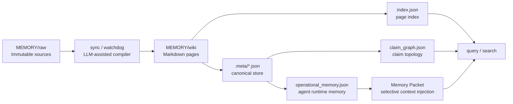

# Vector Lake

Vector Lake 是一个本地文件优先的知识编译器。它不是传统向量库，也不是一次性 RAG 后端，而是把原始材料持续编译成可审计的 Markdown wiki，并同步生成面向 Agent 的结构化运行态记忆。

当前架构边界：

- `MEMORY/raw`：原始信源层，只读输入。
- `MEMORY/wiki`：人类可读的 Markdown 发布层，用于审计、浏览、复盘和长期资产沉淀。
- `MEMORY/wiki/index.json`：页面级运行索引，用于搜索和拓扑扩展。
- `MEMORY/wiki/claim_graph.json`：claim 级逻辑图投影。
- `MEMORY/wiki/.meta/*.json`：canonical governance store，保存实体、断言、证据、信源、变更集和治理队列。
- `MEMORY/wiki/.meta/operational_memory.json`：Agent 运行态记忆层，把 `Claim` 编译为 `fact / preference / decision / task_state`。

如果 `MEMORY/wiki/.meta` 不可写，运行时会回退到仓库内 `data/v8_meta/`。

## Architecture



核心原则：**Markdown 是人类界面，`.meta` 是事实底座，`operational_memory` 是 Agent 运行层。**

## Operational Memory

运行态记忆由 `vector_lake/governance_store.py` 从 canonical claims 编译生成。它解决的问题是：Agent 常常只需要一个事实、偏好、决策或任务状态，不应该每次加载整页 Markdown。

内置类型：

- `fact`：一般事实或断言。
- `preference`：用户偏好、默认策略、首选路径。
- `decision`：已批准或当前有效的决策。
- `task_state`：任务状态、阻塞项、待处理事项。

每条运行态记忆会计算：

- `confidence_score`
- `freshness_score`
- `authority_score`
- `importance_score`
- `reinforcement_score`
- `validity_factor`
- `memory_score`

冲突规则：

- 显式 contradiction：`authority_score > confidence_score > updated_at`。
- 同一 `memory_key` 的 `preference / decision / task_state`：`updated_at > authority_score > confidence_score`。
- 失败侧标记为 `superseded`；无法裁决时保留 `conflicted`。

`query` 会优先生成 Memory Packet，再按预算拼接相关 wiki 页面。Memory Packet 包含当前偏好、决策、任务状态、相关事实、冲突/陈旧告警和证据指针。

## Storage Layout

```text
MEMORY/
  raw/
  wiki/
    *.md
    index.json
    claim_graph.json
    .meta/
      entities.json
      claims.json
      evidence.json
      sources.json
      operational_memory.json
      alias_registry.json
      change_sets.json
      governance_queue.json
```

## Commands

基础体检：

```powershell
python cli.py doctor
```

编译 raw sources：

```powershell
python cli.py sync
```

搜索页面层：

```powershell
python cli.py search "Agent memory" --top_k 5
```

搜索运行态记忆：

```powershell
python cli.py search "部署目标" --mode memory --top_k 5
```

搜索 claim-level facts：

```powershell
python cli.py search "Agent memory" --mode claim --top_k 5
```

基于 Memory Packet 和 wiki 证据做 synthesis：

```powershell
python cli.py query "对比 Karpathy LLM Wiki 与 Agent memory 的架构差异"
```

只预览 query 输出，不落盘：

```powershell
python cli.py query "总结当前运行态记忆架构" --dry-run
```

治理与审计：

```powershell
python cli.py review
python cli.py review resolve <index|item_id> --resolution skip
python cli.py audit-graph
python cli.py debt --top 20
python cli.py trace "<query-or-id>"
python cli.py merge-suggestions --limit 20
```

图谱与清理：

```powershell
python cli.py graph
python cli.py gc --days 30 --dry-run
python cli.py delete "<raw-source-path>" --dry-run
```

## Config

`config.json` 控制运行范围和模型调用：

- `target_directories`：raw source 扫描路径。
- `exclude_paths`：排除目录。
- `supported_extensions`：当前启用的输入扩展名。
- `processed_files_path`：已处理 raw 文件记录。
- `llm.model_cascade`：Gemini CLI 模型降级链。
- `llm.batch_size`：批处理规模。
- `llm.timeout_analysis / timeout_generation / timeout_query`：LLM 调用超时。

## Module Map

| Path | Role |
|---|---|
| `cli.py` | 根目录薄入口 |
| `vector_lake/cli_app.py` | CLI 参数与命令路由 |
| `vector_lake/tools.py` | Tool facade |
| `vector_lake/ingest.py` | raw -> wiki 两步编译管线 |
| `vector_lake/indexer.py` | `index.json` 与 `claim_graph.json` 生成 |
| `vector_lake/claim_extractor.py` | Markdown page -> entity/claim/evidence/source |
| `vector_lake/governance_store.py` | canonical store、change set、operational memory、conflict resolver |
| `vector_lake/governance_metrics.py` | debt metrics 和治理统计 |
| `vector_lake/tool_search.py` | page / memory / claim 搜索与 Memory Packet |
| `vector_lake/tool_query.py` | query-to-page synthesis |
| `vector_lake/tool_review.py` | legacy/governance review surface |
| `vector_lake/tool_doctor.py` | runtime 体检 |
| `schema.md` | Wiki 与运行态记忆契约 |
| `commands/` | 命令层提示与入口说明 |
| `agents/` | ingestor / synthesizer agent 契约 |

## Validation

最近验证基线（2026-04-30）：

```powershell
$env:PYTHONUTF8='1'; python -m unittest discover -s tests -p 'test_*.py' -v
$env:PYTHONUTF8='1'; python -m compileall vector_lake tests
$env:PYTHONUTF8='1'; python cli.py doctor
$env:PYTHONUTF8='1'; python cli.py search "deployment target" --mode memory --top_k 3
$env:PYTHONUTF8='1'; python cli.py debt --top 1
```

验证结果：

- Unit tests：`Ran 8 tests ... OK`
- Compile：OK
- Doctor：healthy
- Operational memory smoke：OK
- Debt snapshot：`operational_memory_count: 13755`
- Memory type counts：`fact: 11881 / decision: 1393 / task_state: 384 / preference: 97`

## Notes

- Windows 控制台建议设置 `PYTHONUTF8=1`，避免中文路径或中文输出触发编码问题。
- 本仓库可能存在 live file lock；如果 `index.json` 或 `.meta` 文件正在被其他进程占用，先释放锁再重建。
- `*.bak`、`*.tmp`、`tmp/`、`data/` 默认被 `.gitignore` 忽略。
