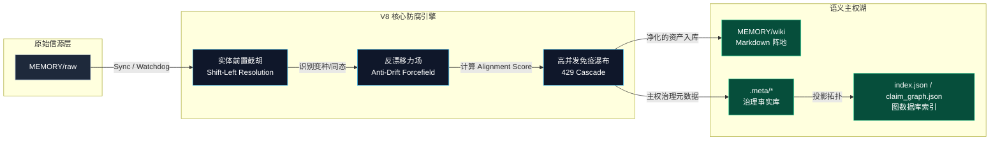
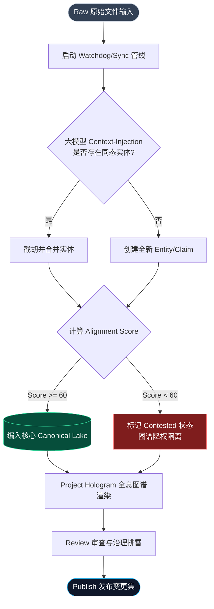

# Vector Lake

Vector Lake 是一个运行在 Gemini 扩展环境里的 Markdown-first 知识编译器。

随着后续持续净化构建，现在它已不仅是一个检索架构，而是具备**自发性反熵（Anti-Drift）与高度战术可视化的战略数据湖**，完全剥离了原有的双轨制，由 V8 强力驱动：`Entity / Claim / Evidence / Source / Change Set`。

## 项目定位

- 主存仍然是文件系统，确保最高权限的语义资产主权可掌控，不轻易被外部无端修改。
- `MEMORY/raw` 是原始信源层，无情喂入各类军工级数据。
- `MEMORY/wiki` 是被净化过的纯人类可编译可读的出版阵地。
- `.meta/*.json` 是唯一的 Canonical Governance Store 主权事实库，旧的 legacy tracks 被全面停尸并清理。
- `index.json` 作为轻量级的页面核心图数据库影子。
- `claim_graph.json` 单独投影为逻辑主干索引。

## 系统架构与数据流 (Architecture & Data Flow)

### 1. 系统架构图 (Architecture)



### 2. 核心数据流 (Data Flow)



## 核心架构大升级 (V8 Hardened Kernel)

- **反漂移力场 (Anti-Drift Forcefield)**：引入了严苛的 `alignment_score` (0-100)，低于 60 分的节点会被处刑进入 `Contested` 状态，并在图谱中以强力惩罚（$\sqrt{align\_a \times align\_b}$）降级相关边权重，将其与核心高价值知识集群做物理隔离。
- **前置归并防腐 (Shift-Left Entity Resolution)**：引入了前置的实体同态字典，利用大模型的 Context-Injection 截胡（左移）所有的重复与变种名，阻止分裂数据在诞生之时流入 Lake 中。
- **全息沙盘视觉重构 (Project Hologram)**：基于深海拟态、透明玻璃美感与 Cyberpunk 赛博朋克强互动的 HUD 全面改造 `topology.html`。将代谢期的 `decay_weight` 在图形管线转化为衰变阴影视野，将 `Contested` 节点强制在深空地图里发出刺眼的血红警示。
- **高并发免疫与级联降级 (429 Immunity Cascade)**：重构了 Ingestion 引擎的底层 API 监听机制。在调用诸如 `gemini-3.1-pro` 导致资源耗尽 (429 RESOURCE_EXHAUSTED) 时，彻底截断底层 CLI 的 `Exit 0` 状态码欺骗，强制拦截 `stderr` 并顺滑降级到 Flash / 8B 模型梯队，保障静默期管线的绝对健壮。

## 🚀 新手快速上手指南 (Quick Start for Beginners)

为了让 Vector Lake 的 V8 引擎能在本地顺利启动，请按照以下步骤进行环境配置与首次投喂：

### 1. 环境依赖与配置 (Prerequisites & Config)
- **Python 3.10+**: 确保本地环境支持。
- **依赖安装**: 在终端执行以下命令安装核心依赖（如 `networkx`, `colorama` 等）：
  ```bash
  pip install -r requirements.txt
  ```
- **底层引擎无缝调用**: 本系统完全依赖原生 Gemini CLI，**无需配置任何额外的 Gemini API Key**。
- **核心配置 `config.json`**:
  在执行前，请确保项目根目录存在 `config.json`。这是用来管控雷达扫描范围和模型梯队的核心配置文件：
  - `target_directories`: 设定要被 V8 引擎吞噬监控的路径（默认为 `["../../MEMORY/raw"]`）。
  - `exclude_paths`: 配置物理隔离区，确保像健康指标（`garmin/`）等噪音不被卷入知识图谱。
  - `llm.model_cascade`: 抗 429 攻击的级联降级梯队（默认为 `["default", "gemini-2.5-pro", "gemini-3.1-flash"]`）。

### 2. 初始化与体检 (Initialization)
首次运行前，通过 `doctor` 巡检命令进行物理目录与依赖的自检：
```bash
python cli.py doctor
```
*（引擎会自动补全缺失的 `MEMORY/raw`、`MEMORY/wiki` 及 `.meta/` 事实库目录）*

### 3. 标准作战工作流 (Standard Workflow)
- **步骤一：投喂原始情报**。将未处理的日志、文档或 Markdown 放入 `MEMORY/raw` 目录。
- **步骤二：启动知识编译**。执行同步管线，系统会自动触发 Shift-Left 防腐机制：
  ```bash
  python cli.py sync
  ```
- **步骤三：全息沙盘视察**。编译完成后，启动图形化拓扑雷达：
  ```bash
  python cli.py graph
  ```
- **步骤四：战略推演问答**。基于被净化后的 Canonical 事实库进行精准提问：
  ```bash
  python cli.py query "总结刚刚录入的系统架构升级了哪些特性？"
  ```

## 当前能力

- `sync` / `watchdog`：把 raw sources 编译成 wiki 页面，强制施加防腐过滤。
- `search`：基于 page index 做 CJK-aware 搜索和图扩展。
- `query`：组装上下文并调用 synthesizer 生成推演结果。
- `graph`：**全新赛博朋克级渲染图谱**。
- `review`：统一在基于 V8 Canonical 事实引擎运行治理入列审查 (支持 `resolve` 与 `ground` 自动捕食)。
- `audit-graph`：把拓扑洞察转成待处理治理项。
- `publish`：发布 pending change sets。
- `debt`：输出治理债务指标，严管系统混乱度。
- `trace`：查看 claim/source/provenance 链路，实施归因审计。
- `merge-suggestions`：生成或入队实体归并候选清单。
- `delete`：无情斩杀无效关联与原始资产。
- `gc`：自动化识别并修剪出入度过低的边缘孤岛节点。
- `doctor`：自愈与依赖体检。

## 存储结构

```text
MEMORY/
  raw/
  wiki/
    *.md
    index.json
    claim_graph.json
    .meta/
      entities.json
      claims.json
      evidence.json
      sources.json
      alias_registry.json
      change_sets.json
      governance_queue.json
```


## 运行模型

### Governance 治理边界

V8 治理层管理这些对象，以物理事实为底座：
- `Entity` 强控名录
- `Claim` 断言节点
- `Evidence` 证据锚点
- `Source` 底座溯源
- `Change Set` 操作记录

运行时的健康映射指标 (`validity_state`) 与防御映射：
- `active` / `review-due` / `needs-review` / `unsupported` / `conflicted`
- **对齐惩罚值**: `alignment_score` 低于基线的会在各个引擎的遍历被强制熔断。
- **半衰期抛弃**: `decay_weight` 控制存留强度。

## 命令行主入口

CLI 是核心操作界面：

- **编译与防御**：`python cli.py sync`
- **情报搜索**：`python cli.py search "边缘计算模型" --top_k 5`
- **深度合成**：`python cli.py query "对比 Vendor A 和 Vendor B 的 AI 战略差异"`
- **全息沙盘**：`python cli.py graph`（推荐体验最新霓虹渲染）
- **审计熔断区**：`python cli.py lint`
- **巡检排雷**：`python cli.py doctor`

（更高级的执行命令可以查看 `commands/` ）

## 测试与防御验证

```bash
python -m unittest discover -s tests -p "test_*.py" -v
```

当前核心攻坚的测试网路如下：
- `query --dry-run` 严格不落盘协议
- 前置 Entity Mapping 字典的劫持成功率
- V8 实体唯一权威性、`alignment_score` 反边缘漂移机制效能。

---
*SYS_CHECK: Mentat Ready. Assault Mode Active.*
