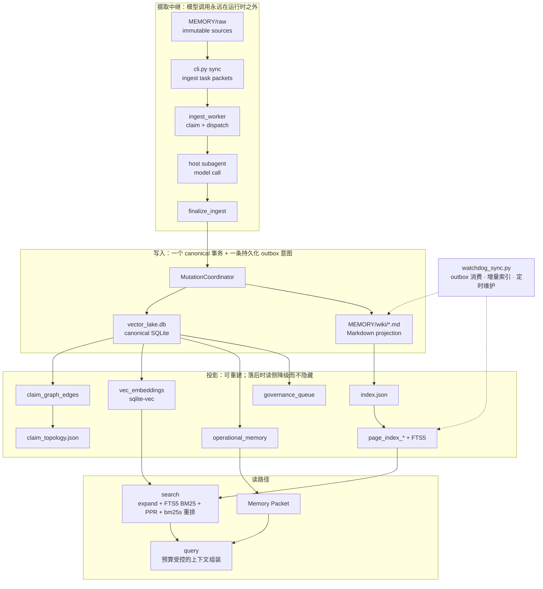

# Vector Lake

Vector Lake 是一个本地文件优先的知识编译器。它不是传统向量库，也不是一次性 RAG 后端，而是把原始材料持续编译成可审计的 Markdown wiki，并同步生成面向 Agent 的结构化运行态记忆。

当前架构边界：

- `MEMORY/raw`：原始信源层，只读输入。
- `MEMORY/wiki`：人类可读的 Markdown 发布层，用于审计、浏览、复盘和长期资产沉淀。
- `MEMORY/wiki/index.json` 与 `MEMORY/wiki/claim_topology.json`：从 canonical 写出的投影（页面节点 + 加权边；断言拓扑）。检索实际读的是它们的 SQLite 投影（`page_index_*` + FTS5），投影落后时回退读 `index.json`，并在输出头部打 `[DEGRADED]` 横页。
- `MEMORY/wiki/.meta/vector_lake.db`：统一的 SQLite 底层引擎，不仅保存实体 (Entities)、断言 (Claims)、证据 (Evidence)、信源 (Sources)、图拓扑、变更集和治理队列，同时也作为 Agent 运行态记忆层，把 `Claim` 编译为 `fact / preference / decision / task_state` 存入 `operational_memory` 表。
- `MEMORY/purpose.md`：版本化战略控制面。YAML 契约驱动摄取范围、证据等级、意图权重、SIR 复审和张力合成阈值；营销噪音与范围外资料不进入主图谱，但保留最小丢弃审计。`purpose_vectors.json` 仅保留为旧版回退，不再是权重主源。

如果 `MEMORY/wiki/.meta` 不可写，运行时会回退到仓库内 `data/v8_meta/`。

## 已知限制与运维要求 (Known Limits & Operational Requirements)

以下约束由当前实现决定，部署前必须满足，否则会出现与预期不符的行为。

| 约束 | 事实 | 规避 |
|---|---|---|
| 必须常驻守护进程 | outbox 消费、增量索引、定时 lint、**到期时的 gram 索引重建**、WAL checkpoint、备份保留、兜底扫描与 Loop 线程监督均在 `watchdog_sync.py` 内，**它同时拉起并看护摄取 Runner**；摄取任务包的**模型调用**在宿主侧 `scripts/ingest_runner.py`（默认写入页面；`VECTOR_LAKE_RUNNER_SHADOW=1` 时只报告），由 `scripts/ingest_runner_service.py` 负责重启，后者自身持有单实例锁 | 只读检索才可省略守护进程。**没有守护进程时没有任何定时维护会触发**（写入也会在 5 分钟后进入 outbox 积压告警），gram 索引需人工按 `doctor` 的 `due=` 执行 `python cli.py gram-index --if-due --apply` |
| 摄取是一条中继流水线，各段职责不重叠 | `ingest_worker`（守护进程内）只认领 `queued` / `failed`（预算未用尽）/ 租约过期的 `dispatched`，产出任务包并转入 `awaiting_subagent`；宿主侧 `ingest_runner.py` 只认领 `awaiting_subagent` 与租约过期的 `subagent_processing`，因此两段不会争抢同一作业。作业租约、`lease_token` 与 `lease_generation` 保证同一个作业不会被并发提交；被顶替或终态失败的作业不会再被派发（前者的状态被标为 `superseded`） | 想让某个源重跑时用 `ingest-tasks --clear-abandoned` 或改源文件（废弃键按内容哈希）；**不要**为“多跑一点”而绕开租约手工改 `jobs` |
| Runner 健康默认只告警 | `runner_absent` / `runner_stalled` / `runner_failing` 默认进 `warnings`，不翻转 `ok`；“从未跑过”与“跑挂了”由 `.meta/runtime/runner_supervisor.json` 区分 | 需要把这几项并入 `degraded` 列表（依然不阻断写入）时设 `VECTOR_LAKE_RUNNER_STRICT=1` |
| 编译依赖 LLM 宿主 | `cli.py sync` 只产出 subagent 任务包，不自行编译；`native_llm.generate_text` 恒抛 `SubagentTaskRequired` | 在具备 subagent 能力的宿主内运行摄取流程 |
| 向量检索需要显式回填 | 任何页面写入都会使该节点向量失效；无自动重嵌 | 定期 `python cli.py embedding-backfill --apply`；需 `GEMINI_API_KEY`（无 key 时 `search` 输出 `[DEGRADED]` 横幅） |
| GC 的孤儿判据是拓扑度数 ≤ 1 | 度数来自 canonical 的 `links` / 共享来源 / claim 共现；**不是**可视化边集 | 先 `python cli.py gc` 做 dry-run，它会在同一调用中打印每个页面的实际度数。单次删除超过候选页 50% 时会自动中止，需 `--force` 才继续 |
| 删除类命令默认演练 | `gc` / `delete` 默认 dry-run，必须 `--apply` 才落盘 | 保持默认；仅在确认 dry-run 输出后追加 `--apply` |
| 修复类工具需要后置重建 | `wiki-restore` 会恢复 Markdown，但索引投影需单独重建 | 按其输出末尾提示运行 `projection-rebuild-index --apply` |
| 全量重建成本随语料线性增长 | 冷启动需对全部正文分词（5000 页约 100 秒）；未变更节点会被跳过 | 仅在有结构变更时全量重建；日常依赖增量更新 |
| 人工编辑会经过校验 | 未通过 schema / 目的契约校验的手改页面会被拒绝并保留原文件，日志给出原因 | 修复页面后重新保存，或查看守护进程状态文件的 `current_action` |

## Architecture


```mermaid
graph TD
    subgraph relay [摄取中继：模型调用永远在运行时之外]
        RAW["MEMORY/raw<br>immutable sources"] --> SYNC["cli.py sync<br>ingest task packets"]
        SYNC --> WORKER["ingest_worker<br>claim + dispatch"]
        WORKER --> HOST["host subagent<br>model call"]
        HOST --> FINAL["finalize_ingest"]
    end
    subgraph write [写入：一个 canonical 事务 + 一条持久化 outbox 意图]
        FINAL --> COORD["MutationCoordinator"]
        COORD --> DB["vector_lake.db<br>canonical SQLite"]
        COORD --> MD["MEMORY/wiki/*.md<br>Markdown projection"]
    end
    subgraph proj [投影：可重建；落后时读侧降级而不隐藏]
        MD --> IDX["index.json"]
        DB --> CG["claim_graph_edges"]
        CG --> CT["claim_topology.json"]
        IDX --> PINDEX["page_index_* + FTS5"]
        DB --> VEC["vec_embeddings<br>sqlite-vec"]
        DB --> OM["operational_memory"]
        DB --> GOV["governance_queue"]
    end
    subgraph read [读路径]
        PINDEX --> SEARCH["search<br>expand + FTS5 BM25 + PPR + bm25s 重排"]
        VEC --> SEARCH
        OM --> PACKET["Memory Packet"]
        SEARCH --> QUERY["query<br>预算受控的上下文组装"]
        PACKET --> QUERY
    end
    WATCH["watchdog_sync.py<br>outbox 消费 · 增量索引 · 定时维护"]
    WATCH -.-> MD
    WATCH -.-> PINDEX
```

核心原则：**Markdown 是人类界面，`.meta` 是事实底座，`operational_memory` 是 Agent 运行层**；投影可重建，而唯一的写入顺序是「canonical 事务 → outbox → 投影」。

## 📂 受控类型与文件结构规范 (Controlled Types & File Structures)

为了保持图谱检索的高信噪比与一致性，Wiki 目录下的 Markdown 文件必须遵循严格的**受控命名前缀**，并被划分为两种完全不同的文件组织结构规范。

### 1. 核心受控类型 (Prefixes)

`validate_wiki_filename` 强制以下前缀（禁用空格与非规范符号，格式如 `Institution_北京协和医院.md`），并额外限制正则 `[Type]_[MainName](-[SubName])*.md`、总长 ≤ 120：

- **`Institution_*`**：医疗机构、医院、医学院及科研院所实体。
- **`Vendor_*`**：商业侧供应商、IT 企业、设备厂商。
- **`Product_*`**：医疗 IT 产品、系统、软件架构（强制包含资质合规槽位）。
- **`Person_*`**：核心高管、研究员、关键人物。
- **`Event_*`**：重要会议、行业突发事件。
- **`Concept_*`**：抽象架构、理论、业务机制。域总览页沿用 `Concept_Overview_<domain>.md` 形式（由 `scripts/compile_domain_overviews.py` 生成）。
- **`Policy_*` / `Standard_*`**：政策法规、行业标准。
- **`Source_*`**：`raw/` 原始信源的一对一摘要节点。页面名由**唯一一条规则**生成（`wiki_utils.canonical_source_name` = `Source_<消毒后的 stem>.md`，消毒是因为 arXiv 式 stem 里的点号过不了严格命名校验）；而“这一页对应哪份 raw”靠 frontmatter 的 `sources:` **声明**判定，不靠页名——历史上有 443 个页沿用旧约定命名为 `Source_<目录>-<stem>-<hash8>`，它们仍然有效，重命名会打断所有指向它们的链接。
- **`Synthesis_*`**：推演、跨界比较与调研长文。
- **`System_*`**：系统投影页（社区页、总览等）。前缀校验直接放行，且不参与 purpose 契约门。

`index.md`、`log.md`、`overview.md`、`orphan_pages.md`、`wiki_link_stats.md`、`Synthesis_log.md` 为白名单文件，不走上述命名与校验规则。

### 2. 双重文件结构设计 (Dual-Schema Format)
根据文件的受控类型，内部的 Markdown 结构被严格限制为两类：

#### A. 实体与概念类 (Dual-Schema Mandate)

- **适用类型**（即 `schema_validator.VALID_H3_SLOTS` 中定义固化插槽的类型）：`Vendor_`, `Product_`, `Person_`, `Event_`, `Concept_`, `Policy_`, `Standard_`, `Institution_`
- **结构要求**：物理上由 `---` 分隔为两部分：
  1. **`## 1. 编译事实 (Compiled Truth)`**：Read Model，只保留当前共识。特征点必须落在类型专属的 `###` 固化插槽内（例如 Vendor 的 `### 组织架构与商业模式`），插槽名不匹配会被 `schema_validator` 拒绝。
  2. **`## 2. 证据时间线 (Evidence Timeline)`**：Event Store，只能追加。格式形如 `- [YYYY-MM-DD] [Event_Tag] ...`。

#### B. 豁免类 (Free-Form)

- **适用类型**：`Source_`, `Synthesis_`
- **结构要求**：自由格式，不切割“事实 / 时间线”，用于单篇文献精读、书籍伴读笔记与横向战略研报。

#### 两个命名空间不要混（实体名 vs 标签）

`title` / `aliases` 是**实体名**，参与链接解析（连 core 名回退也认它们）；`tags` 是**标签**，从不参与链接解析。两者刻意保持不相交：标签撞上任何实体名会被拒绝（`Tag Collision`），而 `aliases` 里以 `#` 开头的条目会被视为把标签塞进实体命名空间、写入即拒绝（改用 `tags:`）。

## Quick Start

> **运行前提**：Vector Lake 不是自包含的编译器。原始信源到 Wiki 页面的“编译”由 LLM 宿主（subagent）执行，`cli.py sync` 只负责生成任务包。因此实际运行需要：**① 单机 ② 常驻 `python watchdog_sync.py` ③ 具备 subagent 能力的宿主**。守护进程会**自动拉起并看护摄取 Runner**（`scripts/ingest_runner_service.py`，可用 `VECTOR_LAKE_RUNNER_AUTOSTART=0` 关闭），因此不再需要手工常驻第二个进程；只启动 MCP server 而不启动守护进程时，写入会在 5 分钟后进入 outbox 积压告警状态。

1. **环境配置**：`config.json` 的 `target_directories` 留空即表示使用当前 `MEMORY/raw/`（多机可移植）；也可显式填写绝对路径。`supported_extensions` 配置允许扫描的后缀。非 embedding 文本推理不由插件直接调用外部 API；需要推理的后台任务会生成当前环境 subagent 任务包。`GEMINI_API_KEY` 只影响 embedding 与混合检索的向量分支。
2. **生成编译任务**：执行 `python cli.py sync` 得到原始信源的 subagent 摄取任务包，由宿主执行并回填。也可由 `watchdog_sync.py` 在检测到 raw 变更时自动生成。
3. **后台监听与自治管理**：运行 `python watchdog_sync.py` 启动守护进程（它会接管 outbox 消费、增量索引与定时 lint）。即使不使用增量监听，只要发生写入就需要它来消费 outbox。它搭载的核心基建与防御系统：
   - **双轨看门狗 (Two-Track Watchdog)**：除增量文件外还捕获 `on_deleted` / `on_moved`，因此重命名或删除页面不会在图谱里留下幽灵节点。
   - **写入健康门 (Write Health Gate)**：写入只在**硬故障**下被阻断（数据库不可用、存在 hard-failed 的 `mutation_outbox` 行）。outbox 积压超过 `VECTOR_LAKE_OUTBOX_MAX_BACKLOG`、投影漂移、心跳过期、终态失败作业、时间线 parity 漂移都属于**可修复降级**，只记录告警并继续写入——阻断它们会同时阻断唯一的修复通道。需要严格模式的运维方可分别用 `VECTOR_LAKE_OUTBOX_BACKLOG_BLOCKING` / `VECTOR_LAKE_TERMINAL_FAILED_JOBS_BLOCKING` / `VECTOR_LAKE_TIMELINE_PARITY_BLOCKING` 把这些降级提升为阻断。
   - **I/O 批处理防抖 (I/O Debouncing)**：同批次修改合并为一次 `index.json` 写盘；`index.json` 不再保存完整正文（每个节点保留至多 320 字符的摘要，摘要与 `weighted_edges` 各占文件的一部分——具体比例取决于实例），投影写入使用短事务，全量重建不再冻结数据库。
   - **两步思维链摄入 (Payload-Based MCP)**：Agent 先输出分析缓冲（Tension / Consensus / Unknowns），长文本经 `payload_file` 落盘后入湖，规避 CLI 传参截断与 JSON 解析失败。
   - **语义张力量化模型 (STQM)**：图谱原生支持 `tension_edges`，把争议与矛盾结构化为冲突边，Query 时可直接展示领域盲区。
   - **跨类型本体拦截 (PIEA)**：入口级跨类型查重，避免同一名称多态共存；内置正则清洗违规嵌套前缀（如 `Concept_Synthesis_`），并由 schema gate 校验受控前缀与类型。
   - **持久化增量索引与稀疏图遍历 (Sparse Graph Traversal)**：前台变更先写 durable outbox，Watchdog 合并批次后更新索引；`_calculate_weighted_edges` 使用稀疏遍历并限制每节点投影边数。
   - **跨平台 I/O 韧性 (I/O Resilience)**：后台子脚本拉起时注入 `PYTHONIOENCODING=utf-8`，避免中文 Windows 上的编解码崩溃。
   - **定时确定性维护 (Scheduled Deterministic Maintenance)**：每天 10:00 与 23:00 刷新脏图拓扑、执行只读 lint、在索引落后时重建 gram 倒排、做 SQLite WAL checkpoint 并执行备份保留；重建与 checkpoint 都在 lint 的失败范围之外，lint 自身失败也会被有界重试而不是无限重跑。另有一条独立节拍的兜底扫描（`VECTOR_LAKE_CATCHUP_INTERVAL_SECONDS`，默认 900 秒）负责把未入队的 raw 源重新入队、作废陈旧任务、释放失去 job 的在途标记。研究、去重、聚类等独立脚本不会被该循环隐式启动。
   - **向量投影存于 SQLite (vec_embeddings)**：向量由 `sqlite-vec` 存放于 `vector_lake.db` 的 `vec_embeddings` 表，不再依赖模型侧的 JSON 载荷；语义去重守护进程只读该表，读取失败时退回**词法/拓扑去重**（不是旧缓存），缺失向量由显式 `embedding-backfill` 补齐。
   - **本体免疫型排重 (Ontology-Immune Deduplication)**：去重守护进程豁免 `Source_*` 等时序不可变信源，避免“相似度过高即合并”把不同日期的研报强行合流。
   - **统一 SQLite 数据底座 (Unified SQLite Engine)**：实体、断言、证据、信源、图拓扑、变更集、治理队列与运行态记忆统一落在 SQLite，启用 WAL。
   - **差分垃圾回收机制 (Diff-based GC)**：Markdown 层面重命名 / 删除或断言被移除时，同步层按页面增量清理对应的实体、断言与证据，不再只增不减。
   - **夜间拾荒者集群 (Janitor Swarm)**：语义去重的**分片准备器**。`python scripts/launch_janitor_swarm.py` 读取治理队列中的 pending merge 项，按 `SHARD_SIZE` 切分为子代理任务包并写出 `janitor_manifest.json`。**它不会自行合并或启动任何外部进程**；实际合并由宿主子代理调用 `resolve_governance_item` 或 `bulk_reconciliation` 完成。
   - **MCP 载荷沙箱 (Payload Sandbox)**：所有长文本参数经 `payload_file` 指向的文件传入，读取受 `VECTOR_LAKE_PAYLOAD_ROOT`（或 `brain/<run>/scratch/`）与 `VECTOR_LAKE_PAYLOAD_MAX_BYTES` 限制，避免命令行传参截断与注入。
   
### 日常运行入口

1. **常驻守护**：`python watchdog_sync.py`（outbox 消费、增量索引、定时 lint 与 WAL checkpoint 都在这里；只跑 MCP server 会让写入持续积压）。守护进程同时**拉起并看护摄取 Runner**，因此“只启动守护”不会再留下半个流水线：不传任何开关时，观测到的就是本机原本常驻的配置（模型接缝 `python scripts/ingest_model_pi_subagents.py`、真实写页）。用 `VECTOR_LAKE_RUNNER_AUTOSTART=0` 关闭该行为，用 `VECTOR_LAKE_RUNNER_SHADOW=1` 改成只报告。
2. **摄取 Runner（可选的手工形式）**：`python scripts/ingest_runner_service.py --limit 2 --interval 120 --model-cmd "python scripts/ingest_model_pi_subagents.py"`。Runner 认领任务包、在子进程里调用宿主模型，再经 `finalize_ingest` 提交。**注意两条路径的默认值相反**：这条手工命令默认只报告 `needs-model`（要真实写入需加 `--no-shadow`），而守护进程自动拉起的 Runner 默认写入（复现本机原本常驻的配置），要改成只报告用 `VECTOR_LAKE_RUNNER_SHADOW=1`。脚本自身持有单实例锁（`<meta>/runtime/.runner_service.lock`），所以手工启动与守护进程启动不会叠成两个消费者；模型调用始终发生在本进程之外的子进程里，运行时自己从不执行它。
3. **检索**：`python cli.py search "<keyword>"`，或 `python cli.py query "<question>"` 走预算受控的上下文组装。
4. **摄取队列**：`python cli.py ingest-tasks` 查看 queued / awaiting_subagent 作业；宿主 subagent 完成后经 `finalize_ingest` 入湖。
5. **被废弃的源**：同一份内容反复确定性失败（例如 `categories` 不是单元素列表、命名或 schema 违规）时，第 3 次尝试后该源会被记为「废弃」并停止派发，避免每轮固定烧掉 3 次模型调用。`python cli.py ingest-tasks --abandoned` 查看清单与原因，`--clear-abandoned [FILE]` 恢复派发。键是 `(路径, 内容哈希)`：**改好源文件即自动恢复**，无需人工清理。`--terminal-failed` 列出耗尽尝试预算的作业，`--close-terminal-failed` 把其中**源已入账**的标记为 superseded（源未入账的会保留，因为那才是真正未完成的工作）。
6. **周期治理**：`python cli.py review` 处理冲突与候选队列，`python cli.py doctor` 检查运行健康度。

历史版本的逐项特性说明不再在本文件维护；版本变更请查 `CHANGELOG.md`，运行契约以本节与上方“已知限制”表为准。

## Operational Memory

运行态记忆由 `vector_lake/governance_store.py` 从 canonical claims 编译生成。它解决的问题是：Agent 常常只需要一个事实、偏好、决策或任务状态，不应该每次加载整页 Markdown。

> **"Wiki-as-Database" 写回范式**：Agent 在运行态生成的新记忆，**严禁**直接写入 SQLite。它们必须通过 `update_operational_memory` 工具，按严格的 **Dual-Schema（双架构）** 规范，即 `## 1. 编译事实 (Compiled Truth)` 与 `## 2. 证据时间线 (Evidence Timeline)`，物理追加到相应的 Wiki 实体文件（如 `Concept_UserPreferences.md`）的时间线下方。这确保了在图谱完全重建时，Agent 记忆依然通过 Markdown 原质保留。

内置类型：

- `fact`：一般事实或断言。
- `preference`：用户偏好、默认策略、首选路径。
- `decision`：已批准或当前有效的决策。
- `task_state`：任务状态、阻塞项、待处理事项。

每条运行态记忆会计算：

- `confidence_score`
- `freshness_score`
- `authority_score`
- `importance_score`
- `reinforcement_score`
- `validity_factor`
- `memory_score`

冲突规则：

- 显式 contradiction：`authority_score > confidence_score > updated_at`。
- 同一 `memory_key` 的 `preference / decision / task_state`：`updated_at > authority_score > confidence_score`。
- 失败侧标记为 `superseded`；无法裁决时保留 `conflicted`。

`query` 会优先生成 Memory Packet，再按预算拼接相关 wiki 页面。Memory Packet 包含当前偏好、决策、任务状态、相关事实、冲突/陈旧告警和证据指针。

## Storage Layout & Architecture

Vector Lake adopts a hybrid CQRS-like architecture with O(1) incremental native SQLite syncing.

- **Markdown (Source of Truth)**: `wiki/*.md` and `raw/*.md`.
- **Database (Read Model & Fast Mutations)**: `vector_lake.db` containing unified SQLite entities, claims, graph edges, and operational memory.
- **Concurrency & Atomicity**: 多页变更经 `MutationCoordinator` 在单个 `BEGIN IMMEDIATE` 事务内提交 canonical 状态与 `mutation_outbox` 意图，再materialize Markdown 投影；事务失败整体回滚，投影失败由 outbox 重试。**Wiki 页面本身没有自动 `*.bak` 备份**——删除类命令（`gc` / `delete`）会先写恢复点目录（`backup/gc/`、`backup/delete-source/`），其余写入依赖 canonical 状态重建。数据库副本写在 `.meta/backups/`（`vector_lake_<ts>.db.bak` 及 `-wal` / `-shm` sidecar），其总量由 `backup-retention` 约束。

```text
MEMORY/
  purpose.md          <-- Versioned Strategic Purpose Contract & Epistemic Stance
  raw/
  backup/
    gc/               <-- Recovery points written before gc deletes a page
    delete-source/    <-- Recovery points written before a cascade delete
  wiki/
    *.md
    index.json          <-- Page index projection: nodes (summary only) + weighted edges
    claim_topology.json <-- Claim topology projection (claim_graph_edges -> JSON)
    .meta/
      purpose_vectors.json <-- Optional legacy fallback for intent weights
      vector_lake.db       <-- Unified SQLite Store (entities, claims, graph, timeline,
                           <--   operational memory, page_index_* projection, vec_embeddings)
      backups/             <-- Bounded SQLite copies (.db.bak + -wal / -shm sidecars)
      runtime/             <-- Runner / supervisor / 锁争用状态 JSON
```

仓库侧（不在 `MEMORY/` 下，且被 `.gitignore` 忽略）：`brain/<run-id>/scratch/subagent_tasks/` 存放宿主 subagent 的任务包，`brain/runtime-<pid>-<uuid>/` 是每进程 scratch（空且超期的会在下次启动时清理）。

## Commands

> **MCP 是主接口**：Agent 直接调用 `vector_lake/mcp_server.py` 注册的工具，不经过终端模拟。本仓库**不随附**任何 slash command 兼容层（`commands/` 目录已不存在）；打包技能的宿主可另用 `$vector-lake:query`、`$vector-lake:timeline` 同名技能。
>
> 工具面共 **45 个**（`doctor` 报出实际注册数，`test_command_surface.py` 守住下限），按职责分组：

| 组 | 工具 |
|---|---|
| 摄取交接 | `sync_vector_lake` · `prepare_ingest_batch` · `list_ingest_tasks` · `claim_ingest_tasks` · `finalize_ingest` · `expire_ingest_tasks` · `list_abandoned_ingest_sources` · `clear_abandoned_ingest_sources` · `list_terminal_failed_ingest_jobs` · `close_terminal_failed_ingest_jobs` |
| 检索与运行态记忆 | `search_vector_lake` · `query_logic_lake` · `search_timeline` · `update_operational_memory` · `finalize_query_synthesis` |
| 治理与审查 | `review_governance_list` · `resolve_governance_item` · `get_governance_debt` · `trigger_audit_graph` · `merge_suggestions_vector_lake` · `check_duplicate_entity` · `bulk_reconciliation` · `review_strategic_purpose` |
| 自愈与体检 | `lint_vector_lake` · `gc_vector_lake` · `doctor_vector_lake` · `trace_vector_lake` · `trigger_autonomous_research` |
| 写入与结构 | `write_wiki_page` · `rename_entity` · `batch_replace_links` · `delete_source` · `propose_schema_mutation` |
| 维护与投影 | `projection_report` · `canonical_backfill` · `projection_rebuild_index` · `embedding_backfill` · `wiki_restore` · `rebuild_timeline_events` · `memory_gram_index_status` · `rebuild_memory_gram_index` · `backup_retention_report` · `idempotency_index_status` · `repair_idempotency_keys` |
| 可视化 | `visualize_vector_lake` |

> 以下底层 CLI 命令仍然保留，供人类开发者日常手动调试与状态维护。

基础体检：

```powershell
python cli.py doctor
```

编译 raw sources：

```powershell
python cli.py sync
```

启动后台守护进程（增量监听）：

```powershell
python watchdog_sync.py
```

搜索页面层：

```powershell
python cli.py search "Agent memory" --top_k 5
```

搜索运行态记忆：

```powershell
python cli.py search "部署目标" --mode memory --top_k 5
```

搜索 claim-level facts：

```powershell
python cli.py search "Agent memory" --mode claim --top_k 5
```

基于 Memory Packet 和 wiki 证据做 synthesis：

```powershell
python cli.py query "对比 Karpathy LLM Wiki 与 Agent memory 的架构差异"
```

只预览 query 输出，不落盘：

```powershell
python cli.py query "总结当前运行态记忆架构" --dry-run
```

治理与审计：

```powershell
python cli.py review
python cli.py review resolve <index|item_id> --resolution skip
python cli.py audit-graph
python cli.py lint
python cli.py lint --auto-fix
python cli.py research
python cli.py debt --top 20
python cli.py trace "<query-or-id>"
python cli.py merge-suggestions --limit 20
```

图谱与清理：

```powershell
python cli.py graph
python cli.py gc --days 30
python cli.py delete "<raw-source-path>"
```

投影与 canonical 维护：

```powershell
python cli.py projection-report --limit 20
python cli.py canonical-backfill --limit 100
python cli.py canonical-backfill --apply --limit 100
python cli.py timeline-rebuild --apply
python cli.py timeline-repair
python cli.py timeline-repair --apply
python cli.py projection-rebuild-index --apply
python cli.py embedding-backfill --limit 200
python cli.py embedding-backfill --apply --limit 200
python cli.py wiki-restore --apply --limit 10
python cli.py gram-index
python cli.py gram-index --if-due --apply
```

备份保留与幂等性键维护：

```powershell
python cli.py backup-retention
python cli.py backup-retention --keep 2 --max-bytes 6442450944 --apply
python cli.py idempotency-status
python cli.py repair-idempotency --table mutation_outbox
python cli.py repair-idempotency --table mutation_outbox --apply
```

这些维护命令默认以 dry-run 或显式 `--apply` 分离执行。`canonical-backfill` 只从已有 Wiki Markdown 回填 SQLite canonical；`projection-rebuild-index` 只从 canonical 重建 `index.json`、FTS 和 `claim_topology.json`，并保留已有 `vec_embeddings`；`embedding-backfill` 按 RPM/TPM 限额断点补齐缺失向量；`wiki-restore` 只把 canonical-only 记录恢复为缺失的 Markdown 投影；`timeline-repair` 就地补齐 `timeline_events` 的 parity 漂移，不重建整表；`gram-index` 报告或重建运行态记忆检索用的精确 n-gram 倒排，`--if-due` 只在该索引确实落后时才重建（见下，`--compact` 已随增量机制一并删除）。

`gram-index` 的重建节奏：基表只要落后就不再精确，而**不精确的基表会被读路径直接拒绝**（不是带着陈旧基表继续服务），所以搜索会退回精确扫描，凭 n-gram 倒排服务时才有快速路径。恢复精确只有重建一条路：重建现在**分批提交**——分批 staging、分批打包、最后用一个短事务发布，发布由内容指纹把关（重建期间被写过的文档保留其变更标记，不会被当作最新）。实测活库上一次重建约 150 s（空闲）到 570 s（边摄入边重建），**最长写锁持有约 2 s**，不再是整场重建期间拒绝所有写入。触发位置只有两处：守护进程的定时维护块（在 WAL checkpoint 之前）与 `gram-index --if-due --apply`；**后者需要守护进程在运行**才有自动节拍，否则只能由人按 `due=` 手工执行——`doctor` 的 `Watchdog Status` 是判断这一点的依据。阈值为 `REBUILD_AFTER_WRITES = 500`，按文档数计，而不是按事务或时长；选择它的依据不是「搜索省下的时间何时回本」，而是「重建能让写入停多久」——因此宁少勿多。`due=` 与 `of 500` 就是这个欠账的当前值，而不是故障。

`backup-retention` 约束 `.meta/backups`（SQLite 副本目录，与 `MEMORY/backup/` 下的页面恢复点无关）：默认保留最新 3 份副本，其余受 12 GiB 预算约束，**最新一份无论是否超预算都不会被删**；`idempotency-status` 报告各幂等表当前达到的唯一性等级，`repair-idempotency` 清除冗余幂等键以便建成完整唯一索引——它两种模式下都不删除业务行。

## Config

`config.json` 与环境变量共同控制运行范围和模型调用。该文件是机器相关配置，**不入 git**：克隆后执行 `cp config.example.json config.json` 再按本机填写。文件缺失时使用代码内置默认值（含默认排除列表 `exclude_paths`），不会退化为“无排除”。

- `target_directories`：raw source 扫描路径。
- `exclude_paths`：排除目录。
- `supported_extensions`：当前启用的输入扩展名。
- `memory_dir`：MEMORY 根目录（机器相关，按安装填写）；可用 `VECTOR_LAKE_MEMORY_DIR` 覆盖。
- 入账与去重：`processed_files` 记 `(路径, 内容哈希)`；finalize 时会在**规范 Source 页面**的 frontmatter 写入 `source_hash`，使「这份页面是按哪份内容编译的」可被证明而不是靠 mtime 推断。已发布但缺账目行的源由扫描按证据补齐（有 `source_hash` 则比对哈希，无则比对页面 `created` 与文件 mtime）；证据显示文件已变时**不补行**，而是让它重新摄入，避免修改被静默丢弃。
- `processed_files_path`：**legacy 字段，当前代码不读取**。已处理 raw 文件记录存放在 SQLite `processed_files` 表。
- `VECTOR_LAKE_DB_PATH`：覆盖 SQLite 数据库路径（默认 `<MEMORY>/wiki/.meta/vector_lake.db`）。
- `VECTOR_LAKE_PAYLOAD_ROOT` / `VECTOR_LAKE_PAYLOAD_MAX_BYTES`：MCP `payload_file` 沙箱的可读根与单文件字节上限（默认 5 MiB）。
- `VECTOR_LAKE_DISABLE_WRITE_HEALTH_GATE=1`：跳过写入前健康门（仅用于受控维护，不建议常开）。
- `VECTOR_LAKE_EMBEDDING_RPM` / `VECTOR_LAKE_EMBEDDING_TPM`：embedding 调度限额，默认分别为 `3000` 和 `1000000`。
- `VECTOR_LAKE_EMBEDDING_UTILIZATION`：安全水位，默认 `0.8`，即按 2400 RPM / 800k TPM 调度。
- `VECTOR_LAKE_EMBEDDING_MAX_BATCH_ITEMS` / `VECTOR_LAKE_EMBEDDING_MAX_BATCH_TOKENS`：单批条数与 token 上限，默认 `100` / `200000`。
- `VECTOR_LAKE_EMBEDDING_TIMEOUT_MS`：单次 embedding HTTP 超时，默认 `30000` 毫秒。
- `VECTOR_LAKE_EMBEDDING_TRANSPORT`：embedding 传输层，默认 `rest`（直接 `batchEmbedContents`），可选 `sdk`（走 `google-genai`）。两条路径对同一文本返回**逐位相同**的向量；默认取 `rest` 是因为它不 import `google.genai`，因而没有 SDK 的 import + client 构造成本（下面的 `VECTOR_LAKE_EMBEDDING_PREWARM` 也只对 `sdk` 有意义）。
- `VECTOR_LAKE_EMBEDDING_PREWARM=off`：关闭 MCP server 启动时的 embedding 客户端预热——**仅对 `sdk` 传输有意义**；`rest` 路径从不构造 client，预热线程会被直接跳过。
- `VECTOR_LAKE_TOKENIZER`：目前只有一个合法值 `rjieba`（保留该开关是为了让已有的环境配置显式表达意图）；写别的值会告警并走自动选择。安装了 rjieba 就用它，反之分词为 `unavailable`（CJK 全文匹配下降，doctor 会报出）。
- `VECTOR_LAKE_OUTBOX_MAX_BACKLOG`：outbox 待处理行数阈值，默认 `2000`。**超出后默认只计为降级告警，不阻断写入**（阻断积压等于掉断唯一的自愈路径）；设 `VECTOR_LAKE_OUTBOX_BACKLOG_BLOCKING=1` 才升级为阻断。
- `VECTOR_LAKE_OUTBOX_FAILURE_NONBLOCKING=1`：把 `mutation_outbox_failed` 从硬故障降为降级告警。默认关闭，因为失败行会阻塞 canonical 写入；打开等于用可用性换安全性。
- `VECTOR_LAKE_TERMINAL_FAILED_JOBS_BLOCKING=1` / `VECTOR_LAKE_TIMELINE_PARITY_BLOCKING=1`：把终态失败作业与时间线 parity 漂移从降级升级为阻断写入的诊断用闸门，默认关闭。
- `VECTOR_LAKE_BACKUP_KEEP` / `VECTOR_LAKE_BACKUP_MAX_BYTES`：`backup-retention` 的默认保留份数（`3`）与字节预算（`12 GiB`）。
- `VECTOR_LAKE_RUNNER_EXPECTED=0`：不再把缺失的摄取 Runner 报为告警；用于不需要摄取的主机。
- `VECTOR_LAKE_RUNNER_AUTOSTART=0`：不让 `watchdog_sync.py` 拉起并看护摄取 Runner（保留 `runner_absent` 告警，用于手工管理 Runner 的主机）。默认开启。
- `VECTOR_LAKE_RUNNER_MODEL_CMD`：自动拉起的 Runner 使用的模型接缝命令（等价于 `--model-cmd`），默认 `python scripts/ingest_model_pi_subagents.py`（即本机 `runner_supervisor.json` 记录的生产值）。相关脚本另读 `VECTOR_LAKE_RUNNER_PI_BIN`、`VECTOR_LAKE_RUNNER_SUBAGENT_AGENT`、`VECTOR_LAKE_RUNNER_MODEL_TIMEOUT`、`VECTOR_LAKE_RUNNER_COOLDOWN`。
- `VECTOR_LAKE_RUNNER_SHADOW=1`：让自动拉起的 Runner 只报告 `needs-model`、不写页面。默认关闭，因为默认复现的是本机原本常驻的写入配置（`shadow=false`）；新主机若只想观察应先打开它。
- `VECTOR_LAKE_CATCHUP_INTERVAL_SECONDS`：守护进程的周期性兜底间隔（默认 `900` 秒；`0` 关闭）。兜底做两件事：把未摄入的 raw 源重新入队（否则失去事件、被取消或从未入队的源没有回到队列的路径），以及把超过时限的陈旧摄取任务作废。
- `VECTOR_LAKE_STALE_TASK_MAX_AGE_SECONDS`：兜底把多旧的摄取任务视为陈旧（默认 `86400` 秒）。
- `VECTOR_LAKE_RUNNER_STALE_SECONDS`：Runner / 监督器心跳过期阈值，默认 `2400` 秒。
- `VECTOR_LAKE_RUNNER_STRICT=1`：把 Runner 告警从 `warnings` 升入 `degraded`（两者都不阻断写入）。
- `VECTOR_LAKE_RERANK_WEIGHT`：检索 Phase-2 重排的权重，默认 `0.4`，即 `0.6 × 上游归一化分 + 0.4 × bm25s 词汇分`；设为 `0` 可完全恢复旧排序。
- `VECTOR_LAKE_LEIDEN_L1_RESOLUTION` / `VECTOR_LAKE_LEIDEN_L0_RESOLUTION`：Leiden 的 Micro / Global 分辨率，默认 `2.0` / `1.0`。分辨率越高社区越小。
- `VECTOR_LAKE_LEIDEN_SEED`：Leiden 随机种子，默认 `42`。**必须固定**才能保证社区划分可复现。
- 所有进程通过 SQLite 滚动窗口共享 RPM/TPM 预算；索引重建和增量索引不调用 embedding API，内容变更后的旧向量由显式 `embedding-backfill` 补齐。

其余开关（凡 `vector_lake/` 里出现的 `VECTOR_LAKE_*` 字面量都在此登记；由测试守往）：

- `VECTOR_LAKE_EMBEDDING_MODEL`：embedding 模型名（默认见 `embedding_scheduler.DEFAULT_MODEL`）。
- `VECTOR_LAKE_EMBEDDING_DIMENSION`：向量维度（默认见 `DEFAULT_DIMENSION`）。
- `VECTOR_LAKE_EMBEDDING_MAX_CHARS_PER_ITEM`：单条目字符上限，默认 `15000`。
- `VECTOR_LAKE_EMBEDDING_MAX_TOKENS_PER_ITEM`：单条目 token 上限，默认 `7500`。
- `VECTOR_LAKE_EMBEDDING_MAX_RETRIES`：单次重试上限，默认 `5`。
- `VECTOR_LAKE_EMBEDDING_MAX_CONSECUTIVE_FAILURES`：连续失败批次上限，默认 `3`。
- `VECTOR_LAKE_EMBEDDING_RUN_STALE_SECONDS`：embedding run 的租约过期时间，默认 `3600`（下限 `60`）秒。
- `VECTOR_LAKE_MEMORY_SEARCH`：运行态记忆检索后端，默认 `gram`（精确 n-gram 倒排）；其他取值回退到投影扇描；`legacy` 强制旧路径。
- `VECTOR_LAKE_IGNORE_SCHEDULED_LINT_STATE`：设值（非空）时忽略已完成的定时 lint 标记，用于强制重跑一次。
- `VECTOR_LAKE_OUTBOX_MAX_PENDING_AGE_SECONDS`：outbox 最老待处理行的年龄阈值，默认 `300` 秒。
- `VECTOR_LAKE_WRITE_LOCK_CONTENTION_WINDOW_SECONDS`：判定写锁争用是否仍属「当前」的滑动窗口，默认 `600` 秒。
- `VECTOR_LAKE_MAX_AWAITING_SUBAGENT_JOBS`：等待中 subagent 作业的条数阈值，默认 `500`。
- `VECTOR_LAKE_MAX_AWAITING_SUBAGENT_AGE_SECONDS`：等待中 subagent 作业的年龄阈值，默认 `86400` 秒。
- `VECTOR_LAKE_SUBAGENT_BACKLOG_BLOCKING=1`：把 subagent 积压从降级告警升级为阻断写入。默认关闭。
- `VECTOR_LAKE_SUBAGENT_RUN_ID`：本进程作为 outbox / job 租约持有者的标识；不设置时用 `hostname:pid`。
- Ingest 完成必须提交领取阶段返回的 `job_id`、`lease_owner`、`lease_token` 和 `lease_generation`；过期 Worker 的结果会被最终 CAS 拒绝。

### 依赖与分词后端 (Dependencies & Tokenizer)

必需依赖见 `requirements.txt`；`requirements.lock.txt` 是 2026-09-16 在本机（Windows / CPython 3.13）解析出的直接依赖钉版，作为**复现辅助**而非带哈希的传递锁，依赖变动后需重新生成。

#### 社区检测：Leiden

`python-louvain` 已移除，改为 **`igraph` + `leidenalg`**。实现在 `scripts/community_clustering_daemon.py`：

- Louvain 用 dendrogram 层级，Leiden 用 `resolution_parameter`，因此两个层级由两次 Leiden 运行得到：**L0（Global，粗）分辨率 1.0**、**L1（Micro，细）分辨率 2.0**。
- Leiden 是随机算法，因此固定了 `seed`（`VECTOR_LAKE_LEIDEN_SEED`，默认 42）以保证可复现。
- `centrality_score` / `node_score` 由 **igraph** 的 PageRank 计算（与它自身构建的图共用一次构建；不再依赖 `networkx`），保持原有排序语义不变。
- 社区 ID 仍由节点重叠映射到稳定 UUID，重跑不会孤儿化已有的 `System_Community_*` 索引页。

阈值参考（合成语料：3 个强内聚簇 × 8 节点）：L1 恢复出 3 个社区、簇内同社区率 100%、固定种子下可复现、社区 ID 跨重跑稳定。

#### 检索重排：bm25s

`bm25s` 提供弹性的 BM25 实现，用于 **Phase-2 同池重排**（`tool_search._rerank_candidates_locally`）：

- **候选集成员不变**（召回由上游 FTS5 + 图扩展决定），只改变池内顺序。
- 词汇信号来自 `title + summary + aliases`（不读正文：否则每次查询都要逐候选读文件）。
- 分数为**池内归一化**（min-max），不是绝对相关度：因此首位候选通常显示 `1.000`，并列最大的候选保持并列。
- 默认权重 0.4 保留上游影响力，避免把**本就无词汇重叠的图扩展候选项**压到底部。

#### CJK 分词

CJK 分词采用两层后端（统一入口 `vector_lake/tokenizer.py`）：

| 后端 | 角色 | 安装 |
|---|---|---|
| **`rjieba`（唯一后端）** | `jieba-rs` 的官方 PyO3 绑定（同作者 messense），Rust 实现 | 必需依赖；提供 `cp38-abi3` wheel（Windows / macOS / manylinux / musllinux），**无需编译器** |

**版本真相（重要）**：`rjieba 0.2.1` 在它的 `Cargo.toml` 里钉定的是 **`jieba-rs = "0.9.0"`**，即实际生效的 Rust crate 是 **0.9.x**，而**不是** 0.11。`jieba-rs 0.11.0` 于 2026-09-16 发布，**目前没有任何已发布的 Python 绑定**；本机也无 Rust 工具链（无 `cargo`/`rustc`/`maturin`），无法从 sdist 自建。该事实在代码中以常量 `tokenizer.JIEBA_RS_PINNED` 记录，并由 `doctor` 与 `backend_version()` 直接显示，例如：

```text
[OK] Tokenizer Backend: rjieba 0.2.1 (jieba-rs 0.9.x); no add_word() on this backend
```

待 `rjieba` 发布基于 0.11 的版本后，只需同步 `requirements.txt` / `requirements.lock.txt` 的版本号与 `JIEBA_RS_PINNED`。

**已知能力缺口**：`rjieba` 不暴露 `add_word()` / `load_userdict()`（模块级与 `Jieba` 类均无），且 jieba-rs 内嵌自己的词典。因此 `tool_search.QUERY_EXPANSION_DICT` 的术语注册在 Rust 后端下**不生效**，代码会输出一次性 WARNING 而非假装成功。影响有限：索引与查询使用**同一**分词器，两侧切分一致，检索仍可命中，仅这几个术语的精确短语形态不同。回退后端移除后这一点不再需要权衡：`add_word()` 一律返回 False，词表注册无法生效。

**实测收益与语义差异**：`rjieba` 相对它所取代的纯 Python 实现快 7–15×（单页 4.39 ms → 0.39 ms），词元一致性的差异只在拉丁/数字边界（如 `utf-8` vs `utf`+`-`+`8`），中文词本身几乎完全一致。旧的对比数据与逐项测量保留在 `CHANGELOG.md`。

**纯 Python `jieba` 回退已于 2026-09-18 移除**：abi3 wheel 覆盖本项目支持的全部平台，而第二套分词与 `rjieba` 的切分不同——这正是搜索索引内容哈希要防的事（`indexer._node_content_digest` 把后端身份纳入 key）。因此**没有 rjieba 的平台会变为 `unavailable`**：CJK 预分词被跳过、CJK 查询命中下降，`doctor` 与 `backend_name()` 会报出而不是掩盖；装回 rjieba 后下一次 `projection-rebuild-index --apply` 会按新身份重新分词。

全量重建的剩余瓶颈已不在分词：warm 重建的约 50% 耗时是 `index.json` / `claim_topology.json` 的 `json.dump` 序列化。

## Module Map

`vector_lake/` 内是运行时本体：它自行调用嵌入模型，但**不发起任何非嵌入的模型调用**（任务包的 `cost_boundary`）；文本生成一律交给宿主，因此摄取 Runner 放在 `scripts/` 而非包内。

入口与核心管线：

| Path | Role |
|---|---|
| `cli.py` | 根目录薄入口，转发到 `vector_lake.cli_app` |
| `watchdog_sync.py` | 常驻守护进程入口（`watchdog_app.start_watchdog`） |
| `vector_lake/cli_app.py` | CLI 参数解析、命令路由与突变批量提交 |
| `vector_lake/mcp_server.py` | MCP 工具后端（FastMCP） |
| `vector_lake/tools.py` | Tool facade，汇聚所有 `tool_*` 模块 |
| `vector_lake/watchdog_app.py` | 文件监听、outbox 消费、增量索引、定时 lint / gram 重建 / WAL checkpoint / 备份保留 |
| `vector_lake/watchdog_status.py` | Watchdog 状态遥测（`.watchdog_status.json`，按组件聚合） |
| `vector_lake/thread_supervision.py` | Loop 线程注册表：死线程重启与上报，并区分“按设计结束”与“崩掉” |

存储与一致性：

| Path | Role |
|---|---|
| `vector_lake/db_store.py` | SQLite 连接与 PRAGMA、schema 初始化、事务、jobs 与 `mutation_outbox` |
| `vector_lake/governance_store.py` | canonical store、change set、别名注册、operational memory 与冲突解析 |
| `vector_lake/mutation_coordinator.py` | 统一突变编排：canonical 事务 + 持久化 outbox + 投影 materialize |
| `vector_lake/runtime_health.py` | 运行时健康评估与写入门（硬故障阻断 / 可修复降级放行） |
| `vector_lake/wiki_utils.py` | 路径解析、frontmatter、原子写入与位置辅助（runtime/outbox 信号目录等）；**命名与身份词表的唯一所有者**（`normalize_entity_name` 决定文件名，`entity_identity_key` 决定比较，`canonical_source_name` 决定 Source 页名） |
| `vector_lake/node_vocabulary.py` | 节点类型词表的唯一来源（类型 ⇄ 前缀、严格文件名模式），零 import 的叶片模块 |
| `vector_lake/schema_validator.py` | frontmatter 与正文结构的 schema 校验（含标签与实体命名空间的隔离门） |
| `vector_lake/defense_hook.py` | 写入前防御钩子（schema + purpose 契约统一入口） |
| `vector_lake/purpose_contract.py` | 战略目的解析、摄取门、SIR 复审与 Synthesis-Proposal 阈值 |
| `vector_lake/yaml_utils.py` | YAML 存取封装 |
| `vector_lake/backup_retention.py` | `.meta/backups` 的扫描、边界解析与剪枝（最新一份永不删除） |

索引、检索与记忆：

| Path | Role |
|---|---|
| `vector_lake/indexer.py` | `index.json` / `claim_topology.json` 生成、FTS 投影、稀疏图遍历与增量更新 |
| `vector_lake/embedding_scheduler.py` | RPM/TPM 限额下的可断点向量回填（`vec_embeddings`） |
| `vector_lake/tokenizer.py` | CJK 分词后端（`rjieba`，单一后端），含 `JIEBA_RS_PINNED` |
| `vector_lake/tool_search.py` | 混合检索（本地扩展 + FTS5 BM25 + 多跳 PPR + bm25s 同池重排）与 Memory Packet、上下文组装 |
| `vector_lake/claim_extractor.py` | Markdown 页面 → entity / claim / evidence / source |
| `vector_lake/tool_memory.py` | 运行态记忆的物理写回（Wiki-as-Database） |
| `vector_lake/governance_metrics.py` | 治理债务指标与合并候选枚举 |
| `vector_lake/governance_service.py` | canonical 治理服务面（队列、变更集与投影的组合入口） |
| `vector_lake/page_index_projection.py` | `index.json` → SQLite 投影（节点 / 边 / 状态戳）与邻接读取 |
| `vector_lake/memory_gram_index.py` | 运行态记忆的精确 n-gram 倒排索引：分批重建、快照指纹与就绪判定 |
| `vector_lake/link_resolution.py` | 链接解析的唯一实现（文件名 / 唯一标题 / 唯一别名 → core 名），lint 与索引器共用；core 名回退同样认声明名（title/alias），但**本名优先**——别名不能夺走某页自己的名字 |
| `vector_lake/stub_creator.py` | 破损链接 stub 的创建规则与既存页面覆盖判定 |

摄取与治理工具（均在 `tools.py` 注册）：

| Path | Role |
|---|---|
| `vector_lake/tool_ingest.py` | raw 扫描、摄取任务包生成、任务领取与 `finalize_ingest` |
| `vector_lake/ingest_worker.py` | queued 作业 → subagent 任务包分发 |
| `vector_lake/runner_supervision.py` | 守护进程对摄取 Runner 的拉起 / 收养 / 重启与状态上报 |
| `vector_lake/periodic_catch_up.py` | 周期性兜底：未入队源重入队、陈旧任务作废、在途标记对账 |
| `vector_lake/native_llm.py` | 宿主 subagent 任务包协议（不自行调用文本模型） |
| `vector_lake/tool_query.py` / `tool_research.py` / `tool_purpose.py` | 查询合成、主动研究下发、战略目的复审 |
| `vector_lake/tool_sync.py` | `sync_vector_lake` 入口：兼容别名，转发到 `prepare_ingest_batch` |
| `vector_lake/host_env.py` | 宿主环境解析（配置 / 凭据文件位置），不读取凭据内容 |
| `vector_lake/tool_review.py` / `tool_merge.py` / `semantic_merge.py` / `tool_piea.py` / `tool_bulk_reconciliation.py` | 队列评审、合并建议与合并执行、跨类型查重、批量对账 |
| `vector_lake/tool_lint.py` / `tool_gc.py` / `tool_delete.py` / `tool_rename.py` / `tool_debt.py` / `tool_doctor.py` | 自愈审计、孤儿 GC、级联删除、重命名、债务与体检 |
| `vector_lake/tool_projection.py` / `tool_timeline.py` / `tool_trace.py` / `tool_graph.py` | 投影对账与重建、时间线重建与检索、溯源、图谱可视化 |
| `vector_lake/tool_maintenance.py` | 备份保留与幂等索引维护面（`backup-retention` / `idempotency-status` / `repair-idempotency`） |
| `vector_lake/provenance.py` / `skeleton_parser.py` | 溯源追踪、结构骨架解析 |

仓库资产：

| Path | Role |
|---|---|
| `schema.md` / `SCHEMA_CATEGORIES.md` | Wiki 与运行态记忆契约、受控分类表 |
| `skills/` | 面向宿主的技能定义（每个能力一份 `SKILL.md`） |
| `templates/` | 摄取 / 查询提示词模板与拓扑可视化 HTML |
| `scripts/` | 独立维护脚本（社区聚类、语义去重、域总览、janitor 分片、purpose 校验），以及宿主侧摄取 Runner：`ingest_runner.py` + 常驻监督器 `ingest_runner_service.py` + 模型接缝 `ingest_model_pi_subagents.py` |
| `tests/` | pytest 回归套件 |

## Validation

```powershell
$env:PYTHONUTF8='1'; python -m pytest -p no:cacheprovider -q      # 与 CI 一致
$env:PYTHONUTF8='1'; python -m compileall -q vector_lake tests
$env:PYTHONUTF8='1'; python cli.py doctor
$env:PYTHONUTF8='1'; python cli.py search "<keyword>" --mode memory --top_k 3
$env:PYTHONUTF8='1'; python cli.py debt --top 1
```

本轮实测结果（2026-09-20）：

- `python -m pytest -p no:cacheprovider -q` → **1274 passed**。
- `python -m compileall -q vector_lake tests` → OK。
- `python cli.py doctor` → `Write Gate: clean`、`Idempotency Index: jobs=full(dups=0), mutation_outbox=full(dups=0)`、`Ingest Jobs: queued:0 awaiting_subagent:0 terminal_failed:0`、`MCP Server: Import OK, 45 tools exposed`；`Summary: healthy with degradation`，降级项为两类而非一类：① 设计内的 subagent 文本运行时委托；② 运行态记忆的精确 n-gram 索引落后（`due=True`）——基表落后时不带着它继续服务，搜索退回精确扫描，按 `doctor` 提示跑 `python cli.py gram-index --if-due --apply` 即恢复快速路径。
- 端到端：raw 源 → `sync` → `ingest-tasks` → `finalize_ingest` → outbox 消费 → 索引 → `search` / `query` 全链路在隔离根上跑通。

**本文件不记录语料规模类数字**（节点数、边数、memory 条数）。这类数值取决于运行实例，无法从仓库复现，容易在版本迭代后变成误导性基线；需要时以目标实例上的 `doctor` / `debt` / `projection-report` 实测输出为准。

## Notes

- Windows 控制台建议设置 `PYTHONUTF8=1`，避免中文路径或中文输出触发编码问题。
- 长任务由 `filelock` 串行化（`index.json.lock`、`.meta/governance_queue.lock`、`.watchdog.instance.lock`、`<meta>/runtime/ingest_processing.json.lock`、`<meta>/runtime/.runner_service.lock`）。遇到占用时先确认没有残留的 watchdog / MCP / ingest Runner 进程，再重试，不要直接删锁文件。
- `.gitignore` 默认忽略 `brain/`（subagent 任务包）、`tmp/`、`data/`、`*.bak`、`*.tmp`、`__pycache__/`、`.pytest_cache/`。
