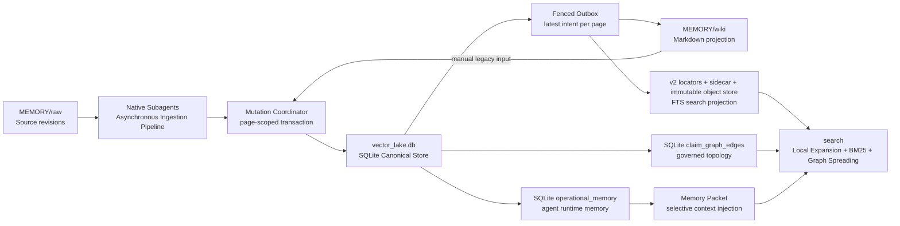

# Vector Lake

Vector Lake 是一个面向医疗数字化研究的本地文件优先知识编译器。它不是传统向量库，也不是一次性 RAG 后端，而是把原始材料持续编译成可审计的 Markdown wiki，并同步生成面向 Agent 的结构化运行态记忆。当前发布定位是受控 Windows 单用户、专家值守的内部研究工作台；核心 MCP 与宿主适配分离，Codex、Pi 和 Gemini 通过独立薄适配器连接。它不宣称具备企业多租户隔离、跨租户权限治理或无人值守 GA 能力。

当前架构边界：

- `MEMORY/raw`：原始信源 revision 的输入层。
- `MEMORY/wiki`：人类可读的 Markdown 发布层，用于审计、浏览、复盘和长期资产沉淀。
- `MEMORY/wiki/index.json` / `claim_graph.json`：projection v2 的小型 locator；实际页面、检索与拓扑组件存于 `MEMORY/wiki/.projection-store/objects/sha256/` 的不可变内容寻址对象中。
- `MEMORY/wiki/.meta/vector_lake.db`：SQLite canonical 存储，保存实体、断言、证据、信源、图拓扑、变更集、治理队列、outbox 和 `operational_memory`。
- `MEMORY/purpose.md`：版本化战略控制面。YAML 契约驱动摄取范围、证据等级、意图权重、SIR 复审和张力合成阈值；营销噪音与范围外资料不进入主图谱，但保留最小丢弃审计。`purpose_vectors.json` 仅保留为旧版回退，不再是权重主源。

`MEMORY/wiki/.meta` 是默认 canonical 目录。若其中已经存在 canonical 数据但目录不可写，运行时会拒绝静默切换数据库；需要迁移位置时应显式设置 `VECTOR_LAKE_META_DIR`。仓库内 `data/v8_meta/` 只用于兼容既存 legacy fallback，或在默认 MEMORY 根没有 primary canonical 且 primary 无法写入时受控回退；`VECTOR_LAKE_ALLOW_META_FALLBACK=1` 可显式允许既存 primary 的回退。

## Architecture


```mermaid
graph LR
    RAW["MEMORY/raw<br>Source revisions"] --> INGEST["Native Subagents<br>Asynchronous Ingestion Pipeline"]
    INGEST --> MUTATION["Mutation Coordinator<br>page-scoped transaction"]
    WIKI["MEMORY/wiki<br>Markdown projection"] -->|manual legacy input| MUTATION
    MUTATION --> META["vector_lake.db<br>SQLite Canonical Store"]
    META --> OUTBOX["Fenced Outbox<br>latest intent per page"]
    OUTBOX --> WIKI
    OUTBOX --> INDEX["v2 locators + sidecar + immutable object store<br>FTS search projection"]
    META --> CLAIM["SQLite claim_graph_edges<br>governed topology"]
    META --> MEMORY["SQLite operational_memory<br>agent runtime memory"]
    MEMORY --> PACKET["Memory Packet<br>selective context injection"]
    INDEX --> QUERY["search<br>Local Expansion + BM25 + Graph Spreading"]
    CLAIM --> QUERY
    PACKET --> QUERY
```

核心原则：**Markdown 是人类界面，`.meta` 是事实底座，`operational_memory` 是由 canonical claims 编译、驻留在同一 SQLite 中的 Agent read model。**

## Runtime Contract

下表来自当前源码与插件清单。修改相关公开表面时必须同步更新，不能用历史版本标题替代运行契约。

| Surface | Current contract |
| --- | --- |
| Plugin package | `11.20.0+codex.20260829201234` |
| Ingest payload | `INGEST_CONTRACT_VERSION = 5` |
| SQLite migration schema | `PRAGMA user_version = 9` |
| Canonical governance schema | `8.0` |
| Index projection | logical `PROJECTION_CONTRACT_VERSION = 1` / physical `format_version = 2` |
| EvidencePacket | `1.1` |
| Public surfaces | 70 MCP tools (`full`) / 9 MCP tools (`memory`) / 21 MCP tools (`readonly`) / 42 CLI commands / 19 Agent skills |

通用 `init_db()` 遇到既有 v1–v8 数据库会拒绝自动升级。CLI-only
`schema-migrate` 接受契约完整的 v4、v5、v6、v7 或 v8 数据库，并按受控历史链最终
迁移到 v9；契约完整的 v9 输入返回幂等 no-op。v1–v3 明确不受该入口支持。执行前必须
停止 MCP、watchdog 及其他写入者；apply 持有 schema maintenance lock 并重新核验
preview fingerprint。未 checkpoint 的 WAL 必须先以同一 fingerprint 显式
`--checkpoint-wal`，再重新 preview。DDL 前会生成经 `quick_check` 验证的 SQLite
备份，并把迁移前 v1 pair 或 v2 locator、sidecar 与完整可达对象闭包绑定为 recovery
bundle；所有 artifact 经 hash、大小与持久化屏障验证后才发布 pending receipt。
迁移留下 schema v9 `rebuild_required` 且仍为 v1 投影时，只有
`projection-rebuild-index` 可进入一次性 legacy migration reader；它在 dry-run 与
apply 前核验 pointer-free runtime、index/claim-graph 同代、sidecar artifact 摘要、
canonical generation 及读取稳定性。普通查询和 projection report 仍拒绝 v1；apply
的首个持久化动作是完整 maintenance backup，随后才发布 v2 locator 与对象闭包。
legacy v1 的 index、claim graph 与 sidecar 单文件硬帽为 128 MiB，创建和恢复都会按
实际字节执行容量预检与逐文件 SHA-256 复核；v2 对象的 1 MiB 合同不受此兼容边界影响。

CLI-only `schema-rollback` 只接受当前数据库权威路径上、且 pre-schema 精确为 v8 的
completed v8→v9 migration receipt；它不接受裸 `.db` 或 v4–v7 的 receipt。preview
物理只读，apply 需要当前 fingerprint 与 `--confirm-no-writers`；如 v9 已有后续写入，
还必须追加 `--confirm-data-rewind`。apply 先创建并验证当前 v9 数据库与 v2 projection
closure 的 forward recovery bundle，再恢复 receipt 绑定的 v8 数据库与迁移前投影。
完整或部分 orphan forward bundle 会逐分量严格复验后复用，缺失分量才重建；任一字节、
schema、generation 或对象闭包漂移均拒绝。回滚完成后应切回冻结的 11.19.1 runtime；
11.20.0 会按设计拒绝 v8 数据库。若源数据库早于 v8，应在迁移前另建并验证 maintenance
snapshot、保留对应旧 runtime；当前 one-step schema rollback 不承诺返回 v4–v7。

Schema v8 新增 generation-bound `search_projection_state_v8`，以及 content/model/
dimension/input-contract 与写入代次审计元数据 `embedding_metadata_v8`。provider 回包
仍以五表 generation CAS 拒绝并发过期写；向量落库后的持续有效性由当前节点输入摘要
与模型契约判断，避免无关 claim/edge 写入令全库重嵌。KNN 会有界越过更近的 legacy、
错误模型或内容过期行，再返回过滤后的 `limit` 条。outbox 的确定性 poison 失败与瞬态
generation/lease/SQLite 冲突分账。旧向量行保留但在缺少 v8 metadata 时 fail-closed，
不参与查询或覆盖率；v8 迁移后 FTS 状态为 `rebuild_required`，只有从当前
canonical 完整重建并核验 generation、行数和 corpus digest 后才恢复为 ready。

Schema v9 新增 singleton `projection_runtime_v9`，以 `rebuild_required`、
`publish_pending`、`ready` 状态和 sidecar SHA/JSON 约束 projection v2 发布。不可变对象先
持久化，随后在 caller-owned transaction 中发布 pending 与 FTS，sidecar 最后切换，
再把相同 generation 标记为 ready；崩溃恢复只接管精确匹配的 pending sidecar。locator
保持小且稳定，普通增量只改受影响 HAMT 路径与最多 512 个节点的候选拓扑 frontier，
不会再重写整份索引。读链仍验证 sidecar、五表 canonical generation、对象闭包与读取前后
身份；logical materialized payload 保持 v1，物理存储格式为 v2。

Schema v6 的历史 DDL 与迁移 checksum 保持不变；Schema v7 通过受控单向迁移将
change-set payload 原始上限提高到 8 MiB，同时保持压缩存储上限 4 MiB + 64 KiB。
单批累计仍为 32 MiB、最多 200 项且全批最多覆盖 200 个不重叠页面；终态历史只保留有界 manifest
和摘要，不保留可回放 payload。旧快照压缩规划每次最多扫描 5,000 行，默认最多处理
100 行/64 MiB，硬上限 500 行/128 MiB。retention 每批全局最多删除 500 行、默认
128 MiB；版本历史采用最多 5,000 行的主键游标窗口和族内顺序索引，不再对全表做
窗口排名。活动 change-set、job 与 outbox 的保护扫描同时受行数和 UTF-8 字节上限约束，
超过上限即停止版本删除。计划绑定参数、业务截止时间、运行代次、行级 guard 与持久
收据；下一批版本游标只能取自成功 apply 后的收据。任何物理
`VACUUM` 都必须在实际删除后重新测量 freelist，再于无写入者的独占维护窗口单独决策。

## CBSS Integration Boundary

Vector Lake 为可计算业务状态体系提供 Source、Evidence、Claim candidate、溯源和检索上下文，不承载 CBSS 的业务执行状态机。

- Vector Lake 负责：canonical Claim/Evidence/Source、知识投影、证据包导出和治理候选排序。
- CBSS 负责：权限确认、AcceptedFact 生命周期、Aggregate、Command、可执行 Policy、Decision、ActionRequest、ExecutionResult、业务 Event Ledger、补偿和业务系统对账。
- `EvidencePacket` 始终是待确认的 claim candidate；它不会把断言自动升级为 AcceptedFact。证据正文导出还必须提供 `actor_id` 与受限用途 `purpose`。
- Vector Lake Timeline 只用于知识变更与溯源，不得当作 CBSS 业务 Event Ledger。
- 接口契约位于 `contracts/cbss/`。

## 📂 受控类型与文件结构规范 (Controlled Types & File Structures)

为了保持图谱检索的高信噪比与一致性，用户维护的 Wiki Markdown 必须使用以下 10 种受控前缀。`System_*` 仅供运行时内部投影使用；`Overview_*` 不是有效前缀，宏观节点应使用 `Concept_*`。

### 1. 核心受控类型 (Prefixes)

文件名禁用空格与其他非规范符号，格式如 `Institution_北京协和医院.md`：

- **`Institution_*`**：医疗机构、医院、医学院、科研院所及需求/监管侧机构。
- **`Vendor_*`**：商业侧供应商、IT 企业、设备厂商。
- **`Product_*`**：医疗 IT 产品、系统、软件架构（强制包含资质合规槽位）。
- **`Person_*`**：核心高管、研究员、关键人物。
- **`Event_*`**：重要会议、行业事件。
- **`Concept_*`**：抽象架构、理论、业务机制及宏观全景节点。
- **`Policy_*` / `Standard_*`**：政策法规、行业标准。
- **`Source_*`**：对应 `raw/` 原始信源的一对一摘要节点。
- **`Synthesis_*`**：跨来源合成、比较与调研长文。

### 2. 文件结构设计

#### A. 实体与概念类 (Dual-Schema Mandate)

- **适用类型**：`Institution_`, `Vendor_`, `Product_`, `Person_`, `Event_`, `Concept_`, `Policy_`, `Standard_`
- **结构要求**：采用两段式知识投影：
  1. **`## 1. 编译事实 (Compiled Truth)`**：只保留当前共识，使用类型专属的 `###` 固化槽位，并为事实附加可审计来源。
  2. **`## 2. 证据时间线 (Timeline)`**：知识证据投影，不是业务 Event Store；允许受治理的纠错与 supersession，条目格式如 `- [YYYY-MM-DD] [Event_Tag]...`。

#### B. Source 类

`Source_*` 可使用自由正文结构，用于保留单一原始信源的可审计摘要。

#### C. Synthesis 类

`Synthesis_*` 不使用实体双结构，但必须包含 `## 核心合成论点 (Core Synthesized Claims)` 与 `## 支撑拓扑 (Supporting Topology)` 两个章节。

## Quick Start

1. **配置扫描范围**：检查 `config.json` 的 `target_directories`、`exclude_paths` 与 `supported_extensions`。非 embedding 文本推理不由插件调用外部模型 API；`GEMINI_API_KEY` 只用于 embedding。
2. **扫描并入队**：执行 `python cli.py sync`。一次调用扫描配置范围、跳过已处理 revision，并最多持久化 50 个 ingest v5 job；它不会直接生成 subagent 任务包，也不承诺清空历史队列。
3. **分发任务包**：运行 `python watchdog_sync.py`，或单独运行 `python -m vector_lake.ingest_worker`。worker 只领取当前 ingest v5 queued job，在隔离目录生成任务包，并把 job 转为 `awaiting_subagent`。
4. **领取任务**：手动模式下，宿主使用 `python cli.py ingest-tasks --claim --limit 5` 或 MCP `claim_ingest_tasks` 领取。MCP 人工领取默认禁用，须由受信宿主显式设置 `VECTOR_LAKE_ALLOW_MANUAL_INGEST_ADMIN=1`；自动摄取启用时，CLI/MCP 人工领取均受 controller 独占限制，该变量不会绕过独占门。日常自动模式交由 automatic ingest host 领取，不要为领取任务而关闭安全检查。领取结果包含任务包以及 `lease_owner`、`lease_token`、`lease_generation`。
5. **完成摄取**：宿主生成 Wiki payload 后调用 MCP `finalize_ingest`，提交 `files_written`、任务包中的 `processed_data` 和领取阶段的租约字段。成功后同一事务完成 job 并登记 `processed_files`。

重复执行 `sync` 直到返回 `VECTOR_LAKE_RAW_FULL_SCAN_COMPLETE_V1` 且没有新 revision；这只证明当前 inventory 已扫描，不代表 queued、awaiting-subagent 或 failed 债务为零。还应执行 `python cli.py ingest-tasks` 与 `python cli.py ingest-tasks --repair-debt --limit 0` 核对队列。

### Automatic ingest host

`sync_vector_lake` 是 `prepare_ingest_batch` 的兼容别名，只负责扫描和入队。Watchdog 的普通 ingest worker 会把 queued job 分发为 `awaiting_subagent`；只有自动摄取主机或外部宿主完成生成并调用 `finalize_ingest`，任务才算完成。

自动摄取主机采用 fail-closed 策略。配置文件固定为 `<VECTOR_LAKE_META_DIR>/auto_ingest_config.json`；文件缺失或 `enabled: false` 时，`auto_ingest` 组件状态为 `disabled`，Doctor 返回 `auto_ingest_disabled` 警告。启用配置必须使用 schema v1 和 `codex_exec`，并提供独立的绝对 `runner_codex_home`、Codex 可执行文件及版本、Codex/系统技能/models cache/认证身份的 SHA-256 固定值、模型与 reasoning effort，以及完整的任务、Token、租约和熔断预算。运行目录只能包含 `auth.json`、只读 `models_cache.json`、`skills/.system/` 和受控动态状态，不能复用交互式 `CODEX_HOME`。

自动摄取会把 raw 正文放入 Codex 子进程 prompt，因此即使存储本地，文本也会进入所配置模型的处理边界。`enabled: true` 还必须显式设置 `allow_model_processing_raw_text: true`；字段缺失、类型不是布尔值或值为 `false` 时，worker 在配置解析与执行入口双重拒绝，错误为 `model_raw_text_processing_not_authorized`。该确认只授权当前自动摄取链路，不授权 embedding 以外的其他外呼，也不替代组织的数据分类、脱敏与模型保留策略。

从 `templates/auto_ingest_config.example.json` 复制配置时，它默认保持 disabled 且所有
路径/版本/hash 都是不可直接启用的占位值。逐项核验并替换 pin，完成数据处理授权后才可
同时把 `enabled` 与 `allow_model_processing_raw_text` 设为 `true`；不要把示例文件本身当作
已验证的运行配置。

默认安全预算为每小时 100 项、滚动 24 小时 2000 项，单任务预留阈值最多 81,920 tokens；对应的预留上限为每小时 8,192,000 tokens、滚动 24 小时 65,536,000 tokens（24 小时预留额度独立限制总量）。完成一次性启用与 raw-text 模型处理授权后，正常 `integrated` / `standalone` 任务固定以 Codex `-a never -s read-only` 自动运行和 finalize，不逐项再次请求确认；异常和策略拒绝仍按配置 fail-closed。以上是本地准入与预留限制，不是提供方计费硬上限，也不是吞吐 SLA。生成结束后，可信事件日志中的实际用量超过预留阈值会拒绝发布，但已发生的模型用量仍计入失败 receipt 与预算观测；无效日志的用量保持未知，不按预留值冒充实际消耗。实际吞吐仍受单 worker、任务时长、heavy-task gate 和熔断器约束。启用或提高预算会启动独立 Codex 子进程并产生模型用量；变更后应使用一个真实的新 raw revision 做 canary，验证 `queued → awaiting_subagent → subagent_processing → finalized`、`processed_files` 当前哈希、outbox drain 与 Wiki/SQLite/index 三面一致。

### Ingest v5 task-packet contract

磁盘中的任务包顶层字段必须精确为 `task_id`、`task_type`、`created_at`、`runtime`、`cost_boundary`、`expected_output`、`metadata`、`prompt`。`metadata` 必须精确包含 `job_id`、`processed_data`、`finalize_tool`；其中 `processed_data` 必须绑定 durable job 的 `filepath`、`hash`、`canonical_name`、`source_hash`、`source_projection_hash`、`integration_candidates`、`ingest_contract_version`、`job_id`。

领取阶段会同时校验任务包所在的 `<active-db-dir>/subagent_tasks/<run>/` 稳定状态目录、文件名与 `task_id`、runtime/cost boundary、预期输出、`finalize_ingest` 工具名、完整 prompt，以及以上字段与 SQLite durable payload 的逐项一致性。任务包与临时 `brain/<run>/scratch/` 都位于活动数据库同级目录，不写入版本化插件安装目录；可分别通过绝对路径环境变量 `VECTOR_LAKE_SUBAGENT_TASK_ROOT` 和 `VECTOR_LAKE_SUBAGENT_BRAIN_ROOT` 覆盖。缺失或被修改的受控任务包会在当前租约下重建；无法安全重建时领取失败并持久化原因。`finalize_ingest` 还会复核 raw revision、Source/target canonical 与 projection hash、候选清单、`integrated` / `standalone` / `rejected` 处置，以及 owner/token/generation fencing。

Ingest v5 要求新生成的 `Source_*` 文件名直接通过严格命名校验：目录层级、空格和原始下划线统一收敛为连字符，完整 source identity 的哈希后缀保留，文件名总长不超过 120 字符。v4 活动任务会在领取前受控重建；若 raw、Source 或候选目标基线在分发后变化，finalize 不写入部分结果，而是失效旧 lease、把任务降级到重建路径，再生成新的 v5 packet。

### Terminal ingest output recovery

`recover_terminal_ingest_outputs` 是仅供受控事故恢复的 full-surface MCP 工具，不改变普通 `claim_ingest_tasks` 的禁用边界。它只接受批准 sandbox 中、合同为 `vector-lake-terminal-ingest-output-recovery/v1` 的 manifest，并要求 1–3 个互异的终止 ingest job、历史 attempt/generation、验证事件摘要、当前待复核输出和显式 `operator_adjustment`。dry-run 会重新校验 raw revision、Source 基线、历史验证事件的精确 revision、完整 integration/final-purpose 合同，并返回内容绑定的确认指纹；apply 还要求可信宿主设置 `VECTOR_LAKE_ALLOW_MANUAL_INGEST_ADMIN=1` 和逐字匹配的指纹。

成功提交会在 job recovery provenance 中保存 output/events/artifact/operator-adjustment 的 `selection_digest`。后续重放只有在该摘要完全一致时才可把 job 识别为 `already_recovered`；receipt 分别返回当前确认指纹和各 job 的实际恢复指纹。工具使用原子批量 lease、owner/token/generation fencing 和失败状态恢复；最后一项提交后仍执行有界 projection 收敛检查，若 canonical 已提交但 projection 未收敛，返回 `committed_projection_pending`，不得报告完整成功。

`finalize_exact_reviewed_ingest_outputs` 是人工复核后的单条精确 finalization 入口。manifest 根合同必须是 `vector-lake-exact-reviewed-ingest-finalization/v1`，`selections` 长度必须恰好为 1，并绑定 job/raw/payload identity、integration candidates 摘要、输出摘要和 bounded review metadata；apply 仍要求 `VECTOR_LAKE_ALLOW_MANUAL_INGEST_ADMIN=1`、automatic controller 关闭、dry-run 指纹逐字确认，并由服务端自行 claim/finalize。lease owner/token 不属于公开 schema、plan 或 receipt；已提交重放只在 stored `reviewed_ingest.selection_digest` 完全一致时幂等。

`retry_terminal_ingest_job` 只处理历史上被错误归类为 `generator_policy` 的顶层 Codex runner `error` 事件。该入口要求一个精确终止 job、当前 raw revision、无活动 lease、未处理 marker、内容绑定 dry-run 指纹及管理员 apply 门禁；apply 复用 ingest debt 的 CAS、Source/candidate 基线刷新和维护备份，不允许重试一般 input/output/model policy 失败。新版 runner 事件校验把顶层 `error` 视为基础设施失败，仍拒绝其输出，但交由有界基础设施重试和熔断器处理，而不再永久隔离为模型策略错误。

### Current runtime boundaries

- canonical 变更与 durable outbox intent 在同一 SQLite 事务提交；Markdown、FTS、`index.json` 与 `claim_graph.json` 是可恢复投影，不承诺跨 SQLite 与文件系统的单事务 ACID。
- 非 embedding 文本推理由当前环境 subagent 处理；插件运行时不通过 `google-genai` 调用文本生成模型。
- 向量保存在 SQLite `vec_embeddings`；只有同时匹配当前内容、模型、维度和 canonical generation 的 v8 metadata 才可用。provider 返回后在同一事务做 CAS，过期响应被丢弃；索引重建不隐式调用 embedding API，缺失向量由 `embedding-backfill` 断点补齐。
- FTS 是 generation-bound 可重建投影。state、generation、行数或 deep corpus digest 不一致时，搜索绕过 FTS 并使用 committed `index.json` 的有界 lexical fallback；健康检查明确报错，重建后再恢复 FTS。
- 同步 MCP 工具使用独立的快速读取与重型任务有界通道；快速通道默认 2 个 worker、4 个等待位，重型通道默认 1/1。源码 identity 在 5 秒 TTL 内 O(1)，到期检查 metadata，并至少每 60 秒或 metadata 变化时完整哈希；`force`/strict 仍执行精确哈希。
- watchdog 负责 raw/Wiki 增量事件、queued ingest 分发、outbox 投影和确定性维护；raw 事件采用 750 ms trailing quiet window 与 5 s 最大等待，in-flight 到达在下一轮合并，溢出升级为补偿全扫。后台 worker 默认最多重启 2 次；`outbox`、`ingest`、`auto_ingest` 耗尽预算后 fail-closed，非关键 `scheduler` 默认隔离并降级报告，不拖停核心观察与投影链。研究、去重、聚类及 Janitor 脚本不会被隐式启动。
- Watchdog schema v3 心跳除时间和组件状态外还必须指向仍存活的 owner PID；新鲜但 owner 已退出的状态不会再被健康检查判为绿色。PID 重用仍不等同于完整命令行身份，部署验收必须同时核对启动路径与 run generation。
- 长文本 MCP 工具只接受批准 sandbox 内、受大小限制的 `payload_file`；不通过 shell 拼接外部文本。
- `write_wiki_batch` 只接受最多 50 项、canonical version 与当前 Markdown SHA-256 双重绑定的 manifest；dry-run 返回的精确 fingerprint 是 apply 的必要条件。批次只原子提交 canonical change sets 与 outbox intents，Markdown 投影在提交后逐页发布，失败项进入 deferred/watchdog 修复。普通页面执行完整 Defense Hook；旧页面 schema-maintenance 仅允许可信宿主通过 `VECTOR_LAKE_WIKI_BATCH_SCHEMA_MAINTENANCE_ALLOWLIST` 配置的精确文件清单，manifest 不能自行降级验证，`System_*` 仍默认禁止写入。
- 删除和保留策略采用 preview/apply 分离；孤儿 GC 与备份保留还要求当前候选 fingerprint 确认。

## Operational Memory

运行态记忆由 `vector_lake/governance_store.py` 从 canonical claims 编译生成。它解决的问题是：Agent 常常只需要一个事实、偏好、决策或任务状态，不应该每次加载整页 Markdown。

> **受控写入范式**：Agent 通过 `update_operational_memory` 提交运行态记忆，不直接编辑 SQLite 或 Wiki。Mutation Coordinator 在 canonical 事务中写入变更与 durable outbox，再由 worker 更新 Markdown、索引和其他可重建投影。

内置类型：

- `fact`：一般事实或断言。
- `preference`：用户偏好、默认策略、首选路径。
- `decision`：已批准或当前有效的决策。
- `task_state`：任务状态、阻塞项、待处理事项。

每条运行态记忆会计算：

- `confidence_score`
- `freshness_score`
- `authority_score`
- `importance_score`
- `reinforcement_score`
- `validity_factor`
- `memory_score`

冲突规则：

- 显式 contradiction：`authority_score > confidence_score > updated_at`。
- 同一 `memory_key` 的 `preference / decision / task_state`：`updated_at > authority_score > confidence_score`。
- 失败侧标记为 `superseded`；无法裁决时保留 `conflicted`。

`search --mode memory/fact` 的文本与 XML 命中保留实际存在的 `memory_id`、`source_claim_id`、`source_page`，原有 `Source` 来源提示不变；同页事实仍可区分稳定身份。CLI `search` 在后端不可用时返回非零退出码并提供诊断指引，不再声称未核验的维护 worker 正在自动恢复；正常零命中和仅有语义 `not_ready` 提示仍返回 `0`。默认 MCP 响应封装不变。

`query` 会优先生成 Memory Packet，再按预算拼接相关 wiki 页面。Memory Packet 包含当前偏好、决策、任务状态、相关事实、冲突/陈旧告警和证据指针。启用 `VECTOR_LAKE_OPERATIONAL_MEMORY_FTS=1` 时，Watchdog 默认以有界批次自动推进派生索引；schema v6 以持久 proof 绑定 canonical 原始行、document mapping 和两套 FTS 物理索引，并按连接可见 revision 缓存稳定结果。缺行、多行、等计数 token 篡改、遗漏 pending、核验超限或查询竞态都会失败关闭并触发有界重放。索引未 ready 时只允许最多 5,000 条 source row 的降级窗口，超过即返回稳定的 not-ready/retry-after 契约，不再静默全表评分。旧式无界回退仅可通过显式高风险兼容开关启用。

操作型记忆分类不再由资料中的“方案、采用、状态、不要”等关键词触发。只有固定操作页、匹配的显式类型及 Operational Memory 来源标记共同成立，才识别为用户偏好、决策或任务；`authoring_origin` 本身不是授权凭据。Memory Packet 对最多 24 个选中 claim 作只读核对，并校验记录内容、页面和生命周期，仅通过 `effective_memory_type` 调整栏目，不改写既有存储 ID、类型或证据。存量类型迁移须单独预检；`fact` 仍是内容分类，不代表事实已被接受。

运行记忆查询在既有有界候选池内优先比较查询字面词覆盖、页面/键证据及相关性，再用持久化 `memory_score` 和时间破同分，最终按稳定 ID 排序；不修改存储权重或生命周期。`retrieval_score` 表示主查询覆盖率（0–1），不是事实置信度，也不是全库最优召回保证。indexed/legacy 使用相同排序规则，但候选预选上限仍然存在。

`trace_vector_lake` 对 `claim_...` 精确 ID 直接查询当前 canonical 主键，不依赖 FTS；不存在的 ID 不转为模糊命中，也不从身份历史中复活已删除记录。Trace 保留证据状态与 `Accepted Fact: False` 边界，读取不会初始化或回灌数据库。

重提取时，仅在当前声明的文本、主体、页面与类型等边界不变，且当前官方审核绑定通过回执、原件、生命周期和所有权复核时保留该绑定。历史版本仅用来核验当前回执的旧快照，不恢复已丢失的关系；当前受治理旧绑定缺少可核验官方证明时，操作会明确阻塞而非静默清空。Source 页映射的空值保留还要求有效的当前所有者及一致的 artifact 绑定，同源冲突保留组会整体回滚。这些机制不代表事实获得业务批准。

运行记忆全文检索统一采用 `casefold()` 规范化（不执行破坏性的 NFKC 字符变换），对查询、FTS 索引构建、类型过滤与回退排序保持一致。规范化仅作用于检索层，底层 SQLite 存储严格保留原始大小写与字符；搜索状态处于 schema version 7，使用确定性 proof digest 校验索引代际完整性。

提取引擎严格分离历史来源身份键（用于生成向后兼容的稳定 `source_id`、`evidence_id` 与 `claim_id`）与真实物理路径（用于 `raw_ref`、artifact 内容哈希计算与 locator 定位）。治理写入层在变更入库前执行所有权预检，严禁同一 `artifact_id` 跨批次或跨页面覆盖已有 `source_id` 归属；多页批次支持同一所有者的互补元数据增量合并。

### Agent-memory verbs 与薄客户端表面

`vector-lake-agent-memory/v1` 提供六个 Vector Lake 原生 verbs：

- `recall`：统一查询 page、memory 或正式的 fact 模式；旧 `claim` 仅是 fact 的兼容别名，不返回 canonical Claim 记录。
- `remember`：继续通过 sandboxed `payload_file` 和 Mutation Coordinator 受控写入。
- `entity`：精确解析 key、canonical id、title 和 alias，并显式报告歧义。
- `synthesize`：只组装 proposal-only dry-run 上下文，不提交 Synthesis 页面。
- `context_pack`：在服务端字符预算内组装 Memory Packet 与页面上下文。完整 strategic purpose 先计入预算，剩余字符再分配给检索内容；预算不足以容纳 purpose 时显式报错，不截断策略约束。`purpose.md` 确实缺失时，在同一预算内返回 `STRATEGIC PURPOSE STATUS: missing` 提示，不声称已检查战略对齐；其他读取或解析错误仍直接报错。
- `delta`：返回指定时间后的当前页面投影更新；不声称包含删除历史。

直接 `forget` 不属于该契约。Vector Lake 的运行态记忆来自 canonical claims；Agent
不得直接删除派生 row 绕过证据历史、治理和 CBSS AcceptedFact 边界。需要轻量接入的
Agent 可在独立 MCP 进程设置 `VECTOR_LAKE_MCP_SURFACE=memory`；默认 `full` 保持
向后兼容。`memory_capabilities` 按当前进程的有效工具表面返回
`effective_surface`、`available_verbs` 与 `omitted_by_surface`；`readonly` 不会在
可用 verbs 中宣称 `remember`。

所有直接 `search`（page / memory / fact）结果，以及 `recall`、`synthesize`、
`context_pack` 响应和 `query` 的默认内存／受控任务上下文，都会携带
`vector-lake-semantic-readiness-envelope/v1`。
该 envelope 返回 `ready/status`、最多 8 条 issue 与 warning、有限债务摘要、捕获的
canonical / governance / projection generation 与 fingerprint，并固定声明
`results_are_not_accepted_facts=true`。`not_ready`、`degraded` 或无法证明代次时的
`unknown` 都不会吞掉基础检索结果。运行时每次只核对轻量 generation token；同一
token 最多复用 5 秒的完整语义评估，任何数据库、治理、投影或 readiness 策略 token
变化都会立即失效，评估期间发生漂移则返回 `unknown`，不会伪报 `ready`。

记忆摘要的 420 字符、轻量 Wiki 摘要的 1200 字符上限包含实际截断标记；
恰好达到上限不算截断。Memory Packet 按完整条目计数，在同一字符预算内保留
XML 闭合与转义。`query` / `context_pack` 透传已纳入数量、省略数量、
文本截短数量及降级状态；`null` 表示未检索或无法证明完整性，不等于零省略。
不存在或不可读的 Wiki 正文、空摘要仅保留发现状态，不计为已纳入上下文的页面。
缺少可选正文不表示元数据检索后端故障；需要正文的上下文组装单独披露降级和省略。

拓扑 audit 默认展示完整只读计划，包括稳定 ID、类型、受影响页面和说明。
超过 50 项或无法容纳于 40000 字符预览时拒绝 preview/apply，不隐藏待执行项。
精确确认指纹与写健康门不变；队列按稳定 `item_id` 幂等，不能因同标题丢掉不同建议。

EvidencePacket 1.1 的 `assessment_complete` 仅表示当前 claim version 有评估，
不表示 supported 或 accepted fact。历史与无版本评估仍保留在 `assessments` 中，
但会标记 `claim_assessment_stale`；没有当前版本评估时同时标记 `claim_unassessed`。

## Storage Layout & Architecture

Vector Lake 使用 SQLite canonical 与可重建投影分离的架构。

- **SQLite (Canonical Store)**：`vector_lake.db` 保存 entities、claims、evidence、sources、graph edges、governance state、jobs 与 outbox；同库的 `operational_memory` 是由 canonical claims 编译的事务性 Agent read model，不构成第二事实源。
- **Markdown (Human-Audit Projection)**：`wiki/*.md` 是可审计发布面；`raw/` 保存由扫描器识别和按 revision 跟踪的输入材料。
- **Derived Projections**：`index.json` 与 `claim_graph.json` 是 projection-v2 locators；其不可变组件位于 `.projection-store/objects/sha256/`。这些对象、FTS、`projection_pair_manifest.json`、Timeline 和 operational-memory packets 均可从 canonical 状态与受治理信源重建。小型 sidecar 是 locator/object 闭包的最后提交标记，绑定共同 generation、root digest、文件大小和 SHA-256；缺失、损坏或摘要不一致时读取链路失败关闭并要求重新同步。
- **Commit Boundary**：canonical change set 与 outbox intent 在 SQLite 内原子提交；文件投影使用备份、原子替换和 fenced worker 恢复，但不宣称文件系统与 SQLite 之间存在分布式事务。outbox 消费者在事务外验证并暂存内容，在短写事务内复核完整租约和最新意图后 CAS 发布；旧意图与并发人工编辑不能被覆盖。

```text
MEMORY/
  purpose.md          <-- Versioned Strategic Purpose Contract & Epistemic Stance
  raw/
  wiki/
    *.md
    index.json
    .meta/
      purpose_vectors.json <-- Optional legacy fallback for intent weights
      vector_lake.db       <-- Unified SQLite Store (Entities, Claims, Graph, Timeline, Operational Memory)
```

## Host adapters and runtime profiles

稳定 MCP 入口是 `scripts/vector_lake_mcp.py --profile <name> --surface <surface>`。它先以脚本自身位置锚定插件根、加载 `runtime_profiles.json`，再导入 MCP server；因此可以从非仓库工作目录启动，也不依赖 `PYTHONPATH="."`。完整成对的进程级 `VECTOR_LAKE_MEMORY_DIR` / `VECTOR_LAKE_META_DIR` 仍优先于 profile，单边覆盖会失败关闭；profile 与进程覆盖中的两个根都必须在展开 `~` 后成为绝对路径，不能随启动工作目录漂移。`VECTOR_LAKE_ENV_FILE` 只有在显式指向绝对文件时才加载，不再猜测任何宿主的 dotenv 路径。

宿主薄适配器只负责定位同一个 launcher 和声明宿主 sandbox：

- **Codex**：`.codex-plugin/plugin.json` → `.codex-plugin/mcp.json`；源码树本地入口为根 `.mcp.json`。
- **Pi / Agent Plugins 1.0**：根 `plugin.json` + `mcp.json`，使用 `${PLUGIN_ROOT}` / `${PLUGIN_DATA}`；Pi 侧需要把本仓库绝对路径加入受信的 `agentPluginPaths`，本仓库不会自动改写用户配置。
- **Gemini 薄适配器**：`gemini-extension.json` 使用 `${extensionPath}`。旧 `commands/*.toml` slash-command 层保持删除；Gemini CLI 未参与当前机器的真实宿主冒烟，因此 manifest 与原始 stdio 合同通过不等于宿主端已验证。

`mcp_runtime_status` 分别返回 `runtime_revision` 与 `host_adapter_revision`。Python、runtime profile、contract 或 template 漂移要求重启 MCP；skill、context、launcher 或宿主 manifest 漂移只要求宿主 reload，不再把正在运行的 MCP 错报为 stale。

## Commands

`vector_lake/mcp_server.py` 提供主要 MCP 工具表面；CLI 作为操作、诊断和维护入口。`skills/*/SKILL.md` 暴露 19 个工作流；Codex 或支持 Agent Plugins skills 的宿主可加载它们，也可直接要求 Agent 调用 MCP 工具。

以下底层 CLI 命令供人类开发者手动调试与状态维护。

基础体检：

```powershell
python cli.py doctor
```

quick doctor 不同步扫描整个 operational-memory 内容摘要；`integrity_verification_kind`
明确区分 generation/revision 绑定的 `durable_proof` 与完整内容 attestation。
证明缺失、失效或索引尚未补齐仍不能报告 ready。若 attestation interval 为 0，
quick 返回 `deferred` 并要求 deep，不把未执行的检查误报为 backfill 停滞。
直接内容篡改仍需 deep 检查；deep、写健康门和普通检索的既有强制核验行为不变。

语义就绪度（与基础设施健康分开）：

```powershell
python cli.py readiness
```

需要逐项治理时，MCP `semantic_readiness_campaign(limit=50, cursor="")` 返回最多
100 项的只读 JSON 页面，精确列出 current-version assessment、evidence、extraction、
source-integrity 与 committed graph topology 债务。分页 cursor 绑定 canonical、投影图、
assessment 和 extraction generation；任一代次变化后旧 cursor 会 fail-closed，调用方应从
第一页重启。第一页在一个只读 snapshot 中单遍构建完整债务清单，并受 150 万数据库行、
50 万债务项、256 MiB JSON/cache inventory、25 万投影节点和 200 万投影边等硬上限约束；
超限返回稳定错误，不截断成假完整。后续 cursor 页面只使用 generation/source-identity
绑定的 2-entry、120 秒进程内 LRU，不再重扫数据库或图；cache miss/过期一律 stale，
不会偷偷重建。报告不输出 claim/evidence 正文，也不把“未评估”自动改写成“已支持”。

导出只读证据包（默认不返回证据正文）：

```powershell
python cli.py evidence-packet "<claim_id>"
python cli.py claim-assessment "<claim_id>" --assessment-type evidence_review --outcome supported --actor-id "reviewer:id" --method-version "review-v1" --reason "Reviewed current evidence" --expected-claim-version "<claim_version>"
```

扫描 raw sources 并持久化一个有界 ingest v5 批次：

```powershell
python cli.py sync
```

查看、领取与维护摄取队列：

```powershell
python cli.py ingest-tasks
python cli.py ingest-tasks --claim --limit 5 --lease-seconds 3600
python cli.py ingest-tasks --repair-debt --limit 0
python cli.py ingest-tasks --repair-debt --apply --limit 100
python cli.py ingest-tasks --cleanup-orphans --min-age-seconds 86400 --limit 100
```

`--repair-debt` 与 `--cleanup-orphans` 默认只预览；只有显式 `--apply` 才修改状态或删除受控孤儿任务包。

启动后台守护进程（增量监听与 queued job 分发）：

```powershell
python watchdog_sync.py
```

仅运行 owner 心跳与 durable outbox 投影维护（不启动文件监听、ingest、
auto-ingest、定时扫描或自动全量 reconcile）：

```powershell
python watchdog_sync.py --maintenance
```

维护模式与默认模式使用同一 MEMORY singleton lock 和 `--stop` 协调关闭；状态文件
记录并校验 run-fenced profile 与精确组件清单，未知或不一致 profile 会失败关闭。

`watchdog_sync.py` 是独立进程，不会自动继承 MCP 子进程的环境。入口会在导入
Vector Lake 运行时前，从同目录 `runtime_profiles.json` 加载默认 profile；调用方成对
显式设置的 `VECTOR_LAKE_MEMORY_DIR` 与 `VECTOR_LAKE_META_DIR` 优先。只覆盖其中
一个、两个根在展开 `~` 后不是绝对路径、profile 清单缺失或字段无效时，入口会失败关闭，
不会猜测 Gemini、Codex 或 Pi 的私有目录。

搜索页面层：

```powershell
python cli.py search "Agent memory" --top_k 5
```

搜索运行态记忆：

```powershell
python cli.py search "部署目标" --mode memory --top_k 5
```

仅搜索 `memory_type=fact` 的运行态记忆：

```powershell
python cli.py search "Agent memory" --mode fact --top_k 5
```

旧 `--mode claim` 仅作为 `fact` 的兼容别名保留，并会返回弃用与实际语义警告；
其结果不是 canonical Claim 记录，也不会混入 `preference`、`decision` 或
`task_state`。按 Claim ID 获取 canonical claim candidate 及证据时使用
`evidence-packet` / `export_evidence_packet`。

检索首先执行 generation-scoped 的 key/id/title/alias 精确身份匹配，再进入
FTS5 BM25、可选 sqlite-vec 和多跳 PPR。精确匹配使用 NFKC + casefold，保留
歧义 alias 的全部候选，并跳过远程 query embedding。

运行只读、输入哈希绑定的检索基准：

```powershell
python cli.py retrieval-benchmark benchmarks/retrieval-v1.template.json
```

### 12k+ corpus 性能门禁

本地 synthetic benchmark 覆盖真实 SQLite FTS5、index decoder/cache、exact identity、graph expansion、单线程与 8-worker 检索、FTS 故障 fallback、错误率和 RSS。它强制关闭远程 query embedding，fixture 结束后自动删除，不读写真实 canonical 数据。

```powershell
python benchmarks/corpus_scale_benchmark.py `
  --workspace C:\Users\shich\MEMORY\scratch\vector-lake-stability-20260822 `
  --nodes 12000 --serial-queries 120 --concurrent-queries 320 `
  --workers 8 --fail-on-slo
```

SLO 与问题编号见 `docs/corpus-scale-stability-plan.md`，实测证据见 `docs/corpus-scale-stability-report.md`。

模板必须替换为当前语料的真实 golden queries/keys。运行器输出 P@K、R@K、MRR、
nDCG@K、逐查询排名、阈值失败和数据集 SHA-256；默认不调用远程 embedding，也不写
`quality_evaluation_runs`。完整契约见 `benchmarks/README.md`。

默认基于 Memory Packet 和 wiki 证据只预览 synthesis context，不创建任务：

```powershell
python cli.py query "对比 Karpathy LLM Wiki 与 Agent memory 的架构差异"
```

显式 `--dry-run` 与默认行为相同；只有已授权并具备 capability 的 `--apply` 才创建受控 query job：

```powershell
python cli.py query "总结当前运行态记忆架构" --dry-run
python cli.py query "总结当前运行态记忆架构" --apply
```

治理与审计：

```powershell
python cli.py review
python cli.py review resolve <index|item_id> --resolution skip
python cli.py audit-graph
python cli.py research
python cli.py research --apply
python cli.py debt --top 20
python cli.py trace "<query-or-id>"
python cli.py merge-suggestions --limit 20
python cli.py merge-suggestions --limit 20 --apply
```

Merge 默认只预览 `merge`、`alias`、`review` 和 `keep_separate` 候选；只有显式
`--apply` 才把当前结果加入治理队列。
Queue creation accepts only two-page `merge` candidates that passed semantic/schema
preflight and carry both canonical-version and Markdown-projection hashes.

图谱与清理：

```powershell
python cli.py graph
python cli.py gc --days 30 --dry-run
python cli.py gc --days 30 --apply --confirm-orphans "<dry-run-fingerprint>"
python cli.py delete "<raw-source-path>" --dry-run
```

GC 的孤儿页删除要求显式 `--apply`，并且 `--confirm-orphans` 必须与当前 dry-run 返回的候选 fingerprint 完全一致。孤儿预览和删除不再扫描历史保留候选；历史清理由独立 `history-retention` 工作流处理。确认删除会在 `wiki/.meta/gc-runs/` 写入独立事务收据，记录备份 manifest 哈希与 outbox ID；Doctor 会验证收据、备份目录、manifest，深度检查时还会复核每个备份文件。

投影与 canonical 维护：

```powershell
# 1. 先停止 MCP、watchdog 和其他 SQLite 写入者。
python cli.py schema-migrate
# 2. 仅当 preview 报告 database_has_uncheckpointed_wal 时执行；之后必须重新 preview。
python cli.py schema-migrate --checkpoint-wal --confirm-fingerprint "sha256:<preview-fingerprint>" --confirm-no-writers
python cli.py schema-migrate
# 3. 使用重新 preview 返回的 fingerprint 执行迁移。
python cli.py schema-migrate --apply --confirm-fingerprint "sha256:<preview-fingerprint>" --confirm-no-writers
# 4. pending/completed 收据都要求重建投影；数据库迁移不会自动执行此步骤。
python cli.py projection-rebuild-index --apply
python cli.py doctor

# 回滚只接受上面 completed migration receipt 的绝对路径；先预览。
python cli.py schema-rollback --migration-receipt "<absolute-completed-migration-receipt>"
# 无迁移后写入时：
python cli.py schema-rollback --migration-receipt "<absolute-completed-migration-receipt>" --apply --confirm-fingerprint "sha256:<rollback-preview-fingerprint>" --confirm-no-writers
# preview 明确报告 data_loss_since_migration=true 时，只有接受回拨这些写入才可追加：
# --confirm-data-rewind

python cli.py projection-report --limit 20
python cli.py canonical-backfill --limit 100
python cli.py canonical-backfill --apply --limit 100
python cli.py evidence-foundation-backfill --limit 100
python cli.py evidence-foundation-backfill --apply --limit 100 --batch-size 25
python cli.py unsupported-claim-debt
python cli.py unsupported-claim-debt --apply --confirm-fingerprint "<preview fingerprint>"
python cli.py claim-provenance-repair
python cli.py claim-provenance-repair --source-map "C:/Users/shich/MEMORY/scratch/source-map.json"
python cli.py claim-provenance-repair --source-map "C:/Users/shich/MEMORY/scratch/source-map.json" --apply --confirm-fingerprint "<preview fingerprint>"
python cli.py claim-placeholder-cleanup --claim-id "claim_123" --claim-id "claim_456"
python cli.py claim-placeholder-cleanup --claim-id "claim_123" --claim-id "claim_456" --apply --confirm-fingerprint "sha256:<preview-fingerprint>"
python cli.py timeline-rebuild
python cli.py timeline-rebuild --apply
python cli.py projection-rebuild-index
python cli.py projection-rebuild-index --apply
python cli.py projection-object-gc --retention-days 7 --limit 1000
python cli.py projection-object-gc --retention-days 7 --limit 1000 --apply --confirm-fingerprint "sha256:<preview-fingerprint>"
python cli.py embedding-backfill --limit 200
python cli.py embedding-backfill --apply --limit 200
python cli.py wiki-restore --limit 10
python cli.py wiki-restore --apply --limit 10
python cli.py memory-search-index
python cli.py memory-search-index --apply --batch-size 256
python cli.py memory-cleanup
python cli.py memory-cleanup --apply
python cli.py history-retention --ttl-days 30 --batch-size 500
python cli.py history-retention --apply --ttl-days 30 --batch-size 500 --plan-as-of "<preview-plan-as-of>" --confirm-fingerprint "sha256:<preview-fingerprint>"
python cli.py history-retention --ttl-days 30 --claim-version-cursor "<receipt-claim-cursor>" --evidence-version-cursor "<receipt-evidence-cursor>" --version-cursor-receipt "sha256:<prior-receipt-fingerprint>"
python cli.py change-set-compaction --max-rows 100 --max-input-bytes 67108864
python cli.py change-set-compaction --apply --max-rows 100 --max-input-bytes 67108864 --confirm-fingerprint "sha256:<preview-fingerprint>"
python cli.py change-set-compaction --max-rows 100 --max-input-bytes 67108864 --cursor "<prior-successful-safe-next-cursor>"
python cli.py change-set-compaction --apply --max-rows 100 --max-input-bytes 67108864 --cursor "<same-input-cursor>" --confirm-fingerprint "sha256:<matching-preview-fingerprint>"
python cli.py topology-queue-cleanup
python cli.py topology-queue-cleanup --apply
python cli.py orphan-source-classify
python cli.py orphan-source-classify --apply
python cli.py backup-retention --keep-latest 5 --min-age-days 30 --stage-ttl-hours 24
python cli.py backup-retention --keep-latest 5 --min-age-days 30 --stage-ttl-hours 24 --apply --confirm-fingerprint "sha256:<preview-fingerprint>"
python cli.py restore-snapshot --maintenance-receipt "<absolute-backup-manifest.json>"
python cli.py restore-snapshot --maintenance-receipt "<absolute-backup-manifest.json>" --apply --confirm-fingerprint "sha256:<preview-fingerprint>" --confirm-no-writers
```

除只读报告外，维护入口默认 preview-first；只有显式 `--apply` 或 `--checkpoint-wal` 才写入。`schema-migrate` preview 不创建目录、lock、数据库或 SQLite sidecar；checkpoint 与 apply 互斥并绑定 fingerprint 与 `--confirm-no-writers`。`schema-rollback` 和 `restore-snapshot` 都拒绝裸备份，先保全当前 DB/projection/Wiki forward bundle，再按 completed receipt 原子恢复；中断后可从 pending receipt 幂等续跑。`projection-rebuild-index` 从 canonical 生成 v2 immutable roots、locator、FTS 与 sidecar，保留已有 `vec_embeddings`；`projection-object-gc` 只清理超过 retention、且不在 live/current/previous/pending/backup/restore roots 可达闭包中的对象，apply 必须提交同一预览 fingerprint。`embedding-backfill` 按 RPM/TPM 限额断点补齐向量并按 provider batch 单事务 CAS。`canonical-backfill`、`evidence-foundation-backfill`、`unsupported-claim-debt`、`claim-provenance-repair`、`claim-placeholder-cleanup`、`history-retention`、`change-set-compaction`、`memory-cleanup`、`topology-queue-cleanup` 与 `orphan-source-classify` 均保持原有 preview、边界、游标或 fingerprint 门禁。`claim-provenance-repair` 只接受现有逐字证据、唯一 `Source_*` 原件映射，或位于 `MEMORY` 内且逐文件冻结 SHA-256、字节数和预期声明数的 `claim-provenance-source-map/v1`；映射既可绑定 `Source_*` 页面，也可绑定声明抽取运行中唯一的 `Source_*` 血缘引用，或正文中唯一的 `Source_*` 页面链接；多来源歧义仍拒绝修复。其余声明保持未修复并进入受治理研究路径。

### Exact-claim official evidence (MCP / Python API)

`claim_provenance_repair` adds optional `source_claim_ids` (1–256 unique,
nonempty, whitespace-free IDs) and `official_evidence_map_path`. A supplied
scope must be entirely eligible and repairable; no partial limit, implicit
same-page expansion, or unselected equal-text/automatic closure is allowed.
Apply rejects before any database mutation if old/new memory contradictions
or same-key non-fact peers require IDs outside the authorized scope; conflict
processing is never silently skipped or expanded beyond that scope.
Omitting these arguments preserves legacy CLI/API behavior. Official maps
require an explicit scope and cannot be mixed with legacy `source_map_path`.

An operator prepares a `claim-official-evidence-map/v1` JSON file inside the
effective MEMORY root, with `entries` covering **exactly** the selected IDs.
Each entry contains `claim_id`, `expected_claim_version`,
`expected_claim_sha256`, `review`, `snapshots`, and `review_receipt_sha256`.
`review` requires `actor_id`, `method_version`, `purpose`, and timezone-qualified
`reviewed_at`. Each snapshot requires:

- `original_url` (absolute HTTPS, no credentials), `retrieved_at` (with timezone),
  `raw_ref` under `raw/research/`, exact `byte_size` and lowercase `raw_sha256`;
- `representation`: `original-http-body` or `verbatim-text-extraction`;
- `quoted_excerpt`: an actual UTF-8 passage present byte-for-byte in the snapshot;
- `metadata`: nonempty `validator`, `consent`, `classification`,
  `retention_policy`, explicit `generation_parent_refs` list, `expires_at` and
  `revoked_at` (null if absent). Extra metadata is retained; expired/revoked
  snapshots are refused;
- `semantic_review`: `supports_claim: true`, `original_source_verified: true`,
  and a nonempty `rationale`. This is a human/operator attestation, **not** a
  semantic inference from byte containment. Multiple primary snapshots per
  claim are supported, e.g. a release index and a specification.

Hashes use SHA-256 over UTF-8 JSON with `ensure_ascii=False`, `sort_keys=True`,
`separators=(",", ":")`: `expected_claim_sha256` covers the complete current
canonical claim object; `review_receipt_sha256` covers the entire entry except
that receipt field. `expected_claim_version` is `claim_governance_version(claim)`.
Receipts and their complete preimages are retained in extraction records.
The receipt is a content binding, not a digital signature or identity proof.

Preview with `dry_run=true`, the exact `source_claim_ids`, and the frozen map
path. Review returned scope/counts and `candidate_fingerprint`; only a later
explicit operator authorization may reuse the **same** arguments with
`dry_run=false` and `confirmation=<fingerprint>`. Apply creates and validates a
complete v4 maintenance backup, proves its DB/projection consistency and the
same confirmed canonical/runtime basis, then rechecks claims and frozen bytes
inside the write transaction before updates. The conservative state fence also
invalidates previews on unrelated canonical/runtime changes. A missing or stale
projection backup blocks apply; do not bypass that gate.

Repair never fetches URLs, modifies Wiki/raw bytes or claim text, records an
AcceptedFact, or promotes evidence tiers. A research summary or generated copy
of claim wording is **not** an original document and must never be submitted as
one. Official status and semantic support require actual operator source review;
this offline tool cannot authenticate a URL or a dishonest attestation. Frozen
files must remain immutable under operator control (SQLite does not lock the
filesystem). Legacy reconstruction remains separate and is not upgraded into
official evidence. Projection rebuilding, if needed after apply, is a separate
preview/authorization step.

MCP `operational_memory_cleanup` 可传入 `source_claim_ids`（1–256 个唯一声明 ID）进行精确模板归档；先以 `dry_run=true` 取得 `candidate_fingerprint`，再以相同范围和 `confirmation` 执行。此模式禁止部分 `limit`，要求一致性备份，并在写事务中重验声明与运行记忆快照；缺失、内容漂移、实质知识或已关联来源/证据的声明一律拒绝。它只归档运行记忆，不删除 Wiki、canonical 声明或历史，也不构成事实证实。新模板规则要求整段格式和所属页面身份同时匹配，普通正文及跨页面引用不会仅因包含自动生成字样而被过滤。

MCP `claim_placeholder_cleanup`（CLI 对应 `claim-placeholder-cleanup`）支持通过 `--claim-id` 传入 1–256 个唯一声明 ID 执行精确占位声明物理清理；先以 `dry_run=true` 校验全或无门禁并取得 `candidate_fingerprint`，再以同一指纹执行 apply。资格门禁要求声明均为 Active 且符合预设 stub 分类、无外链证据或来源、存在唯一归档事实记忆、历史前像在版本表中完备，且外部依赖闭包（反驳、替代、图边、活跃 job 等）全为空；写事务前校验 v4 维护备份与代际，事务内 CAS 校验后物理删除目标声明与记忆，结案对应治理缺口并保留历史版本与旁支声明。

维护快照创建只新增备份，绝不裁剪此前成功的快照；即使已有 5 份或更多，也必须另行授权 `backup-retention` 才能删除。watchdog 每日当地时间 03:00 的 `history-retention` 仅执行只读预览并报告需要操作员批准，不代填确认指纹，不自动删除；预览失败保留错误状态，仅成功预览才记为当天完成。

watchdog 启动时只做有界投影存储检查，不自动重建对象。已有 durable v2 publication state 或 locator 而对象存储缺失时，启动以 `halted` / `projection_recovery_required` 拒绝继续；应保持 watchdog 停止，保全 DB、locator 与剩余对象，取得授权后从经验证的一致快照恢复，不绕过维护 preflight。全新且尚未创建投影的空运行目录仍可启动；此检查不替代 deep doctor 的完整对象校验。

`backup-retention` 预览返回 fingerprint；apply 必须复用相同的 `keep-latest`、`min-age-days`、`stage-ttl-hours` 参数并提交该 fingerprint。默认保留最新 5 份完整备份、30 天内的完整备份和最新一份经实际校验可恢复的 canonical/projection 快照；私有 staging 与失败删除 tombstone 至少保留 24 小时。maintenance manifest v4 记录动态嵌套 artifact、逐文件 SHA-256/bytes、v2 roots 与完整对象闭包；执行前重扫 SQLite quick-check/schema/runtime generation 与 projection binding。旧 v3 backup 继续按内嵌 v1 pair contract 只读兼容。

任何维护快照或 SQLite 备份在创建目录/staging 前都会盘点 maintenance 与 schema-migration
两个备份根，并估算新备份与 WAL/投影 headroom。默认始终保留至少 10 GiB 且不少于磁盘
10% 的空闲空间；`VECTOR_LAKE_BACKUP_MAX_TOTAL_BYTES` 可设置全局备份配额，未设置时
Doctor 明确告警而不伪装为已治理。配额默认 enforce；`report` 模式只放宽总配额，绝不
放宽最小空闲空间或不完整 inventory 的 fail-closed 门禁。

## Config

`config.json` 只控制 raw 扫描范围；运行时调度使用环境变量和 SQLite 状态：

- `VECTOR_LAKE_MEMORY_DIR`：覆盖默认 `~/MEMORY` 根目录。`VECTOR_LAKE_META_DIR` 显式指定 canonical meta 目录；`VECTOR_LAKE_ALLOW_META_FALLBACK=1` 只用于显式允许既存 primary 的 fallback。
- `target_directories`：raw source 扫描根目录。
- `exclude_paths`：按大小写不敏感的完整路径组件或连续组件排除，并在目录遍历阶段剪枝；不会用裸字符串误匹配相似目录名。
- `supported_extensions`：允许扫描的扩展名。
- 已处理 revision 统一记录在 SQLite `processed_files` 表；`config.json` 不再声明未被运行时读取的 `processed_files_path`。
- Raw watchdog 对单个变更使用候选路径摄取；高峰期由单飞 worker 和有界路径集合合并事件，默认在 0.75 秒安静窗口后提交，连续事件最迟 5 秒提交，溢出时触发补偿扫描。候选事件与补偿扫描都固定排除任意大小写形式的 `privacy/Diary` 路径。
- `VECTOR_LAKE_RAW_EVENT_QUIET_SECONDS` / `VECTOR_LAKE_RAW_EVENT_MAX_WAIT_SECONDS`：raw 事件 trailing-edge 去抖与最大陈旧等待，默认 `0.75` / `5` 秒；`VECTOR_LAKE_RAW_EVENT_BUFFER` 默认最多保留 `500` 个候选路径。
- full inventory 对已有 canonical SHA-256 marker 且 mtime/size 匹配的文件只做稳定 metadata 采样；候选事件始终完整哈希。`VECTOR_LAKE_RAW_FULL_SCAN_SCRUB_DAYS` 默认 `7`；持久 `raw_scrub_ledger` 记录 due bucket、attempt/success/result 与 generation，watchdog 每日检查并在 gate busy/失败后保留 due、指数退避。错过计划日会在下次运行补扫，重启不会丢失覆盖债务；设为 `0` 可关闭 scrub。
- `VECTOR_LAKE_RAW_WATCH_REFRESH_SECONDS`：重读 raw 目录配置并协调监听的周期，默认 `5` 秒。
- `VECTOR_LAKE_RAW_WATCH_RETRY_MAX_SECONDS`：单个不可监听目录的最大重试退避，默认 `300` 秒。
- `VECTOR_LAKE_SUBAGENT_RUN_ID`：当前宿主运行标识；经清洗后决定 `brain/<run>/scratch/` 隔离目录。任务包路径不是 `config.json` 键。
- `VECTOR_LAKE_INGEST_WORKER_RUN_ID`：ingest dispatcher 的 lease owner；未设置时使用主机名与 PID。`VECTOR_LAKE_INGEST_TASK_MAX_AGE_SECONDS` 控制 watchdog 回收 awaiting job 的阈值，默认 `86400` 秒。
- `VECTOR_LAKE_PAYLOAD_ROOT`：显式覆盖 MCP `payload_file` 的批准根目录；未设置时只接受活动数据库同级的 `brain/<run>/scratch/`。Codex、Pi 与 Gemini 的其他 sandbox 必须由各自薄适配器显式映射，core 不猜宿主目录。
- `VECTOR_LAKE_AGENT_SANDBOX_ROOTS`：由宿主显式配置、以 `os.pathsep` 分隔的绝对 sandbox 根（Windows 为 `;`）；graph 的显式与默认输出均须位于这些根内。省略 `output_dir` 时选第一个根；未配置/空根列表、空输出目录、相对路径、`..`、symlink/reparse 路径均失败关闭，不推断目录或扩权。
- `visualize_vector_lake` / `graph` 只导出已提交且通过当前 canonical generation 校验的投影快照，不 bootstrap、不重建；缺失、陈旧或损坏时须另行显式修复。MCP 保留 bounded heavy executor，但此唯一导出工具不占 canonical heavy gate，仍使用 projection publish lock。HTML 原子写入 sandbox，结果报告 as-of generation、节点数及 claim 投影默认上游 2500 节点截断边界。页面含本地摘要等数据，打开本身无外联；只有用户主动点击 CDN 加载按钮才加载外部渲染器，外部脚本可访问文件内全部图谱数据。浏览器启动失败不代表文件保存失败。
- 图谱详情的「相关 Wiki」仅按当前导出 `pageGraph.edges` 的已有有限权重排序：双向邻居、同目标取最强边、同权重按 ID 排序；默认 5 项，可展开。它不是相似概率或新的全局评分。节点选择与「打开文件」分离，支持返回；隐藏目标须明确同意显示该分类。直接链接度数不等于加权邻居数。摘要只作安全纯文本摘录展示，清理明确的模板指令和 Markdown 标记，可展开并查看原始字段，不改索引。来源与技术指标默认折叠；Claim 视图不显示相关 Wiki。筛选/配色不重置布局；「冻结布局」固定模拟节点但保留相机和选择交互。当前导出边无显式方向，不显示方向粒子。
- `VECTOR_LAKE_PAYLOAD_MAX_BYTES`：单个 MCP sandbox payload 上限，默认 `5 MiB`。
- `VECTOR_LAKE_WIKI_BATCH_MAX_BYTES`：`write_wiki_batch` 全批 payload 的 UTF-8 字节上限，默认 `16 MiB`，无论配置如何都不能超过 `64 MiB`。
- `VECTOR_LAKE_WIKI_BATCH_SCHEMA_MAINTENANCE_ALLOWLIST`：可信宿主提供的 JSON 文件名数组；未设置时 schema-maintenance 一律拒绝。manifest 请求必须是该精确清单的子集，且每项仍需绑定非空 canonical version 与 projection SHA-256；该能力不接受 `Source_*` 维护例外。
- Timeline 重建通过 `timeline-rebuild` 命令执行，不读取 `timeline.projection_rebuild` 配置键。
- `VECTOR_LAKE_EMBEDDING_MODEL`：embedding 模型，默认 `gemini-embedding-2`；非 embedding 文本推理不由插件调用外部模型 API。
- `VECTOR_LAKE_EMBEDDING_RPM` / `VECTOR_LAKE_EMBEDDING_TPM`：embedding 调度限额，默认 `3000` / `1000000`。
- `VECTOR_LAKE_EMBEDDING_UTILIZATION`：安全水位，默认 `0.8`，即按 2400 RPM / 800k TPM 调度。
- `VECTOR_LAKE_EMBEDDING_MAX_BATCH_ITEMS` / `VECTOR_LAKE_EMBEDDING_MAX_BATCH_TOKENS`：单批条数与 token 上限，默认 `100` / `200000`。
- `VECTOR_LAKE_EMBEDDING_MAX_CHARS_PER_ITEM` / `VECTOR_LAKE_EMBEDDING_MAX_RETRIES` / `VECTOR_LAKE_EMBEDDING_DIMENSION` / `VECTOR_LAKE_EMBEDDING_MAX_CONSECUTIVE_FAILURES`：默认 `15000` / `5` / `3072` / `3`。
- `VECTOR_LAKE_EMBEDDING_TIMEOUT_MS`：单次 embedding HTTP 超时，默认 `30000` 毫秒。
- `VECTOR_LAKE_QUERY_EMBEDDING`：查询时调用 embedding provider 的显式能力门；默认关闭，只有精确设为 `1` 且存在 `GEMINI_API_KEY` 才允许外呼。
- `VECTOR_LAKE_QUERY_EMBEDDING_TIMEOUT_MS` / `VECTOR_LAKE_QUERY_EMBEDDING_MAX_WAIT_MS` / `VECTOR_LAKE_QUERY_EMBEDDING_FAILURE_COOLDOWN_SECONDS`：查询向量默认 `2000 ms` 请求超时、`250 ms` 配额等待、失败后 `30 s` 冷却。
- `VECTOR_LAKE_QUERY_EMBEDDING_FTS_BYPASS_MIN_RESULTS`：FTS 已返回足够候选时跳过远程查询向量，默认 `5`；设 `VECTOR_LAKE_QUERY_EMBEDDING_ALWAYS=1` 可恢复每次向量混合。
- `VECTOR_LAKE_OPERATIONAL_MEMORY_AUTO_MAINTAIN`：FTS 启用时默认 `1`；Watchdog 自动推进派生索引。`VECTOR_LAKE_OPERATIONAL_MEMORY_AUTO_BATCH` / `AUTO_MAX_BATCHES` / `AUTO_WALL_SECONDS` / `AUTO_IDLE_SECONDS` 默认 `512` / `4` / `2` / `5`。
- `VECTOR_LAKE_OPERATIONAL_MEMORY_INTEGRITY_MAX_ROWS` / `VECTOR_LAKE_OPERATIONAL_MEMORY_INTEGRITY_MAX_BYTES`：Operational Memory 冷 proof 的共享硬预算，默认 `1000000` 行 / `536870912` bytes；超过即 not-ready，不会接受未核验索引。稳定 revision 的热查询复用连接内 proof cache。
- `VECTOR_LAKE_OPERATIONAL_MEMORY_DEGRADED_ROW_LIMIT`：索引未 ready 时可检查的 source-row 硬上限，默认 `5000`、最大 `50000`；超过返回 not-ready。`VECTOR_LAKE_OPERATIONAL_MEMORY_ALLOW_UNBOUNDED_FALLBACK=1` 是仅供受控兼容的显式高风险开关。
- `VECTOR_LAKE_RUNTIME_PROFILE` / `VECTOR_LAKE_RUNTIME_PROFILE_PATH`：选择受控运行 profile 及其清单；默认分别为 `default` 和仓库根 `runtime_profiles.json`。
- `VECTOR_LAKE_ENV_FILE`：可选绝对 dotenv 路径；未设置时不自动搜索任何宿主目录。
- `VECTOR_LAKE_DIARY_SYNC_SCRIPT`：可选绝对日记同步脚本；未设置时 watchdog 不触发宿主专属同步。
- `VECTOR_LAKE_MCP_REVISION_CHECK_SECONDS`：server-runtime identity TTL，默认 `5` 秒；设为 `0` 时每次检查 metadata。`VECTOR_LAKE_MCP_REVISION_FULL_HASH_SECONDS` 默认 `60` 秒；`VECTOR_LAKE_MCP_REVISION_STRICT=1` 恢复每次完整哈希。skills 与宿主 manifests 使用独立 adapter revision，不触发 MCP stale。
- `VECTOR_LAKE_MCP_SURFACE`：默认 `full`；`memory` 是含 `remember` 与只读自动摄取预算状态的 9-tool 记忆表面；`readonly` 是启动前按显式 21-tool allowlist 过滤的物理只读工具表面。其 SQLite handle 使用 `mode=ro` 与 `PRAGMA query_only=ON`，数据库缺失时拒绝初始化；只读 scan 仍进入有界 heavy executor，但不会获取 canonical meta 下的跨进程 heavy-task 文件门。未知值、缺失必需工具或 allowlist 漂移会拒绝启动。它不是操作系统 ACL，外部进程仍可改变被读取的目录，因此报告同时绑定 snapshot/generation 并在漂移时 fail-closed。
- `VECTOR_LAKE_MCP_BLOCKING_WORKERS`：同步 MCP 快速通道 worker 数，默认 `2`，限制为 `1` 至 `8`；设回 `1` 可恢复旧兼容配置。
- `VECTOR_LAKE_MCP_BLOCKING_QUEUE_CAPACITY`：快速通道等待队列容量，默认 `4`，限制为 `0` 至 `64`。
- `VECTOR_LAKE_MCP_HEAVY_WORKERS`：重型 MCP 工具独立 worker 数，默认 `1`，限制为 `1` 至 `2`。
- `VECTOR_LAKE_MCP_HEAVY_QUEUE_CAPACITY`：重型工具独立等待队列，默认等于重型 worker 数，限制为 `0` 至 `8`。
- `VECTOR_LAKE_MCP_ADMISSION_TIMEOUT_SECONDS`：饱和 admission 等待，默认 `0.05` 秒，限制为 `0` 至 `5` 秒；超时返回“retry later”。
- `VECTOR_LAKE_MCP_SHUTDOWN_TIMEOUT_SECONDS`：transport 结束后的排空等待，默认 `5` 秒，限制为 `0.1` 至 `30` 秒；超时取消未开始项，已运行 daemon worker 可能在后台完成。
- `VECTOR_LAKE_WATCHDOG_WORKER_RESTART_LIMIT`：单个后台 worker 的进程生命周期内重启预算，默认 `2`、范围 `0..10`。
- `VECTOR_LAKE_WATCHDOG_REQUIRED_COMPONENTS`：耗尽重启预算后必须拖停 watchdog 的组件；默认 `watchdog,outbox,ingest`，`auto_ingest` 始终保持 fail-closed。`scheduler` 默认非关键，可按运维要求显式加入。Runtime Health 与 Deep Doctor 共用同一分类器：可选 scheduler 隔离或陈旧只告警，显式列为必需后才阻断。
- `VECTOR_LAKE_MCP_HEAVY_TASK_WAIT_SECONDS`：MCP 重任务等待共享跨进程门的时间，默认 `0.5` 秒，限制为 `0` 至 `5` 秒；超时返回结构化 `heavy_task_busy`。
- `VECTOR_LAKE_MCP_TOOL_DEADLINE_SECONDS`：同步 MCP 调用的全局 deadline 上限；默认 `0` 表示不另设 deadline，合法范围为 `0..3600` 秒，非法值拒绝 server 启动。请求可用保留参数 `_vector_lake_deadline_seconds` 缩短但不能放宽该上限；排队取消不执行，已进入不可中断 publish 的操作返回可查询的 `cancellation_pending`，后台完成后记录 `completed_after_cancellation`。
- `VECTOR_LAKE_SEMANTIC_CAMPAIGN_CURSOR_TTL_SECONDS`：只读 semantic campaign snapshot/cursor 的 sliding lease，默认 `120` 秒。相同 source/generation 的首屏并发 single-flight 复用；全局 accounted cache 上限 `384 MiB`，generation 或物理 source identity 改变会立即使旧 cursor stale。
- `VECTOR_LAKE_DURABILITY_PROFILE`：只接受 `full`（默认）或 `best_effort`。`full` 对已确认的 Wiki、projection、backup 与 receipt 执行文件及父目录持久化屏障；非法值 fail-closed。`best_effort` 仅用于明确接受更弱断电 RPO 的受控环境。
- `VECTOR_LAKE_TOPOLOGY_REFRESH_DEBOUNCE_SECONDS`：outbox 投影批次后的图拓扑合并刷新等待，默认 `5` 秒。
- `VECTOR_LAKE_TOPOLOGY_MAX_STALENESS_SECONDS`：连续投影期间允许图拓扑保持 dirty 的最长时间，默认 `300` 秒。
- `VECTOR_LAKE_SEARCH_RESULT_MAX_CHARS`：页面搜索结果字符预算，默认 `24000`，与 `top_k` 独立。
- `VECTOR_LAKE_SEARCH_RESULT_MAX_BYTES`：页面搜索结果 UTF-8 字节预算，默认 `32768`；字符和字节预算同时生效。
- `VECTOR_LAKE_DATABASE_WARNING_BYTES`：Doctor 数据库体积告警阈值，默认 `4 GiB`。
- `VECTOR_LAKE_DATABASE_DAILY_GROWTH_WARNING_BYTES` / `VECTOR_LAKE_VERSION_DAILY_GROWTH_WARNING_ROWS`：Doctor 的每日数据库增量与 Claim/Evidence 版本行增量告警阈值，默认 `256 MiB` / `50000` 行。Watchdog 每个 UTC 日记录一次、保留 35 个样本，不自动删除历史。
- `VECTOR_LAKE_BACKUP_MAX_TOTAL_BYTES`：maintenance 与 schema-migration 两个根的全局备份配额；默认 `0` 表示未配置并触发治理告警。`VECTOR_LAKE_BACKUP_MIN_FREE_BYTES` / `VECTOR_LAKE_BACKUP_MIN_FREE_RATIO` 默认 `10 GiB` / `0.10`；`VECTOR_LAKE_BACKUP_QUOTA_MODE` 只接受 `enforce`（默认）或 `report`。
- `VECTOR_LAKE_CLI_HEAVY_TASK_WAIT_SECONDS`：CLI 重任务等待同一门的时间，默认 `30` 秒，限制为 `0` 至 `300` 秒；超时退出码为 `75`。
- `VECTOR_LAKE_TOPOLOGY_WORKER_TIMEOUT_SECONDS`：Louvain 拓扑隔离进程超时，默认 `60` 秒，限制为 `5` 至 `300` 秒；失败时回退到确定性的 connected-components。
- `VECTOR_LAKE_WAL_AUTOCHECKPOINT_PAGES`：每个可写 SQLite 连接的自动回写阈值，默认 `1000` 页；它在事务提交后生效，不限制单个大事务的峰值。
- `VECTOR_LAKE_WAL_JOURNAL_SIZE_LIMIT_BYTES`：checkpoint/reset 后允许保留的 WAL 高水位，默认 `67108864` bytes（64 MiB）；它不是活动事务期间的硬体积上限。
- MCP、CLI 与 watchdog 以 canonical meta 根下的 `.heavy-task.lock` 共享单容量重任务门；同线程可重入，跨线程/进程互斥，soft deadline 只告警而不抢锁。`mcp_runtime_status` 分开返回 server-runtime 与 host-adapter revision，并返回快/重通道 worker、队列、inflight、准入拒绝、排队/执行耗时、搜索阶段耗时以及 heavy-task owner 状态；它是源码漂移后仍允许调用的诊断工具。
- `auto_ingest_budget_status` / `auto-ingest-budget-status` 从有界 controller ledger 与 content-free attempt receipts 返回滚动小时/24小时 launches、reserved/actual usage、remaining、next release、circuit 与 completeness；receipt 目录截断或坏记录会明确 `completeness=false`，不会给出伪精确余额。`auto_ingest_receipt_retention` / `auto-ingest-receipt-retention` 以 preview fingerprint、UTC cutoff、有限 batch 和 durable operation receipt 幂等清理过期 terminal receipts，活动或未终结记录不删除。
- 只读 Lint/Doctor 通过 SQLite 只读事务读取已提交 WAL 状态，不以 WAL 文件非空判定失败，也不执行 checkpoint；WAL 截断继续使用要求 fingerprint 与无写入者确认的显式维护入口。
- 所有进程通过 SQLite 滚动窗口共享 embedding RPM/TPM 预算；索引重建和增量索引不调用 embedding API。
- Ingest 完成必须提交领取阶段返回的 `job_id`、`lease_owner`、`lease_token` 和 `lease_generation`；过期 worker 的结果会被事务内 CAS 拒绝。
- Mutation outbox 同样使用 owner/token/generation fencing；较旧 intent 会被标记为 `superseded`，worker 写投影前再次校验租约。
- Raw ingest identity 由规范化绝对路径、内容 hash 与 canonical name 生成；相同内容的不同路径独立排队。
- `VECTOR_LAKE_RAW_FULL_SCAN_COMPLETE_V1` 只表示本轮 inventory 完整；“无新 revision 入队”不代表 queued、awaiting-subagent 或 failed 债务为零。
- ingest 债务 apply 每次最多处理 `100` 条；`limit=0` 使用该默认批量并返回 `remaining_unselected`。只读预检的 `limit=0` 覆盖全部候选。
- 治理队列通过单行 SQLite 操作插入和解析，业务键去重不采用整表 load/save。

## Module Map

| Path | Role |
| --- | --- |
| `cli.py` | 根目录薄入口 |
| `vector_lake/cli_app.py` | CLI 参数与命令路由 |
| `vector_lake/tools.py` | Tool facade |
| `vector_lake/tool_ingest.py` | ingest v5 扫描入队、任务包领取/修复、债务恢复与 lease-fenced finalization |
| `vector_lake/ingest_worker.py` | queued job dispatcher；生成受控任务包并转入 `awaiting_subagent` |
| `vector_lake/native_llm.py` | 当前环境 subagent 任务包、scratch 路径与 payload 隔离边界 |
| `vector_lake/embedding_scheduler.py` | sqlite-vec 缺失向量的限速、断点和单写调度 |
| `vector_lake/indexer.py` | generation-bound projection v2/FTS 生成与 512-node bounded frontier 增量更新 |
| `vector_lake/projection_store_v2.py` | immutable content-addressed HAMT object store |
| `vector_lake/projection_format_v2.py` | locator/sidecar/root materialization、publish recovery 与 schema delegate |
| `vector_lake/search_projection_contract.py` | FTS corpus digest、row count 与 projection generation 的共享契约 |
| `vector_lake/raw_revision.py` | no-follow 稳定 metadata/content revision 采样与兼容 digest |
| `vector_lake/raw_scrub_contract.py` | 持久 daily scrub due/attempt/success ledger |
| `vector_lake/claim_extractor.py` | Markdown page -> entity/claim/evidence/source |
| `vector_lake/tool_memory.py` | 运行态记忆的受控写入入口 |
| `vector_lake/memory_protocol.py` | 稳定 Agent-memory verbs、能力清单与有界 context/delta 适配器 |
| `vector_lake/retrieval_benchmark.py` | 只读、数据集哈希绑定的 P@K/R@K/MRR/nDCG 检索评估器 |
| `vector_lake/governance_store.py` | canonical store、change sets、operational memory 与冲突裁决 |
| `vector_lake/governance_metrics.py` | debt metrics、治理统计与候选报告编排 |
| `vector_lake/merge_analysis.py` | Unicode-safe 候选召回、证据评分、四态裁决、连通分组与合并预检 |
| `vector_lake/tokenizer_runtime.py` | rjieba 统一分词边界，保证索引与查询词项一致 |
| `vector_lake/tool_search.py` | 精确 identity + Local Query Expansion + SQLite FTS5 BM25 + Multi-Hop PPR 与 Memory Packet |
| `vector_lake/tool_query.py` | query-to-page synthesis |
| `vector_lake/tool_research.py` | 拓扑图谱洞察分析与主动深度研究下发 |
| `vector_lake/purpose_contract.py` | 战略目的解析、摄取门、SIR 复审与 Synthesis-Proposal 阈值 |
| `vector_lake/tool_review.py` | legacy/governance review surface |
| `vector_lake/tool_doctor.py` | 只读基础设施体检与语义就绪度摘要 |
| `vector_lake/tool_semantic_campaign.py` | generation-bound、稳定分页的只读语义/拓扑治理 campaign |
| `vector_lake/tool_auto_ingest.py` | 精确预算状态与 receipt-bound attempt retention |
| `vector_lake/tool_legacy_graph_audit.py` | 以 caller-owned 只读连接对账旧 Wiki 图与 canonical/page/claim 关系；只输出删除阻断证据，不提供删除入口 |
| `vector_lake/tool_storage_baseline.py` | 以 caller-owned 只读事务建立 FTS5/vec0 重建基线；重建就绪必须同时核验 sidecar/index/claim-graph 原始字节、嵌入 manifest、expected corpus，并在扫描前后复核 live canonical generation |
| `vector_lake/storage_growth.py` | 每日一次、35 天有界的数据库、版本表与备份容量增长基线；仅采样和告警，不执行压缩或历史删除 |
| `vector_lake/tool_governance_maintenance.py` | evidence foundation、history retention、memory index 与债务维护 |
| `vector_lake/tool_backup_retention.py` | 指纹确认、恢复点保护与两阶段备份保留 |
| `vector_lake/backup_capacity.py` | 全局备份 inventory、配额/空闲空间遥测与创建前 fail-closed 门禁 |
| `vector_lake/runtime_health.py` | 基础设施健康和语义就绪度的独立只读评估器 |
| `vector_lake/diagnostic_snapshot.py` | Doctor/health/readiness 共享 as-of snapshot 与 drift fence |
| `vector_lake/cancellation.py` | cooperative deadline、atomic phase 与有界 operation registry |
| `vector_lake/durability.py` | 跨平台文件/目录持久化屏障与 durability profile |
| `vector_lake/restore_snapshot.py` | completed maintenance receipt-bound DB/projection/Wiki restore |
| `vector_lake/tool_evidence.py` | 按 Claim ID 导出只读 `EvidencePacket` |
| `vector_lake/evidence_foundation.py` | 校验 SourceArtifact 字节完整性、原始定位、抽取运行与谱系 |
| `vector_lake/claim_assessment.py` | 追加式 ClaimAssessment；不产生 AcceptedFact |
| `vector_lake/decision_registry.py` | 同步外部已验证 CriticalDecisionRegistry 并支持决策范围就绪度 |
| `vector_lake/quality_registry.py` | 登记不可变 schema/dialect 版本与 golden dataset 评估结果 |
| `vector_lake/mcp_server.py` | 67-tool full / 9-tool memory / explicit readonly MCP 表面、源码 revision guard、payload sandbox 与 bounded blocking executor |
| `vector_lake/watchdog_app.py` | trailing-edge 增量监听、队列调度、worker 有界重启/故障隔离、运行态记忆索引维护与定时自愈审计 |
| `scripts/benchmark_multi_host_runtime.py` | 在隔离 MEMORY 上测量多 MCP + watchdog 的启动、RSS、soak 与 runtime-status P95 |
| `vector_lake/watchdog_status.py` | Watchdog 状态遥测面板 (Status JSON) |
| `vector_lake/wiki_utils.py` | Path resolution, frontmatter, atomic writes, backups |
| `vector_lake/db_store.py` | SQLite connection pooling, schema init logic, `_INIT_LOCK` guarding, and WAL settings |
| `vector_lake/mutation_coordinator.py` | page/multi-page mutation 编排、canonical/outbox 提交、投影备份与恢复 |
| `vector_lake/tool_wiki_batch.py` | manifest/hash/version/fingerprint 绑定的受限批量 Wiki canonical 提交与可信宿主 schema-maintenance 白名单 |
| `vector_lake/defense_hook.py` | Pre-flight constraints and guardrails |
| `vector_lake/skeleton_parser.py` | Parsers for structural validation |
| `vector_lake/provenance.py` | Tracing entities to raw sources |
| `vector_lake/tool_piea.py` | PIEA entity schema interceptor |
| `vector_lake/tool_bulk_reconciliation.py` | Graph reconciliation |
| `vector_lake/yaml_utils.py` | YAML helpers |
| `scripts/community_clustering_daemon.py` | Deprecated/unsupported legacy Louvain operator script; disabled by default |
| `schema.md` | Wiki 与运行态记忆契约 |
| `skills/` | 19 个 Agent workflows；技能文档引用实际 MCP 工具并保留 preview/approval 门 |
| `contracts/cbss/` | Vector Lake 与 CBSS 的证据、权限确认、业务事件及就绪度契约 |

### Deprecated legacy operator daemons

`scripts/semantic_dedup_daemon.py` 与
`scripts/community_clustering_daemon.py` 是不受支持的历史运维脚本，默认在任何
DB、`index.json` 或 governance 访问前失败关闭。仅隔离恢复场景的受信 operator
进程可显式设置 `VECTOR_LAKE_ENABLE_LEGACY_UNSAFE_DAEMONS=1`；即使启用，也禁止
与 `watchdog_sync.py` / `vector_lake.watchdog_app.py` 并行运行。

日常运行使用受支持入口：由 watchdog/indexer 维护增量索引和拓扑；通过
`python cli.py projection-rebuild-index` 预览索引重建，通过
`python cli.py embedding-backfill --limit 200` 预览缺失向量，并通过
`python cli.py topology-queue-cleanup` 预览历史 topology queue 债务。写入操作继续
遵循各命令的显式 `--apply` 与无并发写入者门禁。

## Validation

验证基线由当前命令生成，不在文档中固化测试数量或运行态数据计数。多宿主容量门使用隔离数据运行；最新五分钟实测与限制见 `docs/multi-host-runtime-report.md`：

```powershell
python -m pip check
python -m ruff check --no-cache --isolated --select E4,E7,E9,F vector_lake tests scripts
$env:PYTHONIOENCODING='utf-8'; python -m compileall -q vector_lake tests scripts
$env:PYTHONIOENCODING='utf-8'; python scripts/benchmark_multi_host_runtime.py --duration-seconds 300
$env:PYTHONIOENCODING='utf-8'; python -m pytest -q -p no:cacheprovider tests
$env:PYTHONIOENCODING='utf-8'; python -m pytest --collect-only -q -p no:cacheprovider tests
$env:PYTHONUTF8='1'; python cli.py doctor
$env:PYTHONUTF8='1'; python cli.py readiness
$env:PYTHONUTF8='1'; python cli.py projection-report --limit 5
$env:PYTHONUTF8='1'; python cli.py evidence-packet "<claim_id>"
$env:PYTHONUTF8='1'; python cli.py retrieval-benchmark "<dataset.json>"
```

`retrieval-benchmark` 消费当前 `VectorLakeSearchResponse` 中唯一的页面 `EvidenceResults`，并保留每条查询的 `search_status` 与 `semantic_readiness`。不可用、错误、畸形或模式不符的响应属于执行错误，不作为零命中评分；正常零命中仍参与评分，语义 `not_ready` 本身不阻断可用检索。阈值通过返回 `0`，报告为 `fail` 返回 `2`，输入或执行错误返回 `1`。检索阈值通过不代表语义就绪或事实已被接受；模板和合成数据只能验证评估链路，不能证明真实业务收益。

发布证据应记录每次运行的实际结果和实时收集的测试数量。`doctor` 健康不代表语义就绪；`readiness` 可以因治理积压、拓扑待刷新或断言有效性问题返回 `degraded` / `not_ready`。CLI 对健康/ready 返回 `0`，对已生成但失败或非 ready 的报告返回 `2`，未捕获异常返回 `1`，heavy-task 饱和返回 `75`；发布门仍应同时归档正文和退出码。

Doctor 对 SQLite/Wiki/投影内容使用只读路径。CLI 的重任务诊断入口仍会获取共享 heavy-task gate，因而可能更新 `.heavy-task-status.json` 并短暂持有 `.heavy-task.lock`；`VECTOR_LAKE_MCP_SURFACE=readonly` 则以专用有界 executor 承担 scan 准入，不获取该文件门，也不写 canonical meta。严格审计仍建议使用独立只读快照，以隔离其他进程的并发写入；普通 `full` / `memory` MCP 与 CLI 不承诺整个 meta 目录物理零写入。

## Notes

- Windows 控制台建议设置 `PYTHONUTF8=1`，避免中文路径或中文输出触发编码问题。
- 本仓库可能存在 live file lock；如果 `index.json` 或 `.meta` 文件正在被其他进程占用，先释放锁再重建。
- `*.bak`、`*.tmp`、`tmp/`、`data/` 默认被 `.gitignore` 忽略。
