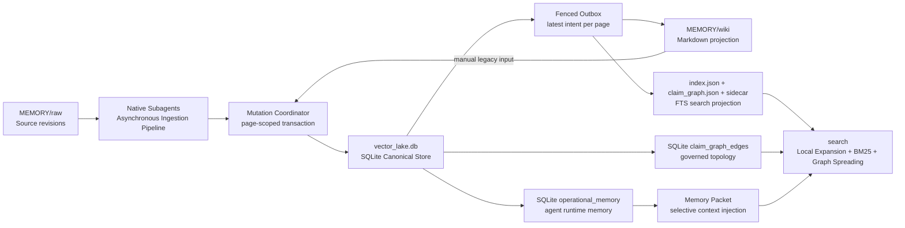

# Vector Lake

Vector Lake 是一个本地文件优先的知识编译器。它不是传统向量库，也不是一次性 RAG 后端，而是把原始材料持续编译成可审计的 Markdown wiki，并同步生成面向 Agent 的结构化运行态记忆。

当前架构边界：

- `MEMORY/raw`：原始信源 revision 的输入层。
- `MEMORY/wiki`：人类可读的 Markdown 发布层，用于审计、浏览、复盘和长期资产沉淀。
- `MEMORY/wiki/index.json`：页面级运行索引，用于搜索和拓扑扩展 (基于 BM25)。
- `MEMORY/wiki/.meta/vector_lake.db`：SQLite canonical 存储，保存实体、断言、证据、信源、图拓扑、变更集、治理队列、outbox 和 `operational_memory`。
- `MEMORY/purpose.md`：版本化战略控制面。YAML 契约驱动摄取范围、证据等级、意图权重、SIR 复审和张力合成阈值；营销噪音与范围外资料不进入主图谱，但保留最小丢弃审计。`purpose_vectors.json` 仅保留为旧版回退，不再是权重主源。

`MEMORY/wiki/.meta` 是默认 canonical 目录。若其中已经存在 canonical 数据但目录不可写，运行时会拒绝静默切换数据库；需要迁移位置时应显式设置 `VECTOR_LAKE_META_DIR`。仓库内 `data/v8_meta/` 只用于兼容既存 legacy fallback，或在默认 MEMORY 根没有 primary canonical 且 primary 无法写入时受控回退；`VECTOR_LAKE_ALLOW_META_FALLBACK=1` 可显式允许既存 primary 的回退。

## Architecture


```mermaid
graph LR
    RAW["MEMORY/raw<br>Source revisions"] --> INGEST["Native Subagents<br>Asynchronous Ingestion Pipeline"]
    INGEST --> MUTATION["Mutation Coordinator<br>page-scoped transaction"]
    WIKI["MEMORY/wiki<br>Markdown projection"] -->|manual legacy input| MUTATION
    MUTATION --> META["vector_lake.db<br>SQLite Canonical Store"]
    META --> OUTBOX["Fenced Outbox<br>latest intent per page"]
    OUTBOX --> WIKI
    OUTBOX --> INDEX["index.json + claim_graph.json + sidecar<br>FTS search projection"]
    META --> CLAIM["SQLite claim_graph_edges<br>governed topology"]
    META --> MEMORY["SQLite operational_memory<br>agent runtime memory"]
    MEMORY --> PACKET["Memory Packet<br>selective context injection"]
    INDEX --> QUERY["search<br>Local Expansion + BM25 + Graph Spreading"]
    CLAIM --> QUERY
    PACKET --> QUERY
```

核心原则：**Markdown 是人类界面，`.meta` 是事实底座，`operational_memory` 是 Agent 运行层。**

## Runtime Contract

下表来自当前源码与插件清单。修改相关公开表面时必须同步更新，不能用历史版本标题替代运行契约。

| Surface | Current contract |
|---|---|
| Plugin package | `11.16.0+codex.20260821091500` |
| Ingest payload | `INGEST_CONTRACT_VERSION = 5` |
| SQLite migration schema | `PRAGMA user_version = 7` |
| Canonical governance schema | `8.0` |
| Index projection | `PROJECTION_CONTRACT_VERSION = 1` |
| EvidencePacket | `1.1` |
| Public surfaces | 51 MCP tools / 32 CLI commands / 19 Codex skills / 19 Gemini command prompts |

通用 `init_db()` 遇到既有 v1–v6 数据库会拒绝自动升级。CLI-only
`schema-migrate` 接受契约完整的 v4、v5、v6 或 v7 数据库，按 v4→v5→v6→v7、
v5→v6→v7 或 v6→v7 单向迁移；契约完整的 v7 输入返回幂等 no-op。
v1–v3 明确不受该入口支持，必须先通过经单独验证的离线恢复或旧版迁移
流程升级到 v4。执行前必须停止 MCP/watchdog 及其他写入者；apply 持有 schema
maintenance lock，重新核验 preview fingerprint；preview 如报告未 checkpoint 的 WAL，
必须先用同一 fingerprint 执行显式 `--checkpoint-wal`，然后重新 preview。apply 在任何
DDL 前生成经 `quick_check` 验证、强制转换为 DELETE journal 的独立 SQLite 备份及
SHA-256，并先发布已 fsync 的 pending receipt/backup manifest。数据库提交后再发布
completed receipt；若迁移或 completed 发布失败，备份与 pending manifest 保留供恢复。
迁移只删除
`timeline_events` 上两条已经有等价替代项的重复索引，并明确保留仍被外部运行时
使用的 `wiki_embeddings`、`embedding_jobs` 与 `embedding_rate_events`。索引和
migration ledger 在同一 EXCLUSIVE 事务回滚，但备份、迁移收据及 journal
mode/sidecar 不属于该原子边界；旧进程不得与迁移 CLI 并行运行。删除索引只减少
后续维护开销，不会自动缩小数据库文件。

Schema v6 的历史 DDL 与迁移 checksum 保持不变；Schema v7 通过受控单向迁移将
change-set payload 原始上限提高到 8 MiB，同时保持压缩存储上限 4 MiB + 64 KiB。
单批累计仍为 32 MiB、最多 200 项且全批最多覆盖 200 个不重叠页面；终态历史只保留有界 manifest
和摘要，不保留可回放 payload。旧快照压缩规划每次最多扫描 5,000 行，默认最多处理
100 行/64 MiB，硬上限 500 行/128 MiB。retention 每批全局最多删除 500 行、默认
128 MiB；版本历史采用最多 5,000 行的主键游标窗口和族内顺序索引，不再对全表做
窗口排名。活动 change-set、job 与 outbox 的保护扫描同时受行数和 UTF-8 字节上限约束，
超过上限即停止版本删除。计划绑定参数、业务截止时间、运行代次、行级 guard 与持久
收据；下一批版本游标只能取自成功 apply 后的收据。任何物理
`VACUUM` 都必须在实际删除后重新测量 freelist，再于无写入者的独占维护窗口单独决策。

## CBSS Integration Boundary

Vector Lake 为可计算业务状态体系提供 Source、Evidence、Claim candidate、溯源和检索上下文，不承载 CBSS 的业务执行状态机。

- Vector Lake 负责：canonical Claim/Evidence/Source、知识投影、证据包导出和治理候选排序。
- CBSS 负责：权限确认、AcceptedFact 生命周期、Aggregate、Command、可执行 Policy、Decision、ActionRequest、ExecutionResult、业务 Event Ledger、补偿和业务系统对账。
- `EvidencePacket` 始终是待确认的 claim candidate；它不会把断言自动升级为 AcceptedFact。证据正文导出还必须提供 `actor_id` 与受限用途 `purpose`。
- Vector Lake Timeline 只用于知识变更与溯源，不得当作 CBSS 业务 Event Ledger。
- 接口契约位于 `contracts/cbss/`。

## 📂 受控类型与文件结构规范 (Controlled Types & File Structures)

为了保持图谱检索的高信噪比与一致性，用户维护的 Wiki Markdown 必须使用以下 10 种受控前缀。`System_*` 仅供运行时内部投影使用；`Overview_*` 不是有效前缀，宏观节点应使用 `Concept_*`。

### 1. 核心受控类型 (Prefixes)

文件名禁用空格与其他非规范符号，格式如 `Institution_北京协和医院.md`：

- **`Institution_*`**：医疗机构、医院、医学院、科研院所及需求/监管侧机构。
- **`Vendor_*`**：商业侧供应商、IT 企业、设备厂商。
- **`Product_*`**：医疗 IT 产品、系统、软件架构（强制包含资质合规槽位）。
- **`Person_*`**：核心高管、研究员、关键人物。
- **`Event_*`**：重要会议、行业事件。
- **`Concept_*`**：抽象架构、理论、业务机制及宏观全景节点。
- **`Policy_*` / `Standard_*`**：政策法规、行业标准。
- **`Source_*`**：对应 `raw/` 原始信源的一对一摘要节点。
- **`Synthesis_*`**：跨来源合成、比较与调研长文。

### 2. 文件结构设计

#### A. 实体与概念类 (Dual-Schema Mandate)

- **适用类型**：`Institution_`, `Vendor_`, `Product_`, `Person_`, `Event_`, `Concept_`, `Policy_`, `Standard_`
- **结构要求**：采用两段式知识投影：
  1. **`## 1. 编译事实 (Compiled Truth)`**：只保留当前共识，使用类型专属的 `###` 固化槽位，并为事实附加可审计来源。
  2. **`## 2. 证据时间线 (Timeline)`**：知识证据投影，不是业务 Event Store；允许受治理的纠错与 supersession，条目格式如 `- [YYYY-MM-DD] [Event_Tag]...`。

#### B. Source 类

`Source_*` 可使用自由正文结构，用于保留单一原始信源的可审计摘要。

#### C. Synthesis 类

`Synthesis_*` 不使用实体双结构，但必须包含 `## 核心合成论点 (Core Synthesized Claims)` 与 `## 支撑拓扑 (Supporting Topology)` 两个章节。

## Quick Start

1. **配置扫描范围**：检查 `config.json` 的 `target_directories`、`exclude_paths` 与 `supported_extensions`。非 embedding 文本推理不由插件调用外部模型 API；`GEMINI_API_KEY` 只用于 embedding。
2. **扫描并入队**：执行 `python cli.py sync`。一次调用扫描配置范围、跳过已处理 revision，并最多持久化 50 个 ingest v5 job；它不会直接生成 subagent 任务包，也不承诺清空历史队列。
3. **分发任务包**：运行 `python watchdog_sync.py`，或单独运行 `python -m vector_lake.ingest_worker`。worker 只领取当前 ingest v5 queued job，在隔离目录生成任务包，并把 job 转为 `awaiting_subagent`。
4. **领取任务**：宿主使用 `python cli.py ingest-tasks --claim --limit 5` 或 MCP `claim_ingest_tasks` 领取。领取结果包含任务包以及 `lease_owner`、`lease_token`、`lease_generation`。
5. **完成摄取**：宿主生成 Wiki payload 后调用 MCP `finalize_ingest`，提交 `files_written`、任务包中的 `processed_data` 和领取阶段的租约字段。成功后同一事务完成 job 并登记 `processed_files`。

重复执行 `sync` 直到返回 `VECTOR_LAKE_RAW_FULL_SCAN_COMPLETE_V1` 且没有新 revision；这只证明当前 inventory 已扫描，不代表 queued、awaiting-subagent 或 failed 债务为零。还应执行 `python cli.py ingest-tasks` 与 `python cli.py ingest-tasks --repair-debt --limit 0` 核对队列。

### Ingest v5 task-packet contract

磁盘中的任务包顶层字段必须精确为 `task_id`、`task_type`、`created_at`、`runtime`、`cost_boundary`、`expected_output`、`metadata`、`prompt`。`metadata` 必须精确包含 `job_id`、`processed_data`、`finalize_tool`；其中 `processed_data` 必须绑定 durable job 的 `filepath`、`hash`、`canonical_name`、`source_hash`、`source_projection_hash`、`integration_candidates`、`ingest_contract_version`、`job_id`。

领取阶段会同时校验任务包所在的 `<active-db-dir>/subagent_tasks/<run>/` 稳定状态目录、文件名与 `task_id`、runtime/cost boundary、预期输出、`finalize_ingest` 工具名、完整 prompt，以及以上字段与 SQLite durable payload 的逐项一致性。任务包与临时 `brain/<run>/scratch/` 都位于活动数据库同级目录，不写入版本化插件安装目录；可分别通过绝对路径环境变量 `VECTOR_LAKE_SUBAGENT_TASK_ROOT` 和 `VECTOR_LAKE_SUBAGENT_BRAIN_ROOT` 覆盖。缺失或被修改的受控任务包会在当前租约下重建；无法安全重建时领取失败并持久化原因。`finalize_ingest` 还会复核 raw revision、Source/target canonical 与 projection hash、候选清单、`integrated` / `standalone` / `rejected` 处置，以及 owner/token/generation fencing。

Ingest v5 要求新生成的 `Source_*` 文件名直接通过严格命名校验：目录层级、空格和原始下划线统一收敛为连字符，完整 source identity 的哈希后缀保留，文件名总长不超过 120 字符。v4 活动任务会在领取前受控重建；若 raw、Source 或候选目标基线在分发后变化，finalize 不写入部分结果，而是失效旧 lease、把任务降级到重建路径，再生成新的 v5 packet。

### Current runtime boundaries

- canonical 变更与 durable outbox intent 在同一 SQLite 事务提交；Markdown、FTS、`index.json` 与 `claim_graph.json` 是可恢复投影，不承诺跨 SQLite 与文件系统的单事务 ACID。
- 非 embedding 文本推理由当前环境 subagent 处理；插件运行时不通过 `google-genai` 调用文本生成模型。
- 向量保存在 SQLite `vec_embeddings`；查询向量请求有等待上限和失败冷却，索引重建不隐式调用 embedding API，缺失向量由 `embedding-backfill` 断点补齐。
- 同步 MCP 工具使用独立的快速读取与重型任务有界通道；长时 GC/扫描不会占用快速读取 worker。源码 revision 变化后，除 `mcp_runtime_status` 外的工具会要求重启 connector。
- watchdog 负责 raw/Wiki 增量事件、queued ingest 分发、outbox 投影和确定性维护；研究、去重、聚类及 Janitor 脚本不会被隐式启动。
- 长文本 MCP 工具只接受批准 sandbox 内、受大小限制的 `payload_file`；不通过 shell 拼接外部文本。
- 删除和保留策略采用 preview/apply 分离；孤儿 GC 与备份保留还要求当前候选 fingerprint 确认。

## Operational Memory

运行态记忆由 `vector_lake/governance_store.py` 从 canonical claims 编译生成。它解决的问题是：Agent 常常只需要一个事实、偏好、决策或任务状态，不应该每次加载整页 Markdown。

> **受控写入范式**：Agent 通过 `update_operational_memory` 提交运行态记忆，不直接编辑 SQLite 或 Wiki。Mutation Coordinator 在 canonical 事务中写入变更与 durable outbox，再由 worker 更新 Markdown、索引和其他可重建投影。

内置类型：

- `fact`：一般事实或断言。
- `preference`：用户偏好、默认策略、首选路径。
- `decision`：已批准或当前有效的决策。
- `task_state`：任务状态、阻塞项、待处理事项。

每条运行态记忆会计算：

- `confidence_score`
- `freshness_score`
- `authority_score`
- `importance_score`
- `reinforcement_score`
- `validity_factor`
- `memory_score`

冲突规则：

- 显式 contradiction：`authority_score > confidence_score > updated_at`。
- 同一 `memory_key` 的 `preference / decision / task_state`：`updated_at > authority_score > confidence_score`。
- 失败侧标记为 `superseded`；无法裁决时保留 `conflicted`。

`query` 会优先生成 Memory Packet，再按预算拼接相关 wiki 页面。Memory Packet 包含当前偏好、决策、任务状态、相关事实、冲突/陈旧告警和证据指针。

## Storage Layout & Architecture

Vector Lake 使用 SQLite canonical 与可重建投影分离的架构。

- **SQLite (Canonical Store)**：`vector_lake.db` 保存 entities、claims、evidence、sources、graph edges、governance state、jobs、outbox 与 operational memory。
- **Markdown (Human-Audit Projection)**：`wiki/*.md` 是可审计发布面；`raw/` 保存由扫描器识别和按 revision 跟踪的输入材料。
- **Derived Projections**：`index.json`、FTS、`claim_graph.json`、`projection_pair_manifest.json`、Timeline 和 operational-memory packets 可从 canonical 状态与受治理信源重建。小型 sidecar 是 index/claim-graph 对的最后提交标记，绑定共同 generation、文件大小和 SHA-256；缺失、损坏或摘要不一致时读取链路失败关闭并要求重新同步。
- **Commit Boundary**：canonical change set 与 outbox intent 在 SQLite 内原子提交；文件投影使用备份、原子替换和 fenced worker 恢复，但不宣称文件系统与 SQLite 之间存在分布式事务。

```text
MEMORY/
  purpose.md          <-- Versioned Strategic Purpose Contract & Epistemic Stance
  raw/
  wiki/
    *.md
    index.json
    .meta/
      purpose_vectors.json <-- Optional legacy fallback for intent weights
      vector_lake.db       <-- Unified SQLite Store (Entities, Claims, Graph, Timeline, Operational Memory)
```

## Commands

> **Note**: `vector_lake/mcp_server.py` 提供主要 MCP 工具表面；CLI 继续作为操作、诊断和维护入口。
> 
> **Gemini CLI Slash Commands**: 我们已将常用功能映射为快捷指令（在聊天框输入 `/` 触发）：
> 以下 `/...` 入口属于 Gemini CLI 的 `commands/*.toml` 兼容层。Codex 不加载插件自定义 slash command；在 Codex 中使用 `$vector-lake:query`、`$vector-lake:timeline` 等同名技能，或直接要求调用对应 MCP 工具。
>
> - `/sync`：扫描未处理 raw revision，并把一个有界批次持久化为 ingest v5 job
> - `/search`：语义搜索向量湖索引
> - `/query`：深度逻辑推理与查询
> - `/review`：检查统一治理队列
> - `/resolve`：处理治理队列中的待办项
> - `/audit`：合成图拓扑并执行审查
> - `/debt`：查看图谱治理债务指标
> - `/lint`：执行节点健康度自愈审查（支持传入 `auto_fix=True` 自动修复残缺元数据与图谱断层）
> - `/research`：自主扫描并下发网络检索指令
> - `/graph`：直接生成并刷新 3D 可视化拓扑面板
> - `/doctor`：运行环境与依赖发现性体检；重型依赖的实际导入由对应运行路径和测试验证
> - `/daemon_watchdog`：启动长期运行的增量监听与 ingest dispatcher
> - `/gc`：垃圾回收与孤儿节点自动清理
> - `/delete`：级联删除信源与切断图谱边
> - `/trace`：展示实体或知识断言的溯源追踪
> - `/merge`：扫描并提出知识合并建议
> - `/timeline`：搜索与提取战略时间线事件
> 
> 以下底层 CLI 命令仍然保留，供人类开发者日常手动调试与状态维护。

基础体检：

```powershell
python cli.py doctor
```

语义就绪度（与基础设施健康分开）：

```powershell
python cli.py readiness
```

导出只读证据包（默认不返回证据正文）：

```powershell
python cli.py evidence-packet "<claim_id>"
```

扫描 raw sources 并持久化一个有界 ingest v5 批次：

```powershell
python cli.py sync
```

查看、领取与维护摄取队列：

```powershell
python cli.py ingest-tasks
python cli.py ingest-tasks --claim --limit 5 --lease-seconds 3600
python cli.py ingest-tasks --repair-debt --limit 0
python cli.py ingest-tasks --repair-debt --apply --limit 100
python cli.py ingest-tasks --cleanup-orphans --min-age-seconds 86400 --limit 100
```

`--repair-debt` 与 `--cleanup-orphans` 默认只预览；只有显式 `--apply` 才修改状态或删除受控孤儿任务包。

启动后台守护进程（增量监听与 queued job 分发）：

```powershell
python watchdog_sync.py
```

`watchdog_sync.py` 是独立进程，不会自动继承 MCP 子进程的环境。入口会在导入
Vector Lake 运行时前，从同目录 `.mcp.json` 补齐缺失的
`VECTOR_LAKE_MEMORY_DIR` 与 `VECTOR_LAKE_META_DIR`；调用方成对显式设置的环境
变量优先。只覆盖其中一个、清单缺失或路径字段无效时，入口会失败关闭，不会静默回退到旧
`~/.gemini/MEMORY`。

搜索页面层：

```powershell
python cli.py search "Agent memory" --top_k 5
```

搜索运行态记忆：

```powershell
python cli.py search "部署目标" --mode memory --top_k 5
```

搜索 claim-level facts：

```powershell
python cli.py search "Agent memory" --mode claim --top_k 5
```

基于 Memory Packet 和 wiki 证据做 synthesis：

```powershell
python cli.py query "对比 Karpathy LLM Wiki 与 Agent memory 的架构差异"
```

只预览 query 输出，不落盘：

```powershell
python cli.py query "总结当前运行态记忆架构" --dry-run
```

治理与审计：

```powershell
python cli.py review
python cli.py review resolve <index|item_id> --resolution skip
python cli.py audit-graph
python cli.py research
python cli.py debt --top 20
python cli.py trace "<query-or-id>"
python cli.py merge-suggestions --limit 20
```

Merge preview balances `merge`, `alias`, `review`, and `keep_separate` decisions.
Queue creation accepts only two-page `merge` candidates that passed semantic/schema
preflight and carry both canonical-version and Markdown-projection hashes.

图谱与清理：

```powershell
python cli.py graph
python cli.py gc --days 30 --dry-run
python cli.py gc --days 30 --apply --confirm-orphans "<dry-run-fingerprint>"
python cli.py delete "<raw-source-path>" --dry-run
```

GC 的孤儿页删除要求显式 `--apply`，并且 `--confirm-orphans` 必须与当前 dry-run 返回的候选 fingerprint 完全一致。孤儿预览和删除不再扫描历史保留候选；历史清理由独立 `history-retention` 工作流处理。确认删除会在 `wiki/.meta/gc-runs/` 写入独立事务收据，记录备份 manifest 哈希与 outbox ID；Doctor 会验证收据、备份目录、manifest，深度检查时还会复核每个备份文件。

投影与 canonical 维护：

```powershell
# 1. 先停止 MCP、watchdog 和其他 SQLite 写入者。
python cli.py schema-migrate
# 2. 仅当 preview 报告 database_has_uncheckpointed_wal 时执行；之后必须重新 preview。
python cli.py schema-migrate --checkpoint-wal --confirm-fingerprint "sha256:<preview-fingerprint>" --confirm-no-writers
python cli.py schema-migrate
# 3. 使用重新 preview 返回的 fingerprint 执行迁移。
python cli.py schema-migrate --apply --confirm-fingerprint "sha256:<preview-fingerprint>" --confirm-no-writers
# 4. pending/completed 收据都要求重建投影；数据库迁移不会自动执行此步骤。
python cli.py projection-rebuild-index --apply
python cli.py doctor

python cli.py projection-report --limit 20
python cli.py canonical-backfill --limit 100
python cli.py canonical-backfill --apply --limit 100
python cli.py evidence-foundation-backfill --limit 100
python cli.py evidence-foundation-backfill --apply --limit 100 --batch-size 25
python cli.py timeline-rebuild
python cli.py timeline-rebuild --apply
python cli.py projection-rebuild-index
python cli.py projection-rebuild-index --apply
python cli.py embedding-backfill --limit 200
python cli.py embedding-backfill --apply --limit 200
python cli.py wiki-restore --limit 10
python cli.py wiki-restore --apply --limit 10
python cli.py memory-search-index
python cli.py memory-search-index --apply --batch-size 256
python cli.py memory-cleanup
python cli.py memory-cleanup --apply
python cli.py history-retention --ttl-days 30 --batch-size 500
python cli.py history-retention --apply --ttl-days 30 --batch-size 500 --plan-as-of "<preview-plan-as-of>" --confirm-fingerprint "sha256:<preview-fingerprint>"
python cli.py history-retention --ttl-days 30 --claim-version-cursor "<receipt-claim-cursor>" --evidence-version-cursor "<receipt-evidence-cursor>" --version-cursor-receipt "sha256:<prior-receipt-fingerprint>"
python cli.py change-set-compaction --max-rows 100 --max-input-bytes 67108864
python cli.py change-set-compaction --apply --max-rows 100 --max-input-bytes 67108864 --confirm-fingerprint "sha256:<preview-fingerprint>"
python cli.py change-set-compaction --max-rows 100 --max-input-bytes 67108864 --cursor "<prior-successful-safe-next-cursor>"
python cli.py change-set-compaction --apply --max-rows 100 --max-input-bytes 67108864 --cursor "<same-input-cursor>" --confirm-fingerprint "sha256:<matching-preview-fingerprint>"
python cli.py topology-queue-cleanup
python cli.py topology-queue-cleanup --apply
python cli.py orphan-source-classify
python cli.py orphan-source-classify --apply
python cli.py backup-retention --keep-latest 5 --min-age-days 30 --stage-ttl-hours 24
python cli.py backup-retention --keep-latest 5 --min-age-days 30 --stage-ttl-hours 24 --apply --confirm-fingerprint "sha256:<preview-fingerprint>"
```

除只读报告外，维护入口默认 preview-first；只有显式 `--apply` 或 `--checkpoint-wal` 才写入。`schema-migrate` 的 preview 不创建目录、lock、数据库或 SQLite sidecar；checkpoint 与 apply 互斥，二者都必须提交匹配的完整 fingerprint 与 `--confirm-no-writers`。checkpoint 只在 maintenance/heavy lock 内执行 `wal_checkpoint(TRUNCATE)`，不生成备份、不执行 DDL，并返回新的只读 preview/fingerprint。apply 在 DDL 前持久化备份和 pending manifest，成功收据返回备份路径/摘要及 `projection_rebuild_required=true`。普通 v7 输入是幂等 no-op；若 v7 preview 发现并校验到同数据库的 pending manifest，仍返回 `projection_rebuild_required=true`，apply 可补发 completed receipt，且不会新建备份。`canonical-backfill` 从 Wiki Markdown 回填缺失 canonical；`evidence-foundation-backfill` 只合并缺失的证据基础元数据；`projection-rebuild-index` 从 canonical 重建 `index.json`、FTS、`claim_graph.json` 和 sidecar，并保留已有 `vec_embeddings`；`embedding-backfill` 按 RPM/TPM 限额断点补齐向量；`wiki-restore` 只做 projection-only 恢复；`memory-search-index` 每次推进一个有界索引批次；`history-retention` 只删除超龄且不再被引用的有界历史批次，apply 必须提交同一次预览返回的 `plan_as_of` 与完整 fingerprint；`change-set-compaction` 将旧 change-set 完整快照转换为受限 manifest 与内容寻址引用，apply 必须提交同一次预览的完整 fingerprint，后续批次只能使用上一次成功 apply 的 `result.safe_next_cursor` 作为 `--cursor`；`memory-cleanup`、`topology-queue-cleanup` 和 `orphan-source-classify` 均先返回候选或债务分类。

`backup-retention` 预览返回 fingerprint；apply 必须复用相同的 `keep-latest`、`min-age-days`、`stage-ttl-hours` 参数并提交该 fingerprint。默认保留最新 5 份完整备份、30 天内的完整备份和最新一份经实际校验可恢复的 canonical/projection 快照；过期但校验通过的删除 tombstone 也可作为恢复保护点，私有 staging 与失败删除 tombstone 至少保留 24 小时。预检和执行前重扫会核验 artifact SHA-256、SQLite 结构与完整性、投影/数据库代次；新备份还会复制并验证 sidecar，旧版无 sidecar 的 v3 备份继续按内嵌 pair contract 兼容校验。

## Config

`config.json` 只控制 raw 扫描范围；运行时调度使用环境变量和 SQLite 状态：

- `VECTOR_LAKE_MEMORY_DIR`：覆盖默认 `~/.gemini/MEMORY` 根目录。`VECTOR_LAKE_META_DIR` 显式指定 canonical meta 目录；`VECTOR_LAKE_ALLOW_META_FALLBACK=1` 只用于显式允许既存 primary 的 fallback。
- `target_directories`：raw source 扫描根目录。
- `exclude_paths`：按大小写不敏感的完整路径组件或连续组件排除，并在目录遍历阶段剪枝；不会用裸字符串误匹配相似目录名。
- `supported_extensions`：允许扫描的扩展名。
- 已处理 revision 统一记录在 SQLite `processed_files` 表；`config.json` 不再声明未被运行时读取的 `processed_files_path`。
- Raw watchdog 对单个变更使用候选路径摄取；高峰期由单飞 worker 和有界路径集合合并事件，溢出时触发补偿扫描。候选事件与补偿扫描都固定排除任意大小写形式的 `privacy/Diary` 路径。
- `VECTOR_LAKE_RAW_WATCH_REFRESH_SECONDS`：重读 raw 目录配置并协调监听的周期，默认 `5` 秒。
- `VECTOR_LAKE_RAW_WATCH_RETRY_MAX_SECONDS`：单个不可监听目录的最大重试退避，默认 `300` 秒。
- `VECTOR_LAKE_SUBAGENT_RUN_ID`：当前宿主运行标识；经清洗后决定 `brain/<run>/scratch/` 隔离目录。任务包路径不是 `config.json` 键。
- `VECTOR_LAKE_INGEST_WORKER_RUN_ID`：ingest dispatcher 的 lease owner；未设置时使用主机名与 PID。`VECTOR_LAKE_INGEST_TASK_MAX_AGE_SECONDS` 控制 watchdog 回收 awaiting job 的阈值，默认 `86400` 秒。
- `VECTOR_LAKE_PAYLOAD_ROOT`：显式覆盖 MCP `payload_file` 的批准根目录；未设置时只接受插件 `brain/<run>/scratch/` 或 `~/.codex/brain/<run>/scratch/`。
- `VECTOR_LAKE_PAYLOAD_MAX_BYTES`：单个 MCP sandbox payload 上限，默认 `5 MiB`。
- Timeline 重建通过 `timeline-rebuild` 命令执行，不读取 `timeline.projection_rebuild` 配置键。
- `VECTOR_LAKE_EMBEDDING_MODEL`：embedding 模型，默认 `gemini-embedding-2`；非 embedding 文本推理不由插件调用外部模型 API。
- `VECTOR_LAKE_EMBEDDING_RPM` / `VECTOR_LAKE_EMBEDDING_TPM`：embedding 调度限额，默认 `3000` / `1000000`。
- `VECTOR_LAKE_EMBEDDING_UTILIZATION`：安全水位，默认 `0.8`，即按 2400 RPM / 800k TPM 调度。
- `VECTOR_LAKE_EMBEDDING_MAX_BATCH_ITEMS` / `VECTOR_LAKE_EMBEDDING_MAX_BATCH_TOKENS`：单批条数与 token 上限，默认 `100` / `200000`。
- `VECTOR_LAKE_EMBEDDING_MAX_CHARS_PER_ITEM` / `VECTOR_LAKE_EMBEDDING_MAX_RETRIES` / `VECTOR_LAKE_EMBEDDING_DIMENSION` / `VECTOR_LAKE_EMBEDDING_MAX_CONSECUTIVE_FAILURES`：默认 `15000` / `5` / `3072` / `3`。
- `VECTOR_LAKE_EMBEDDING_TIMEOUT_MS`：单次 embedding HTTP 超时，默认 `30000` 毫秒。
- `VECTOR_LAKE_QUERY_EMBEDDING`：查询时调用 embedding provider 的显式能力门；默认关闭，只有精确设为 `1` 且存在 `GEMINI_API_KEY` 才允许外呼。
- `VECTOR_LAKE_QUERY_EMBEDDING_TIMEOUT_MS` / `VECTOR_LAKE_QUERY_EMBEDDING_MAX_WAIT_MS` / `VECTOR_LAKE_QUERY_EMBEDDING_FAILURE_COOLDOWN_SECONDS`：查询向量默认 `2000 ms` 请求超时、`250 ms` 配额等待、失败后 `30 s` 冷却。
- `VECTOR_LAKE_QUERY_EMBEDDING_FTS_BYPASS_MIN_RESULTS`：FTS 已返回足够候选时跳过远程查询向量，默认 `5`；设 `VECTOR_LAKE_QUERY_EMBEDDING_ALWAYS=1` 可恢复每次向量混合。
- `VECTOR_LAKE_MCP_REVISION_CHECK_SECONDS`：源码 revision 检查周期，默认 `5` 秒；设为 `0` 时每次检查。
- `VECTOR_LAKE_MCP_BLOCKING_WORKERS`：同步 MCP 工具 worker 数，默认 `1`，限制为 `1` 至 `8`；需要更高吞吐时可显式上调，并同步评估重型查询的并发内存。
- `VECTOR_LAKE_MCP_BLOCKING_QUEUE_CAPACITY`：等待队列容量，默认等于 worker 数，限制为 `0` 至 `64`。
- `VECTOR_LAKE_MCP_HEAVY_WORKERS`：重型 MCP 工具独立 worker 数，默认 `1`，限制为 `1` 至 `2`。
- `VECTOR_LAKE_MCP_HEAVY_QUEUE_CAPACITY`：重型工具独立等待队列，默认等于重型 worker 数，限制为 `0` 至 `8`。
- `VECTOR_LAKE_MCP_ADMISSION_TIMEOUT_SECONDS`：饱和 admission 等待，默认 `0.05` 秒，限制为 `0` 至 `5` 秒；超时返回“retry later”。
- `VECTOR_LAKE_MCP_SHUTDOWN_TIMEOUT_SECONDS`：transport 结束后的排空等待，默认 `5` 秒，限制为 `0.1` 至 `30` 秒；超时取消未开始项，已运行 daemon worker 可能在后台完成。
- `VECTOR_LAKE_MCP_HEAVY_TASK_WAIT_SECONDS`：MCP 重任务等待共享跨进程门的时间，默认 `0.5` 秒，限制为 `0` 至 `5` 秒；超时返回结构化 `heavy_task_busy`。
- `VECTOR_LAKE_TOPOLOGY_REFRESH_DEBOUNCE_SECONDS`：outbox 投影批次后的图拓扑合并刷新等待，默认 `5` 秒。
- `VECTOR_LAKE_TOPOLOGY_MAX_STALENESS_SECONDS`：连续投影期间允许图拓扑保持 dirty 的最长时间，默认 `300` 秒。
- `VECTOR_LAKE_SEARCH_RESULT_MAX_CHARS`：页面搜索结果字符预算，默认 `24000`，与 `top_k` 独立。
- `VECTOR_LAKE_SEARCH_RESULT_MAX_BYTES`：页面搜索结果 UTF-8 字节预算，默认 `32768`；字符和字节预算同时生效。
- `VECTOR_LAKE_DATABASE_WARNING_BYTES`：Doctor 数据库体积告警阈值，默认 `4 GiB`。
- `VECTOR_LAKE_DATABASE_DAILY_GROWTH_WARNING_BYTES` / `VECTOR_LAKE_VERSION_DAILY_GROWTH_WARNING_ROWS`：Doctor 的每日数据库增量与 Claim/Evidence 版本行增量告警阈值，默认 `256 MiB` / `50000` 行。Watchdog 每个 UTC 日记录一次、保留 35 个样本，不自动删除历史。
- `VECTOR_LAKE_CLI_HEAVY_TASK_WAIT_SECONDS`：CLI 重任务等待同一门的时间，默认 `30` 秒，限制为 `0` 至 `300` 秒；超时退出码为 `75`。
- `VECTOR_LAKE_TOPOLOGY_WORKER_TIMEOUT_SECONDS`：Louvain 拓扑隔离进程超时，默认 `60` 秒，限制为 `5` 至 `300` 秒；失败时回退到确定性的 connected-components。
- `VECTOR_LAKE_WAL_AUTOCHECKPOINT_PAGES`：每个可写 SQLite 连接的自动回写阈值，默认 `1000` 页；它在事务提交后生效，不限制单个大事务的峰值。
- `VECTOR_LAKE_WAL_JOURNAL_SIZE_LIMIT_BYTES`：checkpoint/reset 后允许保留的 WAL 高水位，默认 `67108864` bytes（64 MiB）；它不是活动事务期间的硬体积上限。
- MCP、CLI 与 watchdog 以 canonical meta 根下的 `.heavy-task.lock` 共享单容量重任务门；同线程可重入，跨线程/进程互斥，soft deadline 只告警而不抢锁。`mcp_runtime_status` 返回源码 revision、快/重通道 worker、队列、inflight、准入拒绝、排队/执行耗时、搜索阶段耗时以及 heavy-task owner 状态；它是源码漂移后仍允许调用的诊断工具。
- 只读 Lint/Doctor 通过 SQLite 只读事务读取已提交 WAL 状态，不以 WAL 文件非空判定失败，也不执行 checkpoint；WAL 截断继续使用要求 fingerprint 与无写入者确认的显式维护入口。
- 所有进程通过 SQLite 滚动窗口共享 embedding RPM/TPM 预算；索引重建和增量索引不调用 embedding API。
- Ingest 完成必须提交领取阶段返回的 `job_id`、`lease_owner`、`lease_token` 和 `lease_generation`；过期 worker 的结果会被事务内 CAS 拒绝。
- Mutation outbox 同样使用 owner/token/generation fencing；较旧 intent 会被标记为 `superseded`，worker 写投影前再次校验租约。
- Raw ingest identity 由规范化绝对路径、内容 hash 与 canonical name 生成；相同内容的不同路径独立排队。
- `VECTOR_LAKE_RAW_FULL_SCAN_COMPLETE_V1` 只表示本轮 inventory 完整；“无新 revision 入队”不代表 queued、awaiting-subagent 或 failed 债务为零。
- ingest 债务 apply 每次最多处理 `100` 条；`limit=0` 使用该默认批量并返回 `remaining_unselected`。只读预检的 `limit=0` 覆盖全部候选。
- 治理队列通过单行 SQLite 操作插入和解析，业务键去重不采用整表 load/save。

## Module Map

| Path | Role |
|---|---|
| `cli.py` | 根目录薄入口 |
| `vector_lake/cli_app.py` | CLI 参数与命令路由 |
| `vector_lake/tools.py` | Tool facade |
| `vector_lake/tool_ingest.py` | ingest v5 扫描入队、任务包领取/修复、债务恢复与 lease-fenced finalization |
| `vector_lake/ingest_worker.py` | queued job dispatcher；生成受控任务包并转入 `awaiting_subagent` |
| `vector_lake/native_llm.py` | 当前环境 subagent 任务包、scratch 路径与 payload 隔离边界 |
| `vector_lake/embedding_scheduler.py` | sqlite-vec 缺失向量的限速、断点和单写调度 |
| `vector_lake/indexer.py` | `index.json` 生成，使用 Sparse Graph Traversal 优化计算拓扑边 |
| `vector_lake/claim_extractor.py` | Markdown page -> entity/claim/evidence/source |
| `vector_lake/tool_memory.py` | 运行态记忆的受控写入入口 |
| `vector_lake/governance_store.py` | canonical store、change sets、operational memory 与冲突裁决 |
| `vector_lake/governance_metrics.py` | debt metrics、治理统计与候选报告编排 |
| `vector_lake/merge_analysis.py` | Unicode-safe 候选召回、证据评分、四态裁决、连通分组与合并预检 |
| `vector_lake/tokenizer_runtime.py` | rjieba 统一分词边界，保证索引与查询词项一致 |
| `vector_lake/tool_search.py` | 混合检索管线 (Local Query Expansion + SQLite FTS5 BM25 + Multi-Hop PPR) 与 Memory Packet |
| `vector_lake/tool_query.py` | query-to-page synthesis |
| `vector_lake/tool_research.py` | 拓扑图谱洞察分析与主动深度研究下发 |
| `vector_lake/purpose_contract.py` | 战略目的解析、摄取门、SIR 复审与 Synthesis-Proposal 阈值 |
| `vector_lake/tool_review.py` | legacy/governance review surface |
| `vector_lake/tool_doctor.py` | 只读基础设施体检与语义就绪度摘要 |
| `vector_lake/tool_legacy_graph_audit.py` | 以 caller-owned 只读连接对账旧 Wiki 图与 canonical/page/claim 关系；只输出删除阻断证据，不提供删除入口 |
| `vector_lake/tool_storage_baseline.py` | 以 caller-owned 只读事务建立 FTS5/vec0 重建基线；重建就绪必须同时核验 sidecar/index/claim-graph 原始字节、嵌入 manifest、expected corpus，并在扫描前后复核 live canonical generation |
| `vector_lake/storage_growth.py` | 每日一次、35 天有界的数据库、版本表与备份容量增长基线；仅采样和告警，不执行压缩或历史删除 |
| `vector_lake/tool_governance_maintenance.py` | evidence foundation、history retention、memory index 与债务维护 |
| `vector_lake/tool_backup_retention.py` | 指纹确认、恢复点保护与两阶段备份保留 |
| `vector_lake/runtime_health.py` | 基础设施健康和语义就绪度的独立只读评估器 |
| `vector_lake/tool_evidence.py` | 按 Claim ID 导出只读 `EvidencePacket` |
| `vector_lake/evidence_foundation.py` | 校验 SourceArtifact 字节完整性、原始定位、抽取运行与谱系 |
| `vector_lake/claim_assessment.py` | 追加式 ClaimAssessment；不产生 AcceptedFact |
| `vector_lake/decision_registry.py` | 同步外部已验证 CriticalDecisionRegistry 并支持决策范围就绪度 |
| `vector_lake/quality_registry.py` | 登记不可变 schema/dialect 版本与 golden dataset 评估结果 |
| `vector_lake/mcp_server.py` | 51-tool MCP 表面、源码 revision guard、payload sandbox 与 bounded blocking executor |
| `vector_lake/watchdog_app.py` | 增量监听后台服务，队列调度，定时自愈审计 (Scheduled Auto-Lint) |
| `vector_lake/watchdog_status.py` | Watchdog 状态遥测面板 (Status JSON) |
| `vector_lake/wiki_utils.py` | Path resolution, frontmatter, atomic writes, backups |
| `vector_lake/db_store.py` | SQLite connection pooling, schema init logic, `_INIT_LOCK` guarding, and WAL settings |
| `vector_lake/mutation_coordinator.py` | page/multi-page mutation 编排、canonical/outbox 提交、投影备份与恢复 |
| `vector_lake/defense_hook.py` | Pre-flight constraints and guardrails |
| `vector_lake/skeleton_parser.py` | Parsers for structural validation |
| `vector_lake/provenance.py` | Tracing entities to raw sources |
| `vector_lake/tool_piea.py` | PIEA entity schema interceptor |
| `vector_lake/tool_bulk_reconciliation.py` | Graph reconciliation |
| `vector_lake/yaml_utils.py` | YAML helpers |
| `scripts/community_clustering_daemon.py` | Deprecated/unsupported legacy Louvain operator script; disabled by default |
| `schema.md` | Wiki 与运行态记忆契约 |
| `commands/` | 19 个 Gemini CLI slash-command 兼容提示；Codex 使用同名 namespaced skills |
| `contracts/cbss/` | Vector Lake 与 CBSS 的证据、权限确认、业务事件及就绪度契约 |

### Deprecated legacy operator daemons

`scripts/semantic_dedup_daemon.py` 与
`scripts/community_clustering_daemon.py` 是不受支持的历史运维脚本，默认在任何
DB、`index.json` 或 governance 访问前失败关闭。仅隔离恢复场景的受信 operator
进程可显式设置 `VECTOR_LAKE_ENABLE_LEGACY_UNSAFE_DAEMONS=1`；即使启用，也禁止
与 `watchdog_sync.py` / `vector_lake.watchdog_app.py` 并行运行。

日常运行使用受支持入口：由 watchdog/indexer 维护增量索引和拓扑；通过
`python cli.py projection-rebuild-index` 预览索引重建，通过
`python cli.py embedding-backfill --limit 200` 预览缺失向量，并通过
`python cli.py topology-queue-cleanup` 预览历史 topology queue 债务。写入操作继续
遵循各命令的显式 `--apply` 与无并发写入者门禁。

## Validation

验证基线由当前命令生成，不在文档中固化测试数量或运行态数据计数：

```powershell
python -m pip check
python -m ruff check --no-cache --isolated --select E4,E7,E9,F vector_lake tests
$env:PYTHONIOENCODING='utf-8'; python -m compileall -q vector_lake tests
$env:PYTHONIOENCODING='utf-8'; python -m pytest -q -p no:cacheprovider tests
$env:PYTHONIOENCODING='utf-8'; python -m pytest --collect-only -q -p no:cacheprovider tests
$env:PYTHONUTF8='1'; python cli.py doctor
$env:PYTHONUTF8='1'; python cli.py readiness
$env:PYTHONUTF8='1'; python cli.py projection-report --limit 5
$env:PYTHONUTF8='1'; python cli.py evidence-packet "<claim_id>"
```

发布证据应记录每次运行的实际结果和实时收集的测试数量。`doctor` 健康不代表语义就绪；`readiness` 可以因治理积压、拓扑待刷新或断言有效性问题返回 `degraded` / `not_ready`。这两个 CLI 成功生成报告时都返回进程退出码 `0`，即使报告内容是 `FAIL`、`degraded` 或 `not_ready`；未捕获异常才返回非零。发布门必须解析输出内容，不能只检查 shell exit code。

## Notes

- Windows 控制台建议设置 `PYTHONUTF8=1`，避免中文路径或中文输出触发编码问题。
- 本仓库可能存在 live file lock；如果 `index.json` 或 `.meta` 文件正在被其他进程占用，先释放锁再重建。
- `*.bak`、`*.tmp`、`tmp/`、`data/` 默认被 `.gitignore` 忽略。
