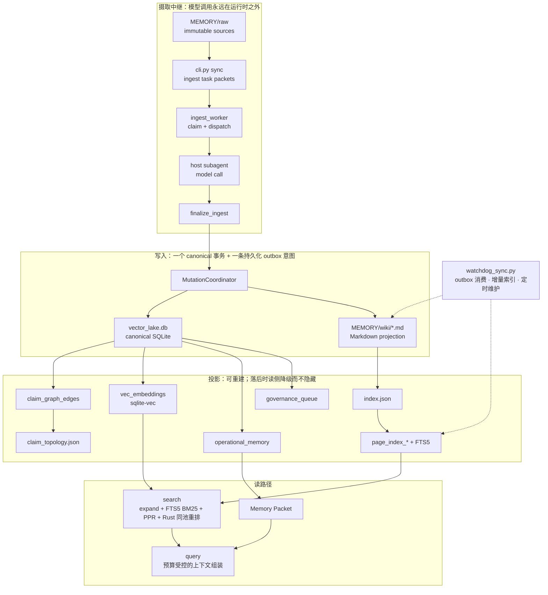

# Vector Lake

Vector Lake 是一个本地文件优先的知识编译器。它不是传统向量库，也不是一次性 RAG 后端，而是把原始材料持续编译成可审计的 Markdown wiki，并同步生成面向 Agent 的结构化运行态记忆。

当前架构边界：

- `MEMORY/raw`：原始信源层，只读输入。
- `MEMORY/wiki`：人类可读的 Markdown 发布层，用于审计、浏览、复盘和长期资产沉淀。
- `MEMORY/wiki/index.json` 与 `MEMORY/wiki/claim_topology.json`：从 canonical 写出的投影（页面节点 + 加权边；断言拓扑）。检索实际读的是它们的 SQLite 投影（`page_index_*` + FTS5），投影落后时回退读 `index.json`，并在输出头部打 `[DEGRADED]` 横页。
- `MEMORY/wiki/.meta/vector_lake.db`：统一的 SQLite 底层引擎，不仅保存实体 (Entities)、断言 (Claims)、证据 (Evidence)、信源 (Sources)、图拓扑、变更集和治理队列，同时也作为 Agent 运行态记忆层，把 `Claim` 编译为 `fact / preference / decision / task_state` 存入 `operational_memory` 表。
- `MEMORY/purpose.md`：版本化战略控制面。YAML 契约驱动摄取范围、证据等级、意图权重、SIR 复审和张力合成阈值；营销噪音与范围外资料不进入主图谱，但保留最小丢弃审计。`purpose_vectors.json` 仅保留为旧版回退，不再是权重主源。

如果 `MEMORY/wiki/.meta` 不可写，运行时会回退到仓库内 `data/v8_meta/`。

## 已知限制与运维要求 (Known Limits & Operational Requirements)

以下约束由当前实现决定，部署前必须满足，否则会出现与预期不符的行为。

| 约束 | 事实 | 规避 |
|---|---|---|
| 必须常驻守护进程 | outbox 消费、增量索引、定时 lint、**到期时的 gram 索引重建**、WAL checkpoint、备份保留、兜底扫描与 Loop 线程监督均在 `watchdog_sync.py` 内，**它同时拉起并看护摄取 Runner**；摄取任务包的**模型调用**在宿主侧 `scripts/ingest_runner.py`（默认写入页面；`VECTOR_LAKE_RUNNER_SHADOW=1` 时只报告），由 `scripts/ingest_runner_service.py` 负责重启，后者自身持有单实例锁 | 只读检索才可省略守护进程。**没有守护进程时没有任何定时维护会触发**（写入也会在 5 分钟后进入 outbox 积压告警），gram 索引需人工按 `doctor` 的 `due=` 执行 `python cli.py gram-index --if-due --apply`。常驻形态用计划任务 `VectorLake-Watchdog`（见“日常运行入口”），不要用临时 shell 拉起：实例锁只会让第二个启动者退出，而临时 shell 被回收会连带杀掉整个进程族 |
| 摄取是一条中继流水线，各段职责不重叠 | `ingest_worker`（守护进程内）只认领 `queued` / `failed`（预算未用尽）/ 租约过期的 `dispatched`，产出任务包并转入 `awaiting_subagent`；宿主侧 `ingest_runner.py` 只认领 `awaiting_subagent` 与租约过期的 `subagent_processing`，因此两段不会争抢同一作业。作业租约、`lease_token` 与 `lease_generation` 保证同一个作业不会被并发提交；被顶替或终态失败的作业不会再被派发（前者的状态被标为 `superseded`） | 想让某个源重跑时用 `ingest-tasks --clear-abandoned` 或改源文件（废弃键按内容哈希）；**不要**为“多跑一点”而绕开租约手工改 `jobs` |
| Runner 健康默认只告警 | `runner_absent` / `runner_stalled` / `runner_failing` 默认进 `warnings`，不翻转 `ok`；“从未跑过”与“跑挂了”由 `.meta/runtime/runner_supervisor.json` 区分 | 需要把这几项并入 `degraded` 列表（依然不阻断写入）时设 `VECTOR_LAKE_RUNNER_STRICT=1` |
| 编译依赖 LLM 宿主 | `cli.py sync` 只产出 subagent 任务包，不自行编译；`native_llm.generate_text` 恒抛 `SubagentTaskRequired` | 在具备 subagent 能力的宿主内运行摄取流程 |
| 向量检索需要显式回填 | 任何页面写入都会使该节点向量失效；无自动重嵌 | 定期 `python cli.py embedding-backfill --apply`；需 `GEMINI_API_KEY`（无 key 时 `search` 输出 `[DEGRADED]` 横幅） |
| GC 的孤儿判据是拓扑度数 ≤ 1 | 度数来自 canonical 的 `links` / 共享来源 / claim 共现；**不是**可视化边集 | 先 `python cli.py gc` 做 dry-run，它会在同一调用中打印每个页面的实际度数。单次删除超过候选页 50% 时会自动中止，需 `--force` 才继续 |
| 删除类命令默认演练 | `gc` / `delete` 默认 dry-run，必须 `--apply` 才落盘 | 保持默认；仅在确认 dry-run 输出后追加 `--apply` |
| 修复类工具需要后置重建 | `wiki-restore` 会恢复 Markdown，但索引投影需单独重建 | 按其输出末尾提示运行 `projection-rebuild-index --apply` |
| 全量重建成本随语料线性增长 | 冷启动需对全部正文分词（5000 页约 100 秒）；未变更节点会被跳过 | 仅在有结构变更时全量重建；日常依赖增量更新 |
| 检索成本几乎全在向量臂，且随语料线性 | 7,164 页实例上单查询热态中位 **210 ms**，其中向量臂 **167 ms（80%）**、Phase-2 重排 6 ms、FTS 臂 2 ms（2026-09-24 审计实测）。`vec_embeddings` 走 sqlite-vec 的 `vec0`，是 C 实现的**线性** KNN、没有 ANN 索引，按此比例 10 万页约 **2.3 s**（**线性外推，未实测**） | 语料再大一个量级时给向量臂换 ANN 索引（HNSW/IVF）或降维；当前规模下无需处理 |
| 人工编辑会经过校验 | 未通过 schema / 目的契约校验的手改页面会被拒绝并保留原文件，日志给出原因 | 修复页面后重新保存，或查看守护进程状态文件的 `current_action` |

## Architecture


```mermaid
graph TD
    subgraph relay [摄取中继：模型调用永远在运行时之外]
        RAW["MEMORY/raw<br>immutable sources"] --> SYNC["cli.py sync<br>ingest task packets"]
        SYNC --> WORKER["ingest_worker<br>claim + dispatch"]
        WORKER --> HOST["host subagent<br>model call"]
        HOST --> FINAL["finalize_ingest"]
    end
    subgraph write [写入：一个 canonical 事务 + 一条持久化 outbox 意图]
        FINAL --> COORD["MutationCoordinator"]
        COORD --> DB["vector_lake.db<br>canonical SQLite"]
        COORD --> MD["MEMORY/wiki/*.md<br>Markdown projection"]
    end
    subgraph proj [投影：可重建；落后时读侧降级而不隐藏]
        MD --> IDX["index.json"]
        DB --> CG["claim_graph_edges"]
        CG --> CT["claim_topology.json"]
        IDX --> PINDEX["page_index_* + FTS5"]
        DB --> VEC["vec_embeddings<br>sqlite-vec"]
        DB --> OM["operational_memory"]
        DB --> GOV["governance_queue"]
    end
    subgraph read [读路径]
        PINDEX --> SEARCH["search<br>expand + FTS5 BM25 + PPR + Rust 同池重排"]
        VEC --> SEARCH
        OM --> PACKET["Memory Packet"]
        SEARCH --> QUERY["query<br>预算受控的上下文组装"]
        PACKET --> QUERY
    end
    WATCH["watchdog_sync.py<br>outbox 消费 · 增量索引 · 定时维护"]
    WATCH -.-> MD
    WATCH -.-> PINDEX
```

核心原则：**Markdown 是人类界面，`.meta` 是事实底座，`operational_memory` 是 Agent 运行层**；投影可重建，而唯一的写入顺序是「canonical 事务 → outbox → 投影」。

## 📂 受控类型与文件结构规范 (Controlled Types & File Structures)

为了保持图谱检索的高信噪比与一致性，Wiki 目录下的 Markdown 文件必须遵循严格的**受控命名前缀**，并被划分为两种完全不同的文件组织结构规范。

### 1. 核心受控类型 (Prefixes)

`validate_wiki_filename` 强制以下前缀（禁用空格与非规范符号，格式如 `Institution_北京协和医院.md`），并额外限制正则 `[Type]_[MainName](-[SubName])*.md`、总长 ≤ 120：

- **`Institution_*`**：医疗机构、医院、医学院及科研院所实体。
- **`Vendor_*`**：商业侧供应商、IT 企业、设备厂商。
- **`Product_*`**：医疗 IT 产品、系统、软件架构（强制包含资质合规槽位）。
- **`Person_*`**：核心高管、研究员、关键人物。
- **`Event_*`**：重要会议、行业突发事件。
- **`Concept_*`**：抽象架构、理论、业务机制。域总览页沿用 `Concept_Overview_<domain>.md` 形式（由 `scripts/compile_domain_overviews.py` 生成）。
- **`Policy_*` / `Standard_*`**：政策法规、行业标准。
- **`Source_*`**：`raw/` 原始信源的一对一摘要节点。页面名由**唯一一条规则**生成（`wiki_utils.canonical_source_name` = `Source_<消毒后的 stem>.md`，消毒是因为 arXiv 式 stem 里的点号过不了严格命名校验）；而“这一页对应哪份 raw”靠 frontmatter 的 `sources:` **声明**判定，不靠页名——历史上有 443 个页沿用旧约定命名为 `Source_<目录>-<stem>-<hash8>`，它们仍然有效，重命名会打断所有指向它们的链接。
- **`Synthesis_*`**：推演、跨界比较与调研长文。
- **`System_*`**：系统投影页（社区页、总览等）。前缀校验直接放行，且不参与 purpose 契约门。

`index.md`、`log.md`、`overview.md`、`orphan_pages.md`、`wiki_link_stats.md`、`Synthesis_log.md` 为白名单文件，不走上述命名与校验规则。

### 2. 双重文件结构设计 (Dual-Schema Format)
根据文件的受控类型，内部的 Markdown 结构被严格限制为两类：

#### A. 实体与概念类 (Dual-Schema Mandate)

- **适用类型**（即 `schema_validator.VALID_H3_SLOTS` 中定义固化插槽的类型）：`Vendor_`, `Product_`, `Person_`, `Event_`, `Concept_`, `Policy_`, `Standard_`, `Institution_`
- **结构要求**：物理上由 `---` 分隔为两部分：
  1. **`## 1. 编译事实 (Compiled Truth)`**：Read Model，只保留当前共识。特征点必须落在类型专属的 `###` 固化插槽内（例如 Vendor 的 `### 组织架构与商业模式`），插槽名不匹配会被 `schema_validator` 拒绝。
  2. **`## 2. 证据时间线 (Evidence Timeline)`**：Event Store，只能追加。格式形如 `- [YYYY-MM-DD] [Event_Tag] ...`。时间线条目按这个格式读取：日期与 `Event_Tag` 取自该前缀（claim 的结构化字段优先，前缀兜底）；标题不含 `证据时间线`/`时间线`/`timeline` 的段落进不了账本（`证据边界` 这类章节是边界声明，不是事件）；源文未给出日期的条目在投影里 `event_date` 为 NULL、排序置于末尾，显示为 `Unknown Date`，绝不拿入库时间冒充发生时间；事件精度由 `event_date_source`（`day`/`coarse`/`unknown`）记录，`YYYY-MM` 与 `YYYY-Qn` 不会被当成某一天。

#### B. 豁免类 (Free-Form)

- **适用类型**：`Source_`, `Synthesis_`
- **结构要求**：自由格式，不切割“事实 / 时间线”，用于单篇文献精读、书籍伴读笔记与横向战略研报。
- **`Synthesis_` 的骨架（只强制存在，不强制位置）**：必须含 `## 核心合成论点 (Core Synthesized Claims)` 与 `## 支撑拓扑 (Supporting Topology)` 两节（`schema_validator.SYNTHESIS_SKELETON_HEADINGS`）。门禁检查的是**存在**：把骨架放在文末仍是合法页面，因为按位置强制会一次性拒绝存量页面；位置由 lint 报告（`synthesis_skeleton_order_report`），于是文档与实现的差异只会出现在报告里，而不是被写成一条并未实现的保护。

#### 两个命名空间不要混（实体名 vs 标签）

`title` / `aliases` 是**实体名**，参与链接解析（连 core 名回退也认它们）；`tags` 是**标签**，从不参与链接解析。两者刻意保持不相交：标签撞上任何实体名会被拒绝（`Tag Collision`），而 `aliases` 里以 `#` 开头的条目会被视为把标签塞进实体命名空间、写入即拒绝（改用 `tags:`）。

## 🚀 安装与快速上手 (Installation & Quick Start)

### 1. 运行环境前置要求 (Prerequisites)

- **Python**: `>= 3.10`（推荐 3.11 ~ 3.13）。
- **操作系统**: Windows (需支持 UTF-8)、macOS、Linux。
- **大模型 API Key（可选）**: `GEMINI_API_KEY`（用于混合检索中的向量生成；若不配置，系统以纯词法 FTS5 + 图拓扑降级运行，不阻断核心读写）。

### 2. 依赖安装 (Dependencies)

```powershell
# 1. 克隆仓库并进入根目录
cd vector-lake

# 2. 安装 Python 核心运行时依赖
pip install -r requirements.txt

# 3. (强烈推荐) 编译并安装 Rust 原生加速核心 (vector_lake_core)
#    提供内存倒排解码、Markdown AST 解析与 PPR 图遍历的硬件级加速 (提升 50x)
#    若跳过此步，系统会自动以纯 Python 模式运行，无破坏性影响
python scripts/build_core.py
```

### 3. 配置与环境变量 (Configuration & Environment)

```powershell
# 从示例创建配置文件
cp config.example.json config.json
```

`config.json` 核心字段说明：
- `memory_dir`: 自定义 `MEMORY` 根目录路径（留空时默认查找环境约定的 `MEMORY/` 目录）；
- `target_directories`: 外部额外 raw 文件扫描目录；
- `supported_extensions`: 允许编译的原始资料后缀（默认 `[".md", ".txt"]`）。

**关键环境变量推荐（可配置于 `.env` 或系统环境）：**

| 环境变量 | 作用 | 推荐值 |
|---|---|---|
| `PYTHONUTF8` | 强制 Python 运行时使用 UTF-8 编码（Windows 强烈推荐） | `1` |
| `GEMINI_API_KEY` | 向量嵌入模型 API Key（Gemini Embedding） | `AIzaSy...` |
| `VECTOR_LAKE_MEMORY_DIR` | 显式指定 MEMORY 根路径（优先级高于 `config.json`） | 例如 `C:/Users/shich/MEMORY` |
| `VECTOR_LAKE_RUNNER_SHADOW` | 设为 `1` 时摄取 Runner 仅模拟评估而不真实写页 | 默认 `0` |
| `VECTOR_LAKE_RUNNER_CONCURRENCY` | 摄取 Runner 并发模型调用线程数（批量摄取加速） | 推荐 `3` ~ `5` |
| `VECTOR_LAKE_RUNNER_HOLD_SHADOW_LEASE` | 设为 `1` 时 shadow 轮不释放已认领的任务包（保留租约供人工检查；默认释放以便下一轮重试） | 默认 `0` |
| `VECTOR_LAKE_QUERY_CONTEXT_TTL` | Query 上下文临时文件的过期秒数 | 默认 `7200` (2小时) |
| `VECTOR_LAKE_VECTOR_SIM_SCALE` | Sum 混合检索模式下向量相似度权重乘数 | 默认 `15.0` |
| `VECTOR_LAKE_NO_BROWSER` | 设为 `1` 时生成 3D 拓扑图后静默不自动弹出浏览器窗口（适合无头/CI环境） | 默认 `0` |

### 4. 验证安装 (Health Check)

运行体检命令，确认环境与数据库状态健康：

```powershell
python cli.py doctor
```

若配置正确，输出中会呈现全项健康状态：
- `[OK] Python: 3.13...`
- `[OK] Tokenizer Backend: rjieba 0.2.1 (jieba-rs 0.9.x)`
- `[OK] Native Acceleration: vector-lake-core v0.2.1 (Rust fast-core active)`（若已编译）
- `[OK] MCP Server: Import OK, 18 tools exposed`
- `[OK] Write Gate: clean`

### 5. 宿主 Agent 接入 (MCP Client Configuration)

Vector Lake 以标准 Model Context Protocol (MCP) 向宿主（Pi、Claude Desktop、Cursor 等）暴露 18 个核心认知与知识工具。

**在客户端配置文件（如 `claude_desktop_config.json` 或 `.mcp.json`）中添加：**

```json
{
  "mcpServers": {
    "vector-lake-mcp": {
      "command": "python",
      "args": [
        "-m",
        "vector_lake.mcp_server"
      ],
      "cwd": "C:/path/to/vector-lake",
      "env": {
        "PYTHONPATH": ".",
        "PYTHONUTF8": "1",
        "GEMINI_API_KEY": "your-api-key"
      }
    }
  }
}
```

### 6. 启动后台守护进程 (Starting Daemon)

```powershell
python watchdog_sync.py
```

> **运行机制提示**：守护进程会常驻监听文件变动、消费写入 outbox、自动看护摄取 Runner（`scripts/ingest_runner_service.py`）并执行定时增量维护。日常只读检索可不启动守护，但发生写入后**必须**由它消费 outbox 以防止队列积压。

---

## 核心机制与运行时防护 (Core Runtime & Defense Systems)

> **运行前提**：Vector Lake 不是自包含的编译器。原始信源到 Wiki 页面的“编译”由 LLM 宿主（subagent）执行，`cli.py sync` 只负责生成任务包。因此实际运行需要：**① 单机 ② 常驻 `python watchdog_sync.py`（Windows 上由计划任务 `VectorLake-Watchdog` 托管）③ 具备 subagent 能力的宿主**。守护进程会**自动拉起并看护摄取 Runner**（`scripts/ingest_runner_service.py`，可用 `VECTOR_LAKE_RUNNER_AUTOSTART=0` 关闭），因此不再需要手工常驻第二个进程；只启动 MCP server 而不启动守护进程时，写入会在 5 分钟后进入 outbox 积压告警状态。
   - **双轨看门狗 (Two-Track Watchdog)**：除增量文件外还捕获 `on_deleted` / `on_moved`，因此重命名或删除页面不会在图谱里留下幽灵节点。
   - **写入健康门 (Write Health Gate)**：写入只在**硬故障**下被阻断（数据库不可用、存在 hard-failed 的 `mutation_outbox` 行）。outbox 积压超过 `VECTOR_LAKE_OUTBOX_MAX_BACKLOG`、投影漂移、心跳过期、终态失败作业、时间线 parity 漂移都属于**可修复降级**，只记录告警并继续写入——阻断它们会同时阻断唯一的修复通道。需要严格模式的运维方可分别用 `VECTOR_LAKE_OUTBOX_BACKLOG_BLOCKING` / `VECTOR_LAKE_TERMINAL_FAILED_JOBS_BLOCKING` / `VECTOR_LAKE_TIMELINE_PARITY_BLOCKING` 把这些降级提升为阻断。
   - **I/O 批处理防抖 (I/O Debouncing)**：同批次修改合并为一次 `index.json` 写盘；`index.json` 不再保存完整正文（每个节点保留至多 320 字符的摘要，摘要与 `weighted_edges` 各占文件的一部分——具体比例取决于实例），投影写入使用短事务，全量重建不再冻结数据库。
   - **两步思维链摄入 (Payload-Based MCP)**：Agent 先输出分析缓冲（Tension / Consensus / Unknowns），长文本经 `payload_file` 落盘后入湖，规避 CLI 传参截断与 JSON 解析失败。
   - **语义张力量化模型 (STQM)**：图谱原生支持 `tension_edges`，把争议与矛盾结构化为冲突边，Query 时可直接展示领域盲区。
   - **跨类型本体拦截 (PIEA)**：入口级跨类型查重，避免同一名称多态共存；内置正则清洗违规嵌套前缀（如 `Concept_Synthesis_`），并由 schema gate 校验受控前缀与类型。
   - **持久化增量索引与稀疏图遍历 (Sparse Graph Traversal)**：前台变更先写 durable outbox，Watchdog 合并批次后更新索引；`_calculate_weighted_edges` 使用稀疏遍历并限制每节点投影边数。
   - **跨平台 I/O 韧性 (I/O Resilience)**：后台子脚本拉起时注入 `PYTHONIOENCODING=utf-8`，避免中文 Windows 上的编解码崩溃。
   - **定时确定性维护 (Scheduled Deterministic Maintenance)**：每天 10:00 与 23:00 刷新脏图拓扑、执行只读 lint、在索引落后时重建 gram 倒排、做 SQLite WAL checkpoint 并执行备份保留；重建与 checkpoint 都在 lint 的失败范围之外，lint 自身失败也会被有界重试而不是无限重跑。另有一条独立节拍的兜底扫描（`VECTOR_LAKE_CATCHUP_INTERVAL_SECONDS`，默认 900 秒）负责把未入队的 raw 源重新入队、作废陈旧任务、释放失去 job 的在途标记，并按批次重建缺失或**输入已变**的向量。研究、去重、聚类等独立脚本不会被该循环隐式启动。
   - **向量投影存于 SQLite (vec_embeddings)**：向量由 `sqlite-vec` 存放于 `vector_lake.db` 的 `vec_embeddings` 表，不再依赖模型侧的 JSON 载荷；语义去重守护进程只读该表，读取失败时退回**词法/拓扑去重**（不是旧缓存）。向量的**存在不等于有效**：页面被绕过增量索引的路径改写、或全量重建改动了别名与摘要时，旧向量不会被删除，只会默默继续用已经不存在的正文答题。因此每个节点在写入向量的同时记录其嵌入输入的摘要（`vec_embedding_inputs`），周期兜底每轮全量比对（实测 7175 节点 0.41 秒），把缺失、输入已变、以及未打标的节点一并按批重建；需要一次性全量重建时用显式 `embedding-backfill`。
   - **本体免疫型排重 (Ontology-Immune Deduplication)**：去重守护进程豁免 `Source_*` 等时序不可变信源，避免“相似度过高即合并”把不同日期的研报强行合流。
   - **合并的可回放性 (Merge Durability)**：`resolution=merge` 只能在合并**已落盘**时写下。类型/ID 不匹配不再静默落到 `_mark_resolved`（fail-closed），声明的名字与文件名不一致（`_`/`-`）时回退查别名注册表，落盘时同写 `merge_applied`/`applied_at`；`lint` 按 `unapplied_merge_items()` 报出“已 resolved 但两页俱在”的条数——只看 `type`/`status` 会把早先已判定为 `skip` 的近邻算成待办。**被消费页的键与标题必须进入幸存页的 `aliases`**（`semantic_merge._union_frontmatter` 的既有规则）：链接解析只认文件名、标题与 frontmatter `aliases`，不读 SQLite 别名表。
   - **统一 SQLite 数据底座 (Unified SQLite Engine)**：实体、断言、证据、信源、图拓扑、变更集、治理队列与运行态记忆统一落在 SQLite，启用 WAL。
   - **差分垃圾回收机制 (Diff-based GC)**：Markdown 层面重命名 / 删除或断言被移除时，同步层按页面增量清理对应的实体、断言与证据，不再只增不减。
   - **夜间拾荒者集群 (Janitor Swarm)**：语义去重的**分片准备器**。`python scripts/launch_janitor_swarm.py` 读取治理队列中的 pending merge 项，按 `SHARD_SIZE` 切分为子代理任务包并写出 `janitor_manifest.json`。**它不会自行合并或启动任何外部进程**；实际合并由宿主子代理调用 `resolve_governance_item` 或 `bulk_reconciliation` 完成。
   - **MCP 载荷沙箱 (Payload Sandbox)**：所有长文本参数经 `payload_file` 指向的文件传入，读取受 `VECTOR_LAKE_PAYLOAD_ROOT`（或 `brain/<run>/scratch/`）与 `VECTOR_LAKE_PAYLOAD_MAX_BYTES` 限制，避免命令行传参截断与注入。
   
### 日常运行入口

1. **常驻守护**：`python watchdog_sync.py`（outbox 消费、增量索引、定时 lint 与 WAL checkpoint 都在这里；只跑 MCP server 会让写入持续积压）。守护进程同时**拉起并看护摄取 Runner**，因此“只启动守护”不会再留下半个流水线：不传任何开关时，观测到的就是本机原本常驻的配置（模型接缝 `python scripts/ingest_model_pi_subagents.py`、真实写页）。用 `VECTOR_LAKE_RUNNER_AUTOSTART=0` 关闭该行为，用 `VECTOR_LAKE_RUNNER_SHADOW=1` 改成只报告。
   Windows 上的常驻形态是计划任务 **`VectorLake-Watchdog`**：`scripts/register_watchdog_task.ps1` 幂等注册（含反转命令），`scripts/watchdog_service.ps1` 是执行入口（钉仓库根与 UTF-8，日志落 `scratch/watchdog_service-*-{out,err}.log` 并只保留最新 10 份）。触发器 = 登录 + 开机 + 每 5 分钟，`MultipleInstances=IgnoreNew`、`ExecutionTimeLimit=PT0S`（不能被 72 小时默认值掐死）、`RestartOnFailure 3×PT1M`、主体 `S4U`（会话 0，与任何交互 shell 解耦）。5 分钟重复只在上一轮包装器返回后才启动，所以**强杀后会在下一个 5 分钟边界自愈，运行中的实例不会被叠加**；而强杀子进程留下的 `LastTaskResult=0xFFFFFFFF` 并不触发 `RestartOnFailure`，真正兜底的就是这条重复触发器，两者都留。**换代码或换启动路径时不要 kill 摄取 Runner**：新守护进程会 adopt 已在运行的 Runner（状态行 `Ingest runner supervised by an existing supervisor (pid N)`），在途摄取不受影响；手工 `python watchdog_sync.py` 仍可用，但会被实例锁 `.meta/.watchdog.instance.lock` 挡成单写者。
2. **摄取 Runner（可选的手工形式）**：`python scripts/ingest_runner_service.py --limit 2 --interval 120 --model-cmd "python scripts/ingest_model_pi_subagents.py"`。Runner 认领任务包、支持通过 `--concurrency / -c`（或 `VECTOR_LAKE_RUNNER_CONCURRENCY`）多线程并发调用宿主模型，再经 `finalize_ingest` 提交。**注意两条路径的默认值相反**：这条手工命令默认只报告 `needs-model`（要真实写入需加 `--no-shadow`），而守护进程自动拉起的 Runner 默认写入（复现本机原本常驻的配置），要改成只报告用 `VECTOR_LAKE_RUNNER_SHADOW=1`。脚本自身持有单实例锁（`<meta>/runtime/.runner_service.lock`），所以手工启动与守护进程启动不会叠成两个消费者；模型调用始终发生在本进程之外的子进程里，运行时自己从不执行它。
3. **检索**：`python cli.py search "<keyword>"`，或 `python cli.py query "<question>"` 走预算受控的上下文组装。
4. **摄取队列**：`python cli.py ingest-tasks` 查看 queued / awaiting_subagent 作业；宿主 subagent 完成后经 `finalize_ingest` 入湖。
5. **被废弃的源**：同一份内容反复确定性失败（例如 `categories` 不是单元素列表、命名或 schema 违规）时，第 3 次尝试后该源会被记为「废弃」并停止派发，避免每轮固定烧掉 3 次模型调用。`python cli.py ingest-tasks --abandoned` 查看清单与原因，`--clear-abandoned [FILE]` 恢复派发。键是 `(路径, 内容哈希)`：**改好源文件即自动恢复**，无需人工清理。`--terminal-failed` 列出耗尽尝试预算的作业，`--close-terminal-failed` 把其中**源已入账**的标记为 superseded（源未入账的会保留，因为那才是真正未完成的工作）。
6. **周期治理**：`python cli.py review` 处理冲突与候选队列，`python cli.py doctor` 检查运行健康度。

历史版本的逐项特性说明不再在本文件维护；版本变更请查 `CHANGELOG.md`，运行契约以本节与上方“已知限制”表为准。

## Operational Memory

运行态记忆由 `vector_lake/governance_store.py` 从 canonical claims 编译生成。它解决的问题是：Agent 常常只需要一个事实、偏好、决策或任务状态，不应该每次加载整页 Markdown。

> **"Wiki-as-Database" 写回范式**：Agent 在运行态生成的新记忆，**严禁**直接写入 SQLite。它们必须通过 `update_operational_memory` 工具，按严格的 **Dual-Schema（双架构）** 规范，即 `## 1. 编译事实 (Compiled Truth)` 与 `## 2. 证据时间线 (Evidence Timeline)`，物理追加到相应的 Wiki 实体文件（如 `Concept_UserPreferences.md`）的时间线下方。这确保了在图谱完全重建时，Agent 记忆依然通过 Markdown 原质保留。

内置类型：

- `fact`：一般事实或断言。
- `preference`：用户偏好、默认策略、首选路径。
- `decision`：已批准或当前有效的决策。
- `task_state`：任务状态、阻塞项、待处理事项。

**类型的来源（2026-09-24 起）**：槽位**只由声明决定** —— claim 自带的 `memory_type`，或命名了槽位的 `claim_type`；其余一律 `fact`。此前 `infer_memory_type` 在没有声明时会扫正文关键词（`方案/采用` → decision、`状态` → task_state、`偏好` → preference），实测它把两个非 fact 槽位**整个伪造**了出来：产出的 6,681 条里，4,842 条 decision **全部**是正文恰好含这些词的页面小节（键名如 `decision_物理机制_mechanism` 465 条、`decision_2_证据时间线` 331 条、`decision_中文摘要` 112 条），1,338 条 task_state 同理；431 条推断出的 preference **任何问法都匹配不到**（偏好是“某人想要什么”的陈述，不是含“偏好”二字的句子）。槽位的合法写入方是 `tool_memory`（把 `memory_type` 写进页面 frontmatter）。也没有结构化替代可用：模板 H2 只有编译事实/证据时间线/Graph Integration/来源核验/概要摘录/结构化摘录，而正文中带“决策/状态”的小节（`决策含义`、`状态机与阶段门`）都是领域内容，按小节名映射同样会误判。存量按可复核的判别式改判（记录来自 claim 且被删规则能从其自身文本复现出相同类型 → `fact`，6,610 条；显式声明者恰恰复现不出，71 条未动）。

每条运行态记忆会计算：

- `confidence_score`
- `freshness_score`
- `authority_score`
- `importance_score`
- `reinforcement_score`
- `validity_factor`
- `memory_score`

**相关性的计算（2026-09-24 起）**：字段命中权重（key 4 / text 3 / page 1 / type 1）**按词的逆文档频率缩放** —— `log(1 + N/df)`，`df` 从词法 postings 统计（全量扫描路径从集合统计，两条路径定义一致且有测试钉住）。改前是扁平权重，出现在数万条记录里的词与稀有词等权；而排序键是 `relevance + memory_score × 5`，静态的 `memory_score`（≈0.35–0.70）乘 5 后压过只有几个整数点的相关性 —— **排序主要由一个与查询无关的存储值决定**。现在“先相关性、`memory_score` 只裁决平局”，且两条路径的平局终键统一为 `memory_id` 升序（`source_rowid` 与插入序的分歧会让同一查询在索引路径与全量扫描下给出不同顺序）。`memory_type` **不参与** df 统计：postings 没有 type 位，把它算进去就是索引复现不了的频率。

冲突规则：

- 显式 contradiction：`authority_score > confidence_score > updated_at`。
- 同一 `memory_key` 的 `preference / decision / task_state`：`updated_at > authority_score > confidence_score`。
- 失败侧标记为 `superseded`；无法裁决时保留 `conflicted`。

`query` 会优先生成 Memory Packet，再按预算拼接相关 wiki 页面。Memory Packet 包含当前偏好、决策、任务状态、相关事实、冲突/陈旧告警和证据指针。

包的每行形如 `- [rel 211.6 | mem 0.70 | active] <正文>`：`rel` 是**决定该行名次**的相关性分（排序因此可审计），`mem` 是仍具自身含义的存储分（它只用于平局）。改前只显示 `mem`，于是“按相关性排序”的包会显示一列几乎恒定的数字 —— 实测 24 条落在 0.65–0.70、仅 5 个不同值。

## Storage Layout & Architecture

Vector Lake adopts a hybrid CQRS-like architecture with O(1) incremental native SQLite syncing.

- **Markdown (Source of Truth)**: `wiki/*.md` and `raw/*.md`.
- **Database (Read Model & Fast Mutations)**: `vector_lake.db` containing unified SQLite entities, claims, graph edges, and operational memory.
- **Concurrency & Atomicity**: 多页变更经 `MutationCoordinator` 在单个 `BEGIN IMMEDIATE` 事务内提交 canonical 状态与 `mutation_outbox` 意图，再materialize Markdown 投影；事务失败整体回滚，投影失败由 outbox 重试。**Wiki 页面本身没有自动 `*.bak` 备份**——删除类命令（`gc` / `delete`）会先写恢复点目录（`backup/gc/`、`backup/delete-source/`），其余写入依赖 canonical 状态重建。数据库副本写在 `.meta/backups/`（`vector_lake_<ts>.db.bak` 及 `-wal` / `-shm` sidecar），其总量由 `backup-retention` 约束。

```text
MEMORY/
  purpose.md          <-- Versioned Strategic Purpose Contract & Epistemic Stance
  raw/
  backup/
    gc/               <-- Recovery points written before gc deletes a page
    delete-source/    <-- Recovery points written before a cascade delete
  wiki/
    *.md
    index.json          <-- Page index projection: nodes (summary only) + weighted edges
    claim_topology.json <-- Claim topology projection (claim_graph_edges -> JSON)
    .meta/
      purpose_vectors.json <-- Optional legacy fallback for intent weights
      vector_lake.db       <-- Unified SQLite Store (entities, claims, graph, timeline,
                           <--   operational memory, page_index_* projection, vec_embeddings)
      backups/             <-- Bounded SQLite copies (.db.bak + -wal / -shm sidecars)
      runtime/             <-- Runner / supervisor / 锁争用状态 JSON
```

仓库侧（不在 `MEMORY/` 下，且被 `.gitignore` 忽略）：`brain/<run-id>/scratch/subagent_tasks/` 存放宿主 subagent 的任务包，`brain/runtime-<pid>-<uuid>/` 是每进程 scratch（空且超期的会在下次启动时清理）。

## Commands

> **MCP 是主接口**：Agent 直接调用 `vector_lake/mcp_server.py` 注册的工具，不经过终端模拟。本仓库**不随附**任何 slash command 兼容层（`commands/` 目录已不存在）；打包技能的宿主可另用 `$vector-lake:query`、`$vector-lake:timeline` 同名技能。
>
> 为避免上下文膨胀并防止 Agent 误触全库重建或并发破坏性运维命令，MCP 接口物理精简为 **18 个核心业务工具**（由 `doctor` 校验与 `test_command_surface.py` 严格守护），其余 29 个灾难恢复、内部调度与维护端点完整收敛至 `cli.py`：

| 职责分类 | 工具 | 说明 |
|---|---|---|
| **混合检索与时序** | `search_vector_lake` · `search_timeline` · `trace_vector_lake` | 768/3072维密集向量+FTS5+PPR混合检索、标准化时序账本查询、事实来源追溯 |
| **深度推理与记忆** | `query_logic_lake` · `finalize_query_synthesis` · `update_operational_memory` | 预算受控推理上下文装配、推理建桩落盘、运行态偏好与决策持久化 |
| **知识治理与审查** | `review_governance_list` · `resolve_governance_item` · `get_governance_debt` · `trigger_audit_graph` · `merge_suggestions_vector_lake` · `check_duplicate_entity` | 治理队列审阅与裁决、知识债务度量、拓扑审计、实体查重与候选合并 |
| **自愈体检与安全写入**| `lint_vector_lake` · `doctor_vector_lake` · `rename_entity` · `write_wiki_page` · `inspect_projections` | 17项Schema自愈审计、运行环境体检、全库实体重命名、单页安全写入、8大派生投影统一巡检 |
| **拓扑可视化** | `visualize_vector_lake` | 3D HTML 知识拓扑交互仪表盘 |

> 29 个底层维护、全量灾难恢复（如 `rebuild_timeline_events`, `rebuild_memory_gram_index`, `canonical_backfill` 等）与内部调度端点保留在 `cli.py` 命令面，供人类开发者日常手动调试与状态维护。

基础体检：

```powershell
python cli.py doctor
```

编译 raw sources：

```powershell
python cli.py sync
```

启动后台守护进程（增量监听）：

```powershell
python watchdog_sync.py
```

搜索页面层：

```powershell
python cli.py search "Agent memory" --top_k 5
```

搜索运行态记忆：

```powershell
python cli.py search "部署目标" --mode memory --top_k 5
```

搜索 claim-level facts：

```powershell
python cli.py search "Agent memory" --mode claim --top_k 5
```

基于 Memory Packet 和 wiki 证据做 synthesis：

```powershell
python cli.py query "对比 Karpathy LLM Wiki 与 Agent memory 的架构差异"
```

只预览 query 输出，不落盘：

```powershell
python cli.py query "总结当前运行态记忆架构" --dry-run
```

治理与审计：

```powershell
python cli.py review
python cli.py review resolve <index|item_id> --resolution skip
python cli.py audit-graph
python cli.py lint
python cli.py lint --auto-fix
python cli.py research
python cli.py debt --top 20
python cli.py trace "<query-or-id>"
python cli.py merge-suggestions --limit 20
```

图谱与清理：

```powershell
python cli.py graph
python cli.py gc --days 30
python cli.py delete "<raw-source-path>"
```

投影与 canonical 维护：

```powershell
python cli.py projection-report --limit 20
# 派生投影健康（八条：memory_gram / vectors / page_projection / fts_index / tantivy_mirror /
# claim_index / timeline_events / governance_queue）与它们的修复入口：默认只报告；
# `--reconcile` 预览会修什么，`--reconcile --apply` 才真修；`--only NAME` 限定一条。
python cli.py projections
python cli.py projections --reconcile --only fts_index
python cli.py projections --reconcile --apply
python cli.py canonical-backfill --limit 100
python cli.py canonical-backfill --apply --limit 100
python cli.py timeline-rebuild --apply
python cli.py timeline-repair
python cli.py timeline-repair --apply
python cli.py projection-rebuild-index --apply
python cli.py embedding-backfill --limit 200
python cli.py embedding-backfill --apply --limit 200
python cli.py wiki-restore --apply --limit 10
python cli.py gram-index
python cli.py gram-index --if-due --apply
```

备份保留与幂等性键维护：

```powershell
python cli.py backup-retention
python cli.py backup-retention --keep 2 --max-bytes 6442450944 --apply
python cli.py idempotency-status
python cli.py repair-idempotency --table mutation_outbox
python cli.py repair-idempotency --table mutation_outbox --apply
python cli.py claim-pointer-report
python cli.py claim-pointer-repair
python cli.py claim-pointer-repair --apply --edges
python cli.py claim-evidence-queue
python cli.py claim-evidence-queue --group month --batch-pages 50
python cli.py claim-evidence-queue --apply
python cli.py provenance-backfill
python cli.py provenance-backfill --limit 1 --apply
python cli.py provenance-backfill --apply --batch 50
python cli.py provenance-backfill --revert wiki/.meta/migrations/2026-09-24-provenance-backfill.rollback.jsonl --apply
python cli.py provenance-accept
python cli.py provenance-accept --apply
python cli.py anchor-draft
python cli.py anchor-backfill
python cli.py anchor-backfill --only 1,2,5,9-14 --apply
```

这些维护命令默认以 dry-run 或显式 `--apply` 分离执行。`canonical-backfill` 只从已有 Wiki Markdown 回填 SQLite canonical；`projection-rebuild-index` 只从 canonical 重建 `index.json`、FTS 和 `claim_topology.json`，并保留已有 `vec_embeddings`；`embedding-backfill` 按 RPM/TPM 限额断点补齐缺失向量；`wiki-restore` 只把 canonical-only 记录恢复为缺失的 Markdown 投影；`timeline-repair` 就地补齐 `timeline_events` 的 parity 漂移并重写 `event_date_source` 缺失的旧行（不重建整表）；`gram-index` 报告或重建运行态记忆检索用的精确 n-gram 倒排，`--if-due` 只在该索引确实落后时才重建（见下，`--compact` 已随增量机制一并删除）。

`gram-index` 的重建节奏：基表只要落后就不再精确，而**不精确的基表会被读路径直接拒绝**（不是带着陈旧基表继续服务），所以搜索会退回精确扫描，凭 n-gram 倒排服务时才有快速路径。恢复精确只有重建一条路：重建现在**分批提交**——分批 staging、分批打包、最后用一个短事务发布，发布由内容指纹把关（重建期间被写过的文档保留其变更标记，不会被当作最新）。实测活库上一次重建约 150 s（空闲）到 570 s（边摄入边重建），**最长写锁持有约 2 s**，不再是整场重建期间拒绝所有写入。触发位置只有两处：守护进程的定时维护块（在 WAL checkpoint 之前）与 `gram-index --if-due --apply`；**后者需要守护进程在运行**才有自动节拍，否则只能由人按 `due=` 手工执行——`doctor` 的 `Watchdog Status` 是判断这一点的依据。阈值为 `REBUILD_AFTER_WRITES = 500`，按文档数计，而不是按事务或时长；选择它的依据不是「搜索省下的时间何时回本」，而是「重建能让写入停多久」——因此宁少勿多。`due=` 与 `of 500` 就是这个欠账的当前值，而不是故障。

`backup-retention` 约束 `.meta/backups`（SQLite 副本目录，与 `MEMORY/backup/` 下的页面恢复点无关）：默认保留最新 3 份副本，其余受 12 GiB 预算约束，**最新一份无论是否超预算都不会被删**；`idempotency-status` 报告各幂等表当前达到的唯一性等级，`repair-idempotency` 清除冗余幂等键以便建成完整唯一索引——它两种模式下都不删除业务行。

`claim-pointer-report` / `claim-pointer-repair` 管的是**指向 claim 的两张表**：`evidence.supports_claim_ids`（命名 claim id）与 `claim_graph_edges`（命名页面键）。claim 被增量路径之外的批量操作退掉时，这两处会留下死指针，而此前没有任何读者会发现——实测活库上 `evidence` 有 25 220 个指针指向已不存在的 claim（分布在 25 217 行，其中 25 214 个来自 2026-07-14 的一次批量事件，此后两个月数量未变）。`claim-pointer-repair` 只从 JSON 字段里摘掉死 id（不动正文、locator、source，也不改 `updated_at`：丢指针不是新证据，不该推新鲜度时钟），每个批次的删除项先落盘到 `wiki/.meta/migrations/2026-09-24-claim-pointer-prune.rollback.jsonl`；`--edges` 额外把 `claim_graph_edges` 中**目标**能被解析器回答的行改回页面键（`[[Concept_CoMET]]` → `Product_CoMET`），源不参与改写（源是边的出处页，用核名规则改写它等于把边挂到另一个页上），解析器回答不了的目标保持原样——保留原字面量是边写入器的既定行为，属链接质量信号而非漂移。

`claim-evidence-queue` 把 lint 报出的**无出典声明债**（`claims.evidence_gap` 非空，实测 18 243 条 / 2 220 页）按**队列批次**派给治理面板：cohort 是 `(缺口形状, 页前缀或摄取月份)`，一个 item 覆盖一个批次（默认 100 页），边界由 `--batch-pages` 与 `--group` 调。缺口形状沿用提取器自己的记录而不是压平成一个数：整页**一支出典都没声明**是摄取合同问题，而**声明了多处、该段没说哪一处**是块自己的锚点问题——实测活库里恰好只声明一个 source 的页面从不产生缺口。每个 item 另外记录该批次里有多少条 claim 早于提取器归属字段（实测 98%），因为那是「能不能修」的前提。默认 dry-run，`--apply` 才入队；重复运行是幂等的（item id 由 `(state, group, cohort, batch)` 派生，已在队列里的批次跳过，页面集变化的批次报为 stale 而不是另开一条）。item 的 `search_queries` 故意留空：`research` 会把前 5 条 pending item 的查询当成检索指令，而出处不是外部检索能补的。

两类块**不再成为 claim**：整块占位符（`待补充`、`TBD`、`TODO`、`待核实` 等）与运行态叙述（`operational memory packet`、`runtime packet` 之类）。它们此前会以 Active 断言进入 claim 索引（`待补充` 本身就是一个 claim_id），而它们记的不是知识，是模板骨架和某次运行的短期状态；过滤位于 `claim_extractor._is_run_state_or_placeholder`，与 `_is_page_boilerplate` 同级。存量由重提取替换：页面文本不变、claims 重算，不另建流水线。

`provenance-backfill` / `provenance-accept` 处理 lint 第 12 项那批无出处声明的存量的**可恢复部分与不可恢复部分**。
实测：2 052 页里只有 6 页历史上真的写过 `raw/` 路径，2 001 页只写过占位符 `Source_Auto_Fixed`
（2026-09-20 的一次批量重写把占位符清掉，正文一字未改），45 页没有任何写入历史——**出处是从未记录，不是被清空**。
`provenance-backfill` 用两条**精确**规则把还能查到的补回来：`jobs.payload` 的 `{filepath, canonical_name}` 账本
（142 页）与 `canonical_source_name` 在 raw 树上的唯一逆匹配（210 页），合计 352 页 / 4 631 条；写入走唯一的
mutation 路径（每页的 schema 校验、`verify_asset`、canonical change set 不变），每页**先**把改前全文写进
`wiki/.meta/migrations/<date>-provenance-backfill.rollback.jsonl` 再提交，`--revert` 可整批回放。多义（多个 raw 同名）
与无匹配的页面**不猜**——给一个只会相似度匹配到的 raw 文件等于伪造出处。
剩余 1 700 页 / 12 686 条的归宿是决策而不是修复，由 `provenance-accept` 落在
`wiki/.meta/provenance_legacy_accepted.json`：记录页面清单、判据、证据与可再访候选，`compute_debt_metrics`
据此把 `unsupported_claim_count`（开口债务）与 `legacy_unsourced_claim_count`（已决策的遗产债）分开，lint
第 12 项把后者作为 census 显示而不再计入 FAIL。不写 1 700 页 frontmatter 是故意的：那是 1 700 次 canonical
变更与重提取，对一个读者不据此行动的标签来说爆炸半径过大；账本是可读、可版本化、可回滚的文件，
以后找到真出处时把页面从里面摘出去即可。

`anchor-draft` / `anchor-backfill` 处理剩下的 **`ambiguous_source`**（页面声明了多处出处、而块没说用哪一处）。
先用确定性规则起草：取块里在候选出处之间**只有部分出处有**的判别术语（CJK 2/3-gram 与拉丁数字 token），
只有在某一处声明出处上覆盖 ≥0.75、该处独占术语 ≥2 个、领先第二名 ≥0.20、判别词总量 ≥4 时才提出归属，
并附上**承载最多匹配词的那一行原文**与行号供人一眼复核；不满足就弃权并写明原因
（`no_citable_basis` / `cannot_discriminate` / `no_readable_source` / `page_scaffolding`）。
活库实测 926 条：提出 257、样板句 156、无法判别 280、出处全不在盘上 78。复核文件写在
`wiki/.meta/anchor_review.md`（按批分页，删掉不认可的编号即可）。

`anchor-backfill` 只写被确认的（`--only 1,2,5,9-14`），写入走唯一 mutation 路径，每页改前全文先落
`wiki/.meta/migrations/<date>-anchor-backfill.rollback.jsonl`。三处值得记下的实测细节：

- 锚点**不带空格**地追加。`_clean_claim_text` 先折叠空白再剔除 `(Source: …)`，所以
  `…职责 (Source: …)` 清完留下一个尾随空格——那是另一个 claim 文本、另一个 `claim_id`（活库首个金丝雀就把
  3 条 claim 铸了新 id、旧 id 变成死指针）；贴紧追加则清理后与原文本逐字节相同，现有 claim 原地拿到
  `inline_sources`。
- **出处路径自带括号时必须跳过**：剔除正则非贪婪到第一个 `)`，`…重构 (2026)_final.md` 会被切半，残渣 `.md]])`
  进入存库文本并重铸 id（实测 4 页 / 16 块）。
- 定位块所在行时**只走正文、跳过纯标题行**：前一次尝试把锚点加到了 `### 物理机制 (Mechanism)` 标题和一行
  frontmatter 上，被写入门以 schema/YAML 错误拒绝（未造成破坏）——门起效了，但 applier 不该去试。

活库执行：926 条里 240 条写入（2 条无法唯一定位、3 条行内已有截断片段、12 条出处含括号），
**240/240 全部挂上 evidence**，`ambiguous_source` **930 → 690**（清 240；基线从 926 漂到 930 是期间摄取又写了 4 条），
**claims 总数不变、逐页 claim-id 集合变更 0 页**，timeline parity 仍 0/0/0。

## Config

`config.json` 与环境变量共同控制运行范围和模型调用。该文件是机器相关配置，**不入 git**：克隆后执行 `cp config.example.json config.json` 再按本机填写。文件缺失时使用代码内置默认值（含默认排除列表 `exclude_paths`），不会退化为“无排除”。

- `target_directories`：raw source 扫描路径。
- `exclude_paths`：排除目录。
- `supported_extensions`：当前启用的输入扩展名。
- `memory_dir`：MEMORY 根目录（机器相关，按安装填写）；可用 `VECTOR_LAKE_MEMORY_DIR` 覆盖。
- 入账与去重：`processed_files` 记 `(路径, 内容哈希)`；finalize 时会在**规范 Source 页面**的 frontmatter 写入 `source_hash`，使「这份页面是按哪份内容编译的」可被证明而不是靠 mtime 推断。已发布但缺账目行的源由扫描按证据补齐（有 `source_hash` 则比对哈希，无则比对页面 `created` 与文件 mtime）；证据显示文件已变时**不补行**，而是让它重新摄入，避免修改被静默丢弃。
- `processed_files_path`：**legacy 字段，当前代码不读取**。已处理 raw 文件记录存放在 SQLite `processed_files` 表。
- `VECTOR_LAKE_DB_PATH`：覆盖 SQLite 数据库路径（默认 `<MEMORY>/wiki/.meta/vector_lake.db`）。
- `VECTOR_LAKE_PAYLOAD_ROOT` / `VECTOR_LAKE_PAYLOAD_MAX_BYTES`：MCP `payload_file` 沙箱的可读根与单文件字节上限（默认 5 MiB）。
- `VECTOR_LAKE_DISABLE_WRITE_HEALTH_GATE=1`：跳过写入前健康门（仅用于受控维护，不建议常开）。
- `VECTOR_LAKE_EMBEDDING_RPM` / `VECTOR_LAKE_EMBEDDING_TPM`：embedding 调度限额，默认分别为 `3000` 和 `1000000`。
- `VECTOR_LAKE_EMBEDDING_UTILIZATION`：安全水位，默认 `0.8`，即按 2400 RPM / 800k TPM 调度。
- `VECTOR_LAKE_EMBEDDING_MAX_BATCH_ITEMS` / `VECTOR_LAKE_EMBEDDING_MAX_BATCH_TOKENS`：单批条数与 token 上限，默认 `100` / `200000`。
- `VECTOR_LAKE_EMBEDDING_TIMEOUT_MS`：单次 embedding HTTP 超时，默认 `30000` 毫秒。
- `VECTOR_LAKE_EMBEDDING_TRANSPORT`：embedding 传输层，默认 `rest`（直接 `batchEmbedContents`），可选 `sdk`（走 `google-genai`）。两条路径对同一文本返回**逐位相同**的向量；默认取 `rest` 是因为它不 import `google.genai`，因而没有 SDK 的 import + client 构造成本（下面的 `VECTOR_LAKE_EMBEDDING_PREWARM` 也只对 `sdk` 有意义）。
- `VECTOR_LAKE_EMBEDDING_PREWARM=off`：关闭 MCP server 启动时的 embedding 客户端预热——**仅对 `sdk` 传输有意义**；`rest` 路径从不构造 client，预热线程会被直接跳过。
- `VECTOR_LAKE_TOKENIZER`：目前只有一个合法值 `rjieba`（保留该开关是为了让已有的环境配置显式表达意图）；写别的值会告警并走自动选择。安装了 rjieba 就用它，反之分词为 `unavailable`（CJK 全文匹配下降，doctor 会报出）。
- `VECTOR_LAKE_OUTBOX_MAX_BACKLOG`：outbox 待处理行数阈值，默认 `2000`。**超出后默认只计为降级告警，不阻断写入**（阻断积压等于掉断唯一的自愈路径）；设 `VECTOR_LAKE_OUTBOX_BACKLOG_BLOCKING=1` 才升级为阻断。
- `VECTOR_LAKE_OUTBOX_FAILURE_NONBLOCKING=1`：把 `mutation_outbox_failed` 从硬故障降为降级告警。默认关闭，因为失败行会阻塞 canonical 写入；打开等于用可用性换安全性。
- `VECTOR_LAKE_TERMINAL_FAILED_JOBS_BLOCKING=1` / `VECTOR_LAKE_TIMELINE_PARITY_BLOCKING=1`：把终态失败作业与时间线 parity 漂移从降级升级为阻断写入的诊断用闸门，默认关闭。
- `VECTOR_LAKE_BACKUP_KEEP` / `VECTOR_LAKE_BACKUP_MAX_BYTES`：`backup-retention` 的默认保留份数（`3`）与字节预算（`12 GiB`）。
- `VECTOR_LAKE_RUNNER_EXPECTED=0`：不再把缺失的摄取 Runner 报为告警；用于不需要摄取的主机。
- `VECTOR_LAKE_RUNNER_AUTOSTART=0`：不让 `watchdog_sync.py` 拉起并看护摄取 Runner（保留 `runner_absent` 告警，用于手工管理 Runner 的主机）。默认开启。
- `VECTOR_LAKE_RUNNER_MODEL_CMD`：自动拉起的 Runner 使用的模型接缝命令（等价于 `--model-cmd`），默认 `python scripts/ingest_model_pi_subagents.py`（即本机 `runner_supervisor.json` 记录的生产值）。相关脚本另读 `VECTOR_LAKE_RUNNER_PI_BIN`、`VECTOR_LAKE_RUNNER_SUBAGENT_AGENT`、`VECTOR_LAKE_RUNNER_MODEL_TIMEOUT`、`VECTOR_LAKE_RUNNER_COOLDOWN`。
- `VECTOR_LAKE_RUNNER_SHADOW=1`：让自动拉起的 Runner 只报告 `needs-model`、不写页面。默认关闭，因为默认复现的是本机原本常驻的写入配置（`shadow=false`）；新主机若只想观察应先打开它。
- `VECTOR_LAKE_CATCHUP_INTERVAL_SECONDS`：守护进程的周期性兜底间隔（默认 `900` 秒；`0` 关闭）。兜底做三件事：把未摄入的 raw 源重新入队（否则失去事件、被取消或从未入队的源没有回到队列的路径）、把超过时限的陈旧摄取任务作废、以及按批次重建缺失或输入已变的向量。
- `VECTOR_LAKE_CATCHUP_EMBEDDING_BATCH`：兜底每轮最多重新嵌入多少个节点（默认 `200`；`0` 关闭该半部）。增量索引在页面变更时会作废其向量且按契约不调用 embedding API，兜底是把这个失效补回来的自动对应物；批大小的上限保证循环不被长时间占用。
- `VECTOR_LAKE_CATCHUP_EMBEDDING_BUDGET_SECONDS`：兜底单个 embedding 批次允许等待的上限（默认 `120` 秒，含限流窗口与重试）。超出被记为失败批并留给下一轮，而不是占住 900 秒的节拍——配额错误每次重试固定 sleep 60 秒，不设上限时两个批次就能吃掉整轮。
- `VECTOR_LAKE_STALE_TASK_MAX_AGE_SECONDS`：兜底把多旧的摄取任务视为陈旧（默认 `86400` 秒）。
- `VECTOR_LAKE_RUNNER_STALE_SECONDS`：Runner / 监督器心跳过期阈值，默认 `2400` 秒。
- `VECTOR_LAKE_RUNNER_STRICT=1`：把 Runner 告警从 `warnings` 升入 `degraded`（两者都不阻断写入）。
- `VECTOR_LAKE_FTS`：词汇半边的检索后端。默认 `fts5`（历史行为：SQLite FTS5 出候选 + `bm25(wiki_search_index)` 出词法分）；`tantivy` 改由 Rust 的 tantivy 引擎（`tantivy-py`，索引落在 `wiki/.meta/tantivy_index/`）承担同一职责。契约逐项保留：输入仍是项目分词器（jieba-rs）预切好的空格串、词项之间是 AND、每个词在 `title`/`summary`/`text` 里命中、`rank` 沿用 FTS5 的**负号**约定（升序最好在前，`tool_search` 里那句 `raw_score * -1.0` 依赖它）。**默认不切换**：池内排序属于相关性变更，按本仓库的规则要一次一个开关、在预注册判定集上过门（`benchmarks/search_eval_decisions*.md`）。镜像写入是 fail-open 的（镜像失败只记 warning，权威写入已落盘），FTS5 表仍是权威投影，`python -c "from vector_lake import tantivy_index as t; t.rebuild_from_sqlite()"` 可随时从它重建镜像；schema 版本不一致时自动重建而不是拿字段含义变了的索引去查询。
- `VECTOR_LAKE_CLAIM_BLOCKS`：claim 抽取的块提取器。默认 `rust`（`vector_lake_core.fast_extract_blocks`）；`python` 强制回到 mistune 实现。两者已做逐字节 parity（1500 页 / 14 560 块：1496 页完全相同，唯一不同的 4 页正是正文含 NUL 字节的页——那些页由本开关的兄弟规则自动改走 mistune，所以生产输入上两侧输出一致）。带 NUL 或 U+FFFD 的正文永远走 mistune：那两个解析器在那些字节上会差几个字符，而线上 claim 语料里**一个这类字节都没有**，走 Rust 反而会把它们引进去。实测收益 7.8×（0.15 → 0.02 ms/页，全语料 1.2 s → 0.2 s）——这是摄取路径而非热查询路径，绝对量很小。
- `VECTOR_LAKE_RERANK_WEIGHT`：检索 Phase-2 重排的权重，默认 `0.4`，即 `0.6 × 上游归一化分 + 0.4 × Rust BM25 词汇分`（打分与混合都在 `vector_lake_core.fast_bm25_rerank` 里完成）；设为 `0` 可完全恢复旧排序。**尚未在判定集上验收**（无 yes/no 结论可引用，不要把它当作已验证的改进）。重排引擎是**必选的 Rust 核心**：没有该符号时不再回退到 Python 实现，而是降级为“保持上游顺序”并在 WARNING 里点名 `maturin develop`（分数看起来仍然归一化，静默降级无法与正常安装区分）。
- `VECTOR_LAKE_ENTITY_NAME_PRIORITY`：查询**点名**某一页时是否让其优先于“只是在谈论它”的页，默认 `0`（关）。开启后按实体名在查询中的**位置**分层（提问把主语放在最前，“X 的公司战略…”、“X 关于 Y”），层内仍按混合分排序。机制来源：九个问法（三个主体）显示裸实体名让主体页排第 1（1.000），加上分析式框架词（“核心价值、优势及市场竞争力”）后掉到第 2/5/6/13 名，因为那些词出现在**分析该实体的文档**里而不在实体自己的页上。
  **判定：默认保持 `0`。** 注册口径为 r3 标注集（`search_eval_labels_r3_p.jsonl` / `_r3_consensus.jsonl`，300 条）+ `--vectors snapshot` + `search_replay.py --compare`：primary nDCG@5 **+0.0275**（CI [+0.005, +0.051]，p=0.015，**CI 不含 0 通过**）、MRR **+0.0551**（CI [+0.025, +0.087]，p=0.000），但**最小效应量 +0.143 SD 未达注册门槛 +0.30 SD**，且 **recall 回退 −0.0070** → 规则 **NOT MET**。回退的机制已记录：“点名”不等于“要它”——`shawnshi` 这类查询把人物页提到第 1，而标签要的是技能产品页。判定与数值见 `benchmarks/search_eval_decisions_round3.md` 末节。
- `VECTOR_LAKE_FUSION`：FTS 与向量两路的融合方式。默认 `sum`（历史行为：`-bm25` 与 `sim²·15` 两个原始量级相加）；`rrf` 改按名次融合（`Σ 1/(60+rank)`，常量见 `tool_search.RRF_K`），并把**图扩展也表达成同一量纲的第三路名次**。
  **判定：默认保持 `sum`。** 预登记的主指标是 nDCG@5（规则见 `benchmarks/search_eval_decisions.md`，含事后加的最小效应量 ≥ +0.05）。确认集 76 条查询、**三位独立判定者**（两位 `deepseek` 同族 + 一位 `gemini` 跨族；三对 kappa 0.70–0.77）下，`rrf` 在 **16/16 个「指标×标注集」组合**里方向一致更好，但主指标配对 bootstrap 95% CI 在四个标注集上**全部包含 0**、符号检验全不显著，且四个点估计（`+0.035 / +0.047 / +0.046 / +0.044`）**全部低于 +0.05** → 规则 **NOT MET**。稳定的是次要指标 recall@5（三处 CI 不含 0），不是主指标 —— 改主指标会翻结论，这正是预登记要防的事。跨族一致率与同族同带（0.70–0.77 vs 0.73），说明判定分歧是判定者特异的，不是共享模型偏置。
- `VECTOR_LAKE_EXPANSION_QUOTA`：给图扩展预留的候选池槽位数。不设＝维持历史行为，即扩展只能捡融合剩下的槽位（实测一半查询捡到 0）；设 N 后每次查询都保证有扩展候选进池。受 `expansion_limit`（general 5 / entity 12）约束，故有效上限是 `min(N, expansion_limit)`。
- `VECTOR_LAKE_AUTHOR_SOURCES`：哪些 raw 前缀算作**作者自己的写作**，逗号分隔，默认 `raw/article`。映射不是从标题猜的：每个摄入任务自带 `filepath`（raw 路径）与 `canonical_name`（写入的页名），取每个源最新一次成功任务的那一对。
  **为什么需要它**：署名不是被索引的信号。实测：149 个来自 `raw/article/` 的页里 **131 个正文从未出现作者姓名**（无“师成/Shawn/Vector Lake/作者”），于是“他怎么看 X”这类问法只能命中**提到**他的 18 页——`师成关于医疗人工智能的观点` 下他亲手写的页只在第 12/13/14/17/18 名，而 `Person_Shawn-Shi`（写他的页）第 2。
- `VECTOR_LAKE_AUTHOR_FACET`：`off`（默认，排序不变）/ `boost` / `filter`。`boost` 把作者页的分数**加性提升** `VECTOR_LAKE_AUTHOR_BOOST` × 池内最高分（默认 `0.25`，上限 `1`＝与池内最高分齐平）。为什么不是倍率：混合分在池内做了 min-max 归一化，**池内最低分恰好是 0.0**，倍率提不起它（实测 ×60 仍为 0.0）；按池内最高分缩放还与量纲无关，`rrf`（分数约 0.016）下同样成立。实测 `师成关于医疗人工智能的观点`：off 命中 5 篇、名次 12/13/14/17/18 → `boost` 4/5/6/9/10 → `boost=0.6` 占 1–5。`filter` 把候选集收窄到作者自己的页（并在 `vector_notes` 里报告收窄前后数量）。
  **判定：默认保持 `off`**（注册口径见下）。
- `VECTOR_LAKE_AUTHOR_ANNOTATE`：默认 `1`，查询包里的页标题后追加 `` `[author]` `` 标注，让读者能分清“作者自己写的”与“写作者的”。标注**不改变**哪些页被检索，只回答问题“这页是他写的吗”。
- `VECTOR_LAKE_CANDIDATE_DEPTH`：每条召回路径（FTS / 向量）取多少个候选进入融合与重排，默认 `25`。它**不随 `top_k` 变化**：原先为 `top_k * 5`，于是加大 `top_k` 会连带换掉候选、池子、来源类上限与重排的池内 min-max 归一化，使 top-5 的结果不是 top-20 结果的前缀。实测：268 条“top-5 池内无相关页”的查询里，**36 条（13.4%）的最优页在同一条排序取 20 名时进入前 5，却不在 top-5 结果里** —— 评测读成“没找到”，实际是被上限截掉的。现固定后，top-k 结果的前 k 个就是任何更大窗口的前 k 个。
- `VECTOR_LAKE_CANDIDATE_POOL`：进入重排的候选池规模，默认 `40`（原为 `max(40, top_k * 3)`）。池内来源类上限固定为 `int(pool * 0.6)`；结果窗口内**不再有**来源类上限（原为 `max(1, int(top_k * 0.6))`），改为固定倍率惩罚，见下一条。候选深度与池规模均不随 `top_k` 缩放：**`top_k` 只决定窗口大小，不再决定谁有资格进窗口**。取默认值时 `top_k=5` 的行为与改动前逐位相同，这是回放验证过的。
- `VECTOR_LAKE_SOURCE_RANK_PENALTY`：来源类页在最终排序中的**得分倍率**，默认 `0.6`（`tool_search.SOURCE_RANK_PENALTY`）。它是**偏好而不是过滤**：每个合格页都留在排序里，来源类只是被压低名次；倍率与量纲无关，所以在 `sum`（分数 5–50）与 `rrf`（分数约 0.016）下含义一致。原先的“结果窗口内最多 N 条来源类”有两个实测代价：**缩短窗口**（上限 3 时，`top_k=20` 在 333 条查询里有 **104 条（31%）**返回不满 20 条），且任何按“答案内容”计的阈值都随窗口大小变化，正好破坏“排序与 `top_k` 无关”这条性质。`1.0` 关闭该偏好，`0.0` 把来源类压到末尾但仍保留在排序里。
  **验收（2026-09-24 复测）**：当前实现下 `top_k=20` 在 r3 的 300 条查询上**满窗 294 条（98%）**（旧实现 31% 不满窗），且把倍率设为 `0.6` / `0.0` / `1.0` 三种取值时不满窗数在 6–8 之间、集合基本一致 —— 窗口长度**不随该偏好变化**，因为 Phase-3 惩罚是乘法映射、从不刪除条目（旧实现是预算耗尽就 `continue` 丢弃）。复测当日嵌入服务限流（429）使向量臂时有时无，故那 2% 不满窗的精确归属（候选池自身不足 vs 限流）未有定论；不变性结论由代码结构与三次设置的一致性共同支撑。复测脚本：`benchmarks/verify_source_penalty_window.py`。
- `VECTOR_LAKE_LEIDEN_L1_RESOLUTION` / `VECTOR_LAKE_LEIDEN_L0_RESOLUTION`：Leiden 的 Micro / Global 分辨率，默认 `2.0` / `1.0`。分辨率越高社区越小。
- `VECTOR_LAKE_LEIDEN_SEED`：Leiden 随机种子，默认 `42`。**必须固定**才能保证社区划分可复现。
- 所有进程通过 SQLite 滚动窗口共享 RPM/TPM 预算；索引重建和增量索引不调用 embedding API，内容变更后的旧向量先作废、再由周期兜底（`VECTOR_LAKE_CATCHUP_EMBEDDING_BATCH`）按批重建，需要一次性全量重建时用显式 `embedding-backfill`。

其余开关（凡 `vector_lake/` 里出现的 `VECTOR_LAKE_*` 字面量都在此登记；由测试守往）：

- `VECTOR_LAKE_EMBEDDING_MODEL`：embedding 模型名（默认见 `embedding_scheduler.DEFAULT_MODEL`）。
- `VECTOR_LAKE_EMBEDDING_DIMENSION`：向量维度（默认见 `DEFAULT_DIMENSION`）。
- `VECTOR_LAKE_EMBEDDING_MAX_CHARS_PER_ITEM`：单条目字符上限，默认 `15000`。
- `VECTOR_LAKE_EMBEDDING_MAX_TOKENS_PER_ITEM`：单条目 token 上限，默认 `7500`。
- `VECTOR_LAKE_EMBEDDING_MAX_RETRIES`：单次重试上限，默认 `5`。
- `VECTOR_LAKE_EMBEDDING_MAX_CONSECUTIVE_FAILURES`：连续失败批次上限，默认 `3`。
- `VECTOR_LAKE_EMBEDDING_RUN_STALE_SECONDS`：embedding run 的租约过期时间，默认 `3600`（下限 `60`）秒。
- `VECTOR_LAKE_MEMORY_SEARCH`：运行态记忆检索后端，默认 `gram`（精确 n-gram 倒排）；其他取值回退到投影扇描；`legacy` 强制旧路径。
- `VECTOR_LAKE_IGNORE_SCHEDULED_LINT_STATE`：设值（非空）时忽略已完成的定时 lint 标记，用于强制重跑一次。
- `VECTOR_LAKE_OUTBOX_MAX_PENDING_AGE_SECONDS`：outbox 最老待处理行的年龄阈值，默认 `300` 秒。
- `VECTOR_LAKE_WRITE_LOCK_CONTENTION_WINDOW_SECONDS`：判定写锁争用是否仍属「当前」的滑动窗口，默认 `600` 秒。
- `VECTOR_LAKE_MAX_AWAITING_SUBAGENT_JOBS`：等待中 subagent 作业的条数阈值，默认 `500`。
- `VECTOR_LAKE_MAX_AWAITING_SUBAGENT_AGE_SECONDS`：等待中 subagent 作业的年龄阈值，默认 `86400` 秒。
- `VECTOR_LAKE_SUBAGENT_BACKLOG_BLOCKING=1`：把 subagent 积压从降级告警升级为阻断写入。默认关闭。
- `VECTOR_LAKE_SUBAGENT_RUN_ID`：本进程作为 outbox / job 租约持有者的标识；不设置时用 `hostname:pid`。
- `VECTOR_LAKE_SEARCH_LEDGER=0`：关闭检索台账（默认开启）。每次检索向 `<meta>/runtime/search_ledger.jsonl` 追加一行：查询的**摘要而非原文**（`q_hash` + `q_chars`）、返回页键、每页来源（`fts` / `vec` / `both` / `ppr`）、耗时与降级说明；文件达 2 MiB 轮转一代，故上限 2×。它回答“同一条查询是不是答得不一样了”，也是 `benchmarks/search_replay.py` 与生产可比的前提；写入失败只会记 `debug`，不影响检索。
- `VECTOR_LAKE_CORE_VERSION`：指定本进程使用哪个已安装的原生核心构建（不设则用 `vector_lake_core/_active_version.txt`，即 `scripts/install_core.py` 最后激活的那个）。用于灰度/回滚：一个进程可以钉在旧构建上，而其他进程已用新构建。
- `VECTOR_LAKE_OUTBOX_PAYLOAD_KEEP_DAYS`：`mutation_outbox` 保留已完成行的载荷多少天（默认 **30**，`0` = 下次维护即清）。只清 `payload_text`，**不删行**：`enqueue_mutation` 靠同一幂等键**复活**终态行而不是插入第二行，删行会把重复的逻辑写入变成真的重复变更；实测 30 天窗口释放 **52 MB**。定时 lint 里执行。
- `VECTOR_LAKE_RECLAIM_FREE_SPACE=1`：允许定时维护里的 `VACUUM`（默认**关闭**，只报告）。本库 `auto_vacuum=0`，删行只把页放进 freelist、文件永不回缩——实测 2 413 MB 文件里有 **622 MB** 可回收；但 VACUUM 要重写整个文件、需等量磁盘、且全程独占写锁，所以默认只在维护窗口由人触发，守护进程只打一行报告。
- Ingest 完成必须提交领取阶段返回的 `job_id`、`lease_owner`、`lease_token` 和 `lease_generation`；过期 Worker 的结果会被最终 CAS 拒绝。

### 依赖与分词后端 (Dependencies & Tokenizer)

必需依赖见 `requirements.txt`；`requirements.lock.txt` 是 2026-09-16 在本机（Windows / CPython 3.13）解析出的直接依赖钉版，作为**复现辅助**而非带哈希的传递锁，依赖变动后需重新生成。

#### 社区检测：Leiden

`python-louvain` 已移除，改为 **`igraph` + `leidenalg`**。实现在 `scripts/community_clustering_daemon.py`：

- Louvain 用 dendrogram 层级，Leiden 用 `resolution_parameter`，因此两个层级由两次 Leiden 运行得到：**L0（Global，粗）分辨率 1.0**、**L1（Micro，细）分辨率 2.0**。
- Leiden 是随机算法，因此固定了 `seed`（`VECTOR_LAKE_LEIDEN_SEED`，默认 42）以保证可复现。
- `centrality_score` / `node_score` 由 **igraph** 的 PageRank 计算（与它自身构建的图共用一次构建；不再依赖 `networkx`），保持原有排序语义不变。
- 社区 ID 仍由节点重叠映射到稳定 UUID，重跑不会孤儿化已有的 `System_Community_*` 索引页。

阈值参考（合成语料：3 个强内聚簇 × 8 节点）：L1 恢复出 3 个社区、簇内同社区率 100%、固定种子下可复现、社区 ID 跨重跑稳定。

#### 检索重排：Rust 核心（`fast_bm25_rerank`）

同池重排（`tool_search._rerank_candidates_locally`）由 Rust 核心完成，不再有 Python 引擎：

- **候选集成员不变**（召回由上游 FTS5 + 图扩展决定），只改变池内顺序。
- 词汇信号来自 `title + summary + aliases`（不读正文：否则每次查询都要逐候选读文件），预先用项目分词器切好后交给核心。
- 分数为**池内归一化**（min-max），不是绝对相关度：因此首位候选通常显示 `1.000`，并列最大的候选保持并列。
- 默认权重 0.4 保留上游影响力，避免把**本就无词汇重叠的图扩展候选项**压到底部。
- 缺核心或缺符号 → fail-open 为“上游顺序”并记 WARNING；`bm25s` 已于 2026-09-25 从依赖中移除（理由：它只在不具备扩展的主机上生效，而那些主机拿到的是另一套打分）。

#### CJK 分词

CJK 分词采用两层后端（统一入口 `vector_lake/tokenizer.py`）：

| 后端 | 角色 | 安装 |
|---|---|---|
| **`rjieba`（唯一后端）** | `jieba-rs` 的官方 PyO3 绑定（同作者 messense），Rust 实现 | 必需依赖；提供 `cp38-abi3` wheel（Windows / macOS / manylinux / musllinux），**无需编译器** |

**版本真相（重要）**：`rjieba 0.2.1` 在它的 `Cargo.toml` 里钉定的是 **`jieba-rs = "0.9.0"`**，即运行中生效的 Rust crate 是 **0.9.x**；`rjieba` 至今没有新于 0.2.1 的发布（2026-04-25），而 crate 已到 0.11.0（2026-09-16）。这个事实在代码中以 `tokenizer.JIEBA_RS_PINNED` 记录，并由 `doctor` / `backend_version()` 显示：

```text
[OK] Tokenizer Backend: rjieba 0.2.1 (jieba-rs 0.9.x); no add_word() on this backend
```

**0.11 现在有了自己的路，且已量过差异（2026-09-25）**：jieba-rs 0.11.0 已直接写进
`crates/vector_lake_core/Cargo.toml`，核心导出 `cut` / `cut_joined`（HMM 开启，与 `rjieba.cut(text)`
同形），因此版本不再由某个 wheel 的隐含依赖决定。实测对比 250 页 / 500 串：

| 对比对象 | 结果 |
|---|---|
| 完整 token 流 | **16/500 相同（3.2%）** |
| **只含 CJK 的 token 流** | **500/500 相同（100%），差异位置 0** |

即 0.9 → 0.11 改的是** ASCII/标点串的切分**（`Concept_1 - 0` → `Concept_1-0`、`1+5 + 2` → `1 + 5 + 2`），
**中文词切分一字未变**。落地仍需三步：① 装新 `.pyd`（`site-packages/vector_lake_core/vector_lake_core.pyd`，
被运行中的 MCP/守护进程占用时无法覆盖，必须等它们重启；备份在 `scratch/core_backup/`）；② 重建词法索引
（FTS 的 `title/summary/text` 存的是预切结果，后端又是 FTS 缓存键的一部分，所以会自动失效而不是错服）；
③ 因属于相关性变更，仍受本仓“一次一个开关 + 预注册判定集”的约束。

**本机构建注意**：默认工具链 `stable-x86_64-pc-windows-gnu` 在本机能编译但**链接失败**
（`unable to find library -lgcc/-lgcc_eh`），必须用 `cargo +stable-x86_64-pc-windows-msvc build --release`；
`maturin build` 的打包步骤会去拉 MSVC CRT 清单（`aka.ms/vs/17/...`）而本机网络不可达，因此改用 cargo 产出的
cdylib 直接充当扩展模块（PyO3 的初始化函数名由 lib target 决定，文件名必须叫 `vector_lake_core.pyd`）。

#### 原生性能加速 (Rust Native Acceleration)

为了消除纯 Python 在密集循环（倒排解码、Markdown AST 遍历、图随机游走）上的局部性能悬崖，项目提供了可选的 Rust 原生加速核心 **`vector_lake_core`**（源码位于 `crates/vector_lake_core`，遵循 `cp38-abi3` 标准）：

| 模块 | 核心加速路径 | 机制与收益 |
|---|---|---|
| **`fast_gram_index`** | `vector_lake/memory_gram_index.py` | 纯 C/Rust 级别的小端紧凑 `uint32` delta postings 解包、跳过脏页与权重累加，避免 Python 字典遍历与位移开销，使海量运行态记忆检索进入毫秒级 |
| **`fast_markdown`** | `vector_lake/wiki_utils.py`、`vector_lake/claim_extractor.py` | 基于 `pulldown-cmark` Pull Parser 事件流的高速 Frontmatter 分割、章节列表项计数与段落/列表项块提取（claim 抽取 0.15 → 0.02 ms/页，见 `VECTOR_LAKE_CLAIM_BLOCKS`）。`fast_extract_wikilinks` 已导出但**无调用点**——仓里还没人接它，不要按它已生效来估收益 |
| **`fast_graph_fusion`** | `vector_lake/tool_search.py` | 带重启 Personalized PageRank (PPR) 随机游走扩散。同模块导出的 `fast_reciprocal_rank_fusion` 同样**无调用点**（RRF 目前在 Python 里算），且 2026-09-25 实测它比那几行 Python **慢**（5.7 µs vs 8.3 µs，因为每查询的列表只有 6–17 项、过界成本占主导）——**不要接** |
| **`graph_topology`** | `vector_lake/indexer.py` | `fast_calculate_weighted_edges` 计算稀疏共现图的加权边。下面那些耗时数字来自更早的语料（未在现语料重测） |
| **`text_similarity`** | `vector_lake/tool_lint.py` | 纯 Rust 实现的 Gestalt/Ratcliff-Obershelp 算法，替代 Python `difflib.SequenceMatcher`；2026-09-25 实测在 380 对名称上 **10.25×**（3.2 ms → 0.3 ms），批量版（`fast_batch_sequence_matcher_ratios`，无调用点）相对它只多 1.3 个点 |
| **`local_bm25`** | `vector_lake/tool_search.py` | 纯内存轻量 Okapi BM25 局部候选池重排引擎；2026-09-25 起是**唯一**引擎（第三方 `bm25s` 回退已移除），打分与权重混合一并在此完成 |

> “无调用点”是事实描述而不是缺陷清单：2026-09-25 按 ROI 逐个量过，结论是 `fast_batch_sequence_matcher_ratios`、`fast_reciprocal_rank_fusion`、
> `extract_grams`（被同名 Python 实现追着跑，二者实测 1.0×、gram 集合 4000/4000 相同）都不值得接；真正符合
> “单次载荷大”形状的 `fast_extract_blocks` 已接上。判断依据（过界下限 4.9 µs/次 vs 每次载荷大小）记在 `CHANGELOG.md`。

* **双模平滑降级（Graceful Fallback）**：`vector_lake_core` 采用非破坏性双模设计。若已编译安装，系统无缝启用硬件加速；若当前环境未安装，代码通过 `try: import vector_lake_core ... except ImportError:` 自动回退。**例外：同池重排没有 Python 回退**——缺核心时它降级为“保持上游顺序”并记 WARNING（见上一节），因为一个只在弱主机上生效的第二套 BM25 打分本身就是隐患。
* **状态可观测性**：`python cli.py doctor` 自动诊断原生加速状态：
  * 已激活：`[OK] Native Acceleration: vector-lake-core v0.2.1 (Rust fast-core active)`
  * 未安装：`[OK] Native Acceleration: pure-python (optional vector-lake-core not installed)`
* **本地构建与更新**（每次升级**不需停服**，这是 2026-09-25 改成的方式）：
  ```powershell
  python scripts/install_core.py            # 构建(MSVC) + 安装到版本目录 + 写 shim + 激活
  python scripts/install_core.py --list     # 已装版本 / 当前激活
  python scripts/install_core.py --activate 0.1.0   # 回滚：只改指针
  ```
  机制：PyO3 扩展的初始化符号由 lib 名决定（`PyInit_vector_lake_core`），所以文件名改不了；而 Windows 不允许覆盖已被加载的 DLL——今天两次升级都得 disable 计划任务 + 杀守护进程与 MCP 才换得动。现在每次构建放进**自己的版本目录**（`site-packages/vector_lake_core_0_2_0/vector_lake_core.pyd`，加载器只看路径最后一段，因而不要求文件名带版本），由 `vector_lake_core/__init__.py` 这个 shim 按 `VECTOR_LAKE_CORE_VERSION` → `_active_version.txt` 的顺序选一个。装新版本是**新增文件**，不动任何已被打开的文件，消费者在自身上次重启时接上新版本。实测：装 + 回滚演练全程 4 个服务 pid 未变。
  ```
  两个作业级注意：`maturin build` 在本机的打包步仍拉不到 MSVC CRT 清单，所以脚本直接用 cargo 产物；shim 会**接管 pip 管理的 `__init__.py`**（原件备份为 `__init__.py.pip-original`），因此以后重装 wheel 会让 shim 失效，需重跑一次 `install_core.py`。
  ```

**已知能力缺口**：`rjieba` 不暴露 `add_word()` / `load_userdict()`（模块级与 `Jieba` 类均无），且 jieba-rs 内嵌自己的词典。因此 `tool_search.QUERY_EXPANSION_DICT` 的术语注册在 Rust 后端下**不生效**，代码会输出一次性 WARNING 而非假装成功。影响有限：索引与查询使用**同一**分词器，两侧切分一致，检索仍可命中，仅这几个术语的精确短语形态不同。回退后端移除后这一点不再需要权衡：`add_word()` 一律返回 False，词表注册无法生效。

**实测收益与语义差异**：`rjieba` 相对它所取代的纯 Python 实现快 7–15×（单页 4.39 ms → 0.39 ms），词元一致性的差异只在拉丁/数字边界（如 `utf-8` vs `utf`+`-`+`8`），中文词本身几乎完全一致。旧的对比数据与逐项测量保留在 `CHANGELOG.md`。

**纯 Python `jieba` 回退已于 2026-09-18 移除**：abi3 wheel 覆盖本项目支持的全部平台，而第二套分词与 `rjieba` 的切分不同——这正是搜索索引内容哈希要防的事（`indexer._node_content_digest` 把后端身份纳入 key）。因此**没有 rjieba 的平台会变为 `unavailable`**：CJK 预分词被跳过、CJK 查询命中下降，`doctor` 与 `backend_name()` 会报出而不是掩盖；装回 rjieba 后下一次 `projection-rebuild-index --apply` 会按新身份重新分词。

全量重建的剩余瓶颈不在分词，也不在序列化：**2026-09-25 py-spy 实测（2 遍、31 110 样本）87.2% 自耗在 FTS5 写入**（`upsert_search_index`），而 `json.dump` 只有 **0.2%**、`json.raw_decode` 2.0%、`tokenizer.cut`（jieba）0.7% —— 本节此前写的“warm 重建约 50% 是 `json.dump`”已被该测量推翻。同一轮把 FTS 写入的两个分支都修了（两者同一机制：**FTS5 服务不了列查找**，`WHERE node_key = ?` 会全扫整个虚拟索引）：行已存在时走 `fts_rowid` 记录的位置（同时校验 `node_key`，因位置在索引重建后可能被重号）**52.4 → 0.22 ms/行**；行不存在时由调用方声明 `replace_existing=False` 而**不做删除**（键集刚读过，知道没有行）**52.1 → 8.9 ms/行**。冷重建实测 **367 s**（7 039 缺失行），按此推 **~63 s**（该外推尚未再跑一次全量重写验证）。

## Module Map

`vector_lake/` 内是运行时本体：它自行调用嵌入模型，但**不发起任何非嵌入的模型调用**（任务包的 `cost_boundary`）；文本生成一律交给宿主，因此摄取 Runner 放在 `scripts/` 而非包内。

入口与核心管线：

| Path | Role |
|---|---|
| `cli.py` | 根目录薄入口，转发到 `vector_lake.cli_app` |
| `watchdog_sync.py` | 常驻守护进程入口（`watchdog_app.start_watchdog`） |
| `scripts/watchdog_service.ps1` | Windows 常驻包装器（计划任务 `VectorLake-Watchdog` 的执行入口）：钉仓库根与 UTF-8、日志落 `scratch/` |
| `scripts/register_watchdog_task.ps1` | 幂等注册/替换 `VectorLake-Watchdog` 计划任务；文件头写明反转命令 |
| `vector_lake/cli_app.py` | CLI 参数解析、命令路由与突变批量提交 |
| `vector_lake/mcp_server.py` | MCP 工具后端（FastMCP） |
| `vector_lake/tools.py` | Tool facade，汇聚所有 `tool_*` 模块 |
| `vector_lake/watchdog_app.py` | 文件监听、outbox 消费、增量索引、定时 lint / gram 重建 / WAL checkpoint / 备份保留 |
| `vector_lake/watchdog_status.py` | Watchdog 状态遥测（`.watchdog_status.json`，按组件聚合） |
| `vector_lake/thread_supervision.py` | Loop 线程注册表：死线程重启与上报，并区分“按设计结束”与“崩掉” |

存储与一致性：

| Path | Role |
|---|---|
| `vector_lake/db_store.py` | SQLite 连接与 PRAGMA、schema 初始化、事务、jobs 与 `mutation_outbox` |
| `vector_lake/governance_store.py` | canonical store、change set、别名注册、operational memory 与冲突解析 |
| `vector_lake/mutation_coordinator.py` | 统一突变编排：canonical 事务 + 持久化 outbox + 投影 materialize |
| `vector_lake/runtime_health.py` | 运行时健康评估与写入门（硬故障阻断 / 可修复降级放行） |
| `vector_lake/wiki_utils.py` | 路径解析、frontmatter、原子写入与位置辅助（runtime/outbox 信号目录等）；**命名与身份词表的唯一所有者**（`normalize_entity_name` 决定文件名，`entity_identity_key` 决定比较，`canonical_source_name` 决定 Source 页名） |
| `vector_lake/node_vocabulary.py` | 节点类型词表的唯一来源（类型 ⇄ 前缀、严格文件名模式），零 import 的叶片模块 |
| `vector_lake/schema_validator.py` | frontmatter 与正文结构的 schema 校验（含标签与实体命名空间的隔离门） |
| `vector_lake/defense_hook.py` | 写入前防御钩子（schema + purpose 契约统一入口） |
| `vector_lake/purpose_contract.py` | 战略目的解析、摄取门、SIR 复审与 Synthesis-Proposal 阈值 |
| `vector_lake/yaml_utils.py` | YAML 存取封装 |
| `vector_lake/backup_retention.py` | `.meta/backups` 的扫描、边界解析与剪枝（最新一份永不删除） |

索引、检索与记忆：

| Path | Role |
|---|---|
| `vector_lake/indexer.py` | `index.json` / `claim_topology.json` 生成、FTS 投影、稀疏图遍历与增量更新 |
| `vector_lake/embedding_scheduler.py` | RPM/TPM 限额下的可断点向量回填（`vec_embeddings`） |
| `vector_lake/tokenizer.py` | CJK 分词后端（`rjieba`，单一后端），含 `JIEBA_RS_PINNED` |
| `vector_lake/tool_search.py` | 混合检索（本地扩展 + FTS5 BM25 + 多跳 PPR + Rust 同池重排）与 Memory Packet、上下文组装 |
| `vector_lake/claim_extractor.py` | Markdown 页面 → entity / claim / evidence / source |
| `vector_lake/tool_memory.py` | 运行态记忆的物理写回（Wiki-as-Database） |
| `vector_lake/governance_metrics.py` | 治理债务指标与合并候选枚举 |
| `vector_lake/governance_service.py` | canonical 治理服务面（队列、变更集与投影的组合入口） |
| `vector_lake/page_index_projection.py` | `index.json` → SQLite 投影（节点 / 边 / 状态戳）与邻接读取 |
| `vector_lake/memory_gram_index.py` | 运行态记忆的精确 n-gram 倒排索引：分批重建、快照指纹与就绪判定 |
| `vector_lake/link_resolution.py` | 链接解析的唯一实现（文件名 / 唯一标题 / 唯一别名 → core 名），lint 与索引器共用；core 名回退同样认声明名（title/alias），但**本名优先**——别名不能夺走某页自己的名字 |
| `vector_lake/stub_creator.py` | 破损链接 stub 的创建规则与既存页面覆盖判定 |

摄取与治理工具（均在 `tools.py` 注册）：

| Path | Role |
|---|---|
| `vector_lake/tool_ingest.py` | raw 扫描、摄取任务包生成、任务领取与 `finalize_ingest` |
| `vector_lake/ingest_worker.py` | queued 作业 → subagent 任务包分发 |
| `vector_lake/runner_supervision.py` | 守护进程对摄取 Runner 的拉起 / 收养 / 重启与状态上报 |
| `vector_lake/periodic_catch_up.py` | 周期性兜底：未入队源重入队、陈旧任务作废、在途标记对账 |
| `vector_lake/native_llm.py` | 宿主 subagent 任务包协议（不自行调用文本模型） |
| `vector_lake/tool_query.py` / `tool_research.py` / `tool_purpose.py` | 查询合成、主动研究下发、战略目的复审 |
| `vector_lake/tool_sync.py` | `sync_vector_lake` 入口：兼容别名，转发到 `prepare_ingest_batch` |
| `vector_lake/host_env.py` | 宿主环境解析（配置 / 凭据文件位置），不读取凭据内容 |
| `vector_lake/tool_review.py` / `tool_merge.py` / `semantic_merge.py` / `tool_piea.py` / `tool_bulk_reconciliation.py` | 队列评审、合并建议与合并执行、跨类型查重、批量对账 |
| `vector_lake/tool_lint.py` / `tool_gc.py` / `tool_delete.py` / `tool_rename.py` / `tool_debt.py` / `tool_doctor.py` | 自愈审计、孤儿 GC、级联删除、重命名、债务与体检 |
| `vector_lake/tool_projection.py` / `tool_timeline.py` / `tool_trace.py` / `tool_graph.py` | 投影对账与重建、时间线重建与检索、溯源、图谱可视化 |
| `vector_lake/tool_maintenance.py` | 备份保留与幂等索引维护面（`backup-retention` / `idempotency-status` / `repair-idempotency`） |
| `vector_lake/provenance.py` / `skeleton_parser.py` | 溯源追踪、结构骨架解析 |

仓库资产：

| Path | Role |
|---|---|
| `schema.md` / `SCHEMA_CATEGORIES.md` | Wiki 与运行态记忆契约、受控分类表 |
| `skills/` | 面向宿主的技能定义（每个能力一份 `SKILL.md`） |
| `templates/` | 摄取 / 查询提示词模板与拓扑可视化 HTML |
| `crates/vector_lake_core/` | Rust 原生加速核心源码（PyO3、pulldown-cmark、rayon、abi3 规范） |
| `scripts/build_core.py` | 原生加速扩展的一键跨平台编译与就地安装脚本 |
| `scripts/` | 独立维护脚本（社区聚类、语义去重、域总览、janitor 分片、purpose 校验），以及宿主侧摄取 Runner：`ingest_runner.py` + 常驻监督器 `ingest_runner_service.py` + 模型接缝 `ingest_model_pi_subagents.py` |
| `tests/` | pytest 回归套件 |

## Validation

```powershell
$env:PYTHONUTF8='1'; python -m pytest -p no:cacheprovider -q      # 与 CI 一致
$env:PYTHONUTF8='1'; python -m compileall -q vector_lake tests
$env:PYTHONUTF8='1'; python cli.py doctor
$env:PYTHONUTF8='1'; python cli.py search "<keyword>" --mode memory --top_k 3
$env:PYTHONUTF8='1'; python cli.py debt --top 1
```

本次会话实测结果（2026-09-26）：知识摄取 P0-P2 全链路重构（2字中文实体召回与标题亲和力提权、Tag Collision 降级自愈、候选类型配额分桶、密集向量+FTS混合初筛、Target 编译事实第一节增量合并）、`Healthcare_IT` 别名对齐、`stub_creator` 门禁修正。

- `python -m pytest -p no:cacheprovider -q` → **1676 passed**（全库 0 failed；新增候选 2 字实体提权、标签自愈、类型分桶配额多样性、向量环境降级、Compiled Truth 第一节同频更新等测试）。
- `python cli.py doctor` → `Write Gate: clean`、`MCP Server: Import OK, 18 tools exposed`、`State Consistency: Wiki:7178 JSON:7178 SQLite:7178 missing_index:0 extra_index:0 missing_canonical:0 extra_canonical:0`、`Vector Projection: nodes=7178 embedded=7178 missing=0 stale=0`。
- `python cli.py lint` → 17 项自愈审计中 **14 项严格 PASS**（Frontmatter Completeness、Naming Compliance、Type/Status Legality、Category Vocabulary、Duplicate IDs、Alias Conflicts、Broken Links、Knowledge Decay、Semantic GC、Alignment Drift、Strict Schema Verification、Domain Vocabulary、Metric Evidence、Source Path Resolution 全部转绿）。
- `python cli.py projections` → 8 大派生投影中除按频次延时重建的 `memory_gram` 外全项 HEALTHY。

本次会话实测结果（2026-09-25 下午）：模型缝失败证据、守护进程监听换 `watchfiles`、tantivy 后端（开关默认关）、
`author_page_keys` 取数与缓存键、gram 重建门改成按检索次数摊销、claim 块提取换 Rust。

- `python -m pytest -p no:cacheprovider -q` → **1667 passed**（本会话新增：模型缝 8、claim 块 parity 19、tantivy 后端 8、gram 重建政策 6、投影注册表 19、outbox 保留/台账 10、FTS 保留词转义 6、MCP 接口优化 4、Skills 命名空间统一 1、rerank 契约 16 等；
  同时把 `tests/test_rerank_bm25s.py` 更名为 `test_rerank_candidates.py`）。
- `python cli.py gram-index --apply` → 340 482 gram / 14 473 499 posting / 69 929 文档，phase `stage=58.0s, pack=16.5s, publish=2.0s`（比旧注释里的 ~430 s 快得多，语料也更小）；
  重建后 `dirty=0`、`gram_index_usable()=True`，可用性检查 15.8 ms/次 → 0.1 ms/次。
- **py-spy stage profile**（`assemble_context`，受守护进程 embedding 兜底争用，只引用阶段级差值）：`_indexed_memory_candidates` 自耗 61.8%、
  sqlite-vec 10.7%、`gram_index_usable` 每查询 9 次共约 10%、`author_page_keys` 8.8%；记忆检索 1 240 → 782 ms/次，author facet 242 → 16.9 ms/查询。
- **判定集评测**（`benchmarks/search_replay.py` + 规则卡 `search-eval-rule/1.2`，第三批 300 查询、`--vectors snapshot`）：
  fts5 vs tantivy 主指标 nDCG@5 0.8350 → 0.8198（差值 −0.0152，CI [−0.028, −0.002]）→ **RULE NOT MET，默认保持 fts5**。
  评测同时暴露出两个真缺陷并已修：`VECTOR_LAKE_FTS` 在真实检索路径（`tool_search._get_fts_search_results`）上是无效的；harness 的 config 指纹里没有词法后端。
- **lint 堵点拆出两层**：`_find_page_file` 逐候选做 `Path.resolve()`（未命中与命中同价）→ 改一次目录清单；以及 `alias_registry` 只有主键索引而查询过滤 `value`（12 005 行全扫，**4.386 ms/次 × 2 805 次 = 63.5% 墙钟**）→ 加 `idx_alias_registry_value`。语句侧 4.386 → **0.012 ms**，**lint 墙钟 35.0 s → 7.2 s**（同机同语料）。
- **记忆检索的成本拆分**（健康索引态，18 次调用）：**89% 在 SQL**（gram postings 325.9 ms、document frequencies 34.4 ms），Python 打分循环只有 **0.5 ms**、载荷解码 1.4 ms —— 那个模块的成本不是 Python。
- **状态（写本文件当时）**：**FTS 投影完好**（7 139 行、键集与 `index.json` 节点集逐项相等、`fts_rowid` 全部已回填）；**向量投影回填中**（一次 profile 探针误删 7 039 行派生投影，已恢复 FTS，向量由 catch-up 每轮 +200 自愈），`python cli.py projections` 会直接给出这个判断。
- Windows 工具链：默认 `stable-x86_64-pc-windows-gnu` 在本机**能编不能链**（缺 `-lgcc/-lgcc_eh`），构建核心须显式用 msvc；`maturin build` 的打包步因拉不到 MSVC CRT 清单而失败。

上午实测结果（2026-09-25 上午，同样是当日完成的改动）：本轮只改三处判定——合并的落盘与可回放性（`governance_service`）、claim 提取的占位符/运行态过滤（`claim_extractor`）、Synthesis 骨架的文档与门禁对齐（`schema_validator` + `tool_lint`）。

- `python -m pytest -p no:cacheprovider -q` → **1554 passed**（新增 9 个用例：合并 fail-closed、注册表名字回退、未落盘合并检测、占位符与运行态叙述过滤、骨架顺序与 lint 报告）。
- `python cli.py doctor` → `Write Gate: clean`、`Page Edge Projection` 与已发布边一致、`Vector Projection` 无 missing/stale/unstamped、`Memory Gram Index` `usable=True` 且 `queued=0`。
- `python cli.py projection-report` → Wiki / canonical / index 三侧逐项 0 差异。
- `python cli.py lint` → 17 节中 11 节 PASS；已知 FAIL 为 7 Broken Links（85）、8 Orphan（10）、9 Name Collisions（22）、12 Governance Debt（2）、14 Strict Schema Verification（17）、17 Source Path Resolution（1154）。`unapplied_merge_items()` 为 **0**（本轮的合并全部落盘）；骨架顺序报告列出 15 页仍把骨架放在文末——那是报告该说的话，不是失败。
- 本轮合并删除的 48 页，其被消费键已补回幸存页 `aliases`：lint 的断链 **370 → 85**，被删键作为目标的一条不剩（可见的 10 条全部是既存的 `raw/` 路径类；其余 75 条被 lint 输出截断，未单独分类）。

上一轮实测结果（2026-09-24）：

- `python -m pytest -p no:cacheprovider -q` → **1476 passed**。
- `python cli.py lint` → 16 节中 13 节 PASS；已知 FAIL 为 8 Orphan（10）、9 Name Collisions（22）、12 Governance Debt（18,243 条无来源声明）。
- **真实数据检索审计**（`benchmarks/audit_search_real_data.py`，r3 判定集 300 查询全量 + 100 查询逐页归因，冻结向量）：nDCG@5 **0.7512**、MRR **0.7652**、recall@5 **0.8224**、success@5 **0.8667**；标注相关页 **87.5%** 进 top-5、**12.0%** 进了候选池但被排到窗口外、0.5% 未召回 —— 瓶颈在**排序**而非召回。候选池来源构成：向量 69.4% / 图扩展 15.0% / FTS 10.2% / 两路同源 5.4%。
- **排序不变量**（真实数据）：top-5 是更大窗口的前缀 **100/100**、同查询重复调用一致 **100/100**、`top_k=5` 满窗 **100/100**；500 条存储向量范数全为 **1.0000**（`1 − L2²/2` 当作余弦换算的前提成立）。
- **`VECTOR_LAKE_SOURCE_RANK_PENALTY` 首次验收**（`audit` 提出假设 → 注册实验）：关闭（1.0）比默认（0.6）**低 0.0740 nDCG@5**（CI [−0.098, −0.051]）、recall −0.0530、MRR −0.0742、success −0.0226，四指标同向且 CI 全排除 0 → 默认成立。

可复用的度量器件：`benchmarks/search_replay.py`（回放 + `--compare` 配对统计，冻结向量见 `--vectors snapshot`）、`benchmarks/criterion_satisfiability.py`（查询可满足性）、`benchmarks/verify_source_penalty_window.py`（窗口长度不变量）、`benchmarks/audit_search_cost_and_loss.py`（成本与损失归因）、`benchmarks/bench_hot_paths.py`（热点延迟）。判定与历史写在 `benchmarks/search_eval_decisions*.md`。

上一轮实测结果（2026-09-20）：

- `python -m pytest -p no:cacheprovider -q` → **1274 passed**。
- `python -m compileall -q vector_lake tests` → OK。
- `python cli.py doctor` → `Write Gate: clean`、`Idempotency Index: jobs=full(dups=0), mutation_outbox=full(dups=0)`、`Ingest Jobs: queued:0 awaiting_subagent:0 terminal_failed:0`、`MCP Server: Import OK, 45 tools exposed`；`Summary: healthy with degradation`，降级项为两类而非一类：① 设计内的 subagent 文本运行时委托；② 运行态记忆的精确 n-gram 索引落后（`due=True`）——基表落后时不带着它继续服务，搜索退回精确扫描，按 `doctor` 提示跑 `python cli.py gram-index --if-due --apply` 即恢复快速路径。
- 端到端：raw 源 → `sync` → `ingest-tasks` → `finalize_ingest` → outbox 消费 → 索引 → `search` / `query` 全链路在隔离根上跑通。

**本文件不记录语料规模类数字**（节点数、边数、memory 条数）。这类数值取决于运行实例，无法从仓库复现，容易在版本迭代后变成误导性基线；需要时以目标实例上的 `doctor` / `debt` / `projection-report` 实测输出为准。

## Notes

- Windows 控制台建议设置 `PYTHONUTF8=1`，避免中文路径或中文输出触发编码问题。
- 长任务由 `filelock` 串行化（`index.json.lock`、`.meta/governance_queue.lock`、`.watchdog.instance.lock`、`<meta>/runtime/ingest_processing.json.lock`、`<meta>/runtime/.runner_service.lock`）。遇到占用时先确认没有残留的 watchdog / MCP / ingest Runner 进程，再重试，不要直接删锁文件。
- `.gitignore` 默认忽略 `brain/`（subagent 任务包）、`tmp/`、`data/`、`*.bak`、`*.tmp`、`__pycache__/`、`.pytest_cache/`。
