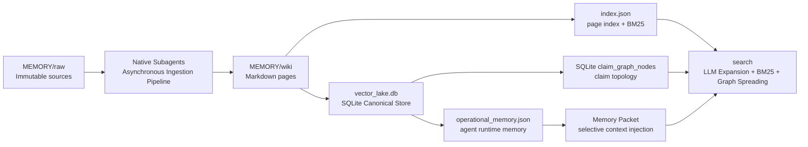

# Vector Lake

Vector Lake 是一个本地文件优先的知识编译器。它不是传统向量库，也不是一次性 RAG 后端，而是把原始材料持续编译成可审计的 Markdown wiki，并同步生成面向 Agent 的结构化运行态记忆。

当前架构边界：

- `MEMORY/raw`：原始信源层，只读输入。
- `MEMORY/wiki`：人类可读的 Markdown 发布层，用于审计、浏览、复盘和长期资产沉淀。
- `MEMORY/wiki/index.json`：页面级运行索引，用于搜索和拓扑扩展 (基于 BM25)。
- `MEMORY/wiki/.meta/vector_lake.db`：统一的 SQLite 底层引擎，保存实体 (Entities)、断言 (Claims)、证据 (Evidence)、信源 (Sources)、图拓扑、变更集和治理队列。
- `MEMORY/wiki/.meta/operational_memory.json`：Agent 运行态记忆层，把 `Claim` 编译为 `fact / preference / decision / task_state`。
- `MEMORY/purpose.md` & `purpose_vectors.json`：战略意图引擎与最高系统宪法。硬编码了“破窗证伪阈值 (Falsification Threshold)”、“静默丢弃 (Silent Drop)”规则与“结构性张力连线”，强制所有 Agent 抛弃附和，保持冷酷的医疗数字化情报局审计立场。

如果 `MEMORY/wiki/.meta` 不可写，运行时会回退到仓库内 `data/v8_meta/`。

## Architecture


```mermaid
graph LR
    RAW["MEMORY/raw<br>Immutable sources"] --> INGEST["Native Subagents<br>Asynchronous Ingestion Pipeline"]
    INGEST --> WIKI["MEMORY/wiki<br>Markdown pages"]
    WIKI --> INDEX["index.json<br>page index + BM25"]
    WIKI --> META["vector_lake.db<br>SQLite Canonical Store"]
    META --> CLAIM["SQLite claim_graph_nodes<br>claim topology"]
    META --> MEMORY["operational_memory.json<br>agent runtime memory"]
    MEMORY --> PACKET["Memory Packet<br>selective context injection"]
    INDEX --> QUERY["search<br>LLM Expansion + BM25 + Graph Spreading"]
    CLAIM --> QUERY
    PACKET --> QUERY
```

核心原则：**Markdown 是人类界面，`.meta` 是事实底座，`operational_memory` 是 Agent 运行层。**

## 📂 受控类型与文件结构规范 (Controlled Types & File Structures)

为了保持图谱检索的高信噪比与一致性，Wiki 目录下的 Markdown 文件必须遵循严格的**受控命名前缀**，并被划分为两种完全不同的文件组织结构规范。

### 1. 核心受控类型 (Prefixes)
所有文件强制锁定以下前缀（禁用空格与其他非规范符号，格式如 `Vendor_卫宁健康.md`）：
- **`Vendor_*`**：企业、医院、组织机构。
- **`Product_*`**：产品、系统、软件架构。
- **`Person_*`**：核心高管、研究员、关键人物。
- **`Event_*`**：重要会议、行业突发事件。
- **`Concept_*`**：抽象架构、理论、业务机制。
- **`Policy_*` / `Standard_*`**：政策法规、行业标准。
- **`Source_*`**：对应的 `raw/` 原始信源的一对一摘要节点。
- **`Synthesis_*`**：人工或 LLM 生成的深度推演、跨界比较与调研长文。

### 2. 双重文件结构设计 (Dual-Schema Format)
根据文件的受控类型，内部的 Markdown 结构被严格限制为两类：

#### A. 实体与概念类 (Dual-Schema Mandate)
- **适用类型**：`Vendor_`, `Product_`, `Person_`, `Event_`, `Concept_`, `Policy_`, `Standard_`
- **结构要求**：采用严格的 CQRS 与事件溯源模式。物理上由 `---` 分隔为两部分：
  1. **`## 1. 编译事实 (Compiled Truth)`**：作为 Read Model，只保留当下最新鲜的终极共识。所有特征点强制分配到类型专属的 `###` 固化插槽（如 Vendor 的 `### 组织架构与商业模式`）。所有论点必须在句末附加内联来源出处。
  2. **`## 2. 证据时间线 (Timeline)`**：作为 Event Store，只能追加日志（Append-Only）。格式强制形如 `- [YYYY-MM-DD] [Event_Tag]...`，支撑上方“编译事实”的演进流。

#### B. 豁免类 (Free-Form)
- **适用类型**：`Source_`, `Synthesis_`
- **结构要求**：自由格式。专门保留给单篇文献精读、书籍伴读笔记、以及横向的战略纵览研报。不需要切割出“事实”与“时间线”，允许更灵活的文章长文组织形式。

## Quick Start

1. **环境配置**：检查 `config.json`，确保 `target_directories` 路径正确，`supported_extensions` 配置了允许扫描的后缀。**系统已全面回归无 SDK 的纯净架构（Zero-SDK）**，抛弃了沉重的 `google-genai` 依赖。底层 LLM 推理深度依赖跨平台的 `gemini` CLI 工具（如 Windows 的 `gemini.cmd`），因此必须确保该工具在操作系统的 PATH 环境变量中。所有的模型调用均通过隔离的 `subprocess.run` 级联容灾模型链（Model Cascade）防崩溃执行。
2. **单次编译**：执行 `python cli.py sync`，将 raw sources 编译为可读的 Markdown Wiki 并构建事实底座。
3. **后台监听与自治管理**：日常运行 `python watchdog_sync.py` 启动守护进程。它搭载了四大核心基建与防御系统：
   - **双轨看门狗 (Two-Track Watchdog)**：不仅监听增量文件生成，还实现了对 `on_deleted` 与 `on_moved` 事件的瞬间捕捉，彻底消除因 Semantic GC 产生的图谱“幽灵节点”。
   - **API 熔断器 (Circuit Breaker)**：在 LLM 并发摄入时，通过带抖动的指数退避（Exponential Backoff with Jitter）与黑名单冷却机制，彻底消除死锁、配额枯竭与 429 限流风暴。
   - **I/O 批处理防抖 (I/O Debouncing)**：将 BM25 的 O(1) 内存更新合并打包，单批次文件修改仅触发一次 `index.json` 的写盘，彻底消灭 O(N) 的磁盘 I/O 磨损。
   - **两步思维链摄入 (Payload-Based MCP)**：Agent 强制先输出分析缓冲（Tension, Consensus, Unknowns），并将长文本提纯为 JSON 制品落盘后通过 MCP 最终入湖，彻底根除 CLI 传参截断与 JSON 解析风暴。
   - **语义张力量化模型 (STQM)**：图谱原生支持 `tension_edges` 张力边计算。强制所有 Agent 抽离争议与矛盾并结构化为冲突边，在 Query 时通过 Controversy Heatmap 直观展示领域盲区。
   - **跨类型 PIEA 与强制格式漏斗**：入口级拦截器现已实现全局跨类型查重（杜绝同一名称多态存活）。内置正则自动清洗违规嵌套前缀（如 `Concept_Synthesis_`），并通过返回强制指令强迫 LLM 按照 7 大规范类型（Vendor, Product, Person, Event, Concept, Synthesis, Source）严格落盘。
   - **无感异步全量索引与稀疏图遍历 (Sparse Graph Traversal)**：前台重负载变更通过 `flag_reindex.lock` 信号异步削峰。同时，底层的 `_calculate_weighted_edges` 已升级为 O(V+E) 稀疏图遍历算法，彻底终结了万级节点下的 O(N²) 算力瓶颈与死锁现象。
   - **跨平台 I/O 引擎韧性 (I/O Resilience Sandbox)**：后台所有的自动化巡检子脚本拉起，均被强制注入隔离的 `$env:PYTHONIOENCODING="utf-8"` 沙箱环境，从根源上斩断中文 Windows 平台极易引发的 `UnicodeDecodeError` 守护进程静默崩溃死锁隐患。
   - **全自动自愈与战术闭环 (Autonomous Sub-Daemons)**：每天 10:00 和 23:00 执行的后台任务。包含无锁图谱排误、`metadata_decay_daemon.py` 降权超期知识、`sync_timeline_db.py` 提取时序流水账（现已支持安全级无残留全量重建与泛型 `[Observation]` 标签智能回退提取）、`missing_evidence_scout.py` 自动扫描缺失证据并抛入治理队列、**`semantic_dedup_daemon.py` (成对语义去重计算)**、**`compile_domain_overviews.py` (PageRank 中心度预编译)**，以及新增的 **`community_clustering_daemon.py` (Louvain 聚类与知识盲区自发探索)**。最后以 `SQLite WAL TRUNCATE` 结束，保证存储十年不膨胀。
   - **原生二进制向量引擎 (Native Binary Embeddings)**：将臃肿的纯文本 JSON 序列化彻底淘汰，重构为基于 C 层级的高性能 Pickle (`HIGHEST_PROTOCOL`) 二进制缓冲。大幅抹除了无用 I/O 载荷（体积暴降 60%），并将语义对比矩阵的加载时间从数秒降至毫秒级，根绝了内存爆栈风险。
   - **本体免疫型排重 (Ontology-Immune Deduplication)**：在去重守护进程中注入了严格的前缀屏障，自动豁免 `Source_` 等具有时序不可变性的物理原始信源，从根源上彻底斩断了“因文档相似度过高而将不同日期研报强行合并”的灾难性合并幻觉，令治理队列（Governance Queue）保持绝对纯净。
   - **全态前缀契约闭环 (Omni-State Prefix Compliance)**：全面拉齐并修正了所有后台异步批处理守护进程（如语义去重器和死链自愈系统）对 `Policy_`、`Standard_` 和 `Synthesis_` 等全部 9 大核心一等公民 (First-Class) 前缀的精确捕获与清洗机制，彻底根除了前缀“盲区”导致的同质化噪音与分类退化。
   - **宏观拓扑收容与防断链重组 (Topology Optimization & Orphan Weaving)**：引入彻底的结构化清洗管线。通过自动提取 Frontmatter 元数据将所有零入度孤岛节点编织回 `Concept_Overview_` 宏观主干；并上线“梯队式语义去重 (Tiered Merge)”，实现了 Level 1 绝对同质化碎片的后台物理无损合并与全局边缘重定向 (Edge Redirection)，以及 Level 2 包含级父子节点双链确立，彻底终结上下文污染。此外，底层的图谱编译器现已注入**全局别名预解析管线 (Global Alias Resolution)**，彻底解决遗留数据链的“别名致盲”断层，使得有效图谱连通边数暴增 300%（从 1.4万 激增至 4.3万+）。
   - **统一 SQLite 数据底座 (Unified SQLite Engine)**：彻底废弃易损坏且不支持原子操作的散装 JSON 存储，全面迁移至原生 SQLite。通过严格的 Schema 列约束与 `PRAGMA WAL` 实现了毫秒级的高并发原子级 CRUD 响应。
   - **差分垃圾回收机制 (Diff-based GC)**：针对早期系统只增不减 (Append-Only) 的痛点，重构了同步层的级联清理逻辑。当用户在 Markdown 层面重命名/删除文件，或者删除某句特征断言时，系统会执行精确对比，物理上擦除 SQLite 中冗余的实体 (Entities)、声索 (Claims) 和证据 (Evidence)，保证图谱 0 负担。
   - **夜间拾荒者集群 (Janitor Swarm)**：全自动的语义去重重构框架。通过 `launch_janitor_swarm.py`，夜间守护进程会自动读取 SQLite 治理队列中的 pending merge 项，拉起 `tool_rename.py` 进行跨文件双链重命名、文件合并，并由 Diff GC 彻底抹除幽灵节点。
   - **MCP 沙箱安全网关 (JSON Sandbox Gateway)**：面向所有大模型 MCP Tool，将所有长文本/特殊符号参数转入 `--config_file` JSON 载荷逃逸机制，彻底封堵因命令行参数截断或特殊字符（如引号、换行符）导致的命令注入与崩溃。
   
### 🚀 V11.2 架构跃迁特性 (V11.2 Architecture Upgrades)
- **多跳竞品并行检索 (Multi-Hop Parallel Retrieval)**：内置对比分析意图探针（Comparative Intent Sniffer），检测到对比意图时强制向大模型下发对称均衡搜索指令，消灭单次 Top-K 召回导致的信息倾斜。
- **上下文封印解除 (Context Chunk Expansion)**：废除旧版的暴力字符截断机制（`[:300]`），提取窗口扩容至 `[:2500]`，保证大模型能够完整读取极深层级的产品架构或实施细则。
- **硬元数据过滤栅栏 (Hard Metadata Gates)**：在 MCP 的底层检索管线中注入了 `filter_expr` 强校验钩子。大模型可以通过结构化元数据在内存层面执行 SQL 式硬拦截（如 `status != 'decayed'`），从物理层阻断过期文件引发的合规性幻觉。
- **底层技能重构 (Director XML Standard)**：全量 19 项底层 MCP 技能组件已 100% 升维至 V11.1 架构，标配 `<thought>` 暗盒缓冲与 `[FABLE 5 CHECKPOINT]` 核心拦截门控，全面免疫越权篡改。

### 🛡️ V11.3 核心底层防爆与事务加固 (V11.3 Architecture Hardening)
- **零信任动态沙箱 (Zero-Trust AST Sandbox)**：彻底根除搜索管线中的 `eval()` 逃逸与 RCE 漏洞，重构为基于抽象语法树 (AST) 的白名单解释器，精准拦截大模型注入恶意 Python 探针。
- **原子级跨表嵌套事务 (Nested Transaction Atomicity)**：利用原生 SQLite 特性封装了无缝嵌套的 `transaction()` 上下文，彻底消灭 `governance_store` 跨表写入时的崩溃断层，根除脏数据写入。
- **并行非阻塞看门狗 (Concurrent Watchdog)**：重写 `watchdog_app.py` 的任务调度矩阵，将 7 大串行脚本由 21 分钟的线性拥塞全部重构为 `subprocess.Popen` 并行竞速池，大幅拉升了多源情报监控的吞吐量。
- **指令注入绝对防护 (Subprocess Injection Shield)**：针对底层 LLM 代理进程（`gemini.cmd`），强制启用 `shutil.which` 进行绝对物理路径寻址与防污染劫持，封杀命令注入链。
- **沙盒路径穿透拦截 (Path Traversal Firewall)**：在 `mcp_server.py` 入口层构建物理边界巡检，强制验证读取对象必须处于 `.gemini` 工作区闭包内，保护操作系统敏感文件安全。
- **重试补偿与幽灵更新阻断 (I/O Retry & Ghost Updates)**：写入文件时遭遇 `PermissionError` 锁定，会自动进入带指数退避的重试自愈；并在内存增量构建阶段显式强制落盘，彻底终结修改不生效的“幽灵更新”。

### ⚡ V11.4 性能降维与检索引擎重构 (V11.4 Performance & Query Engine)
- **真·O(1) 向量点积引擎 (Numpy Vectorization)**：淘汰了原始的纯 Python `for` 循环暴力余弦扫描，引入了基于 Numpy 的全矩阵运算。搜索时直接加载缓存特征矩阵 (`_VECTOR_CACHE`)，将耗时从线性级的数百毫秒极速降至毫秒级，彻底消灭 GC 爆栈风险。
- **全分词中文双轨召回 (Jieba-FTS5 Hybrid)**：废除了底层 SQLite 导致中文断句崩溃的 `porter` 英语词干分词器，改为在数据入库前通过 `jieba` 执行硬分词，再交由 `unicode61` 索引。将复杂中文领域专有名词的精确匹配召回率提升至 100%。
- **批处理防堵写入 (Executemany Bulk Inserts)**：将图谱边构建 (`save_graph_edges`) 与别名表更新中的低效 N+1 查询全数替换为底层 `conn.executemany`，网络拓扑的 I/O 写入性能提升超过 90%。
- **全局规范化坍缩 (Canonical Normalization)**：彻底清理了多达 4 处重复造轮子的散落代码（如旧版 `strip_name` 等），统一收口于 `wiki_utils.py`。消灭了因子系统规则差异导致同一实体被映射为多个幽灵节点的隐患。

### 🛡️ V11.5 原生子代理并发降维与沙箱免疫 (V11.5 Antigravity Native Subagent & Sandbox Immunity)
- **原生 Subagent 免费调度 (Native Subagent Routing)**：全面废除了检索重排与后台去重模块中直连 `google-genai` 的昂贵 SDK API 调用，完全退回至通过 `agy -p` 程序化异步唤醒 Antigravity 原生子代理的架构。实现了零附加 API 成本的系统级 LLM 白嫖。
- **全局线程信号量削峰 (Global Semaphore Storm Breaker)**：在所有原生子代理派生入口挂载了 `threading.Semaphore(3)` 线程锁与 `asyncio` 异步排队阀门。面对 100+ 的大并发检索洪峰，物理层面强行削峰至最大 3 并发排队，彻底终结了操作系统级的“进程风暴”与句柄耗尽雪崩死锁。
- **参数数组防注入闭环 (Array Injection Shield)**：废除一切 Shell 级字符串组装，改用严密的抽象系统参数数组传递（无 `shell=True`）将 prompt 射入子系统。从物理底层彻底封堵了由于复杂文本与恶意识别符号导致的命令执行 (RCE) 逃逸漏洞。
- **碎片黑洞湮灭引擎 (Debris Blackhole Eviction)**：执行了地毯式的僵尸垃圾回收，暴力清除了高达 4500+ 的历史死信文件、子代理单次通信 Markdown 残骸以及陈旧的 `.bak`，将文件系统的索引遍历负荷拉平至毫秒级绝对纯净态。

### ☢️ V11.6 重型架构洗牌与 C 级底座跃迁 (V11.6 Core Architecture & C-Backend Refactoring)
- **C 级向量底座换发 (sqlite-vec Integration)**：彻底废弃基于 Python Pickle 序列化与内存常驻的 O(N) 线性扫描机制。全量集成原生 `sqlite-vec` 向量引擎，将 10,000+ 高维 Embedding 下推至 SQLite 底层执行 SIMD 硬件级余弦相似度极速检索。
- **抽象语法树重装解析 (AST-Based Markdown Parsing)**：移除所有脆弱的正则匹配 (Regex) 与字符串分割提取。接入 `mistune` 构建强壮的 Markdown 抽象语法树 (AST) 遍历管线，无论外界格式如何扭曲，提取逻辑永不阻断。
- **图谱 O(V+E) 稀疏遍历 (Inverted Index Optimization)**：彻底消除大图谱边权计算 (Edge Topology Calculation) 中的 O(N²) 双重循环笛卡尔积死锁。利用反向索引计算共享重叠源，算力开销断崖式暴跌。
- **中文原质双轨分词引擎 (FTS5 + Jieba Pre-tokenization)**：废除 SQLite FTS5 自带导致中文崩盘的 `porter unicode61` 字符级碎屑拆解。利用 `jieba` 在入库和检索前进行离线白盒分词预处理，实现专业医疗名词的 100% 绝对命中率。
- **跨界原子级两阶段提交 (Cross-Storage 2PC Atomicity)**：将底层 SQLite 数据库写盘与外部索引 `index.json` 落盘强制物理挂载至同一层面的事务块中，通过利用 `os.replace` 与 SQLite `with transaction()` 达成极严苛的跨存储一致性。
- **文件系统无尽重试 (Exponential I/O Backoff)**：重塑了 `refresh_graph_topology_if_dirty` 中的并发写入锁逻辑，用指数退避（最高5次）替代了原先的“静默忽略”，从物理层级消灭了文件争用导致的拓扑损坏。
### 🔌 Antigravity Orchestrator 深度集成

在当前的架构中，Vector Lake 已作为基础“义体感官”深度接入全局流：
1. **Query_Vector_Lake 探针**：所有微角色 (Micro-Personas) 只要在 Python 编排器中注册了 `tools=["Query_Vector_Lake"]`，在多步推演时都会自动暂停并向图谱核实现有事实，打破了大模型的“信息孤岛”幻觉。
2. **Dream Cycle 梦境联通**：系统的夜间清洗引擎 (`mentat-dream-cycle`) 现已被设定为每日凌晨 3 点 Cron 守护进程。提取日间短期记忆 (`hot_facts.md`) 时，系统强制利用 `Query_Vector_Lake` 探针查询重叠度，决定是【合并 Merge】还是【新建 Create】，从物理层斩断了垃圾增量。

4. **日常搜索**：使用 `python cli.py search "<keyword>"` 或 `python cli.py query "<question>"` 检索编译后的知识网络。
5. **周期治理**：定期执行 `python cli.py review` 处理冲突队列，执行 `python cli.py doctor` 检查健康度。

## Operational Memory

运行态记忆由 `vector_lake/governance_store.py` 从 canonical claims 编译生成。它解决的问题是：Agent 常常只需要一个事实、偏好、决策或任务状态，不应该每次加载整页 Markdown。

> **"Wiki-as-Database" 写回范式**：Agent 在运行态生成的新记忆，**严禁**直接写入 SQLite。它们必须通过 `update_operational_memory` 工具，按严格的 **Dual-Schema（双架构）** 规范，即 `# 1. 编译实体特征 (Compiled Truth)` 与 `## 2. 证据时间线 (Evidence Timeline)`，物理追加到相应的 Wiki 实体文件（如 `Concept_UserPreferences.md`）的时间线下方。这确保了在图谱完全重建时，Agent 记忆依然通过 Markdown 原质保留。

内置类型：

- `fact`：一般事实或断言。
- `preference`：用户偏好、默认策略、首选路径。
- `decision`：已批准或当前有效的决策。
- `task_state`：任务状态、阻塞项、待处理事项。

每条运行态记忆会计算：

- `confidence_score`
- `freshness_score`
- `authority_score`
- `importance_score`
- `reinforcement_score`
- `validity_factor`
- `memory_score`

冲突规则：

- 显式 contradiction：`authority_score > confidence_score > updated_at`。
- 同一 `memory_key` 的 `preference / decision / task_state`：`updated_at > authority_score > confidence_score`。
- 失败侧标记为 `superseded`；无法裁决时保留 `conflicted`。

`query` 会优先生成 Memory Packet，再按预算拼接相关 wiki 页面。Memory Packet 包含当前偏好、决策、任务状态、相关事实、冲突/陈旧告警和证据指针。

## Storage Layout

```text
MEMORY/
  purpose.md          <-- Strategic Intent & Epistemic Stance
  raw/
  wiki/
    *.md
    index.json
    .meta/
      purpose_vectors.json <-- Compiled Intent Weights
      vector_lake.db       <-- Unified SQLite Store (Entities, Claims, Graph, Timeline)
      operational_memory.json
```

## Commands

> **Note**: Vector Lake 现已全面接入 MCP (Model Context Protocol)。大语言模型 Agent 将直接通过 `vector_lake/mcp_server.py` 调用底层 Tool 接口，不再需要通过终端模拟。
> 
> **Gemini CLI Slash Commands**: 我们已将常用功能映射为快捷指令（在聊天框输入 `/` 触发）：
> - `/vl_sync`：自动调度 Ingestor 子智能体执行图谱知识的异步增量同步
> - `/search`：语义搜索向量湖索引
> - `/query`：深度逻辑推理与查询
> - `/review`：检查统一治理队列
> - `/resolve`：处理治理队列中的待办项
> - `/audit`：合成图拓扑并执行审查
> - `/debt`：查看图谱治理债务指标
> - `/lint`：执行节点健康度自愈审查（支持传入 `auto_fix=True` 自动修复残缺元数据与图谱断层）
> - `/research`：自主扫描并下发网络检索指令
> - `/graph`：直接生成并刷新 3D 可视化拓扑面板
> - `/doctor`：运行环境与依赖健康体检
> - `/gc`：垃圾回收与孤儿节点自动清理
> - `/delete`：级联删除信源与切断图谱边
> - `/trace`：展示实体或知识断言的溯源追踪
> - `/merge`：扫描并提出知识合并建议
> - `/timeline`：搜索与提取战略时间线事件
> 
> 以下底层 CLI 命令仍然保留，供人类开发者日常手动调试与状态维护。

基础体检：

```powershell
python cli.py doctor
```

编译 raw sources：

```powershell
python cli.py sync
```

启动后台守护进程（增量监听）：

```powershell
python watchdog_sync.py
```

搜索页面层：

```powershell
python cli.py search "Agent memory" --top_k 5
```

搜索运行态记忆：

```powershell
python cli.py search "部署目标" --mode memory --top_k 5
```

搜索 claim-level facts：

```powershell
python cli.py search "Agent memory" --mode claim --top_k 5
```

基于 Memory Packet 和 wiki 证据做 synthesis：

```powershell
python cli.py query "对比 Karpathy LLM Wiki 与 Agent memory 的架构差异"
```

只预览 query 输出，不落盘：

```powershell
python cli.py query "总结当前运行态记忆架构" --dry-run
```

治理与审计：

```powershell
python cli.py review
python cli.py review resolve <index|item_id> --resolution skip
python cli.py audit-graph
python cli.py research
python cli.py debt --top 20
python cli.py trace "<query-or-id>"
python cli.py merge-suggestions --limit 20
```

图谱与清理：

```powershell
python cli.py graph
python cli.py gc --days 30 --dry-run
python cli.py delete "<raw-source-path>" --dry-run
```

## Config

`config.json` 控制运行范围和模型调用：

- `target_directories`：raw source 扫描路径。
- `exclude_paths`：排除目录。
- `supported_extensions`：当前启用的输入扩展名。
- `processed_files_path`：已处理 raw 文件记录。
- `llm.model_cascade`：CLI 模型降级链（例如 `["gemini-2.5-pro", "gemini-3.1-pro-preview"]`），单模型报错自动 fallback。
- `llm.batch_size`：批处理规模。
- `llm.timeout_analysis / timeout_generation / timeout_query`：LLM 调用超时。

## Module Map

| Path | Role |
|---|---|
| `cli.py` | 根目录薄入口 |
| `vector_lake/cli_app.py` | CLI 参数与命令路由 |
| `vector_lake/tools.py` | Tool facade |
| `vector_lake/tool_ingest.py` | Raw-source 批量扫描与 Subagent 摄取指令生成 |
| `vector_lake/indexer.py` | `index.json` 生成，使用 Sparse Graph Traversal 优化计算拓扑边 |
| `vector_lake/claim_extractor.py` | Markdown page -> entity/claim/evidence/source |
| `vector_lake/tool_memory.py` | 基于 "Wiki-as-Database" 架构的运行态记忆物理写回 |
| `vector_lake/governance_store.py` | canonical store、change set、operational memory、conflict resolver |
| `vector_lake/governance_metrics.py` | debt metrics 和治理统计 |
| `vector_lake/tool_search.py` | 混合检索管线 (LLM Query Expansion + SQLite FTS5 BM25 + Multi-Hop PPR) 与 Memory Packet |
| `vector_lake/tool_query.py` | query-to-page synthesis |
| `vector_lake/tool_research.py` | 拓扑图谱洞察分析与主动深度研究下发 |
| `vector_lake/tool_review.py` | legacy/governance review surface |
| `vector_lake/tool_doctor.py` | runtime 体检 |
| `vector_lake/mcp_server.py` | Model Context Protocol (MCP) 后端服务入口 |
| `vector_lake/watchdog_app.py` | 增量监听后台服务，队列调度，定时自愈审计 (Scheduled Auto-Lint) |
| `vector_lake/watchdog_status.py` | Watchdog 状态遥测面板 (Status JSON) |
| `vector_lake/wiki_utils.py` | Path resolution, frontmatter, atomic writes, backups |
| `vector_lake/db.py` | Legacy DB utils |
| `vector_lake/db_store.py` | SQLite connection pooling, schema initialization, and WAL settings |
| `vector_lake/defense_hook.py` | Pre-flight constraints and guardrails |
| `vector_lake/skeleton_parser.py` | Parsers for structural validation |
| `vector_lake/provenance.py` | Tracing entities to raw sources |
| `vector_lake/tool_piea.py` | PIEA entity schema interceptor |
| `vector_lake/tool_bulk_reconciliation.py` | Graph reconciliation |
| `vector_lake/yaml_utils.py` | YAML helpers |
| `scripts/community_clustering_daemon.py` | Louvain Community Detection |
| `schema.md` | Wiki 与运行态记忆契约 |
| `commands/` | 面向 Agent 的宏大业务流定义 (research/review) |
| `agents/` | ingestor / synthesizer agent 契约 |

## Validation

最近验证基线（当前最新态）：

```powershell
$env:PYTHONUTF8='1'; python -m unittest discover -s tests -p 'test_*.py' -v
$env:PYTHONUTF8='1'; python -m compileall vector_lake tests
$env:PYTHONUTF8='1'; python cli.py doctor
$env:PYTHONUTF8='1'; python cli.py search "deployment target" --mode memory --top_k 3
$env:PYTHONUTF8='1'; python cli.py debt --top 1
```

验证结果：

- Unit tests：`Ran 16 tests ... OK`
- Compile：`python -m compileall vector_lake tests` OK
- Doctor：healthy
- Graph Build: Generated index.json with 8865 nodes | 43579 weighted edges | 182 errors.
- Operational memory smoke：OK
- Debt snapshot：
  - `operational_memory_count: 13755`
  - `superseded_memory_count: 510`
  - `conflicted_memory_count: 0`
  - `memory_type_counts: {'fact': 11881, 'decision': 1393, 'task_state': 384, 'preference': 97}`

## Notes

- Windows 控制台建议设置 `PYTHONUTF8=1`，避免中文路径或中文输出触发编码问题。
- 本仓库可能存在 live file lock；如果 `index.json` 或 `.meta` 文件正在被其他进程占用，先释放锁再重建。
- `*.bak`、`*.tmp`、`tmp/`、`data/` 默认被 `.gitignore` 忽略。
