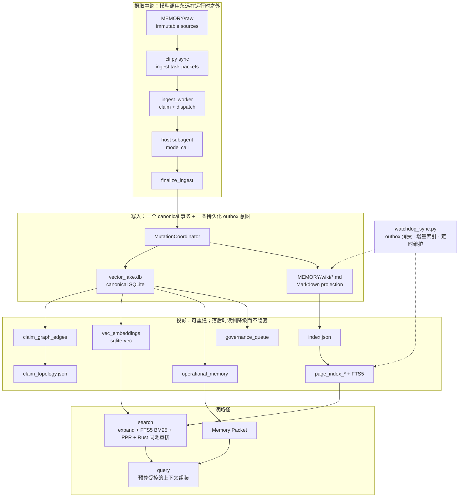

# Vector Lake

Vector Lake 是一个本地文件优先的知识编译器。它不是传统向量库，也不是一次性 RAG 后端，而是把原始材料持续编译成可审计的 Markdown wiki，并同步生成面向 Agent 的结构化运行态记忆。

当前架构边界：

* `MEMORY/raw`：原始信源层，只读输入。
* `MEMORY/wiki`：人类可读的 Markdown 发布层，用于审计、浏览、复盘和长期资产沉淀。
* `MEMORY/wiki/index.json` 与 `MEMORY/wiki/claim_topology.json`：从 canonical 写出的投影（页面节点 + 加权边；断言拓扑）。检索实际读的是它们的 SQLite 投影（`page_index_*` + FTS5），投影落后时回退读 `index.json`，并在输出头部打 `[DEGRADED]` 横页。
* `MEMORY/wiki/.meta/vector_lake.db`：统一的 SQLite 底层引擎，不仅保存实体 (Entities)、断言 (Claims)、证据 (Evidence)、信源 (Sources)、图拓扑、变更集和治理队列，同时也作为 Agent 运行态记忆层，把 `Claim` 编译为 `fact / preference / decision / task_state` 存入 `operational_memory` 表。
* `MEMORY/purpose.md`：版本化战略控制面。YAML 契约驱动摄取范围、证据等级、意图权重、SIR 复审和张力合成阈值；营销噪音与范围外资料不进入主图谱，但保留最小丢弃审计。`purpose_vectors.json` 仅保留为旧版回退，不再是权重主源。

如果 `MEMORY/wiki/.meta` 不可写，运行时会回退到仓库内 `data/v8_meta/`。

## 已知限制与运维要求 (Known Limits & Operational Requirements)

以下约束由当前实现决定，部署前必须满足，否则会出现与预期不符的行为。

|约束|事实|规避|
|-|-|-|
|必须常驻守护进程|outbox 消费、增量索引、定时 lint、**到期时的 gram 索引重建**、WAL checkpoint、备份保留、兜底扫描与 Loop 线程监督均在 `watchdog_sync.py` 内，**它同时拉起并看护摄取 Runner**；摄取任务包的**模型调用**在宿主侧 `scripts/ingest_runner.py`（默认写入页面；`VECTOR_LAKE_RUNNER_SHADOW=1` 时只报告），由 `scripts/ingest_runner_service.py` 负责重启，后者自身持有单实例锁|只读检索才可省略守护进程。**没有守护进程时没有任何定时维护会触发**（写入也会在 5 分钟后进入 outbox 积压告警），gram 索引需人工按 `doctor` 的 `due=` 执行 `python cli.py gram-index --if-due --apply`。常驻形态用计划任务 `VectorLake-Watchdog`（见“日常运行入口”），不要用临时 shell 拉起：实例锁只会让第二个启动者退出，而临时 shell 被回收会连带杀掉整个进程族|
|摄取是一条中继流水线，各段职责不重叠|`ingest_worker`（守护进程内）只认领 `queued` / `failed`（预算未用尽）/ 租约过期的 `dispatched`，产出任务包并转入 `awaiting_subagent`；宿主侧 `ingest_runner.py` 只认领 `awaiting_subagent` 与租约过期的 `subagent_processing`，因此两段不会争抢同一作业。作业租约、`lease_token` 与 `lease_generation` 保证同一个作业不会被并发提交；被顶替或终态失败的作业不会再被派发（前者的状态被标为 `superseded`）|想让某个源重跑时用 `ingest-tasks --clear-abandoned` 或改源文件（废弃键按内容哈希）；**不要**为“多跑一点”而绕开租约手工改 `jobs`|
|Runner 健康默认只告警|`runner_absent` / `runner_stalled` / `runner_failing` 默认进 `warnings`，不翻转 `ok`；“从未跑过”与“跑挂了”由 `.meta/runtime/runner_supervisor.json` 区分|需要把这几项并入 `degraded` 列表（依然不阻断写入）时设 `VECTOR_LAKE_RUNNER_STRICT=1`|
|编译依赖 LLM 宿主|`cli.py sync` 只产出 subagent 任务包，不自行编译；`native_llm.generate_text` 恒抛 `SubagentTaskRequired`|在具备 subagent 能力的宿主内运行摄取流程|
|向量投影需要维护|页面变更会使对应向量失效；常驻守护进程的周期兜底会按批次补齐缺失或过时向量，受嵌入模型与凭据可用性约束|未启用兜底或需立即恢复时执行 `python cli.py embedding-backfill --apply`；缺少嵌入凭据时检索降级，不以向量缺失冒充库中无资料|
|GC 的孤儿判据是拓扑度数 ≤ 1|度数来自 canonical 的 `links` / 共享来源 / claim 共现；**不是**可视化边集|先 `python cli.py gc` 做 dry-run，它会在同一调用中打印每个页面的实际度数。单次删除超过候选页 50% 时会自动中止，需 `--force` 才继续|
|删除类命令默认演练|`gc` / `delete` 默认 dry-run，必须 `--apply` 才落盘|保持默认；仅在确认 dry-run 输出后追加 `--apply`|
|修复类工具需要后置重建|`wiki-restore` 会恢复 Markdown，但索引投影需单独重建|按其输出末尾提示运行 `projection-rebuild-index --apply`|
|全量重建成本取决于语料与后端|全量重建需要读取与分词正文；增量路径可跳过未变更节点，不使用旧语料耗时外推当前实例|仅在必要时全量重建；日常依赖增量更新，并记录当前工作负载下的耗时|
|过滤态扩容有界，采样延迟不等于普适 SLA|2026-10-01，7,162 个向量的生产库只读快照，本地热态 `_search_scored_pages`，不含 provider 网络：36 个跨域过滤场景各重复 3 次，前缀复用前后 **p50 69.5 → 55.6 ms、p95 180.6 → 95.8 ms**，108 对结果、分数、顺序及诊断一致。另测 12 个默认过滤查询各 3 次，p95 **507.0 → 363.9 ms**，说明宽泛查询仍可能超过 250 ms；不是所有过滤查询都已满足预算|已实施查询内候选池前缀与过滤判定复用，触顶控制场景的位表扫描 **9 → 2 次**。**4096 上限及不完整告警保留**，不能用缓存消除召回缺口；候选池不是精确全量检索，历史同构一致性测试也不等于人工相关性验收|
|人工编辑会经过校验|未通过 schema / 目的契约校验的手改页面会被拒绝并保留原文件，日志给出原因|修复页面后重新保存，或查看守护进程状态文件的 `current_action`|

## Architecture


```mermaid
graph TD
    subgraph relay [摄取中继：模型调用永远在运行时之外]
        RAW["MEMORY/raw<br>immutable sources"] --> SYNC["cli.py sync<br>ingest task packets"]
        SYNC --> WORKER["ingest_worker<br>claim + dispatch"]
        WORKER --> HOST["host subagent<br>model call"]
        HOST --> FINAL["finalize_ingest"]
    end
    subgraph write [写入：一个 canonical 事务 + 一条持久化 outbox 意图]
        FINAL --> COORD["MutationCoordinator"]
        COORD --> DB["vector_lake.db<br>canonical SQLite"]
        COORD --> MD["MEMORY/wiki/*.md<br>Markdown projection"]
    end
    subgraph proj [投影：可重建；落后时读侧降级而不隐藏]
        MD --> IDX["index.json"]
        DB --> CG["claim_graph_edges"]
        CG --> CT["claim_topology.json"]
        IDX --> PINDEX["page_index_* + FTS5"]
        DB --> VEC["vec_embeddings<br>sqlite-vec"]
        DB --> OM["operational_memory"]
        DB --> GOV["governance_queue"]
    end
    subgraph read [读路径]
        PINDEX --> SEARCH["search<br>expand + FTS5 BM25 + PPR + Rust 同池重排"]
        VEC --> SEARCH
        OM --> PACKET["Memory Packet"]
        SEARCH --> QUERY["query<br>预算受控的上下文组装"]
        PACKET --> QUERY
    end
    WATCH["watchdog_sync.py<br>outbox 消费 · 增量索引 · 定时维护"]
    WATCH -.-> MD
    WATCH -.-> PINDEX
```

核心原则：**Markdown 是人类界面，`.meta` 是事实底座，`operational_memory` 是 Agent 运行层**；投影可重建，而唯一的写入顺序是「canonical 事务 → outbox → 投影」。

## 📂 受控类型与文件结构规范 (Controlled Types & File Structures)

为了保持图谱检索的高信噪比与一致性，Wiki 目录下的 Markdown 文件必须遵循严格的**受控命名前缀**，并被划分为两种完全不同的文件组织结构规范。

### 1. 核心受控类型 (Prefixes)

`validate_wiki_filename` 强制以下前缀（禁用空格与非规范符号，格式如 `Institution_北京协和医院.md`），命名形式为 `<Type>_<MainName>[-<SubName>].md`，总长不超过 120 个字符：

* **`Institution_*`**：医疗机构、医院、医学院及科研院所实体。
* **`Vendor_*`**：商业侧供应商、IT 企业、设备厂商。
* **`Product_*`**：医疗 IT 产品、系统、软件架构（强制包含资质合规槽位）。
* **`Person_*`**：核心高管、研究员、关键人物。
* **`Event_*`**：重要会议、行业突发事件。
* **`Concept_*`**：抽象架构、理论、业务机制。域总览页沿用 `Concept_Overview_<domain>.md` 形式（由 `scripts/compile_domain_overviews.py` 生成）。
* **`Policy_*` / `Standard_*`**：政策法规、行业标准。
* **`Source_*`**：`raw/` 原始信源的一对一摘要节点。新页面名由 `wiki_utils.canonical_source_name` 生成（`Source_<消毒后的 stem>.md`）；与 raw 的对应关系靠 frontmatter 的 `sources:` 声明，不靠页名。旧格式 `Source_<目录>-<stem>-<hash8>` 的页面仍有效，不要批量重命名打断已有链接。
* **`Synthesis_*`**：推演、跨界比较与调研长文。
* **`System_*`**：系统投影页（社区页、总览等）。前缀校验直接放行，且不参与 purpose 契约门。

`index.md`、`log.md`、`overview.md`、`orphan_pages.md`、`wiki_link_stats.md`、`Synthesis_log.md` 为白名单文件，不走上述命名与校验规则。

### 2. 双重文件结构设计 (Dual-Schema Format)

根据文件的受控类型，内部的 Markdown 结构被严格限制为两类：

#### A. 实体与概念类 (Dual-Schema Mandate)

* **适用类型**（即 `schema_validator.VALID_H3_SLOTS` 中定义固化插槽的类型）：`Vendor_`, `Product_`, `Person_`, `Event_`, `Concept_`, `Policy_`, `Standard_`, `Institution_`
* **结构要求**：物理上由 `---` 分隔为两部分：

  1. **`## 1. 编译事实 (Compiled Truth)`**：Read Model，只保留当前共识。特征点必须落在类型专属的 `###` 固化插槽内（例如 Vendor 的 `### 组织架构与商业模式`），插槽名不匹配会被 `schema_validator` 拒绝。
  2. **`## 2. 证据时间线 (Evidence Timeline)`**：Event Store，只能追加。格式形如 `- [YYYY-MM-DD] [Event_Tag] ...`。时间线条目按这个格式读取：日期与 `Event_Tag` 取自该前缀（claim 的结构化字段优先，前缀兜底）；标题不含 `证据时间线`/`时间线`/`timeline` 的段落进不了账本（`证据边界` 这类章节是边界声明，不是事件）；源文未给出日期的条目在投影里 `event_date` 为 NULL、排序置于末尾，显示为 `Unknown Date`，绝不拿入库时间冒充发生时间；事件精度由 `event_date_source`（`day`/`coarse`/`unknown`）记录，`YYYY-MM` 与 `YYYY-Qn` 不会被当成某一天。

#### B. 豁免类 (Free-Form)

* **适用类型**：`Source_`, `Synthesis_`
* **结构要求**：自由格式，不切割“事实 / 时间线”，用于单篇文献精读、书籍伴读笔记与横向战略研报。
* **`Synthesis_` 的骨架（只强制存在，不强制位置）**：必须含 `## 核心合成论点 (Core Synthesized Claims)` 与 `## 支撑拓扑 (Supporting Topology)` 两节（`schema_validator.SYNTHESIS_SKELETON_HEADINGS`）。门禁检查的是**存在**：把骨架放在文末仍是合法页面，因为按位置强制会一次性拒绝存量页面；位置由 lint 报告（`synthesis_skeleton_order_report`），于是文档与实现的差异只会出现在报告里，而不是被写成一条并未实现的保护。

#### 两个命名空间不要混（实体名 vs 标签）

`title` / `aliases` 是**实体名**，参与链接解析（连 core 名回退也认它们）；`tags` 是**标签**，从不参与链接解析。两者刻意保持不相交：标签撞上任何实体名会被拒绝（`Tag Collision`），而 `aliases` 里以 `#` 开头的条目会被视为把标签塞进实体命名空间、写入即拒绝（改用 `tags:`）。

## 🚀 安装与快速上手 (Installation & Quick Start)

### 1. 运行环境前置要求 (Prerequisites)

* **Python**: `>= 3.10`（推荐 3.11 \~ 3.13）。
* **操作系统**: Windows (需支持 UTF-8)、macOS、Linux。
* **大模型 API Key（可选）**: `GEMINI_API_KEY`（用于混合检索中的向量生成；若不配置，系统以纯词法 FTS5 + 图拓扑降级运行，不阻断核心读写）。

### 2. 依赖安装 (Dependencies)

```powershell
# 1. 克隆仓库并进入根目录
cd vector-lake

# 2. 安装 Python 核心运行时依赖
pip install -r requirements.txt

# 3. 可选：首次安装原生核心需要 Rust 与 maturin（详见“原生性能加速”）
pip install maturin
python scripts/build_core.py
```

### 3. 配置与环境变量 (Configuration & Environment)

```powershell
# 从示例创建配置文件
cp config.example.json config.json
```

`config.json` 核心字段说明：

* `memory_dir`: 自定义 `MEMORY` 根目录路径（留空时默认查找环境约定的 `MEMORY/` 目录）；
* `target_directories`: 摄入扫描目录；留空时扫描当前 `MEMORY/raw`，非空时替代默认目录（相对路径基于项目根目录，注意勿指向私密资料）；
* `supported_extensions`: 允许编译的原始资料后缀（默认 `[".md", ".txt"]`）。

**关键环境变量（由宿主环境注入；项目不会自动加载 `.env`）：**

|环境变量|作用|推荐值|
|-|-|-|
|`PYTHONUTF8`|强制 Python 运行时使用 UTF-8 编码（Windows 强烈推荐）|`1`|
|`GEMINI_API_KEY`|向量嵌入模型 API Key（Gemini Embedding）；通过本机环境或私有配置提供，不要提交凭据|不在仓库填写|
|`VECTOR_LAKE_MEMORY_DIR`|显式指定 MEMORY 根路径（优先级高于 `config.json`）|例如 `C:/path/to/MEMORY`|
|`VECTOR_LAKE_RUNNER_SHADOW`|设为 `1` 时摄取 Runner 仅模拟评估而不真实写页|默认 `0`|
|`VECTOR_LAKE_RUNNER_CONCURRENCY`|摄取 Runner 并发模型调用线程数（批量摄取加速）|推荐 `3` \~ `5`|
|`VECTOR_LAKE_RUNNER_HOLD_SHADOW_LEASE`|设为 `1` 时 shadow 轮不释放已认领的任务包（保留租约供人工检查；默认释放以便下一轮重试）|默认 `0`|
|`VECTOR_LAKE_QUERY_CONTEXT_TTL`|Query 上下文临时文件的过期秒数|默认 `7200` (2小时)|
|`VECTOR_LAKE_VECTOR_SIM_SCALE`|Sum 混合检索模式下向量相似度权重乘数|默认 `15.0`|
|`VECTOR_LAKE_NO_BROWSER`|设为 `1` 时生成 3D 拓扑图后静默不自动弹出浏览器窗口（适合无头/CI环境）|默认 `0`|

### 4. 验证安装 (Health Check)

运行体检命令，确认环境与数据库状态健康：

```powershell
python cli.py doctor
```

逐项核对输出中的 Python、分词后端、原生核心、MCP 工具及写入门；原生核心是可选项，索引或写入门异常时按实际诊断处理，不以固定版本号或工具数量判定成功。

### 5. 宿主 Agent 接入 (MCP Client Configuration)

Vector Lake 以标准 Model Context Protocol (MCP) 向宿主（Pi、Claude Desktop、Cursor 等）暴露 19 个核心认知与知识工具。

**在客户端配置文件（如 `claude_desktop_config.json` 或 `.mcp.json`）中添加：**

```json
{
  "mcpServers": {
    "mentat-mind-mcp": {
      "command": "python",
      "args": [
        "-m",
        "vector_lake.mcp_server"
      ],
      "cwd": "C:/path/to/vector-lake",
      "env": {
        "PYTHONPATH": ".",
        "PYTHONUTF8": "1",
        "GEMINI_API_KEY": "your-api-key"
      }
    }
  }
}
```

### 6. 启动后台守护进程 (Starting Daemon)

```powershell
python watchdog_sync.py
```

> **运行机制提示**：守护进程会常驻监听文件变动、消费写入 outbox、自动看护摄取 Runner（`scripts/ingest_runner_service.py`）并执行定时增量维护。日常只读检索可不启动守护，但发生写入后**必须**由它消费 outbox 以防止队列积压。

\---

## 核心机制与运行时防护 (Core Runtime & Defense Systems)

> **运行前提**：Vector Lake 不是自包含的编译器。原始信源到 Wiki 页面的“编译”由 LLM 宿主（subagent）执行，`cli.py sync` 只负责生成任务包。因此实际运行需要：**① 单机 ② 常驻 `python watchdog_sync.py`（Windows 上由计划任务 `VectorLake-Watchdog` 托管）③ 具备 subagent 能力的宿主**。守护进程会**自动拉起并看护摄取 Runner**（`scripts/ingest_runner_service.py`，可用 `VECTOR_LAKE_RUNNER_AUTOSTART=0` 关闭），因此不再需要手工常驻第二个进程；只启动 MCP server 而不启动守护进程时，写入会在 5 分钟后进入 outbox 积压告警状态。

* **双轨看门狗 (Two-Track Watchdog)**：除增量文件外还捕获 `on_deleted` / `on_moved`，因此重命名或删除页面不会在图谱里留下幽灵节点。
* **写入健康门 (Write Health Gate)**：写入只在**硬故障**下被阻断（数据库不可用、存在 hard-failed 的 `mutation_outbox` 行）。outbox 积压超过 `VECTOR_LAKE_OUTBOX_MAX_BACKLOG`、投影漂移、心跳过期、终态失败作业、时间线 parity 漂移都属于**可修复降级**，只记录告警并继续写入——阻断它们会同时阻断唯一的修复通道。需要严格模式的运维方可分别用 `VECTOR_LAKE_OUTBOX_BACKLOG_BLOCKING` / `VECTOR_LAKE_TERMINAL_FAILED_JOBS_BLOCKING` / `VECTOR_LAKE_TIMELINE_PARITY_BLOCKING` 把这些降级提升为阻断。
* **I/O 批处理防抖 (I/O Debouncing)**：同批次修改合并为一次 `index.json` 写盘；`index.json` 不再保存完整正文（每个节点保留至多 320 字符的摘要，摘要与 `weighted_edges` 各占文件的一部分——具体比例取决于实例），投影写入使用短事务，全量重建不再冻结数据库。
* **语义张力量化模型 (STQM)**：图谱原生支持 `tension_edges`，把争议与矛盾结构化为冲突边，Query 时可直接展示领域盲区。
* **跨类型本体拦截 (PIEA)**：入口级跨类型查重，避免同一名称多态共存；内置正则清洗违规嵌套前缀（如 `Concept_Synthesis_`），并由 schema gate 校验受控前缀与类型。
* **持久化增量索引与稀疏图遍历 (Sparse Graph Traversal)**：前台变更先写 durable outbox，Watchdog 合并批次后更新索引；`_calculate_weighted_edges` 使用稀疏遍历并限制每节点投影边数。
* **跨平台 I/O 韧性 (I/O Resilience)**：后台子脚本拉起时注入 `PYTHONIOENCODING=utf-8`，避免中文 Windows 上的编解码崩溃。
* **定时确定性维护 (Scheduled Deterministic Maintenance)**：每天 10:00 与 23:00 刷新脏图拓扑、执行只读 lint、在索引落后时重建 gram 倒排、做 SQLite WAL checkpoint 并执行备份保留；重建与 checkpoint 都在 lint 的失败范围之外，lint 自身失败也会被有界重试而不是无限重跑。另有一条独立节拍的兜底扫描（`VECTOR_LAKE_CATCHUP_INTERVAL_SECONDS`，默认 900 秒）负责把未入队的 raw 源重新入队、作废陈旧任务、释放失去 job 的在途标记，并按批次重建缺失或**输入已变**的向量。研究、去重、聚类等独立脚本不会被该循环隐式启动。
* **向量投影存于 SQLite (vec\_embeddings)**：向量由 `sqlite-vec` 存放于 `vector_lake.db` 的 `vec_embeddings` 表，不再依赖模型侧的 JSON 载荷；语义去重守护进程只读该表，读取失败时退回**词法/拓扑去重**（不是旧缓存）。向量的**存在不等于有效**：页面被绕过增量索引的路径改写、或全量重建改动了别名与摘要时，旧向量不会被删除，只会默默继续用已经不存在的正文答题。因此每个节点在写入向量的同时记录其嵌入输入的摘要（`vec_embedding_inputs`），周期兜底每轮全量比对（实测 7175 节点 0.41 秒），把缺失、输入已变、以及未打标的节点一并按批重建；需要一次性全量重建时用显式 `embedding-backfill`。
* **本体免疫型排重 (Ontology-Immune Deduplication)**：去重守护进程豁免 `Source_*` 等时序不可变信源，避免“相似度过高即合并”把不同日期的研报强行合流。
* **合并的可回放性 (Merge Durability)**：`resolution=merge` 只能在合并**已落盘**时写下。类型/ID 不匹配不再静默落到 `_mark_resolved`（fail-closed），声明的名字与文件名不一致（`_`/`-`）时回退查别名注册表，落盘时同写 `merge_applied`/`applied_at`；`lint` 按 `unapplied_merge_items()` 报出“已 resolved 但两页俱在”的条数——只看 `type`/`status` 会把早先已判定为 `skip` 的近邻算成待办。**被消费页的键与标题必须进入幸存页的 `aliases`**（`semantic_merge._union_frontmatter` 的既有规则）：链接解析只认文件名、标题与 frontmatter `aliases`，不读 SQLite 别名表。
* **统一 SQLite 数据底座 (Unified SQLite Engine)**：实体、断言、证据、信源、图拓扑、变更集、治理队列与运行态记忆统一落在 SQLite，启用 WAL。
* **差分垃圾回收机制 (Diff-based GC)**：Markdown 层面重命名 / 删除或断言被移除时，同步层按页面增量清理对应的实体、断言与证据，不再只增不减。
* **夜间拾荒者集群 (Janitor Swarm)**：语义去重的**分片准备器**。`python scripts/launch_janitor_swarm.py` 读取治理队列中的 pending merge 项，按 `SHARD_SIZE` 切分为子代理任务包并写出 `janitor_manifest.json`。**它不会自行合并或启动任何外部进程**；实际合并由宿主子代理调用 `resolve_governance_item` 或 `bulk_reconciliation` 完成。
* **MCP 载荷沙箱 (Payload Sandbox)**：所有长文本参数经 `payload_file` 指向的文件传入，读取受 `VECTOR_LAKE_PAYLOAD_ROOT`（或 `brain/<run>/scratch/`）与 `VECTOR_LAKE_PAYLOAD_MAX_BYTES` 限制，避免命令行传参截断与注入。

### 日常运行入口

1. **常驻守护**：`python watchdog_sync.py`（outbox 消费、增量索引、定时 lint 与 WAL checkpoint 都在这里；只跑 MCP server 会让写入持续积压）。守护进程同时**拉起并看护摄取 Runner**，因此“只启动守护”不会再留下半个流水线：不传任何开关时，观测到的就是本机原本常驻的配置（模型接缝 `python scripts/ingest_model_pi_subagents.py`、真实写页）。用 `VECTOR_LAKE_RUNNER_AUTOSTART=0` 关闭该行为，用 `VECTOR_LAKE_RUNNER_SHADOW=1` 改成只报告。
Windows 上的常驻形态是计划任务 **`VectorLake-Watchdog`**：`scripts/register_watchdog_task.ps1` 幂等注册（含反转命令），`scripts/watchdog_service.ps1` 是执行入口（钉仓库根与 UTF-8，日志落 `scratch/watchdog_service-*-{out,err}.log` 并只保留最新 10 份）。触发器 = 登录 + 开机 + 每 5 分钟，`MultipleInstances=IgnoreNew`、`ExecutionTimeLimit=PT0S`（不能被 72 小时默认值掐死）、`RestartOnFailure 3×PT1M`、主体 `S4U`（会话 0，与任何交互 shell 解耦）。5 分钟重复只在上一轮包装器返回后才启动，所以**强杀后会在下一个 5 分钟边界自愈，运行中的实例不会被叠加**；而强杀子进程留下的 `LastTaskResult=0xFFFFFFFF` 并不触发 `RestartOnFailure`，真正兜底的就是这条重复触发器，两者都留。**换代码或换启动路径时不要 kill 摄取 Runner**：新守护进程会 adopt 已在运行的 Runner（状态行 `Ingest runner supervised by an existing supervisor (pid N)`），在途摄取不受影响；手工 `python watchdog_sync.py` 仍可用，但会被实例锁 `.meta/.watchdog.instance.lock` 挡成单写者。
2. **摄取 Runner（可选的手工形式）**：`python scripts/ingest_runner_service.py --limit 2 --interval 120 --model-cmd "python scripts/ingest_model_pi_subagents.py"`。Runner 认领任务包、支持通过 `--concurrency / -c`（或 `VECTOR_LAKE_RUNNER_CONCURRENCY`）多线程并发调用宿主模型，再经 `finalize_ingest` 提交。**注意两条路径的默认值相反**：这条手工命令默认只报告 `needs-model`（要真实写入需加 `--no-shadow`），而守护进程自动拉起的 Runner 默认写入（复现本机原本常驻的配置），要改成只报告用 `VECTOR_LAKE_RUNNER_SHADOW=1`。脚本自身持有单实例锁（`<meta>/runtime/.runner_service.lock`），所以手工启动与守护进程启动不会叠成两个消费者；模型调用始终发生在本进程之外的子进程里，运行时自己从不执行它。自定义 `--model-cmd` 必须在 stdout 只返回 `{"files_written": [{"filename": "Source_*.md", "content": "..."}], "integration": {"disposition": "integrated|standalone|rejected", "relations": [...]}}`；standalone/rejected 用 `reason`，rejected 用空文件数组。旧的纯数组输出及缺失判断一律记为模型失败，不会再静默记作 standalone；租约、源哈希和候选清单由宿主任务包提供，不能由模型改写。任务包协议版本 3 会在认领前重建旧版 queued / failed / awaiting\_subagent 提示词，保留 queued / failed 的原有尝试次数，不改动已领取的 subagent\_processing 作业。升级正在运行的 Runner 前，先确认摄入队列无在途任务并保留旧版代码恢复点；磁盘改动不会热更新常驻 Runner。
3. **检索**：`python cli.py search "<keyword>"`，或 `python cli.py query "<question>"` 走预算受控的上下文组装。
4. **摄取队列**：`python cli.py ingest-tasks` 查看 queued / awaiting\_subagent 作业；模型或 subagent 只返回包含 `files_written` 和 `integration` 的对象，宿主控制器验证后调用 `finalize_ingest` 入湖。
5. **被废弃的源**：同一份内容反复确定性失败（例如 `categories` 不是单元素列表、命名或 schema 违规）时，第 3 次尝试后该源会被记为「废弃」并停止派发，避免每轮固定烧掉 3 次模型调用。`python cli.py ingest-tasks --abandoned` 查看清单与原因，`--clear-abandoned [FILE]` 恢复派发。键是 `(路径, 内容哈希)`：**改好源文件即自动恢复**，无需人工清理。`--terminal-failed` 列出耗尽尝试预算的作业，`--close-terminal-failed` 把其中**源已入账**的标记为 superseded（源未入账的会保留，因为那才是真正未完成的工作）。
6. **周期治理**：`python cli.py review` 处理冲突与候选队列，`python cli.py doctor` 检查运行健康度。

历史版本的逐项特性说明不再在本文件维护；版本变更请查 `CHANGELOG.md`，运行契约以本节与上方“已知限制”表为准。

## Operational Memory

运行态记忆由 `vector_lake/governance_store.py` 从 canonical claims 编译生成。它解决的问题是：Agent 常常只需要一个事实、偏好、决策或任务状态，不应该每次加载整页 Markdown。

> **"Wiki-as-Database" 写回范式**：Agent 在运行态生成的新记忆，**严禁**直接写入 SQLite。它们必须通过 `update_operational_memory` 工具，按严格的 **Dual-Schema（双架构）** 规范，即 `## 1. 编译事实 (Compiled Truth)` 与 `## 2. 证据时间线 (Evidence Timeline)`，物理追加到相应的 Wiki 实体文件（如 `Concept_UserPreferences.md`）的时间线下方。这确保了在图谱完全重建时，Agent 记忆依然通过 Markdown 原质保留。

内置类型：

* `fact`：一般事实或断言。
* `preference`：用户偏好、默认策略、首选路径。
* `decision`：已批准或当前有效的决策。
* `task_state`：任务状态、阻塞项、待处理事项。

**类型来源**：只认 claim 显式声明的 `memory_type` 或可映射的 `claim_type`；其余为 `fact`。正文关键词与小节标题不用于推断偏好、决策或任务状态。`tool_memory` 通过页面 frontmatter 写入类型声明。

每条运行态记忆会计算：

* `confidence_score`
* `freshness_score`
* `authority_score`
* `importance_score`
* `reinforcement_score`
* `validity_factor`
* `memory_score`

**相关性排序**：字段命中权重（key 4 / text 3 / page 1 / type 1）按 `log(1 + N/df)` 缩放；`memory_type` 不参与 df 统计。先按相关性排序，`memory_score` 只裁决平局，最终以 `memory_id` 升序稳定排序。索引与全量扫描使用同一口径。

冲突规则：

* 显式 contradiction：`authority_score > confidence_score > updated_at`。
* 同一 `memory_key` 的 `preference / decision / task_state`：`updated_at > authority_score > confidence_score`。
* 失败侧标记为 `superseded`；无法裁决时保留 `conflicted`。

`query` 会优先生成 Memory Packet，再按预算拼接相关 wiki 页面。Memory Packet 包含当前偏好、决策、任务状态、相关事实、冲突/陈旧告警和证据指针。

包的每行形如 `- [rel 211.6 | mem 0.70 | active] <正文>`：`rel` 为查询相关性分，`mem` 为用于裁决平局的存储分。

## Storage Layout & Architecture

Vector Lake uses a CQRS-like layout with canonical SQLite mutations and derived file/search projections.

* **Raw sources**: `raw/*` remains the original input.
* **Markdown wiki**: `wiki/*.md` is the readable publication layer; edits enter the validated mutation path.
* **Canonical database**: `vector_lake.db` stores entities, claims, graph edges and operational memory. Search indexes and files are derived projections.
* **Concurrency & Atomicity**: 多页变更经 `MutationCoordinator` 在单个 `BEGIN IMMEDIATE` 事务内提交 canonical 状态与 `mutation_outbox` 意图，再物化为 Markdown 投影；事务失败整体回滚，投影失败由 outbox 重试。**Wiki 页面本身没有自动 `*.bak` 备份**——删除类命令（`gc` / `delete`）会先写恢复点目录（`backup/gc/`、`backup/delete-source/`），其余写入依赖 canonical 状态重建。数据库副本写在 `.meta/backups/`（`vector_lake_<ts>.db.bak` 及 `-wal` / `-shm` sidecar），其总量由 `backup-retention` 约束。

```text
MEMORY/
  purpose.md          <-- Versioned Strategic Purpose Contract & Epistemic Stance
  raw/
  backup/
    gc/               <-- Recovery points written before gc deletes a page
    delete-source/    <-- Recovery points written before a cascade delete
  wiki/
    *.md
    index.json          <-- Page index projection: nodes (summary only) + weighted edges
    claim_topology.json <-- Claim topology projection (claim_graph_edges -> JSON)
    .meta/
      purpose_vectors.json <-- Legacy fallback for intent weights
      vector_lake.db       <-- Unified SQLite Store (entities, claims, graph, timeline,
                           <--   operational memory, page_index_* projection, vec_embeddings)
      backups/             <-- Bounded SQLite copies (.db.bak + -wal / -shm sidecars)
      runtime/             <-- Runner / supervisor / 锁争用状态 JSON
```

仓库侧（不在 `MEMORY/` 下，且被 `.gitignore` 忽略）：`brain/<run-id>/scratch/subagent_tasks/` 存放宿主 subagent 的任务包，`brain/runtime-<pid>-<uuid>/` 是每进程 scratch（空且超期的会在下次启动时清理）。

## Commands

> **MCP 是主接口**：Agent 直接调用 `vector_lake/mcp_server.py` 注册的工具，不经过终端模拟。本仓库**不随附**任何 slash command 兼容层（`commands/` 目录已不存在）；打包技能的宿主可另用 `$vector-lake:query`、`$vector-lake:timeline` 同名技能。
>
> MCP 暴露 19 个工具，由 `doctor` 与 `tests/test_command_surface.py` 核验。全量恢复、内部调度和重建端点保留在 CLI，避免 Agent 在常规检索中误触重型维护。

|职责分类|工具|说明|
|-|-|-|
|**混合检索与时序**|`search_vector_lake` · `search_timeline` · `trace_vector_lake`|按已记录的模型与维度执行向量、FTS5 和 PPR 混合检索；时间线查询与事实溯源|
|**推演上下文与记忆**|`preview_query_context` · `query_logic_lake` · `finalize_query_synthesis` · `update_operational_memory`|上下文预览、准备推演任务、核验提案页面与运行态记忆写入|
|**知识治理与审查**|`review_governance_list` · `resolve_governance_item` · `get_governance_debt` · `trigger_audit_graph` · `merge_suggestions_vector_lake` · `check_duplicate_entity`|治理队列审阅与裁决、知识债务度量、拓扑审计、实体查重与候选合并|
|**自愈体检与安全写入**|`lint_vector_lake` · `doctor_vector_lake` · `rename_entity` · `write_wiki_page` · `inspect_projections`|Schema 审计与修复、运行环境体检、实体重命名、单页安全写入和派生投影巡检|
|**拓扑可视化**|`visualize_vector_lake`|3D HTML 知识拓扑交互仪表盘|

基础体检：

```powershell
python cli.py doctor
```

编译 raw sources：

```powershell
python cli.py sync
```

启动后台守护进程（增量监听）：

```powershell
python watchdog_sync.py
```

搜索页面层：

```powershell
python cli.py search "Agent memory" --top_k 5
```

搜索运行态记忆：

```powershell
python cli.py search "部署目标" --mode memory --top_k 5
```

搜索 claim-level facts：

```powershell
python cli.py search "Agent memory" --mode claim --top_k 5
```

基于 Memory Packet 和 wiki 证据做 synthesis：

```powershell
python cli.py query "对比 Karpathy LLM Wiki 与 Agent memory 的架构差异"
```

准备查询并查看溯源（仍会创建临时上下文 payload，不写 Wiki 页面）：

```powershell
python cli.py query "总结当前运行态记忆架构" --dry-run
```

只需要内联上下文、不创建提案 payload 时，在 MCP 宿主调用 `preview_query_context`：

```json
{"query_str": "总结当前运行态记忆架构"}
```

预览仍可能记录检索审计事件，不是整个文件系统的零写入模式。

治理与审计：

```powershell
python cli.py review
python cli.py review resolve <index|item_id> --resolution skip
python cli.py audit-graph
python cli.py lint
python cli.py lint --auto-fix
python cli.py research
python cli.py debt --top 20
python cli.py trace "<query-or-id>"
python cli.py merge-suggestions --limit 20
```

图谱与清理：

```powershell
python cli.py graph
python cli.py gc --days 30
python cli.py delete "<raw-source-path>"
```

投影与 canonical 维护：

```powershell
python cli.py projection-report --limit 20
# 派生投影健康（八条：memory_gram / vectors / page_projection / fts_index / tantivy_mirror /
# claim_index / timeline_events / governance_queue）与它们的修复入口：默认只报告；
# `--reconcile` 预览会修什么，`--reconcile --apply` 才真修；`--only NAME` 限定一条。
python cli.py projections
python cli.py projections --reconcile --only fts_index
python cli.py projections --reconcile --apply
python cli.py canonical-backfill --limit 100
python cli.py canonical-backfill --apply --limit 100
python cli.py timeline-rebuild --apply
python cli.py timeline-repair
python cli.py timeline-repair --apply
python cli.py projection-rebuild-index --apply
# 向量影子索引（二值预筛 + 全精度精排）：投影/维度变更后 status 会停用它，重建一次即恢复。
python cli.py vector-index-rebuild
python cli.py vector-index-rebuild --apply --shortlist 256
python cli.py embedding-backfill --limit 200
python cli.py embedding-backfill --apply --limit 200
python cli.py wiki-restore --apply --limit 10
python cli.py gram-index
python cli.py gram-index --if-due --apply
```

备份保留与幂等性键维护：

```powershell
python cli.py backup-retention
python cli.py backup-retention --keep 2 --max-bytes 6442450944 --apply
python cli.py idempotency-status
python cli.py repair-idempotency --table mutation_outbox
python cli.py repair-idempotency --table mutation_outbox --apply
python cli.py claim-pointer-report
python cli.py claim-pointer-repair
python cli.py claim-pointer-repair --apply --edges
python cli.py claim-evidence-queue
python cli.py claim-evidence-queue --group month --batch-pages 50
python cli.py claim-evidence-queue --apply
python cli.py provenance-backfill
python cli.py provenance-backfill --limit 1 --apply
python cli.py provenance-backfill --apply --batch 50
python cli.py provenance-backfill --revert wiki/.meta/migrations/<date>-provenance-backfill.rollback.jsonl --apply
python cli.py provenance-accept
python cli.py provenance-accept --apply
python cli.py anchor-draft
python cli.py anchor-backfill
python cli.py anchor-backfill --only 1,2,5,9-14 --apply
```

这些维护命令默认报告或演练，修改必须显式使用对应的 `--apply`。重建、修复与接受遗产缺口是不同动作，不应互相替代。

* `canonical-backfill`：从已有 Wiki Markdown 回填 canonical。
* `projection-rebuild-index`：从 canonical 重建页面索引、FTS 和 claim topology，保留已有向量。
* `embedding-backfill`：按 RPM/TPM 限额断点补齐向量；`wiki-restore` 从 canonical 恢复缺失的 Markdown。
* `timeline-repair`：就地修复事件投影 parity 与日期来源字段，不以入库日期代替事件日期。
* `gram-index`：报告或重建精确 n-gram 倒排。脏基表不服务，检索退回精确扫描；重建分批 staging，最后经内容指纹校验发布。`--if-due` 根据基表可用性、500 个脏文档阈值、搜索成本摊销及交互式搜索阈值判断到期。守护进程提供定时维护；手工命令本身不要求守护进程运行。以实际 `due=` 和 `Watchdog Status` 判断维护状态。
* `backup-retention`：只约束 `.meta/backups` 中的数据库副本，默认保留最新 3 份，其余受 12 GiB 预算约束；最新一份不会因超预算被删。`MEMORY/backup/` 中的页面恢复点不在此范围。
* `idempotency-status` / `repair-idempotency`：检查唯一性等级，清理冗余幂等键以恢复完整唯一索引，不删除业务行。
* `claim-pointer-report` / `claim-pointer-repair`：检查及摘除证据中的死 claim 指针，先记录回滚项；`--edges` 只修正可解析的目标页面键，不改边的出处页，不更新证据新鲜度。
* `claim-evidence-queue`：按缺口形状与 cohort 分批进入治理队列，默认演练，`--apply` 才入队。出处缺口不自动转成外部研究指令。占位符和运行态 Packet 叙述不作为 claim。
* `provenance-backfill`：仅根据摄入台账或唯一源文件逆匹配补来源，经正常写入门提交并保留回滚记录；多义与无匹配时弃权。`provenance-accept` 记录已接受的遗产缺口，不把它伪装成已找到来源。
* `anchor-draft`：依据候选出处的判别词起草块级归属，并提供原文行供复核；证据不足时弃权。`anchor-backfill --only ... --apply` 只写确认项并保留回滚记录。

锚点写入需保持 claim 清洗后的文本与 ID 不变：出处标记贴紧追加；含括号而不能安全解析的出处跳过；只定位正文，不在标题或 frontmatter 上补锚点。迁移执行统计与旧评测记录不作为当前运维状态，历史版本见 Git 与 CHANGELOG。

## Config

`config.json` 与环境变量共同控制运行范围和模型调用。该文件是机器相关配置，**不入 git**：克隆后执行 `cp config.example.json config.json` 再按本机填写。文件缺失时使用代码内置默认值（含默认排除列表 `exclude_paths`），不会退化为“无排除”。

* `target_directories`：raw source 扫描路径。
* `exclude_paths`：排除目录。
* `supported_extensions`：当前启用的输入扩展名。
* `memory_dir`：MEMORY 根目录（机器相关，按安装填写）；可用 `VECTOR_LAKE_MEMORY_DIR` 覆盖。
* 入账与去重：`processed_files` 记 `(路径, 内容哈希)`；finalize 时会在**规范 Source 页面**的 frontmatter 写入 `source_hash`，使「这份页面是按哪份内容编译的」可被证明而不是靠 mtime 推断。已发布但缺账目行的源由扫描按证据补齐（有 `source_hash` 则比对哈希，无则比对页面 `created` 与文件 mtime）；证据显示文件已变时**不补行**，而是让它重新摄入，避免修改被静默丢弃。
* `VECTOR_LAKE_DB_PATH`：覆盖 SQLite 数据库路径（默认 `<MEMORY>/wiki/.meta/vector_lake.db`）。
* `VECTOR_LAKE_PAYLOAD_ROOT` / `VECTOR_LAKE_PAYLOAD_MAX_BYTES`：MCP `payload_file` 沙箱的可读根与单文件字节上限（默认 5 MiB）。
* `VECTOR_LAKE_DISABLE_WRITE_HEALTH_GATE=1`：跳过写入前健康门（仅用于受控维护，不建议常开）。
* `VECTOR_LAKE_EMBEDDING_RPM` / `VECTOR_LAKE_EMBEDDING_TPM`：embedding 调度限额，默认分别为 `3000` 和 `1000000`。
* `VECTOR_LAKE_EMBEDDING_UTILIZATION`：安全水位，默认 `0.8`，即按 2400 RPM / 800k TPM 调度。
* `VECTOR_LAKE_EMBEDDING_MAX_BATCH_ITEMS` / `VECTOR_LAKE_EMBEDDING_MAX_BATCH_TOKENS`：单批条数与 token 上限，默认 `100` / `200000`。
* `VECTOR_LAKE_EMBEDDING_TIMEOUT_MS`：单次 embedding HTTP 超时，默认 `30000` 毫秒。
* `VECTOR_LAKE_EMBEDDING_TRANSPORT`：embedding 传输层，默认 `rest`（直接 `batchEmbedContents`），可选 `sdk`（走 `google-genai`）。两条路径对同一文本返回**逐位相同**的向量；默认取 `rest` 是因为它不 import `google.genai`，因而没有 SDK 的 import + client 构造成本（下面的 `VECTOR_LAKE_EMBEDDING_PREWARM` 也只对 `sdk` 有意义）。
* `VECTOR_LAKE_EMBEDDING_PREWARM=off`：关闭 MCP server 启动时的 embedding 客户端预热——**仅对 `sdk` 传输有意义**；`rest` 路径从不构造 client，预热线程会被直接跳过。
* `VECTOR_LAKE_TOKENIZER`：目前只有一个合法值 `rjieba`（保留该开关是为了让已有的环境配置显式表达意图）；写别的值会告警并走自动选择。安装了 rjieba 就用它，反之分词为 `unavailable`（CJK 全文匹配下降，doctor 会报出）。
* `VECTOR_LAKE_OUTBOX_MAX_BACKLOG`：outbox 待处理行数阈值，默认 `2000`。**超出后默认只计为降级告警，不阻断写入**（阻断积压等于掉断唯一的自愈路径）；设 `VECTOR_LAKE_OUTBOX_BACKLOG_BLOCKING=1` 才升级为阻断。
* `VECTOR_LAKE_OUTBOX_FAILURE_NONBLOCKING=1`：把 `mutation_outbox_failed` 从硬故障降为降级告警。默认关闭，因为失败行会阻塞 canonical 写入；打开等于用可用性换安全性。
* `VECTOR_LAKE_TERMINAL_FAILED_JOBS_BLOCKING=1` / `VECTOR_LAKE_TIMELINE_PARITY_BLOCKING=1`：把终态失败作业与时间线 parity 漂移从降级升级为阻断写入的诊断用闸门，默认关闭。
* `VECTOR_LAKE_BACKUP_KEEP` / `VECTOR_LAKE_BACKUP_MAX_BYTES`：`backup-retention` 的默认保留份数（`3`）与字节预算（`12 GiB`）。
* `VECTOR_LAKE_RUNNER_EXPECTED=0`：不再把缺失的摄取 Runner 报为告警；用于不需要摄取的主机。
* `VECTOR_LAKE_RUNNER_AUTOSTART=0`：不让 `watchdog_sync.py` 拉起并看护摄取 Runner（保留 `runner_absent` 告警，用于手工管理 Runner 的主机）。默认开启。
* `VECTOR_LAKE_RUNNER_MODEL_CMD`：自动拉起的 Runner 使用的模型接缝命令（等价于 `--model-cmd`），默认 `python scripts/ingest_model_pi_subagents.py`（即本机 `runner_supervisor.json` 记录的生产值）。相关脚本另读 `VECTOR_LAKE_RUNNER_PI_BIN`、`VECTOR_LAKE_RUNNER_SUBAGENT_AGENT`、`VECTOR_LAKE_RUNNER_MODEL_TIMEOUT`、`VECTOR_LAKE_RUNNER_COOLDOWN`。
* `VECTOR_LAKE_RUNNER_REPAIR_ATTEMPTS`：`finalize_ingest` 拒绝后的修正重试轮数（默认 `2`；`0` 关闭）。拒绝时 Runner 把校验器的原始报错与上一次输出回灌给模型再试：措辞或形状失误只多花一次模型调用，而不消耗 job 的尝试预算（到上限即弃源）。之所以需要这层，是因为 prompt 与校验器曾长期各持一份规则而只能靠猜；契约现已随 packet 投递，这层是兜底而非替代。轮数是计数而非开关，因为单一源可能叠加多个互不相关的 schema 违规（实测：先命名违规、再缺张力槽位）。
* `VECTOR_LAKE_RUNNER_SHADOW=1`：让自动拉起的 Runner 只报告 `needs-model`、不写页面。默认关闭，因为默认复现的是本机原本常驻的写入配置（`shadow=false`）；新主机若只想观察应先打开它。
* `VECTOR_LAKE_CATCHUP_INTERVAL_SECONDS`：守护进程的周期性兜底间隔（默认 `900` 秒；`0` 关闭）。兜底做三件事：把未摄入的 raw 源重新入队（否则失去事件、被取消或从未入队的源没有回到队列的路径）、把超过时限的陈旧摄取任务作废、以及按批次重建缺失或输入已变的向量。
* `VECTOR_LAKE_CATCHUP_EMBEDDING_BATCH`：兜底每轮最多重新嵌入多少个节点（默认 `200`；`0` 关闭该半部）。增量索引在页面变更时会作废其向量且按契约不调用 embedding API，兜底是把这个失效补回来的自动对应物；批大小的上限保证循环不被长时间占用。
* `VECTOR_LAKE_CATCHUP_EMBEDDING_BUDGET_SECONDS`：兜底单个 embedding 批次允许等待的上限（默认 `120` 秒，含限流窗口与重试）。超出被记为失败批并留给下一轮，而不是占住 900 秒的节拍——配额错误每次重试固定 sleep 60 秒，不设上限时两个批次就能吃掉整轮。
* `VECTOR_LAKE_STALE_TASK_MAX_AGE_SECONDS`：兜底把多旧的摄取任务视为陈旧（默认 `86400` 秒）。
* `VECTOR_LAKE_RUNNER_STALE_SECONDS`：Runner / 监督器心跳过期阈值，默认 `2400` 秒。
* `VECTOR_LAKE_RUNNER_STRICT=1`：把 Runner 告警从 `warnings` 升入 `degraded`（两者都不阻断写入）。
* `VECTOR_LAKE_FTS`：词法检索后端，默认 `fts5`；`tantivy` 使用派生镜像。两者接收项目分词器的预切词串，采用 AND 查询，并沿用负数 rank 约定。FTS5 仍是权威投影，镜像失败只告警；可用 `python -c "from vector_lake import tantivy_index as t; t.rebuild_from_sqlite()"` 重建镜像。切换后端前需验证相关性，不能仅凭吞吐量替换默认值。
* `VECTOR_LAKE_CLAIM_BLOCKS`：claim 块提取器，默认 `rust`（`vector_lake_core.fast_extract_blocks`）；`python` 使用 mistune。含 NUL 或 U+FFFD 的正文走 mistune，避免解析器差异改变 claim 文本与标识。
* `VECTOR_LAKE_RERANK_WEIGHT`：同池重排权重，默认 `0.4`，混合上游归一化分与 Rust BM25 分；`0` 禁用重排。缺少 `fast_bm25_rerank` 时保留上游顺序并告警，没有 Python 重排回退。重排不增加候选，也不等于经过人工相关性验收。
* `VECTOR_LAKE_ENTITY_NAME_PRIORITY`：是否优先提升被查询点名的实体页，默认 `0`；开启后按实体名在查询中的位置分层，层内按混合分排序。点名某实体不一定意味着想要它的主体页，故不默认开启。
* `VECTOR_LAKE_FUSION`：FTS 与向量融合方式，默认 `sum`（词法分与按 `VECTOR_LAKE_VECTOR_SIM_SCALE` 缩放的向量分相加）；`rrf` 按名次融合，并使图扩展使用相同的名次量纲。切换会改变排序，不把代理回放或模型判定等同于人工质量验收。
* `VECTOR_LAKE_VECTOR_INDEX`：默认 `auto`，影子表 `vec_emb_bits` / `vec_emb_float` / `vec_emb_two_stage_meta` 自检一致时使用二值预筛与原维度 L2 精排，否则回退到 `vec_embeddings` 暴力扫描。`two_stage` 在不可用时额外告警并回退；`legacy` 选择普通向量臂的旧路径。过滤态要完全恢复旧臂，需同时设 `VECTOR_LAKE_METADATA_FIRST=0`。候选短名单不保证全量精确召回，近重复簇可能漏掉尾部候选；模型或维度变更使影子失效后，执行 `python cli.py vector-index-rebuild --apply` 恢复。
* `VECTOR_LAKE_METADATA_FIRST`：过滤态默认 `1`，二值候选先过滤、通过者再精排；`0` 恢复先精排后过滤。普通选择器只读取 `domain` / `topic_cluster` / `status`，`filter_expr` 使用完整节点。首次扩容最多预取 4096 个候选，后续复用查询内前缀与过滤判定；精排仍走原 SQL。仅验证过的 `sqlite-vec v0.1.9` 使用预取，未知版本或前缀不一致时逐轮读取。跨连接数据版本或本连接写入计数变化时清空复用状态。当前前缀长度用于耗尽判断，预取池大小不冒充已检查量；触顶时仍报告结果可能不完整。该取值顺序可能与旧臂产生不同的候选和排序。
* `VECTOR_LAKE_MEMORY_GRAM_LATENCY_SEARCHES`：脏 memory n-gram 索引按搜索次数触发重建的阈值。代码默认 `0`（关闭此触发）；N>0 时，索引存在脏文档且重建后搜索次数达到 N，`gram-index --if-due` 判为到期，不改变脏索引不能服务的精确性门。托管启动脚本 `scripts/watchdog_service.ps1` 在未设置时导出 `20`，显式 `0` 或其他值保留；普通 shell 不继承该脚本默认值。到期判定不等于重建已完成，需要守护进程或手工执行维护。
* `VECTOR_LAKE_EXPANSION_QUOTA`：给图扩展预留候选池槽位。不设时只使用融合后剩余槽位；设 N 时预留最多 `min(N, expansion_limit)` 个槽位，`expansion_limit` 为 general 5 / entity 12。预留不保证图中存在足够的合格候选。
* `VECTOR_LAKE_AUTHOR_SOURCES`：作者关联的 raw 路径前缀，逗号分隔，默认 `raw/article`。应按自己的资料目录约定配置；路径前缀不是作者实名证明。关联集合取最新成功摄入台账映射与页面 `sources` 溯源的并集，因此包含符合前缀的 Source 页及关联的 Concept / Event / Synthesis 等编译页。缓存随台账、前缀及 `page_index_state` 变化失效，不从标题或正文提及猜归属。
* `VECTOR_LAKE_AUTHOR_FACET`：代码默认 `off`（不应用关联偏好）；`boost` 为关联页加上 `VECTOR_LAKE_AUTHOR_BOOST` × 池内最高分（系数默认 `0.25`），不是分数倍率；`filter` 只保留关联页。混合来源编译页只要有一个来源命中就会关联，不能据此认定整页原创或所有结论都是作者立场。`filter` 是服务器级设置，会影响普通查询。
仓库的 `.mcp.json` 与 `mcp_config.json` 显式配置 `boost`；自建宿主使用代码默认值时为 `off`。宿主若缓存注册环境，修改文件或仅重连子进程未必生效，应重载宿主并核对实际进程环境。
* `VECTOR_LAKE_AUTHOR_ANNOTATE`：默认 `1`；facet 启用时可在查询包页标题后标注 `[author]`。标注表示符合来源关联规则，不是整页作者认证，也不改变候选集合。
* `VECTOR_LAKE_CANDIDATE_DEPTH`：每条召回路径进入融合的候选深度，默认 `25`，不随 `top_k` 变化；过滤召回可有界扩容至 4096。
* `VECTOR_LAKE_CANDIDATE_POOL`：重排候选池规模，默认 `40`；池内来源类上限为 `int(pool * 0.6)`。它与候选深度均不随 `top_k` 缩放，`top_k` 只决定最终窗口大小；候选不足时可能返回少于请求数量。
* `VECTOR_LAKE_SOURCE_RANK_PENALTY`：来源类页最终得分倍率，默认 `0.6`。这是排序偏好，不是过滤；`1.0` 关闭偏好，`0.0` 压至零分但仍保留候选。
* `VECTOR_LAKE_LEIDEN_L1_RESOLUTION` / `VECTOR_LAKE_LEIDEN_L0_RESOLUTION`：Leiden 的 Micro / Global 分辨率，默认 `2.0` / `1.0`。分辨率越高社区越小。
* `VECTOR_LAKE_LEIDEN_SEED`：Leiden 随机种子，默认 `42`。**必须固定**才能保证社区划分可复现。
* 所有进程通过 SQLite 滚动窗口共享 RPM/TPM 预算；索引重建和增量索引不调用 embedding API，内容变更后的旧向量先作废、再由周期兜底（`VECTOR_LAKE_CATCHUP_EMBEDDING_BATCH`）按批重建，需要一次性全量重建时用显式 `embedding-backfill`。

其余开关（凡 `vector_lake/` 里出现的 `VECTOR_LAKE_*` 字面量都在此登记；由测试守往）：

* `VECTOR_LAKE_EMBEDDING_MODEL`：embedding 模型名（默认见 `embedding_scheduler.DEFAULT_MODEL`）。
* `VECTOR_LAKE_EMBEDDING_DIMENSION`：向量维度（默认见 `DEFAULT_DIMENSION`）。
* `VECTOR_LAKE_EMBEDDING_MAX_CHARS_PER_ITEM`：单条目字符上限，默认 `15000`。
* `VECTOR_LAKE_EMBEDDING_MAX_TOKENS_PER_ITEM`：单条目 token 上限，默认 `7500`。
* `VECTOR_LAKE_EMBEDDING_MAX_RETRIES`：单次重试上限，默认 `5`。
* `VECTOR_LAKE_EMBEDDING_MAX_CONSECUTIVE_FAILURES`：连续失败批次上限，默认 `3`。
* `VECTOR_LAKE_EMBEDDING_RUN_STALE_SECONDS`：embedding run 的租约过期时间，默认 `3600`（下限 `60`）秒。
* `VECTOR_LAKE_MEMORY_SEARCH`：运行态记忆检索后端，默认 `gram`（精确 n-gram 倒排）；其他取值回退到投影扇描；`legacy` 强制旧路径。
* `VECTOR_LAKE_IGNORE_SCHEDULED_LINT_STATE`：设值（非空）时忽略已完成的定时 lint 标记，用于强制重跑一次。
* `VECTOR_LAKE_OUTBOX_MAX_PENDING_AGE_SECONDS`：outbox 最老待处理行的年龄阈值，默认 `300` 秒。
* `VECTOR_LAKE_WRITE_LOCK_CONTENTION_WINDOW_SECONDS`：判定写锁争用是否仍属「当前」的滑动窗口，默认 `600` 秒。
* `VECTOR_LAKE_MAX_AWAITING_SUBAGENT_JOBS`：等待中 subagent 作业的条数阈值，默认 `500`。
* `VECTOR_LAKE_MAX_AWAITING_SUBAGENT_AGE_SECONDS`：等待中 subagent 作业的年龄阈值，默认 `86400` 秒。
* `VECTOR_LAKE_SUBAGENT_BACKLOG_BLOCKING=1`：把 subagent 积压从降级告警升级为阻断写入。默认关闭。
* `VECTOR_LAKE_SUBAGENT_RUN_ID`：本进程作为 outbox / job 租约持有者的标识；不设置时用 `hostname:pid`。
* `VECTOR_LAKE_SEARCH_LEDGER=0`：关闭检索台账，默认开启。台账保存查询哈希与字符数、返回页键、召回来源、耗时及降级说明，不保存查询原文。位于 `<meta>/runtime/search_ledger.jsonl`，达 2 MiB 时保留一代轮转；写入失败只记 debug，不阻断检索。
* `VECTOR_LAKE_CORE_VERSION`：指定本进程使用哪个已安装的原生核心构建（不设则用 `vector_lake_core/_active_version.txt`，即 `scripts/install_core.py` 最后激活的那个）。用于灰度/回滚：一个进程可以钉在旧构建上，而其他进程已用新构建。
* `VECTOR_LAKE_OUTBOX_PAYLOAD_KEEP_DAYS`：已完成 outbox 载荷保留天数，默认 `30`，`0` 表示下次维护清理。只清 `payload_text`，不删除用于幂等去重与终态复用的业务行。
* `VECTOR_LAKE_RECLAIM_FREE_SPACE=1`：允许维护执行 `VACUUM`，默认关闭、只报告。未启用自动回收的 SQLite 实例删行后只增加 freelist；`VACUUM` 要重写文件并占用写锁，启用前需预留磁盘空间、恢复点和维护窗口，不从旧实例的可回收字节数推断当前收益。
* Ingest 完成必须提交领取阶段返回的 `job_id`、`lease_owner`、`lease_token` 和 `lease_generation`；过期 Worker 的结果会被最终 CAS 拒绝。

### 依赖与分词后端 (Dependencies & Tokenizer)

必需依赖见 `requirements.txt`；`requirements.lock.txt` 是 Windows / CPython 3.13 环境的依赖版本快照，作为复现辅助，不是带哈希的跨平台锁。依赖变更后需重新核对。

#### 社区检测：Leiden

`python-louvain` 已移除，改为 **`igraph` + `leidenalg`**。实现在 `scripts/community_clustering_daemon.py`：

* Louvain 用 dendrogram 层级，Leiden 用 `resolution_parameter`，因此两个层级由两次 Leiden 运行得到：**L0（Global，粗）分辨率 1.0**、**L1（Micro，细）分辨率 2.0**。
* Leiden 是随机算法，因此固定了 `seed`（`VECTOR_LAKE_LEIDEN_SEED`，默认 42）以保证可复现。
* `centrality_score` / `node_score` 由 **igraph** 的 PageRank 计算（与它自身构建的图共用一次构建；不再依赖 `networkx`），保持原有排序语义不变。
* 社区 ID 仍由节点重叠映射到稳定 UUID，重跑不会孤儿化已有的 `System_Community_*` 索引页。

阈值参考（合成语料：3 个强内聚簇 × 8 节点）：L1 恢复出 3 个社区、簇内同社区率 100%、固定种子下可复现、社区 ID 跨重跑稳定。

#### 检索重排：Rust 核心（`fast_bm25_rerank`）

同池重排（`tool_search._rerank_candidates_locally`）由 Rust 核心完成，不再有 Python 引擎：

* **候选集成员不变**（召回由上游 FTS5 + 图扩展决定），只改变池内顺序。
* 词汇信号来自 `title + summary + aliases`（不读正文：否则每次查询都要逐候选读文件），预先用项目分词器切好后交给核心。
* 分数为**池内归一化**（min-max），不是绝对相关度：因此首位候选通常显示 `1.000`，并列最大的候选保持并列。
* 默认权重 0.4 保留上游影响力，避免把**本就无词汇重叠的图扩展候选项**压到底部。
* 缺核心或缺符号时保留上游顺序并告警，不使用第二套打分引擎。

#### CJK 分词

CJK 分词采用两层后端（统一入口 `vector_lake/tokenizer.py`）：

|后端|角色|安装|
|-|-|-|
|**`rjieba`（唯一后端）**|`jieba-rs` 的官方 PyO3 绑定（同作者 messense），Rust 实现|必需依赖；提供 `cp38-abi3` wheel（Windows / macOS / manylinux / musllinux），**无需编译器**|


|对比对象|结果|
|-|-|
|完整 token 流|**16/500 相同（3.2%）**|
|**只含 CJK 的 token 流**|**500/500 相同（100%），差异位置 0**|

即 0.9 → 0.11 改的是** ASCII/标点串的切分**（`Concept_1 - 0` → `Concept_1-0`、`1+5 + 2` → `1 + 5 + 2`），
切换分词后端前验证相关性，并重建 FTS 中的预切词投影。原生核心的更新方式见下文。

#### 原生性能加速 (Rust Native Acceleration)

可选原生核心 `vector_lake_core` 位于 `crates/vector_lake_core`，采用 `cp38-abi3`。各调用路径是否有回退由自身契约决定，安装成功不等于正在运行的宿主已经加载新版本。

|模块|调用路径|当前职责|
|-|-|-|
|`fast_gram_index`|`vector_lake/memory_gram_index.py`|紧凑 delta postings 解包、脏文档排除与权重累计|
|`fast_markdown`|`vector_lake/wiki_utils.py`、`vector_lake/claim_extractor.py`|Frontmatter 分割、章节列表项计数与块提取|
|`graph_fusion`|`vector_lake/tool_search.py`|PPR 图扩散；`PprIndex` 按图代际缓存，`prepared_personalized_pagerank` 复用整数 ID 图；旧核心可回退至原入口|
|`graph_topology`|`vector_lake/indexer.py`|稀疏共现图的加权边计算|
|`text_similarity`|`vector_lake/tool_lint.py`|名称相似度计算|
|`local_bm25`|`vector_lake/tool_search.py`|同池 BM25 重排；缺少核心时保留上游顺序并告警，不另启 Python 重排器|

仅导出但没有调用点的函数不计作已生效的加速。使用 `python cli.py doctor` 核对实际加载版本与可用路径；吞吐量或延迟必须按当前语料测量，不使用旧微基准外推。

首次安装需要 Rust 工具链和 maturin，通过 `scripts/build_core.py` 构建并安装 wheel。Windows 下覆盖已加载的 DLL 前需安全停用消费者。已有版本目录安装后可用：

```powershell
python scripts/install_core.py
python scripts/install_core.py --list
python scripts/install_core.py --activate <installed-version>
```

`install_core.py` 通过版本目录和指针激活，避免覆盖已加载 DLL；运行中的进程仍需自身重启才加载新版本。重装 wheel 可能覆盖版本选择 shim，应重新核对激活状态。

`rjieba` 不支持 `add_word()` / `load_userdict()`；术语注册在该后端不生效并告警。项目没有纯 Python jieba 回退；缺少 rjieba 时 CJK 预分词会降级，`doctor` 与 `backend_name()` 报告实际状态。恢复或切换分词后端后执行 `projection-rebuild-index --apply`，不能混用旧分词投影。

FTS5 更新使用 `fts_rowid` 定位并核对键，避免按页面键扫描虚拟表。详细历史性能记录见 CHANGELOG；当前检索样本和限制见文首。

## Module Map

`vector_lake/` 内是运行时本体：它自行调用嵌入模型，但**不发起任何非嵌入的模型调用**（任务包的 `cost_boundary`）；文本生成一律交给宿主，因此摄取 Runner 放在 `scripts/` 而非包内。

入口与核心管线：

|Path|Role|
|-|-|
|`cli.py`|根目录薄入口，转发到 `vector_lake.cli_app`|
|`watchdog_sync.py`|常驻守护进程入口（`watchdog_app.start_watchdog`）|
|`scripts/watchdog_service.ps1`|Windows 常驻包装器（计划任务 `VectorLake-Watchdog` 的执行入口）：钉仓库根与 UTF-8、日志落 `scratch/`|
|`scripts/register_watchdog_task.ps1`|幂等注册/替换 `VectorLake-Watchdog` 计划任务；文件头写明反转命令|
|`vector_lake/cli_app.py`|CLI 参数解析、命令路由与突变批量提交|
|`vector_lake/mcp_server.py`|MCP 工具后端（FastMCP）|
|`vector_lake/tools.py`|Tool facade，汇聚所有 `tool_*` 模块|
|`vector_lake/watchdog_app.py`|文件监听、outbox 消费、增量索引、定时 lint / gram 重建 / WAL checkpoint / 备份保留|
|`vector_lake/watchdog_status.py`|Watchdog 状态遥测（`.watchdog_status.json`，按组件聚合）|
|`vector_lake/thread_supervision.py`|Loop 线程注册表：死线程重启与上报，并区分“按设计结束”与“崩掉”|

存储与一致性：

|Path|Role|
|-|-|
|`vector_lake/db_store.py`|SQLite 连接与 PRAGMA、schema 初始化、事务、jobs 与 `mutation_outbox`|
|`vector_lake/governance_store.py`|canonical store、change set、别名注册、operational memory 与冲突解析|
|`vector_lake/mutation_coordinator.py`|统一突变编排：canonical 事务 + 持久化 outbox + 投影 materialize|
|`vector_lake/runtime_health.py`|运行时健康评估与写入门（硬故障阻断 / 可修复降级放行）|
|`vector_lake/wiki_utils.py`|路径解析、frontmatter、原子写入与位置辅助（runtime/outbox 信号目录等）；**命名与身份词表的唯一所有者**（`normalize_entity_name` 决定文件名，`entity_identity_key` 决定比较，`canonical_source_name` 决定 Source 页名）|
|`vector_lake/node_vocabulary.py`|节点类型词表的唯一来源（类型 ⇄ 前缀、严格文件名模式），零 import 的叶片模块|
|`vector_lake/schema_validator.py`|frontmatter 与正文结构的 schema 校验（含标签与实体命名空间的隔离门）|
|`vector_lake/defense_hook.py`|写入前防御钩子（schema + purpose 契约统一入口）|
|`vector_lake/purpose_contract.py`|战略目的解析、摄取门、SIR 复审与 Synthesis-Proposal 阈值|
|`vector_lake/yaml_utils.py`|YAML 存取封装|
|`vector_lake/backup_retention.py`|`.meta/backups` 的扫描、边界解析与剪枝（最新一份永不删除）|

索引、检索与记忆：

|Path|Role|
|-|-|
|`vector_lake/indexer.py`|`index.json` / `claim_topology.json` 生成、FTS 投影、稀疏图遍历与增量更新|
|`vector_lake/embedding_scheduler.py`|RPM/TPM 限额下的可断点向量回填（`vec_embeddings`）|
|`vector_lake/tokenizer.py`|CJK 分词后端（`rjieba`，单一后端），含 `JIEBA_RS_PINNED`|
|`vector_lake/tool_search.py`|混合检索（本地扩展 + FTS5 BM25 + 多跳 PPR + Rust 同池重排）与 Memory Packet、上下文组装|
|`vector_lake/two_stage_index.py`|影子向量索引自检、二值候选与原维度精排、镜像维护及重建|
|`vector_lake/author_facet.py`|依据摄入台账与页面来源计算作者关联集合及排序偏好|
|`vector_lake/claim_extractor.py`|Markdown 页面 → entity / claim / evidence / source|
|`vector_lake/tool_memory.py`|运行态记忆的物理写回（Wiki-as-Database）|
|`vector_lake/governance_metrics.py`|治理债务指标与合并候选枚举|
|`vector_lake/governance_service.py`|canonical 治理服务面（队列、变更集与投影的组合入口）|
|`vector_lake/page_index_projection.py`|`index.json` → SQLite 投影（节点 / 边 / 状态戳）与邻接读取|
|`vector_lake/memory_gram_index.py`|运行态记忆的精确 n-gram 倒排索引：分批重建、快照指纹与就绪判定|
|`vector_lake/link_resolution.py`|链接解析的唯一实现（文件名 / 唯一标题 / 唯一别名 → core 名），lint 与索引器共用；core 名回退同样认声明名（title/alias），但**本名优先**——别名不能夺走某页自己的名字|
|`vector_lake/stub_creator.py`|破损链接 stub 的创建规则与既存页面覆盖判定|

摄取与治理工具（均在 `tools.py` 注册）：

|Path|Role|
|-|-|
|`vector_lake/tool_ingest.py`|raw 扫描、摄取任务包生成、任务领取与 `finalize_ingest`|
|`vector_lake/ingest_worker.py`|queued 作业 → subagent 任务包分发|
|`vector_lake/runner_supervision.py`|守护进程对摄取 Runner 的拉起 / 收养 / 重启与状态上报|
|`vector_lake/periodic_catch_up.py`|周期性兜底：未入队源重入队、陈旧任务作废、在途标记对账|
|`vector_lake/native_llm.py`|宿主 subagent 任务包协议（不自行调用文本模型）|
|`vector_lake/tool_query.py` / `tool_research.py` / `tool_purpose.py`|查询合成、主动研究下发、战略目的复审|
|`vector_lake/tool_sync.py`|`sync_vector_lake` 入口：兼容别名，转发到 `prepare_ingest_batch`|
|`vector_lake/host_env.py`|宿主环境解析（配置 / 凭据文件位置），不读取凭据内容|
|`vector_lake/tool_review.py` / `tool_merge.py` / `semantic_merge.py` / `tool_piea.py` / `tool_bulk_reconciliation.py`|队列评审、合并建议与合并执行、跨类型查重、批量对账|
|`vector_lake/tool_lint.py` / `tool_gc.py` / `tool_delete.py` / `tool_rename.py` / `tool_debt.py` / `tool_doctor.py`|自愈审计、孤儿 GC、级联删除、重命名、债务与体检|
|`vector_lake/tool_projection.py` / `tool_timeline.py` / `tool_trace.py` / `tool_graph.py`|投影对账与重建、时间线重建与检索、溯源、图谱可视化|
|`vector_lake/tool_maintenance.py`|备份保留与幂等索引维护面（`backup-retention` / `idempotency-status` / `repair-idempotency`）|
|`vector_lake/provenance.py` / `skeleton_parser.py`|溯源追踪、结构骨架解析|

仓库资产：

|Path|Role|
|-|-|
|`schema.md` / `SCHEMA_CATEGORIES.md`|Wiki 与运行态记忆契约、受控分类表|
|`skills/`|面向宿主的技能定义（每个能力一份 `SKILL.md`）|
|`templates/`|摄取 / 查询提示词模板与拓扑可视化 HTML|
|`crates/vector_lake_core/`|Rust 原生加速核心源码（PyO3、pulldown-cmark、rayon、abi3 规范）|
|`scripts/build_core.py`|原生加速扩展的一键跨平台编译与就地安装脚本|
|`scripts/`|独立维护脚本（社区聚类、语义去重、域总览、janitor 分片、purpose 校验），以及宿主侧摄取 Runner：`ingest_runner.py` + 常驻监督器 `ingest_runner_service.py` + 模型接缝 `ingest_model_pi_subagents.py`|
|`tests/`|pytest 回归套件|

## Validation

```powershell
$env:PYTHONUTF8='1'; python -m pytest -p no:cacheprovider -q      # 与 CI 一致
$env:PYTHONUTF8='1'; python -m compileall -q vector_lake tests
$env:PYTHONUTF8='1'; python cli.py doctor
$env:PYTHONUTF8='1'; python cli.py search "<keyword>" --mode memory --top_k 3
$env:PYTHONUTF8='1'; python cli.py debt --top 1
```

测试数量、语料规模和运行时健康度会随实例变化，应执行当前验证命令。README 只保留注明工作负载与日期的性能样本；历史变更和评测记录见 CHANGELOG 与 Git 历史，不作为当前健康度或质量保证。

## Notes

* Windows 控制台建议设置 `PYTHONUTF8=1`，避免中文路径或中文输出触发编码问题。
* 长任务由 `filelock` 串行化（`index.json.lock`、`.meta/governance_queue.lock`、`.watchdog.instance.lock`、`<meta>/runtime/ingest_processing.json.lock`、`<meta>/runtime/.runner_service.lock`）。遇到占用时先确认没有残留的 watchdog / MCP / ingest Runner 进程，再重试，不要直接删锁文件。
* `.gitignore` 排除任务包、临时文件、`scratch/`、构建产物和本机数据。发布前检查暂存清单，不提交数据库、模型 payload、wheel、原生二进制或凭据。
