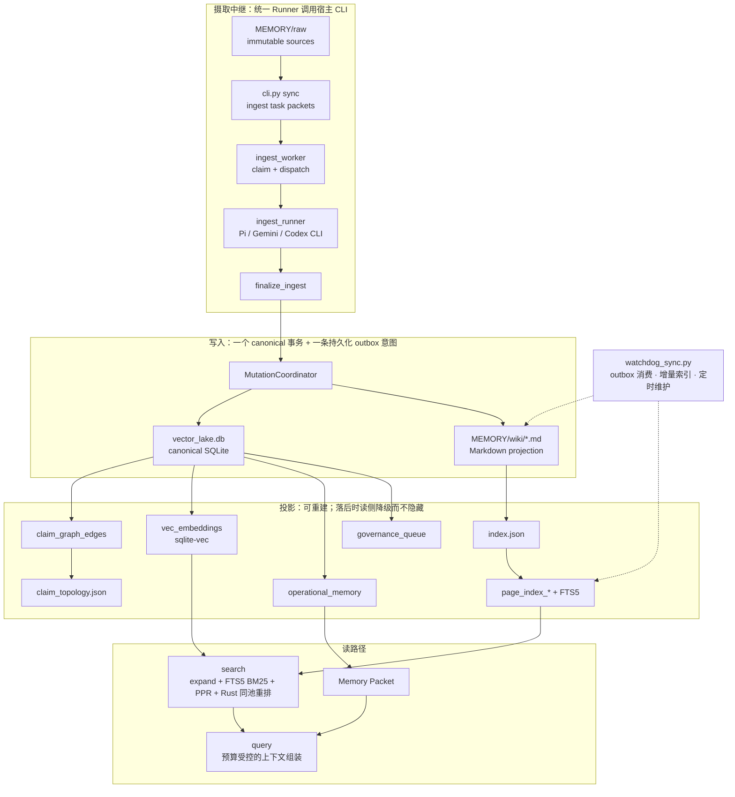

# Vector Lake

Vector Lake 是一个本地文件优先的知识编译器。它不是传统向量库，也不是一次性 RAG 后端，而是把原始材料持续编译成可审计的 Markdown wiki，并同步生成面向 Agent 的结构化运行态记忆。

当前架构边界：

* `MEMORY/raw`：原始信源层，只读输入。
* `MEMORY/wiki`：人类可读的 Markdown 发布层，用于审计、浏览、复盘和长期资产沉淀。
* `MEMORY/wiki/index.json` 与 `MEMORY/wiki/claim_topology.json`：从 canonical 写出的投影（页面节点 + 加权边；断言拓扑）。检索实际读的是它们的 SQLite 投影（`page_index_*` + FTS5），投影落后时回退读 `index.json`，并在输出头部标记 `[DEGRADED]`。
* `MEMORY/wiki/.meta/vector_lake.db`：统一的 SQLite 底层引擎，不仅保存实体 (Entities)、断言 (Claims)、证据 (Evidence)、信源 (Sources)、图拓扑、变更集和治理队列，还将 `Claim` 编译为 `fact / preference / decision / task_state`，存入 Agent 运行态的 `operational_memory` 表。
* `MEMORY/purpose.md`：版本化战略控制面。YAML 契约驱动摄取范围、证据等级、意图权重、SIR 复审和张力合成阈值；营销噪音与范围外资料不进入主图谱，但保留最小丢弃审计。`purpose_vectors.json` 仅保留为旧版回退，不再是权重主源。

如果 `MEMORY/wiki/.meta` 不可写，运行时会回退到仓库内 `data/v8_meta/`。

## 运行身份与隔离业务验收

MCP `runtime_identity` 返回**实际调用进程**的 PID、Python 版本、磁盘 checkout、选定 Python 函数的已加载代码与当前源文件比较、已加载 core 的版本／路径和磁盘二进制 SHA。它不打开数据库、不导入未加载的业务／core 模块、不重载或重启服务。

`matches_function_code` 仅比较明确列出的解包函数代码，不涵盖装饰器包装、默认参数、globals、导入时状态或整个模块。Git HEAD 与磁盘 SHA 不代表已加载版本；core 磁盘 SHA 也不证明内存映像相同。`not_loaded`、路径不符、代码不符、不可核验分别报告，不能替代健康门或发布绑定。

隔离业务入口复用 CI 后端门，以新目录保存 synthetic MEMORY、后端回执、JUnit 和成功回执；拒绝重用输出目录，单个 lane 130 秒超时后终止其进程树，不生成成功回执：

```bash
python -B scripts/business_acceptance.py --backend native --native-dir /path/to/fresh-ci-core-build --output /path/to/new-native-artifacts
python -B scripts/business_acceptance.py --backend fallback --output /path/to/new-fallback-artifacts
```

覆盖真实 synthetic canonical→outbox→Markdown／索引／FTS 的创建、更新、旧发布拒绝和删除，以及 in-process MCP 的工具发现／调用和定向故障回归。不是生产语料、模型网络、远端协议服务或迁移验收；成功回执仍写 `production_acceptance: not_established`。实际部署仍须单独授权、停止旧 writers、验证完整备份、绑定期望发布构件，并在真实服务进程执行身份和业务验收。远端 CI 与实际生产验收仍须绑定具体发布提交及运行进程；剪枝合同已由 core 0.2.2 统一为每节点最多 15 条 incident 边、同权按端点字典序，不能据此宣称所有评分严格等价。

## 已知限制与运维要求 (Known Limits & Operational Requirements)

以下约束由当前实现决定，部署前必须满足，否则会出现与预期不符的行为。

|约束|事实|规避|
|-|-|-|
|必须常驻守护进程|outbox 消费、增量索引、定时 lint、**到期时的 gram 索引重建**、WAL checkpoint、备份保留、兜底扫描与 Loop 线程监督均在 `watchdog_sync.py` 内，**它同时拉起并看护摄取 Runner**；摄取任务包的**模型调用**在宿主侧 `scripts/ingest_runner.py`（自动启动默认写入页面；shadow 跳过模型调用，但仍认领任务并记录状态），由 `scripts/ingest_runner_service.py` 负责重启，后者自身持有单实例锁|只读检索才可省略守护进程。**没有守护进程时没有任何定时维护会触发**（写入也会在 5 分钟后进入 outbox 积压告警），gram 索引需人工按 `doctor` 的 `due=` 执行 `python cli.py gram-index --if-due --apply`。常驻形态用计划任务 `VectorLake-Watchdog`（见“日常运行入口”），不依赖临时 shell 保持常驻。实例锁可拒绝重复启动，但不能代替进程托管或证明子进程已退出|
|摄取是一条中继流水线，各段职责不重叠|`ingest_worker`（守护进程内）只认领 `queued` / `failed`（预算未用尽）/ 租约过期的 `dispatched`，产出任务包并转入 `awaiting_subagent`；宿主侧 `ingest_runner.py` 只认领 `awaiting_subagent` 与租约过期的 `subagent_processing`，因此两段不会争抢同一作业。作业租约、`lease_token` 与 `lease_generation` 保证同一个作业不会被并发提交；被顶替或终态失败的作业不会再被派发（前者的状态被标为 `superseded`）|想让某个源重跑时用 `ingest-tasks --clear-abandoned` 或改源文件（废弃键按内容哈希）；**不要**为“多跑一点”而绕开租约手工改 `jobs`|
|Runner 健康默认只告警|`runner_absent` / `runner_stalled` / `runner_failing` 默认进 `warnings`，不翻转 `ok`；“从未跑过”与“跑挂了”由 `.meta/runtime/runner_supervisor.json` 区分|需要把这几项并入 `degraded` 列表（依然不阻断写入）时设 `VECTOR_LAKE_RUNNER_STRICT=1`|
|文本编译需要模型执行后端|`cli.py sync` 只准备任务包；统一 Runner 选择 Pi / Gemini / Codex 执行模型调用，`native_llm.generate_text` 仍抛 `SubagentTaskRequired`|在 Runner 主机安装并认证所选 CLI；通过 `config.json` 的 `ingest.backend` 选择后端，Pi 才要求 subagent 能力|
|向量投影需要维护|页面变更会使对应向量失效；常驻守护进程的周期兜底会按批次补齐缺失或过时向量，受嵌入模型与凭据可用性约束|未启用兜底或需立即恢复时执行 `python cli.py embedding-backfill --apply`；缺少嵌入凭据时检索降级，不以向量缺失冒充库中无资料|
|GC 的孤儿判据是拓扑度数 ≤ 1|度数来自 canonical 的 `links` / 共享来源 / claim 共现；**不是**可视化边集|先 `python cli.py gc` 做 dry-run，它会在同一调用中打印每个页面的实际度数。单次删除超过候选页 50% 时会自动中止，需 `--force` 才继续|
|删除类命令默认演练|`gc` / `delete` 默认 dry-run，必须 `--apply` 才落盘|保持默认；仅在确认 dry-run 输出后追加 `--apply`|
|修复类工具需要后置重建|`wiki-restore` 会恢复 Markdown，但索引投影需单独重建|按其输出末尾提示运行 `projection-rebuild-index --apply`|
|全量重建成本取决于语料与后端|全量重建需要读取与分词正文；增量路径可跳过未变更节点，不使用旧语料耗时外推当前实例|仅在必要时全量重建；日常依赖增量更新，并记录当前工作负载下的耗时|
|过滤态扩容有界|查询内复用候选池前缀与过滤判定；候选池最多 4096 条，宽泛过滤仍可能触顶或超过延迟预算|触顶时保留不完整告警，不把有界候选检索写成精确全量检索。性能需按当前语料和 provider 网络重新测量，历史结果见 [CHANGELOG](CHANGELOG.md)|
|人工编辑会经过校验|未通过 schema / 目的契约校验的手改页面会被拒绝并保留原文件，日志给出原因|修复页面后重新保存，或查看守护进程状态文件的 `current_action`|

## Architecture


```mermaid
graph TD
    subgraph relay [摄取中继：统一 Runner 调用宿主 CLI]
        RAW["MEMORY/raw<br>immutable sources"] --> SYNC["cli.py sync<br>ingest task packets"]
        SYNC --> WORKER["ingest_worker<br>claim + dispatch"]
        WORKER --> HOST["ingest_runner<br>Pi / Gemini / Codex CLI"]
        HOST --> FINAL["finalize_ingest"]
    end
    subgraph write [写入：一个 canonical 事务 + 一条持久化 outbox 意图]
        FINAL --> COORD["MutationCoordinator"]
        COORD --> DB["vector_lake.db<br>canonical SQLite"]
        COORD --> MD["MEMORY/wiki/*.md<br>Markdown projection"]
    end
    subgraph proj [投影：可重建；落后时读侧降级而不隐藏]
        MD --> IDX["index.json"]
        DB --> CG["claim_graph_edges"]
        CG --> CT["claim_topology.json"]
        IDX --> PINDEX["page_index_* + FTS5"]
        DB --> VEC["vec_embeddings<br>sqlite-vec"]
        DB --> OM["operational_memory"]
        DB --> GOV["governance_queue"]
    end
    subgraph read [读路径]
        PINDEX --> SEARCH["search<br>expand + FTS5 BM25 + PPR + Rust 同池重排"]
        VEC --> SEARCH
        OM --> PACKET["Memory Packet"]
        SEARCH --> QUERY["query<br>预算受控的上下文组装"]
        PACKET --> QUERY
    end
    WATCH["watchdog_sync.py<br>outbox 消费 · 增量索引 · 定时维护"]
    WATCH -.-> MD
    WATCH -.-> PINDEX
```

核心原则：**Markdown 是人类界面，`.meta` 是事实底座，`operational_memory` 是 Agent 运行层**；投影可重建，而唯一的写入顺序是「canonical 事务 → outbox → 投影」。

### 摄取中继的执行、恢复与完成边界

图中的箭头不是一次同步调用。`sync` 写入 SQLite `jobs`，Worker 持有 120 秒派发租约，生成任务包并转入 `awaiting_subagent`；Runner 再持有默认 3600 秒模型租约。`awaiting_subagent` 是共享队列状态，Gemini/Codex 使用它也不代表实际创建了子代理。`sync` 返回入队成功不等于编译完成；常驻 Runner 会继续消费，因此也不能把入队当作无后续写入的预览。

Runner 只在执行槽位空闲时认领任务：串行逐项认领，并发最多认领空闲槽位数。`--limit` 是本轮最多处理的任务数，不再提前占用整个批次的租约。默认单任务模型预算 900 秒（配置上限 3300 秒），初始执行和修复共享 deadline，且为租约结束前保留 120 秒余量。Windows Job Object / POSIX 进程组负责拥有的子进程生命周期，不等于文件或网络隔离。

模型返回的 `files_written` 是文件名和内容组成的草案，不是已经落盘的文件。宿主保留来源、候选清单和租约字段；`finalize_ingest` 校验版本、权限范围、页面契约后才提交。失败与租约释放同样需要当前 claim：旧 token/generation、过期租约或终态作业均不得回写。内部失败记录/释放调用传入 `claim=claimed_task`；未提供 claim 的旧式管理调用仅可处理未认领的 `queued` / 预算内 `failed`，不能推断当前所有者的令牌。

修复和重试共用 `ingest_errors` 分类：候选 canonical/投影版本过期不让模型修补旧令牌，重新派发且不消耗来源失败预算；缺字段、命名或 Schema 错误允许有界修复。默认每个作业 3 次失败预算，每次最多 1 次初始执行加 2 轮修复，即确定性校验持续失败时最多 9 次适配器调用。版本冲突不消耗预算，此数不是所有故障的全局调用上限，也不是 Pi 父会话和子代理的底层模型请求数。

Runner 状态中的 `finalized` 保留为成功关闭作业总数；另有 `published`、`content-rejected`、`duplicate-closed`、`missing-source-closed` 四项互斥结果。`duplicate` / `missing-source` 旧字段仍是检测次数，不保证关闭成功；执行失败看 `errors` 与 `model-failed`。这些都是当前 Runner 进程的计数，不是数据库历史总量。Health 的 `runner.outcomes` 对旧快照缺失字段返回 `null`，不把未知补成零。`projection_outbox_pending` / `projection_outbox_failed` 单独展示全库 outbox 工作，不是某个作业的投影完成回执；outbox 清空也不证明向量全部更新。

### 模型后端的权限与留存边界

统一的是任务 JSON 和 `finalize_ingest` 提交协议，不是执行权限或模型服务。三个内置后端均没有默认失败切换；切换已运行的后端需要先停止/排空原消费者，修改配置不证明运行态已经切换。

|后端|执行与来源输入|工具及文件边界|本地适配器留存|
|-|-|-|-|
|Pi|无界面父 Pi 会话要求委派给项目 `vector-lake-ingestor`；子代理读取明确指定的原始来源|默认摄取子代理仅有 `read`，fresh context，不继承全局/项目上下文；父会话仍使用宿主 Pi 策略，适配器未给整个执行链增加 OS 沙箱。显式 agent override 需单独核验，不能套用默认子代理保证|会话保存在 `scratch/runner_sessions`（不可写时使用临时目录）；失败时保存完整 stdout/stderr。按年龄/数量清理不是立即删除，也不是凭证脱敏|
|Gemini|宿主读取来源、核对内容指纹，将正文及授权候选送入 stdin|请求 deny-all 工具策略，禁用 MCP、扩展、hooks 和项目上下文；适配器未增加 OS 沙箱|适配器临时文件自动清理，不主动保存模型输出；CLI 自身与提供方留存另行遵循其策略|
|Codex|同上|请求禁用工具/功能、MCP、插件和项目文档；CLI 使用 `read-only` sandbox 与 `--ephemeral`|结果 Schema/最后消息临时文件自动清理；提供方留存不由适配器控制|
|自定义 `--model-cmd`|宿主通过 shell 执行，并检查返回 JSON|命令本身的权限、工具、额外写入与联网没有被内置适配器验证；仅适用于明确受信的宿主命令|由自定义命令决定|

`--check` 不认领任务、不验证认证，也不发送真实模型请求。输出的 `capability_scope` 区分 Pi 的可执行文件解析、Gemini 的 headless 参数检查、Codex 的参数/功能门检查和自定义命令的未检查状态；`execution_boundary` / `local_retention` 描述静态边界，`boundary_verified=false` 表示不能将这些描述或 help 探针当作运行态安全验收。`authentication_verified=false` 不代表认证失败，而是本次没有验证。

本地 CLI 不等于本地推理：正文和候选上下文仍可能发送到宿主 CLI 配置的模型提供方。CLI/提供方留存、日志外发和来源传输需要遵守数据授权；Pi 完整失败日志可能含来源内容或其他敏感信息，不可直接作为可公开分享的诊断包。后端边界核验不通过时应停止，不得通过换 CLI 绕过认证、生命周期或授权限制。

### 后端暂停、续批、耗时与探针缓存

`claim_ingest_tasks` 返回每一个实际认领的作业；不可读/损坏的包以错误任务返回，不在认领时预先扣失败预算。缺失任务包路径仍返回 `null`，保持原数组协议；Runner 消费错误任务时才按当前租约记录一次失败。因此坏任务不会隐藏健康任务，也不会让本轮实际认领数超过 `--limit`。

来源/页面校验失败仍使用原有来源预算。模型进程退出、超时、无效交付 JSON 和宿主运行故障则保留来源预算，通过带围栏的释放等待重试；它们不是内容拒绝。Runner 将后端状态写入 `.meta/runtime/runner_backend_state.json`：前两次连续执行故障分别退避 5、10 秒，第三次进入 `open`，不再认领或发起新模型调用，重启也不自动清零。已经运行的并发调用可以结束，迟到成功不能自动解除 `open`。在途请求可能多于三次，三次是暂停触发阈值，不是并发时的总请求数上限。

状态损坏/不可读时停止启动，不伪造健康。修复后可由所有者显式使用 Runner 的 `--reset-backend` 清除暂停；此操作必须取得同一根的消费者锁，不能与 `--check` 合用，不验证认证，也不能重置已有来源失败次数。该标志随后会按正常 Runner 模式执行工作，故实际运行/服务重启须另有授权；本次代码修改不会自动激活生产服务或清除其状态。Health 单独报告 `runner_backend_paused`，默认告警/strict 降级规则保持不变。

`--interval` 现在是最大空闲等待：有可执行积压时让步 1 秒后续批；空队列按 5、10、20、40、80 秒退避到配置上限（至少 5 秒）。仅探测 `awaiting_subagent` 或租约已过期的模型任务，不跳过派发/重试的 `available_at`，不将仍有有效租约的任务视为积压。长期空闲后新任务仍可能等待一次最大空闲间隔；这里未引入跨进程事件推送。每个任务完成时由主线程刷新状态，避免长批次直到结束才更新进度。

`runner.timings` 分别记录 `queue_wait`、`claim`、`model`、`finalize`、`cycle` 的毫秒耗时；每阶段只保留最近 128 个样本，并展示累计计数、窗口样本数及窗口 p50/p95。未知或非法样本不补零。`model` 包含适配器/CLI 启动、能力探针和本轮模型执行，不是提供方纯推理时间；一次修复单独计为一次模型阶段。数据不含来源正文、凭据、命令内容或文件路径，不能把各阶段 p95 相加当作端到端 p95。

Gemini/Codex 实际执行可复用安全能力探针；显式 `--check` 仍做完整新探针。缓存每根每后端最多一条（仅两个后端），有效期 300 秒、生成条目最多 64 KiB，以文件锁串行发布。身份绑定原生 executable 或可识别 npm 的启动器、manifest、声明入口，以及可识别 Codex 原生组件的路径/文件元数据；同时绑定适配器策略摘要。身份/策略变化、过期、时钟回退、损坏或缺失所需功能门时重新完整检查；检查中身份变化拒绝结果；失败探针不缓存。未知包装器/安装布局不缓存；缓存 IO/锁失败只降级为完整安全探针，不跳过工具限制。缓存不保存认证、正文、运行安全验收或 CLI/模型结果。它不能替代安装完整性验证，也不能识别未改变绑定组件的任意传递依赖篡改。

合成启动开销可用 `scripts/benchmark_ingest_relay.py --output <task-report.json>` 测量：它只创建并运行本地模拟 CLI/临时 MEMORY，比较独立适配器进程的 uncached/warm 输出、探针次数和时延，绝不调用真实模型服务或生产知识库。该回执不代表真实提供方响应速度，也不覆盖整个 canonical→投影链路。

## 📂 受控类型与文件结构规范 (Controlled Types & File Structures)

为了保持图谱检索的高信噪比与一致性，Wiki 目录下的 Markdown 文件必须遵循严格的**受控命名前缀**，并被划分为两种完全不同的文件组织结构规范。

### 1. 核心受控类型 (Prefixes)

`validate_wiki_filename` 强制以下前缀（禁用空格与非规范符号，格式如 `Institution_北京协和医院.md`），命名形式为 `<Type>_<MainName>[-<SubName>].md`，总长不超过 120 个字符：

* **`Institution_*`**：医疗机构、医院、医学院及科研院所实体。
* **`Vendor_*`**：商业侧供应商、IT 企业、设备厂商。
* **`Product_*`**：医疗 IT 产品、系统、软件架构（强制包含资质合规槽位）。
* **`Person_*`**：核心高管、研究员、关键人物。
* **`Event_*`**：重要会议、行业突发事件。
* **`Concept_*`**：抽象架构、理论、业务机制。域总览页沿用 `Concept_Overview_<domain>.md` 形式（由 `scripts/compile_domain_overviews.py` 生成）。
* **`Policy_*` / `Standard_*`**：政策法规、行业标准。
* **`Source_*`**：`raw/` 原始信源的一对一摘要节点。新页面名由 `wiki_utils.canonical_source_name` 生成（`Source_<消毒后的 stem>.md`）；与 raw 的对应关系靠 frontmatter 的 `sources:` 声明，不靠页名。旧格式 `Source_<目录>-<stem>-<hash8>` 的页面仍有效，不要批量重命名打断已有链接。
* **`Synthesis_*`**：推演、跨界比较与调研长文。
* **`System_*`**：系统投影页（社区页、总览等）。前缀校验直接放行，且不参与 purpose 契约门。

`index.md`、`log.md`、`overview.md`、`orphan_pages.md`、`wiki_link_stats.md`、`Synthesis_log.md` 为白名单文件，不走上述命名与校验规则。

### 2. 双重文件结构设计 (Dual-Schema Format)

根据文件的受控类型，内部的 Markdown 结构被严格限制为两类：

#### A. 实体与概念类 (Dual-Schema Mandate)

* **适用类型**（即 `schema_validator.VALID_H3_SLOTS` 中定义固化插槽的类型）：`Vendor_`, `Product_`, `Person_`, `Event_`, `Concept_`, `Policy_`, `Standard_`, `Institution_`
* **结构要求**：物理上由 `---` 分隔为两部分：

  1. **`## 1. 编译事实 (Compiled Truth)`**：Read Model，只保留当前共识。特征点必须落在类型专属的 `###` 固化插槽内（例如 Vendor 的 `### 组织架构与商业模式`），插槽名不匹配会被 `schema_validator` 拒绝。
  2. **`## 2. 证据时间线 (Evidence Timeline)`**：Event Store，只能追加。格式形如 `- [YYYY-MM-DD] [Event_Tag] ...`。时间线条目按这个格式读取：日期与 `Event_Tag` 取自该前缀（claim 的结构化字段优先，前缀兜底）；标题不含 `证据时间线`/`时间线`/`timeline` 的段落进不了账本（`证据边界` 这类章节是边界声明，不是事件）；源文未给出日期的条目在投影里 `event_date` 为 NULL、排序置于末尾，显示为 `Unknown Date`，绝不拿入库时间冒充发生时间；事件精度由 `event_date_source`（`day`/`coarse`/`unknown`）记录，`YYYY-MM` 与 `YYYY-Qn` 不会被当成某一天。

#### B. 信源与合成类 (Semi-Structured)

* **适用类型**：`Source_`, `Synthesis_`
* **结构要求**：不套用实体页的“编译事实 / 证据时间线”。新 Source 页采用 `templates/wiki/source.md` 的推荐骨架；历史自由格式摘要仍可读，不新增历史标题门。结构化输入的 Static Skeleton 与 Graph Integration 由宿主供给或管理。Synthesis 页使用下述必需骨架，分析正文可以自由组织。
* **`Synthesis_` 的骨架（只强制存在，不强制位置）**：必须含 `## 核心合成论点 (Core Synthesized Claims)` 与 `## 支撑拓扑 (Supporting Topology)` 两节（`schema_validator.SYNTHESIS_SKELETON_HEADINGS`）。门禁检查的是**存在**：把骨架放在文末仍是合法页面，因为按位置强制会一次性拒绝存量页面；位置由 lint 报告（`synthesis_skeleton_order_report`），于是文档与实现的差异只会出现在报告里，而不是被写成一条并未实现的保护。

#### 两个命名空间不要混（实体名 vs 标签）

`title` / `aliases` 是**实体名**，参与链接解析（连 core 名回退也认它们）；`tags` 是**标签**，从不参与链接解析。两者刻意保持不相交：标签撞上任何实体名会被拒绝（`Tag Collision`），而 `aliases` 里以 `#` 开头的条目会被视为把标签塞进实体命名空间、写入即拒绝（改用 `tags:`）。

## 🚀 安装与快速上手 (Installation & Quick Start)

### 1. 运行环境前置要求 (Prerequisites)

* **Python**: `>= 3.10`（推荐 3.11 \~ 3.13）。
* **操作系统**: Windows (需支持 UTF-8)、macOS、Linux。
* **嵌入模型凭据（可选）**：Vector Lake 的 embedding 使用 `GEMINI_API_KEY`；未配置时检索使用 FTS5 与图拓扑，不能生成或补齐向量。文本编译另需所选 Pi / Gemini / Codex CLI 及其原生认证；`ingest.backend` 不改变 embedding 提供方，配置 Key 也不会让 `sync` 自行调用文本模型。

### 2. 依赖安装 (Dependencies)

```powershell
# 1. 克隆仓库并进入根目录
git clone https://github.com/shawnshi/vector-lake.git
cd vector-lake

# 2. 安装 Python 核心运行时依赖
python -m pip install -r requirements.txt

# 3. 可选：首次安装原生核心需要 Rust 与 maturin（详见“原生性能加速”）
python -m pip install maturin
python scripts/build_core.py
```

### 3. 配置与环境变量 (Configuration & Environment)

```powershell
# 从示例创建配置文件
cp config.example.json config.json
```

`config.json` 核心字段说明：

* `ingest.backend`：后台摄取的模型执行 CLI，可选 `pi`、`gemini`、`codex`，默认 `pi`。这是嵌套字段，不是顶层 `backend`，也不是模型名称或 MCP 客户端类型；所选 CLI 需安装在 Runner 所在主机并完成其原生认证，Pi 后端还需 subagent 能力。
* `memory_dir`：自定义 `MEMORY` 根目录；优先级为 `VECTOR_LAKE_MEMORY_DIR`、此字段、宿主历史默认路径。新部署建议显式设置绝对路径，避免误用宿主目录。
* `target_directories`：摄入扫描目录；留空时扫描当前 `MEMORY/raw`，非空时替代默认目录（相对路径基于项目根目录）。
* `exclude_paths`：默认排除 `stocks/`、`garmin/`、`personal-insights/`；配置会覆盖默认列表。另有代码级规则拒绝 `privacy/.../Diary/...` 来源，不能通过配置解除。
* `supported_extensions`：允许编译的原始资料后缀（默认 `[".md", ".txt"]`）。

将以下配置合并到 `config.json`；使用 Gemini 或 Codex 时，将 `pi` 改为 `gemini` 或 `codex`，保留其他字段：

```json
{
  "ingest": {
    "backend": "pi"
  }
}
```

后端选择优先级为 `--model-cmd` > `VECTOR_LAKE_RUNNER_MODEL_CMD` > `ingest.backend` > 默认 Pi。非法配置会报错；真实摄取启动时检查 CLI 能力，不可用时明确退出，不自动切换服务。配置在启动时读取，不热切换；修改后需协调重启并核对实际后端。能力检查、锁和安全切换流程见 [Config](#config)。

启用 embedding 或宿主编译会将相关文本交给模型服务。先核对扫描目录、排除项及宿主的数据边界；本地文件优先不等于零外联。

Outbox 发布协议使用逐页 `projection_generation` 和独立的租约 owner/token/generation。完成与失败回写必须携带当前未过期的认领回执；仅传 outbox ID 不再可用。A→B→A 重放保留幂等行 ID，但分配新的逐页版本，旧重试不能覆盖新投影。canonical 提交、前台物化、后台物化/索引及手工编辑归一化共用按文件名排序的页面锁；等待页面锁时不持有 SQLite 写事务；调用方不得在外层 SQLite 事务中发布页面。锁归属绑定 PID 与线程，文件名别名不能以不同 canonical 名称指向同一物理页面。现有 payload retention 保留 outbox 行及版本，只清空过期 payload。

已有库由 writer 首次使用 outbox 协议时做加列、索引与旧租约迁移；纯 reader 保留旧快照的只读访问。迁移不得与旧版本 writer 混跑：部署前停止全部旧 writer、保存并验证完整数据库备份，在受控环境升级后统一启动新版本。未知版本的历史 intent 若对应现存 canonical 页面会失败关闭，不自动把旧 payload 绑定到当前页面；恢复需通过受控 canonical mutation 重新入队。canonical callback 可以更新关联账本，但不能改变已准备页面，否则整笔事务回滚。绕过协议的原始 SQL/外部文件写者不受合作式页面锁保护。

Watchdog 的 wiki/raw watcher 与后台循环统一接受线程监督，异常退出有界重启；独立的 `watch-wiki` / `watch-raw` 状态不会被主进程心跳清除，正常停机等待当前替代线程结束。

备份回收只处理具有完成回执、SQLite 完整性检查结果及匹配 SHA-256 的备份。生产备份与回收共享目录锁，维护备份先在 `.partial` 目录构建再发布；旧备份、未完成备份、内容变化或包含额外文件的目录均保留并显示为 `PROTECTED`。至少保留最新的验证通过副本；该验证不等同于跨投影恢复演练。历史备份不会被自动补写回执，受保护文件可能使实际磁盘占用超过回收预算。

**关键环境变量（由宿主环境注入；项目不会自动加载 `.env`）：**

|环境变量|作用|推荐值|
|-|-|-|
|`PYTHONUTF8`|强制 Python 运行时使用 UTF-8 编码（Windows 强烈推荐）|`1`|
|`GEMINI_API_KEY`|向量嵌入模型 API Key（Gemini Embedding）；代码从进程环境读取，不从 `config.json` 读取凭据|不在仓库填写|
|`VECTOR_LAKE_MEMORY_DIR`|显式指定 MEMORY 根路径（优先级高于 `config.json`）|例如 `C:/path/to/MEMORY`|
|`VECTOR_LAKE_RUNNER_MODEL_CMD`|覆盖 `ingest.backend` 的模型接缝命令；使用配置文件选择后端时应取消此覆盖|通常不设置|
|`VECTOR_LAKE_RUNNER_SHADOW`|Watchdog 拉起 Runner 时，设为 `1` 跳过模型调用和写页，但仍认领任务、处理重复来源并写运行状态；直接 Runner 默认 shadow，需 `--no-shadow` 才写页|默认 `0`（Watchdog 路径）|
|`VECTOR_LAKE_RUNNER_CONCURRENCY`|摄取 Runner 并发模型调用线程数，也可由 `ingest_runner.py --concurrency` 覆盖|默认 `1`；按宿主容量调整|
|`VECTOR_LAKE_RUNNER_HOLD_SHADOW_LEASE`|设为 `1` 时 shadow 轮不释放已认领的任务包（保留租约供人工检查；默认释放以便下一轮重试）|默认 `0`|
|`VECTOR_LAKE_QUERY_CONTEXT_TTL`|Query 上下文临时文件的过期秒数|默认 `7200` (2小时)|
|`VECTOR_LAKE_VECTOR_SIM_SCALE`|Sum 混合检索模式下向量相似度权重乘数|默认 `15.0`|
|`VECTOR_LAKE_NO_BROWSER`|设为 `1` 时生成 3D 拓扑图后静默不自动弹出浏览器窗口（适合无头/CI环境）|默认 `0`|

### 4. 验证安装 (Health Check)

运行体检命令，确认环境与数据库状态健康：

```powershell
python cli.py doctor
```

逐项核对输出中的 Python、分词后端、原生核心、MCP 工具及写入门；原生核心是可选项，索引或写入门异常时按实际诊断处理，不以固定版本号或工具数量判定成功。

### 5. 宿主 Agent 接入 (MCP Client Configuration)

Vector Lake 以标准 Model Context Protocol (MCP) 向宿主（Pi、Claude Desktop、Cursor 等）暴露 19 个工具；准确注册面由 `mcp_server.py` 与 `tests/test_command_surface.py` 核验。

**在客户端配置文件（如 `claude_desktop_config.json` 或 `.mcp.json`）中添加：**

```json
{
  "mcpServers": {
    "mentat-mind-mcp": {
      "command": "python",
      "args": [
        "-m",
        "vector_lake.mcp_server"
      ],
      "env": {
        "PYTHONPATH": "C:/path/to/vector-lake",
        "PYTHONUTF8": "1"
      }
    }
  }
}
```

`PYTHONPATH` 使用仓库的绝对路径，避免依赖不同客户端的工作目录规则。需要向量嵌入时，由启动环境或客户端的私有配置提供 `GEMINI_API_KEY`，不要把真实密钥写入共享示例。

Pi 的文件配置位于 `~/.pi/agent/mcp.json`；其他客户端使用各自的配置入口。在具备 `tool_search` 的 Pi 会话中，可以在该 server 项增加：

```json
{
  "toolExposure": {
    "query_logic_lake": "deferred",
    "finalize_query_synthesis": "deferred"
  }
}
```

这是 Pi 的工具暴露配置，不应直接复制到其他 MCP 客户端。更新服务代码后，常驻 Python 进程需要重连或重启；Pi 使用 `/mcp reconnect mentat-mind-mcp`。`doctor` 的新进程导入检查不等于现有连接已经加载新代码。

### 6. 启动后台守护进程 (Starting Daemon)

```powershell
python watchdog_sync.py
```

> **运行机制提示**：守护进程会常驻监听文件变动、消费写入 outbox、自动看护摄取 Runner（`scripts/ingest_runner_service.py`）并执行定时增量维护。日常只读检索可不启动守护，但发生写入后**必须**由它消费 outbox 以防止队列积压。

\---

## 核心机制与运行时防护 (Core Runtime & Defense Systems)

> **运行前提**：完整摄取需要 **① 单机数据根 ② 常驻 `python watchdog_sync.py`（Windows 可由计划任务 `VectorLake-Watchdog` 托管）③ 已安装、已认证的 Pi / Gemini / Codex CLI 后端**。`cli.py sync` 只准备任务包，统一 Runner 执行模型调用并经 `finalize_ingest` 发布。守护进程自动拉起并看护 `scripts/ingest_runner_service.py`，可用 `VECTOR_LAKE_RUNNER_AUTOSTART=0` 关闭；通常无需另开手工监督器。MCP 客户端身份不决定摄取后端，Pi 的 subagent 要求也不适用于 Gemini/Codex。只启动 MCP server 而不启动守护进程时，写入会在 5 分钟后进入 outbox 积压告警状态。

* **双轨看门狗 (Two-Track Watchdog)**：除增量文件外还捕获 `on_deleted` / `on_moved`，因此重命名或删除页面不会在图谱里留下幽灵节点。
* **写入健康门 (Write Health Gate)**：写入只在**硬故障**下被阻断（数据库不可用、存在 hard-failed 的 `mutation_outbox` 行）。outbox 积压超过 `VECTOR_LAKE_OUTBOX_MAX_BACKLOG`、投影漂移、心跳过期、终态失败作业、时间线 parity 漂移都属于**可修复降级**，只记录告警并继续写入——阻断它们会同时阻断唯一的修复通道。需要严格模式的运维方可分别用 `VECTOR_LAKE_OUTBOX_BACKLOG_BLOCKING` / `VECTOR_LAKE_TERMINAL_FAILED_JOBS_BLOCKING` / `VECTOR_LAKE_TIMELINE_PARITY_BLOCKING` 把这些降级提升为阻断。
* **I/O 批处理防抖 (I/O Debouncing)**：同批次修改合并为一次 `index.json` 写盘；`index.json` 不再保存完整正文（每个节点保留至多 320 字符的摘要，摘要与 `weighted_edges` 各占文件的一部分——具体比例取决于实例），投影写入使用短事务，全量重建不再冻结数据库。
* **语义张力量化模型 (STQM)**：图谱原生支持 `tension_edges`，把争议与矛盾结构化为冲突边，Query 时可直接展示领域盲区。
* **跨类型本体拦截 (PIEA)**：入口级跨类型查重，避免同一名称多态共存；内置正则清洗违规嵌套前缀（如 `Concept_Synthesis_`），并由 schema gate 校验受控前缀与类型。
* **持久化增量索引与稀疏图遍历 (Sparse Graph Traversal)**：前台变更先写 durable outbox，Watchdog 合并批次后更新索引；`_calculate_weighted_edges` 使用稀疏遍历并限制每节点投影边数。
* **跨平台进程防护**：后台子脚本使用 UTF-8；模型调用与被看护的 Runner 使用 `process_control`。Windows 子进程在启动门闩放行前加入带 `KILL_ON_JOB_CLOSE` 的 Job Object；POSIX 使用独立进程组。超时后收束受控进程族，但 POSIX 不覆盖主动 `setsid()` 逃离的进程。
* **派发与版本绑定**：派发时刷新候选与版本快照，再在同一事务中更新任务载荷和交接状态；获写锁后重新检查租约与所有权。保留原作业身份、源路径、内容哈希和重试历史；刷新前后源校验或投影不一致时拒绝旧快照，不向旧提案补写新版本令牌。
* **内容校验与历史异常隔离**：新摄入任务和 Source 的 File Hash 仍使用 MD5；已有 `sha256:<digest>` 处理账本在观察快照缺失或变化时，按 SHA-256 验证内容，不因仅修改时间变化而重复入队。补齐缺失观察字段时保留原摘要格式；SHA-256 校验不可用时不派发，内容不匹配仍按变更入队。账本记录的大小非零、却对应空文件 MD5 时，扫描跳过该源并由 `doctor` 报告；不自动改写历史哈希或批量重派。历史大小为零的文件后来新增内容，仍按正常变更检测入队。
* **定时确定性维护 (Scheduled Deterministic Maintenance)**：每天 10:00 与 23:00 刷新脏图拓扑、执行只读 lint、在索引落后时重建 gram 倒排、做 SQLite WAL checkpoint 并执行备份保留；各维护阶段分别执行并汇总失败，lint 失败不妨碍后续阶段；checkpoint 会核对 SQLite 返回的 busy/帧数结果，不把“调用未抛异常”当作完成。另有一条独立节拍的兜底扫描（`VECTOR_LAKE_CATCHUP_INTERVAL_SECONDS`，默认 900 秒）按扫描规则准备新源或内容已变更的源、作废陈旧任务、释放失去 job 的在途标记，并按批次重建缺失或**输入已变**的向量。研究、去重、聚类等独立脚本不会被该循环隐式启动。
* **向量投影存于 SQLite (vec\_embeddings)**：向量由 `sqlite-vec` 存放于 `vector_lake.db` 的 `vec_embeddings` 表，不再依赖模型侧的 JSON 载荷；语义去重守护进程只读该表，读取失败时退回**词法/拓扑去重**（不是旧缓存）。向量的**存在不等于有效**：页面被绕过增量索引的路径改写、或全量重建改动了别名与摘要时，旧向量不会被删除，只会默默继续用已经不存在的正文答题。因此每个节点在写入向量的同时记录其嵌入输入的摘要（`vec_embedding_inputs`），周期兜底每轮比对当前节点，把缺失、输入已变、以及未打标的节点一并按批重建；需要一次性全量重建时用显式 `embedding-backfill`。
* **本体免疫型排重 (Ontology-Immune Deduplication)**：去重守护进程豁免 `Source_*` 等时序不可变信源，避免“相似度过高即合并”把不同日期的研报强行合流。
* **合并的可回放性 (Merge Durability)**：`resolution=merge` 只能在合并**已落盘**时写下。类型/ID 不匹配不再静默落到 `_mark_resolved`（fail-closed），声明的名字与文件名不一致（`_`/`-`）时回退查别名注册表，落盘时同写 `merge_applied`/`applied_at`；`lint` 按 `unapplied_merge_items()` 报出“已 resolved 但两页俱在”的条数——只看 `type`/`status` 会把早先已判定为 `skip` 的近邻算成待办。**被消费页的键与标题必须进入幸存页的 `aliases`**（`semantic_merge._union_frontmatter` 的既有规则）：链接解析只认文件名、标题与 frontmatter `aliases`，不读 SQLite 别名表。
* **统一 SQLite 数据底座 (Unified SQLite Engine)**：实体、断言、证据、信源、图拓扑、变更集、治理队列与运行态记忆统一落在 SQLite，启用 WAL。
* **差分垃圾回收机制 (Diff-based GC)**：Markdown 层面重命名 / 删除或断言被移除时，同步层按页面增量清理对应的实体、断言与证据，不再只增不减。
* **夜间拾荒者集群 (Janitor Swarm)**：语义去重的**分片准备器**。`python scripts/launch_janitor_swarm.py` 读取治理队列中的 pending merge 项，按 `SHARD_SIZE` 切分为子代理任务包并写出 `janitor_manifest.json`。**它不会自行合并或启动任何外部进程**；实际合并由宿主子代理调用 `resolve_governance_item` 或 `bulk_reconciliation` 完成。
* **MCP 载荷沙箱 (Payload Sandbox)**：`write_wiki_page` 等文件载荷入口要求 `payload_file`；`update_operational_memory` 也接受直接 `content`，治理与摄取提交入口另支持内联参数。文件读取受沙箱路径与 `VECTOR_LAKE_PAYLOAD_MAX_BYTES` 限制；`VECTOR_LAKE_PAYLOAD_ROOT` 扩展允许根，不替代内置 `brain/<run>/scratch/` 沙箱。这是文件读取约束，不是模型、网络或进程隔离。

### 日常运行入口

1. **常驻守护**：`python watchdog_sync.py`（outbox 消费、增量索引、定时 lint 与 WAL checkpoint 都在这里；只跑 MCP server 会让写入持续积压）。自动拉起的 Runner 按 Config 节的优先级选择后端；未配置时使用 Pi，默认真实写页。`VECTOR_LAKE_RUNNER_AUTOSTART=0` 关闭自动看护；`VECTOR_LAKE_RUNNER_SHADOW=1` 跳过模型调用和写页，但仍认领任务、处理重复来源及记录状态，不是只读预览。
Windows 常驻入口为计划任务 **`VectorLake-Watchdog`**，执行 `scripts/watchdog_service.ps1`，固定仓库工作目录与 UTF-8，日志写入 `scratch/watchdog_service-*-{out,err}.log`，每个流保留最新 10 份。注册脚本 `scripts/register_watchdog_task.ps1` 会替换同名任务；先核对现有配置，不把它当作无损重启命令。脚本默认配置为登录 + 开机 + 每 5 分钟、`MultipleInstances=IgnoreNew`、`ExecutionTimeLimit=PT0S`、失败重启 3 次且间隔 1 分钟；主体优先 `S4U`，失败后尝试 `Interactive`。现有部署的频率和身份可能不同，以实际任务配置为准。

**更新常驻代码时先安排空闲窗口**：确认摄取作业和 outbox 无在途处理，保留代码与数据库恢复点；控制计划任务的重复触发，再按已核验的 PID、创建时间和父子关系停止受影响的守护/Runner 进程树。`Stop-ScheduledTask` 不会取消后续触发，也不能单独证明 Python 子进程已退出。新守护可能接管已有 Runner，但接管不等于加载新代码。恢复后核对新 PID、心跳、队列与索引；MCP 连接须另行重连。不要按进程名批量终止其他宿主会话。
2. **摄取 Runner（可选的手工形式）**：`python scripts/ingest_runner_service.py --limit 2 --interval 120`，不指定 `--model-cmd` 才会按环境变量 / `ingest.backend` 选择内置后端。手工监督器及直接 Runner 默认 shadow（报告 `needs-model`，仍有队列与状态副作用）；真实写入需 `--no-shadow`。自动启动则默认真实写页。Runner 用 `--concurrency / -c`（或 `VECTOR_LAKE_RUNNER_CONCURRENCY`）控制模型调用并发；root 所有权锁与消费者锁阻止不同入口并行认领，细节见 Config 节。

   自定义 `--model-cmd` 保留 shell/stdin/stdout 协议，stdout 必须只返回 `{"files_written": [{"filename": "Source_*.md", "content": "..."}], "integration": {"disposition": "integrated|standalone|rejected", "relations": [...]}}`；standalone/rejected 用 `reason`，rejected 用空文件数组。纯数组或缺少集成判断会被拒绝；租约、源哈希和候选清单由宿主提供，不能由模型改写。内置后端共用结果验证、修复预算和 `finalize_ingest`，不另建发布路径。

   任务包协议版本 3 会在认领前重建旧版 queued / failed / awaiting\_subagent 提示词，保留 queued / failed 的原有尝试次数，不改动已领取的 subagent\_processing 作业。升级前先等待在途任务完成并保留恢复点；磁盘改动不会热更新驻留进程。
3. **检索**：`python cli.py search "<keyword>"`，或 `python cli.py query "<question>"` 走预算受控的上下文组装。
4. **摄取队列**：`python cli.py ingest-tasks` 查看 queued / awaiting\_subagent 作业；模型或 subagent 只返回包含 `files_written` 和 `integration` 的对象，宿主控制器验证后调用 `finalize_ingest` 入湖。
5. **被废弃的源**：同一份内容反复确定性失败（例如 `categories` 不是单元素列表、命名或 schema 违规）时，第 3 次尝试后该源会被记为「废弃」并停止派发，避免每轮固定烧掉 3 次模型调用。`python cli.py ingest-tasks --abandoned` 查看清单与原因，`--clear-abandoned [FILE]` 恢复派发。键是 `(路径, 内容哈希)`：**改好源文件即自动恢复**，无需人工清理。`--terminal-failed` 列出耗尽尝试预算的作业，`--close-terminal-failed` 把其中**源已入账**的标记为 superseded（源未入账的会保留，因为那才是真正未完成的工作）。
6. **周期治理**：`python cli.py review` 处理冲突与候选队列，`python cli.py doctor` 检查运行健康度。

### 显式当前版本重评（限定60份）

`recompile-ingest` 是本地操作者入口，**不是**普通 `sync` 的新扫描策略，也不是认证或 OS 隔离边界。它只接受冻结78项清单中的39份证据缺口与21份隔离资料；18份有效拒收不得纳入。两个输入文件均须提供 SHA-256，源文件的 SHA-256、MD5、大小与 mtime 必须仍匹配清单。

```bash
python cli.py recompile-ingest --plan <frozen-plan.json> --plan-sha256 <digest> --approval <read-approval.json> --approval-sha256 <digest>
# 上述只验证，不登记或派发；实际交接再显式增加 --apply --batch-size 1。
```

读取批准文件的结构为 `{"version":1,"request_id":"<unique-id>","plan_sha256":"<digest>","read_scope":"public_only","entries":[...]}`。`entries` 必须恰好覆盖60份；每项含 `filepath`、当前 `sha256`、`classification:"public"` 和 `classification_evidence`（12–1000字符）。**不能由目录、domain、URL或程序默认值替操作者填充公开性证明**；未知/私人资料不被这个入口接收，SHA-256也只绑定批准制品，不证明其分类主张。当前入口不提供私人资料的隔离授权模式。

交接复用原生任务包、单实例Runner、claim/lease及 `finalize_ingest`；使用独立 `ingest_recompile` 作业类型，旧Runner不会把它领取后按duplicate关闭。只有持久请求、白名单、当前字节与租约全部匹配，才允许本次任务不走C1重复关闭；普通作业的去重不变。Canonical Source命名冲突、其他活跃/待处理任务、新出现的当前版本完成回执、旧账本漂移或不明/共享Source归属均会阻断交接。模型只读取任务目录中的已校验只读源快照，不再打开可变化的原raw；只读属性/工作目录不构成OS安全沙箱。快照在真实finalization后清理，未完成任务的快照保留供恢复。模型不获得混合Wiki候选或私人purpose正文，只能按当前源独立编译或给出真实来源拒收；非Source页保持原生create-only规则。

旧jobs/result_json保留；仅真实finalization才更新processed_files。请求登记的`completed`只是授权记录，**不是模型完成或出版回执**；输出`DISPATCHED_NOT_COMPLETE`也不是完成。新回执另记录request、批准制品及当前SHA-256绑定。失败作业只能通过同一显式入口重交接，保留失败次数与等待时间；更换request_id不会重置同内容的确定性失败预算。先交接1份并验证真实出版/拒收回执，才继续余下对象。新代码须按上文空闲窗口规范加载到常驻Runner；磁盘修改或派发成功不证明新服务已激活。

经操作者明确决定，可用 `--defer-filepath <approved-raw> --defer-sha256 <digest>` 延后一份归属不明的对象，再沿原入口交接其他对象。这不覆盖、改绑或读取该旧Source，不移除60份冻结白名单中的成员，也不改写拒收与处理账本。延后要求当前指纹匹配、没有未完成原生作业，且确实命中归属未证明的门；同一请求仅允许一份，持久记录单列为 `ingest_recompile_deferral`。其 `completed` 只表示延后登记，**不是来源重评完成**；登记后按固定幂等标识校验完整绑定，撤销或损坏必须阻断，旧参数不得复活或换对象，本入口不提供解除延后。交接结果另返回 `deferred` 数量，该对象不能进入模型或finalizer。

历史版本的逐项特性说明不再在本文件维护；版本变更请查 `CHANGELOG.md`，运行契约以本节与上方“已知限制”表为准。

## Operational Memory

运行态记忆由 `vector_lake/governance_store.py` 从 canonical claims 编译生成。它解决的问题是：Agent 常常只需要一个事实、偏好、决策或任务状态，不应该每次加载整页 Markdown。

> **"Wiki-as-Database" 写回范式**：Agent 在运行态生成的新记忆，**严禁**直接写入 SQLite。它们必须通过 `update_operational_memory` 工具，按严格的 **Dual-Schema（双架构）** 规范，即 `## 1. 编译事实 (Compiled Truth)` 与 `## 2. 证据时间线 (Evidence Timeline)`，物理追加到相应的 Wiki 实体文件（如 `Concept_UserPreferences.md`）的时间线下方。这确保了在图谱完全重建时，Agent 记忆依然通过 Markdown 原质保留。

内置类型：

* `fact`：一般事实或断言。
* `preference`：用户偏好、默认策略、首选路径。
* `decision`：已批准或当前有效的决策。
* `task_state`：任务状态、阻塞项、待处理事项。

**类型来源**：只认 claim 显式声明的 `memory_type` 或可映射的 `claim_type`；其余为 `fact`。正文关键词与小节标题不用于推断偏好、决策或任务状态。`tool_memory` 通过页面 frontmatter 写入类型声明。

每条运行态记忆会计算：

* `confidence_score`
* `freshness_score`
* `authority_score`
* `importance_score`
* `reinforcement_score`
* `validity_factor`
* `memory_score`

**相关性排序**：字段命中权重（key 4 / text 3 / page 1 / type 1）按 `log(1 + N/df)` 缩放；`memory_type` 不参与 df 统计。依次按查询相关性、`memory_score`、更新时间降序排序，再以 `memory_id` 升序破同分；索引与全量扫描使用同一口径。候选窗口另保留 canonical `rowid` 的自然顺序，索引触发器维护对应的 `source_rowid`。

冲突规则：

* 显式 contradiction：`authority_score > confidence_score > updated_at`。
* 同一 `memory_key` 的 `preference / decision / task_state`：`updated_at > authority_score > confidence_score`。
* 失败侧标记为 `superseded`；无法裁决时保留 `conflicted`。

`query` 会优先生成 Memory Packet，再按预算拼接相关 wiki 页面。Memory Packet 包含当前偏好、决策、任务状态、相关事实、冲突/陈旧告警和证据指针。

包的每行形如 `- [rel 211.6 | mem 0.70 | active] <正文>`：`rel` 为查询相关性分，`mem` 为用于裁决平局的存储分。

## CI Backend & Platform Gates

`.github/workflows/test.yml` 配置 Windows／Ubuntu × `native`／`fallback` × Python 3.10／3.13 八个 job，最多并发两个、每 job 25 分钟；仅授予 contents read，不保存 checkout 凭证。配置存在不等于具体发布提交的远端八个组合已通过。

* 两后端的既有 metadata／two-stage-index 测试需要 NumPy；`scripts/ci-test-requirements.txt` 固定 2.2.6（Python ≥ 3.10）、四个平台／解释器 wheel 哈希，CI 仅安装官方二进制且不解析额外依赖。该包不加入应用运行时清单，不以本机偶然已安装来替代测试依赖声明。
* `native`：CI 专用清单固定构建工具 maturin 1.15.0 与官方 PyPI x86_64 wheel SHA-256；Python < 3.11 的必需依赖 tomli 2.3.0 单列 marker 与官方 pure-Python wheel 哈希，不依赖偶然传递安装。不增加应用运行时依赖，不升级宿主安装。`scripts/ci_core.py build` 使用 release／locked、全新任务目录构建并提取 wheel，记录构建前后 crate 输入与 DLL／SO 哈希，不 pip install 项目原生模块。测试开始／结束均核验当前源码、任务内二进制、实际加载路径及 `indexer.HAVE_CORE`；缺失、过期、哈希错误或误用宿主模块均失败，不静默回退；任何后端校验前先使旧 probe 失效，失败不能遗留上次的成功回执。当前 checkout 的 graph／prepared PPR ABI 必须具备，不能把缺失 ABI 的 native-only 测试静默 skip。
* `fallback`：测试进程在导入应用前阻止 `vector_lake_core` 导入，开始／结束确认 `HAVE_CORE=False` 且没有加载 core；这不表示 sqlite-vec／Tantivy／rjieba 等其他原生依赖也被禁用。两条路径均禁用自动 pytest 插件和字节码缓存（CLI 也显式关闭当前解释器写入），并使用隔离 bootstrap MEMORY、清除 provider key 与 DB override。fallback 明确跳过只测试原生 API 的模块，单列 skip／collection 差异，不把减少的用例数称为相同全量覆盖。
* 可移植小图测试覆盖实际后端的直接／双向链接、来源／邻居证据、阈值与 NaN、零贡献桶。64 节点密集图把 `ci_core_*` 剪枝观测写入 probe JSON 与 stdout，并在两后端强制每节点最多 15 条 incident 边。core 0.2.2 修复旧版分离 source／target 计数和同权不稳定次序；Python 原生调用不再硬编码 50。新增 raw API 的 cap 0／1／2／5／15／64 与反向输入验证。同权小图边集合一致不是所有评分／证据归一化的 parity 证明；本次不改评分、舍入或证据资格规则。
* 本地可用 `python scripts/ci_core.py build --output <全新任务目录> --offline --timeout 150`，再用 `python scripts/ci_core.py test --backend native --native-dir <构建目录> --receipt <任务内probe.json> -- -q` 或 `--backend fallback` 核验。online 构建只面向已授权的隔离 CI runner；本地验证不触发 hosted workflow、不安装到主环境、不读生产库。

## Storage Layout & Architecture

Vector Lake uses a CQRS-like layout with canonical SQLite mutations and derived file/search projections.

* **Raw sources**: `raw/*` remains the original input.
* **Markdown wiki**: `wiki/*.md` is the readable publication layer; edits enter the validated mutation path.
* **Canonical database**: `vector_lake.db` stores entities, claims, graph edges and operational memory. Search indexes and files are derived projections.
* **SQLite write-lock scope**: 增量索引的读取、分词、图计算、JSON 发布与 claim graph 构建在全局 SQLite 写事务外执行，仍由共享 index 文件锁串行化。该批次的 FTS 修改和旧向量作废共用短事务；提交后才发布文件并刷新 page projection。文件发布失败会向调用方抛出，outbox 保留重试意图；衍生投影可能暂时部分更新，不能把 SQL 提交当作投影完成。索引入口拒绝外层 SQLite 事务，避免 SQLite → index 锁序倒置。写锁竞争诊断在 commit/rollback 释放锁后记录，不通过 `inspect.stack()` 读取源码；BEGIN 等待预算不包含业务 SQL、投影刷新或诊断持久化时间。全量 page projection、批量 SQL 与 best-effort Tantivy 镜像仍可能持有写锁，其成本另行优化；本改动不承诺消除全部写锁竞争。
* **Projection refresh costs**: page projection 的 full refresh 仍核对所有节点的八列，并删除不在权威键集合中的行，但完全相同的行不再删除／重写；有变化的行沿用 `INSERT OR REPLACE`，不改成保持 rowid 的 UPSERT。行 JSON 与权威键列表在写事务外准备；边 digest、边刷新、状态戳、partial fallback 与缓存失效保持原路径。返回字段 `nodes_written` 保留历史含义（本次准备／处理的行数），不代表实际被 SQLite 修改的行数。此优化降低写放大，不取消全量节点比较／序列化、边摘要或现有跨事务部分发布边界。
* **Projection health costs**: `projection_registry.status()` 内，同一 connection 的成功 compound COUNT／anti-join 只执行一次，计数仅在该同步调用内共享，结束或异常后丢弃；嵌套调用与并发 context 独立，直接 health／reconcile 在普通独立调用中仍重新读取。失败仍显式报告 degraded，不转换为 no-data／healthy。它不是跨请求健康缓存，也不是覆盖全部投影的一致性数据库快照；不跳过 `runtime_health` 的目录、canonical、JSON 或深度检查。
* **Graph candidate costs**: Python／Rust 只在保守的、按原评分括号顺序计算且按各后端规则舍入的亲和度上界仍低于入边阈值时，跳过零权邻居桶与零权来源桶；直接链接、非零贡献、可达阈值的亲和度，以及非有限／负乘数／溢出的回退路径保留。Rust 对存在未列入 `links` 的显式 triple 的两个端点禁用此优化，保留原生路径借共享桶计分的既有行为。不截断候选、不改评分／舍入／prune；真实密集证据仍可能二次方展开。两后端既有评分／截断与原生同权边排序差异不在此处宣称修复，保真验证分别对照各自冻结实现；原生全资格集合的对照使用 cap ≥ 节点数，不冒充同权截断结果的确定性证明。
* **Concurrency & Atomicity**: 多页变更经 `MutationCoordinator` 在单个 `BEGIN IMMEDIATE` 事务内提交 canonical 状态与 `mutation_outbox` 意图，再物化为 Markdown 投影；事务失败整体回滚，投影失败由 outbox 重试。**Wiki 页面本身没有自动 `*.bak` 备份**——删除类命令（`gc` / `delete`）会先写恢复点目录（`backup/gc/`、`backup/delete-source/`），其余写入依赖 canonical 状态重建。数据库副本写在 `.meta/backups/`（`vector_lake_<ts>.db.bak` 及 `-wal` / `-shm` sidecar），其总量由 `backup-retention` 约束。

```text
MEMORY/
  purpose.md          <-- Versioned Strategic Purpose Contract & Epistemic Stance
  raw/
  backup/
    gc/               <-- Recovery points written before gc deletes a page
    delete-source/    <-- Recovery points written before a cascade delete
  wiki/
    *.md
    index.json          <-- Page index projection: nodes (summary only) + weighted edges
    claim_topology.json <-- Claim topology projection (claim_graph_edges -> JSON)
    .meta/
      purpose_vectors.json <-- Legacy fallback for intent weights
      vector_lake.db       <-- Unified SQLite Store (entities, claims, graph, timeline,
                           <--   operational memory, page_index_* projection, vec_embeddings)
      backups/             <-- Bounded SQLite copies (.db.bak + -wal / -shm sidecars)
      runtime/             <-- Runner / supervisor / 锁争用状态 JSON
```

仓库侧（不在 `MEMORY/` 下，且被 `.gitignore` 忽略）：`brain/<run-id>/scratch/subagent_tasks/` 存放宿主 subagent 的任务包，`brain/runtime-<pid>-<uuid>/` 是每进程 scratch（空且超期的会在下次启动时清理）。

## Commands

> **MCP 是主接口**：Agent 直接调用 `vector_lake/mcp_server.py` 注册的工具，不经过终端模拟。本仓库**不随附**任何 slash command 兼容层（`commands/` 目录已不存在）；打包技能的宿主可另用 `$vector-lake:query`、`$vector-lake:timeline` 同名技能。
>
> 全量恢复、内部调度和重建端点保留在 CLI，避免 Agent 在常规检索中误触重型维护。

|职责分类|工具|说明|
|-|-|-|
|**混合检索与时序**|`search_vector_lake` · `search_timeline` · `trace_vector_lake`|按已记录的模型与维度执行向量、FTS5 和 PPR 混合检索；时间线查询与事实溯源|
|**推演上下文与记忆**|`preview_query_context` · `query_logic_lake` · `finalize_query_synthesis` · `update_operational_memory`|上下文预览、准备推演任务、核验提案页面与运行态记忆写入|
|**知识治理与审查**|`review_governance_list` · `resolve_governance_item` · `get_governance_debt` · `trigger_audit_graph` · `merge_suggestions_vector_lake` · `check_duplicate_entity`|治理队列审阅与裁决、知识债务度量、拓扑审计、实体查重与候选合并|
|**自愈体检与安全写入**|`lint_vector_lake` · `doctor_vector_lake` · `runtime_identity` · `rename_entity` · `write_wiki_page` · `inspect_projections`|Schema 审计与修复、运行环境体检、当前进程身份观察、实体重命名、单页安全写入和派生投影巡检|
|**拓扑可视化**|`visualize_vector_lake`|3D HTML 知识拓扑交互仪表盘|

基础体检：

```powershell
python cli.py doctor
```

编译 raw sources：

```powershell
python cli.py sync
```

启动后台守护进程（增量监听）：

```powershell
python watchdog_sync.py
```

搜索页面层：

```powershell
python cli.py search "Agent memory" --top_k 5
```

搜索运行态记忆：

```powershell
python cli.py search "部署目标" --mode memory --top_k 5
```

搜索 claim-level facts：

```powershell
python cli.py search "Agent memory" --mode claim --top_k 5
```

基于 Memory Packet 和 wiki 证据做 synthesis：

```powershell
python cli.py query "对比 Karpathy LLM Wiki 与 Agent memory 的架构差异"
```

准备查询并查看溯源（仍会创建临时上下文 payload，不写 Wiki 页面）：

```powershell
python cli.py query "总结当前运行态记忆架构" --dry-run
```

只需要内联上下文、不创建提案 payload 时，在 MCP 宿主调用 `preview_query_context`：

```json
{"query_str": "总结当前运行态记忆架构"}
```

预览仍可能记录检索审计事件，不是整个文件系统的零写入模式。

治理与审计：

```powershell
python cli.py review
python cli.py review resolve <index|item_id> --resolution skip
python cli.py audit-graph
python cli.py lint
python cli.py lint --auto-fix
python cli.py research
python cli.py debt --top 20
python cli.py trace "<query-or-id>"
python cli.py merge-suggestions --limit 20
```

图谱与清理：

```powershell
python cli.py graph
python cli.py gc --days 30
python cli.py delete "<raw-source-path>"
```

投影与 canonical 维护：

```powershell
python cli.py projection-report --limit 20
# 派生投影健康（八条：memory_gram / vectors / page_projection / fts_index / tantivy_mirror /
# claim_index / timeline_events / governance_queue）与它们的修复入口：默认只报告；
# `--reconcile` 预览会修什么，`--reconcile --apply` 才真修；`--only NAME` 限定一条。
python cli.py projections
python cli.py projections --reconcile --only fts_index
python cli.py projections --reconcile --apply
python cli.py canonical-backfill --limit 100
python cli.py canonical-backfill --apply --limit 100
python cli.py timeline-rebuild --apply
python cli.py timeline-repair
python cli.py timeline-repair --apply
python cli.py projection-rebuild-index --apply
# 向量影子索引（二值预筛 + 全精度精排）：投影/维度变更后 status 会停用它，重建一次即恢复。
python cli.py vector-index-rebuild
python cli.py vector-index-rebuild --apply --shortlist 256
python cli.py embedding-backfill --limit 200
python cli.py embedding-backfill --apply --limit 200
python cli.py wiki-restore --apply --limit 10
python cli.py gram-index
python cli.py gram-index --if-due --apply
```

备份保留与幂等性键维护：

```powershell
python cli.py backup-retention
python cli.py backup-retention --keep 2 --max-bytes 6442450944 --apply
python cli.py idempotency-status
python cli.py repair-idempotency --table mutation_outbox
python cli.py repair-idempotency --table mutation_outbox --apply
python cli.py claim-pointer-report
python cli.py claim-pointer-repair
python cli.py claim-pointer-repair --apply --edges
python cli.py claim-evidence-queue
python cli.py claim-evidence-queue --group month --batch-pages 50
python cli.py claim-evidence-queue --apply
python cli.py provenance-backfill
python cli.py provenance-backfill --limit 1 --apply
python cli.py provenance-backfill --apply --batch 50
python cli.py provenance-backfill --revert wiki/.meta/migrations/<date>-provenance-backfill.rollback.jsonl --apply
python cli.py provenance-accept
python cli.py provenance-accept --apply
python cli.py anchor-draft
python cli.py anchor-backfill
python cli.py anchor-backfill --only 1,2,5,9-14 --apply
```

这些维护命令默认报告或演练，修改必须显式使用对应的 `--apply`。重建、修复与接受遗产缺口是不同动作，不应互相替代。

* `canonical-backfill`：从已有 Wiki Markdown 回填 canonical。
* `projection-rebuild-index`：从 canonical 重建页面索引、FTS 和 claim topology，保留已有向量。
* `embedding-backfill`：按 RPM/TPM 限额断点补齐向量；`wiki-restore` 从 canonical 恢复缺失的 Markdown。
* `timeline-repair`：就地修复事件投影 parity 与日期来源字段，不以入库日期代替事件日期。
* `gram-index`：报告或重建精确 n-gram 倒排。脏基表不服务，检索退回精确扫描；重建分批 staging，最后经内容指纹校验发布。`--if-due` 根据基表可用性、500 个脏文档阈值、脏基线年龄、搜索成本摊销及交互式搜索阈值判断到期。守护进程提供定时维护；手工命令本身不要求守护进程运行。以实际 `due=` 和 `Watchdog Status` 判断维护状态。
* `backup-retention`：只约束 `.meta/backups` 中的数据库副本，默认保留最新 3 份，其余受 12 GiB 预算约束；最新一份不会因超预算被删。`MEMORY/backup/` 中的页面恢复点不在此范围。
* `idempotency-status` / `repair-idempotency`：检查唯一性等级，清理冗余幂等键以恢复完整唯一索引，不删除业务行。
* `claim-pointer-report` / `claim-pointer-repair`：检查及摘除证据中的死 claim 指针，先记录回滚项；`--edges` 只修正可解析的目标页面键，不改边的出处页，不更新证据新鲜度。该入口不清理历史孤儿 operational memory，后者使用下述冻结范围维护脚本。
* `claim-evidence-queue`：按缺口形状与 cohort 分批进入治理队列，默认演练，`--apply` 才入队。出处缺口不自动转成外部研究指令。占位符和运行态 Packet 叙述不作为 claim。
* `provenance-backfill`：仅根据摄入台账或唯一源文件逆匹配补来源，经正常写入门提交并保留回滚记录；多义与无匹配时弃权。`provenance-accept` 记录已接受的遗产缺口，不把它伪装成已找到来源。
* `anchor-draft`：依据候选出处的判别词起草块级归属，并提供原文行供复核；证据不足时弃权。`anchor-backfill --only ... --apply` 只写确认项并保留回滚记录。

锚点写入需保持 claim 清洗后的文本与 ID 不变：出处标记贴紧追加；含括号而不能安全解析的出处跳过；只定位正文，不在标题或 frontmatter 上补锚点。迁移执行统计与旧评测记录不作为当前运维状态，历史版本见 Git 与 CHANGELOG。

### 历史孤儿记忆的定向维护

正常页面删除会在同一 native SQLite 事务中，先删除引用所选 claim 的运行态记忆，再删除 claim；lookup 行和 gram dirty / retirement 标记由数据库触发器同步维护。初始化会刷新原生 INSERT / UPDATE lookup 触发器，避免旧定义遗漏 `source_rowid`。

遗留孤儿使用 `scripts/repair_orphan_memory.py`，不需要全库重建。仅选择 claim、页面投影和显式 canonical `page_key` 都已不存在的记忆；实体显示名或 ID 相同不算该页面仍存在。`freeze` / `apply` 要求 canonical mutation outbox 已结算，冻结最多 2000 条。以下为 PowerShell 示例，路径与批准值须按本机实际范围填写：

```powershell
$env:VECTOR_LAKE_MEMORY_DIR = "C:/data/MEMORY"
$Database = "$env:VECTOR_LAKE_MEMORY_DIR/wiki/.meta/vector_lake.db"
$Archive = "$env:VECTOR_LAKE_MEMORY_DIR/wiki/.meta/backups/orphan-memory-recovery"
$ApprovedCount = [int](Read-Host "输入已核对的冻结数量")

python scripts/repair_orphan_memory.py --database $Database --archive $Archive --mode freeze --expect-count $ApprovedCount
python scripts/repair_orphan_memory.py --database $Database --archive $Archive --mode dry-run
# 核对 manifest 与 dry-run 的数量和 scope hash 后，才输入批准 hash 并执行写入。
$ApprovedScopeHash = Read-Host "输入已批准的 scope SHA256"
python scripts/repair_orphan_memory.py --database $Database --archive $Archive --mode refresh-triggers --approved-count $ApprovedCount --approved-sha256 $ApprovedScopeHash
python scripts/repair_orphan_memory.py --database $Database --archive $Archive --mode apply --approved-count $ApprovedCount --approved-sha256 $ApprovedScopeHash
```

只有需要撤回清理时，才使用同一 archive、批准数量及 hash 执行恢复；不要把它与清理流程连续运行：

```powershell
python scripts/repair_orphan_memory.py --database $Database --archive $Archive --mode restore --approved-count $ApprovedCount --approved-sha256 $ApprovedScopeHash
```

* 默认模式为 `dry-run`；`apply` / `restore` / `refresh-triggers` 都必须显式绑定批准数量与 scope hash。不要把有写入作用的 mode 当作预览。
* `refresh-triggers` 只替换 `trg_om_index_insert` / `trg_om_index_update`，验证行内容与其他 schema 不变；不迁移表结构，也不回填全库历史行。触发器更新需单独纳入授权。
* `apply` 在独占 native 事务内重验实时范围、原始 payload 与 canonical 行号；范围变化、未结算 outbox、嵌套事务或索引验证失败均拒绝提交。无关记忆、lookup 和已有 gram 标记保持不变。
* `restore` 恢复原始 canonical 行号与字段，重新生成正确的 lookup；已有 ID 或行号冲突时拒绝覆盖。旧版本错误的 lookup 排序标记不是恢复目标。
* SQL 与迭代采用合作式 deadline，不能承诺操作系统 I/O 永不阻塞。提交后连接清理或回执出版失败，返回明确的 `state=committed` 及错误元数据；不能当作未执行直接重试。
* archive 包含完整 SQLite 快照和原始记忆 payload，应保留在本机私有备份目录，不进入 Git、模型审查包或对外报告。恢复演练使用隔离数据库，不能在生产库上随意往返执行。

执行后检查 `claim-pointer-report`、`projections` 与 `doctor`。gram 索引可能因其他摄取产生 live dirty backlog 而回退精确扫描；这不等于清理失败，也不代表应强制重建。是否维护以实际 `due=`、写入门和用户授权为准。

## Config

`config.json` 与环境变量共同控制运行范围和模型调用。该文件是机器相关配置，**不入 git**：克隆后执行 `cp config.example.json config.json` 再按本机填写。文件缺失时使用代码内置默认值（含默认排除列表 `exclude_paths`），不会退化为“无排除”。

* `ingest.backend`：后台摄取的模型执行 CLI，只接受 `pi` / `gemini` / `codex`；字段缺失或空对象时兼容默认 `pi`，非法值或未知 ingest 字段明确报错。它不等于连接 MCP 的客户端，所选 CLI 须安装在 Runner 所在主机/容器。
* `target_directories`：raw source 扫描路径。
* `exclude_paths`：排除目录。
* `supported_extensions`：当前启用的输入扩展名。
* `memory_dir`：MEMORY 根目录（机器相关，按安装填写）；可用 `VECTOR_LAKE_MEMORY_DIR` 覆盖。

最小后端配置（合并到本机 `config.json`，不要覆盖其他字段）：

```json
{"ingest": {"backend": "codex"}}
```

```bash
python scripts/ingest_runner.py --check
python scripts/ingest_runner_service.py --check
# 直接检查另一后端，不改本机配置：
python scripts/ingest_model_cli.py --backend gemini --check
```

`--check` 只解析配置/可执行文件及本地 CLI 帮助与安全参数，不领取作业、写运行状态或调用模型；成功不证明认证或模型服务可用。自定义接缝只报告所选命令，不执行不明自检。非 shadow 启动在领取任务前检查内置后端能力；CLI 缺失或参数不支持时退出并报错，不改用其他服务、不消耗来源尝试次数。

Codex/Gemini 接缝使用原始素材和 dispatch snapshot，不继承 Pi 的 subagent 机制。适配器将工作目录设为任务临时目录，并配置禁用执行/文件工具、扩展、用户 MCP、hooks 与额外上下文读取；Codex 请求只读 sandbox 与 ephemeral 会话，Gemini 使用临时系统设置、空 core tools 和 deny-all policy。这些是 CLI 级限制，不是 OS 隔离，也不以本地参数检查替代实机效果验证。结果只经现有 `finalize_ingest` 入库；临时输出/设置结束后清理，不复制凭证，认证仍由 CLI 自身完成。处理来源前需确认数据与模型服务授权，配置字段不能替代授权。

Codex 要求 `exec` 的输出 schema/最终消息/ephemeral 参数及工具禁用 feature gates；Gemini 要求 `--output-format` / `--extensions` / `--policy`。不支持这些能力的版本明确拒绝启动。CLI 探针仅核验本地参数，后端权限和供应商模型的实机行为仍需用脱敏样本独立验收。

配置在启动时读取，不热切换。状态记录 `effective_backend` 和 `selection_source`；Runner 另记 `resolved_model_command`，保留旧 `model_command` 布尔字段。`.runner_service.lock` 是所有入口的 root 级所有权门：直接 Runner 持有它，监督器只允许自己的实际子进程通过已占用的门；每个模型消费者还须持有 `.runner_consumer.lock`。冲突方不领取任务、不覆盖赢家 PID/状态，输出 requested/effective backend 和 `configuration_mismatch`；直接 Runner 冲突返回 `4`，监督器保留既有重复启动返回 `0` 的协议。未知/损坏旧记录报告 unknown，不声称新配置生效。仍在运行的旧无锁 Runner 会由其 PID 记录阻止并行启动；不会自动删除 PID 文件或终止旧进程。状态路径在写入时解析，避免导入时缓存跨越 root 隔离边界。

切换时先让在途任务完成，协调停止当前 root 的 Runner/监督器及其自动看护，避免 watchdog 按旧启动计划重新拉起。修改配置后重新启动相应入口，核对新 PID、`effective_backend`、`selection_source` 与心跳；命令行或环境变量覆盖会优先于配置文件。更新 watchdog 的后端选择代码时，还需重启 watchdog；仅重启其子进程不会更新父进程已加载的代码。不会自动杀掉其他客户端的进程，生产切换/重启需独立授权。

* 入账与去重：`processed_files` 记 `(路径, 内容哈希)`，表示来源已被处理，不保证存在 Source 页面。`finalized` 且 `integration.disposition=rejected` 是正常拒收，不出版 Wiki 文件；历史 `operator_trust_hash_baseline_upgrade` 的 `completed` 记录只证明操作者接受了哈希基线，不是模型摄入或出版回执。核查缺页时应绑定当前内容摘要及对应的完成 / 拒收回执；证据缺失保留为待核验，不直接清空账本或批量重摄入。
* 出版溯源：实际出版时在**规范 Source 页面**的 frontmatter 写入 `source_hash`，记录编译所用内容。已发布但缺账目行的源由扫描按证据补齐；有 `source_hash` 则比对哈希，无则仅按页面 `created` 与文件 mtime 作历史日期推断，不能证明字节一致。证据显示文件已变时**不补行**，而是让它重新摄入，避免修改被静默丢弃。
* `VECTOR_LAKE_DB_PATH`：覆盖 SQLite 数据库路径（默认 `<MEMORY>/wiki/.meta/vector_lake.db`）。
* `VECTOR_LAKE_PAYLOAD_ROOT` / `VECTOR_LAKE_PAYLOAD_MAX_BYTES`：MCP `payload_file` 沙箱的可读根与单文件字节上限（默认 5 MiB）。
* `VECTOR_LAKE_DISABLE_WRITE_HEALTH_GATE=1`：跳过写入前健康门（仅用于受控维护，不建议常开）。
* `VECTOR_LAKE_EMBEDDING_RPM` / `VECTOR_LAKE_EMBEDDING_TPM`：embedding 调度限额，默认分别为 `3000` 和 `1000000`。
* `VECTOR_LAKE_EMBEDDING_UTILIZATION`：安全水位，默认 `0.8`，即按 2400 RPM / 800k TPM 调度。
* `VECTOR_LAKE_EMBEDDING_MAX_BATCH_ITEMS` / `VECTOR_LAKE_EMBEDDING_MAX_BATCH_TOKENS`：单批条数与 token 上限，默认 `100` / `200000`。
* `VECTOR_LAKE_EMBEDDING_TIMEOUT_MS`：单次 embedding HTTP 超时，默认 `30000` 毫秒，两种传输都按此配置。带 caller budget 时，每次请求只使用剩余预算与该配置的较小值，不再将 REST 的小预算抬至 1 秒。SDK 内部重试设为一次尝试，由调度器统一负责配额分类及有界重试。
* `embed_texts(..., budget_seconds=...)` 从输入准备及 client 获取前建立单一 monotonic deadline；限流、请求、重试和响应验证共享它。逾期结果不会返回给调用方／写入向量，过期后也不启动新的 provider attempt。它是**协作式 deadline，不是硬墙钟取消**：同步 SDK 初始化、client／SQLite 锁等待、DNS 和持续传输下的 socket inactivity timeout 仍可能超过总预算，结束后才会检查并拒收；不创建无法终止的后台 timeout worker。backfill 的预算仍按 batch 计算，不包含批次前 setup、批次后的数据库发布及整轮多个 batch；不据此承诺整轮或 MCP 请求的硬上限。
* `VECTOR_LAKE_EMBEDDING_TRANSPORT`：embedding 传输层，默认 `rest`（直接 `batchEmbedContents`），可选 `sdk`（走 `google-genai`）。两条路径使用配置的模型与维度；不要把历史样本的向量一致性当作生产验收。默认 `rest` 不导入 `google.genai`，不构造 SDK client（下面的 `VECTOR_LAKE_EMBEDDING_PREWARM` 也只对 `sdk` 有意义）。
* `VECTOR_LAKE_EMBEDDING_PREWARM=off`：关闭 MCP server 启动时的 embedding 客户端预热——**仅对 `sdk` 传输有意义**；`rest` 路径从不构造 client，预热线程会被直接跳过。
* `VECTOR_LAKE_TOKENIZER`：目前只有一个合法值 `rjieba`（保留该开关是为了让已有的环境配置显式表达意图）；写别的值会告警并走自动选择。安装了 rjieba 就用它，反之分词为 `unavailable`（CJK 全文匹配下降，doctor 会报出）。
* `VECTOR_LAKE_OUTBOX_MAX_BACKLOG`：outbox 待处理行数阈值，默认 `2000`。**超出后默认只计为降级告警，不阻断写入**（阻断积压等于掉断唯一的自愈路径）；设 `VECTOR_LAKE_OUTBOX_BACKLOG_BLOCKING=1` 才升级为阻断。
* `VECTOR_LAKE_OUTBOX_FAILURE_NONBLOCKING=1`：把 `mutation_outbox_failed` 从硬故障降为降级告警。默认关闭，因为失败行会阻塞 canonical 写入；打开等于用可用性换安全性。
* `VECTOR_LAKE_TERMINAL_FAILED_JOBS_BLOCKING=1` / `VECTOR_LAKE_TIMELINE_PARITY_BLOCKING=1`：把终态失败作业与时间线 parity 漂移从降级升级为阻断写入的诊断用闸门，默认关闭。
* `VECTOR_LAKE_BACKUP_KEEP` / `VECTOR_LAKE_BACKUP_MAX_BYTES`：`backup-retention` 的默认保留份数（`3`）与字节预算（`12 GiB`）。
* `VECTOR_LAKE_RUNNER_EXPECTED=0`：不再把缺失的摄取 Runner 报为告警；用于不需要摄取的主机。
* `VECTOR_LAKE_RUNNER_AUTOSTART=0`：不让 `watchdog_sync.py` 拉起并看护摄取 Runner（保留 `runner_absent` 告警，用于手工管理 Runner 的主机）。默认开启。
* `VECTOR_LAKE_RUNNER_MODEL_CMD`：显式覆盖模型接缝命令。自动启动、手动监督器和直接 Runner 共用 `--model-cmd` > 此环境变量 > `config.json` 的 `ingest.backend` > 默认 Pi 的解析顺序；空白覆盖值忽略，非法配置仍报错。自定义命令维持原有 shell/stdin/stdout 协议，内置接缝按 Python argv 启动。
* `VECTOR_LAKE_RUNNER_PI_BIN` / `VECTOR_LAKE_RUNNER_GEMINI_BIN` / `VECTOR_LAKE_RUNNER_CODEX_BIN`：对应 CLI 的可执行文件或 PATH 名称，默认 `pi` / `gemini` / `codex`。Pi 保留托管安装路径的后备解析；显式不可用的二进制不回退到其他安装或服务。`VECTOR_LAKE_RUNNER_SUBAGENT_AGENT` 仅适用于 Pi，默认项目级 `vector-lake-ingestor`（`.pi/agents/vector-lake-ingestor.md`，仅 `read` 工具、fresh 上下文，不继承全局/项目材料或技能）；默认 profile 缺失时拒绝替换为 reviewer。显式代理覆盖仍受所选代理自己的权限与输出契约约束。Pi 接缝从仓库根启动，原生任务包/模型结果验证与 `finalize_ingest` 不变。各接缝共用 `VECTOR_LAKE_RUNNER_MODEL_TIMEOUT`，Runner 另读 `VECTOR_LAKE_RUNNER_COOLDOWN`。
* `VECTOR_LAKE_RUNNER_REPAIR_ATTEMPTS`：可修正的输出/格式错误在 `finalize_ingest` 拒绝后最多修正的轮数（默认 `2`；`0` 关闭）。各轮共享同一模型截止时间，不另领超时预算；源变化、过期版本或租约冲突不进入模型格式修正，须重新派发。缺失版本字段与真正的陈旧版本不同，仍可由模型修正。重试不能替代校验。
* `VECTOR_LAKE_RUNNER_SHADOW=1`：让自动拉起的 Runner 不写 Wiki 页面，默认关闭。直接运行 `scripts/ingest_runner.py` 默认 shadow，使用 `--no-shadow` 才写页；shadow 跳过模型调用，但仍会认领任务、处理重复来源并记录运行状态，不是零副作用模式。
* `VECTOR_LAKE_CATCHUP_INTERVAL_SECONDS`：守护进程的周期性兜底间隔（默认 `900` 秒；`0` 关闭）。兜底做三件事：按扫描规则准备尚未处理或内容已变更的 raw、把超过时限的陈旧摄取任务作废、以及按批次重建缺失或输入已变的向量。它不把所有“缺少 Source 页面”的已处理记录自动重摄入；拒收、信任基线和历史校验隔离仍按各自规则保留。
* `VECTOR_LAKE_CATCHUP_EMBEDDING_BATCH`：兜底每轮最多重新嵌入多少个节点（默认 `200`；`0` 关闭该半部）。增量索引在页面变更时会作废其向量且按契约不调用 embedding API，兜底是把这个失效补回来的自动对应物；批大小的上限保证循环不被长时间占用。
* `VECTOR_LAKE_CATCHUP_EMBEDDING_BUDGET_SECONDS`：兜底单个 embedding 批次允许等待的上限（默认 `120` 秒，含限流窗口与重试）。超出被记为失败批并留给下一轮，而不是占住 900 秒的节拍——配额错误每次重试固定 sleep 60 秒，不设上限时两个批次就能吃掉整轮。
* `VECTOR_LAKE_STALE_TASK_MAX_AGE_SECONDS`：兜底把多旧的摄取任务视为陈旧（默认 `86400` 秒）。
* `VECTOR_LAKE_RUNNER_STALE_SECONDS`：Runner / 监督器心跳过期阈值，默认 `2400` 秒。
* `VECTOR_LAKE_RUNNER_STRICT=1`：把 Runner 告警从 `warnings` 升入 `degraded`（两者都不阻断写入）。
* `VECTOR_LAKE_FTS`：词法检索后端，默认 `fts5`；`tantivy` 使用派生镜像。两者接收项目分词器的预切词串，每条查询内部采用 AND，并沿用负数 rank 约定。页面检索先保留原始查询命中；未填满召回深度时，最多执行 8 条保留其他限定词的词典替换查询，去重后补位（sum 模式的补充 BM25 贡献减半；RRF 中补充项排在原始命中之后）。不把全部扩展词拼成一个 AND。FTS5 仍是权威投影，镜像失败只告警；可用 `python -c "from vector_lake import tantivy_index as t; t.rebuild_from_sqlite()"` 重建镜像。切换后端前需验证相关性，不能仅凭吞吐量替换默认值。
* `VECTOR_LAKE_CLAIM_BLOCKS`：claim 块提取器，默认 `rust`（`vector_lake_core.fast_extract_blocks`）；`python` 使用 mistune。含 NUL 或 U+FFFD 的正文走 mistune，避免解析器差异改变 claim 文本与标识。
* `VECTOR_LAKE_RERANK_WEIGHT`：同池重排权重，默认 `0.4`，混合上游归一化分与 Rust BM25 分；`0` 禁用重排。缺少 `fast_bm25_rerank` 时保留上游顺序并告警，没有 Python 重排回退。重排不增加候选，也不等于经过人工相关性验收。
* `VECTOR_LAKE_ENTITY_NAME_PRIORITY`：是否优先提升被查询点名的实体页，默认 `0`；开启后按实体名在查询中的位置分层，层内按混合分排序。点名某实体不一定意味着想要它的主体页，故不默认开启。
* `VECTOR_LAKE_FUSION`：FTS 与向量融合方式，默认 `sum`（词法分与按 `VECTOR_LAKE_VECTOR_SIM_SCALE` 缩放的向量分相加）；`rrf` 按名次融合，并使图扩展使用相同的名次量纲。切换会改变排序，不把代理回放或模型判定等同于人工质量验收。
* `VECTOR_LAKE_VECTOR_INDEX`：默认 `auto`，影子表 `vec_emb_bits` / `vec_emb_float` / `vec_emb_two_stage_meta` 自检一致时使用二值预筛与原维度 L2 精排，否则回退到 `vec_embeddings` 暴力扫描。`two_stage` 在不可用时额外告警并回退；`legacy` 选择普通向量臂的旧路径。过滤态要完全恢复旧臂，需同时设 `VECTOR_LAKE_METADATA_FIRST=0`。候选短名单不保证全量精确召回，近重复簇可能漏掉尾部候选；模型或维度变更使影子失效后，执行 `python cli.py vector-index-rebuild --apply` 恢复。
* `VECTOR_LAKE_METADATA_FIRST`：过滤态默认 `1`，二值候选先过滤、通过者再精排；`0` 恢复先精排后过滤。普通选择器只读取 `domain` / `topic_cluster` / `status`，`filter_expr` 使用完整节点。首次扩容最多预取 4096 个候选，后续复用查询内前缀与过滤判定；精排仍走原 SQL。仅验证过的 `sqlite-vec v0.1.9` 使用预取，未知版本或前缀不一致时逐轮读取。跨连接数据版本或本连接写入计数变化时清空复用状态。当前前缀长度用于耗尽判断，预取池大小不冒充已检查量；触顶时仍报告结果可能不完整。该取值顺序可能与旧臂产生不同的候选和排序。
* `VECTOR_LAKE_NUMERIC_THREADS`：MCP、Watchdog 和 Runner 在导入数值库前应用的进程级线程预设，默认 `1`；`0` 关闭预设，允许值为 0–64。已有 `OPENBLAS_NUM_THREADS`、`OMP_NUM_THREADS`、`MKL_NUM_THREADS`、`NUMEXPR_NUM_THREADS` 设置优先。不修改系统或用户环境变量。部署后仍须验证实际检索吞吐，不把提交内存下降等同于常驻 RAM 节省。
* `VECTOR_LAKE_MEMORY_GRAM_MAX_BASE_AGE_SECONDS`：脏 gram 基线的最大年龄，默认 `3600` 秒；`0` 关闭年龄触发。基线存在脏文档且距上次重建达到此值时判为到期，干净索引不会按年龄重建。它是基线年龄上限，不是首个脏文档的精确计时；重建仍由后台维护执行，不在查询路径阻塞重建。
* `VECTOR_LAKE_RUNNER_MODEL_TIMEOUT`：同一任务初次模型调用及全部修正轮次的共享时间预算，默认 `900` 秒、上限 `3300` 秒；必须是有限正数。实际预算还受当前租约剩余时间约束，预留 `120` 秒用于提交；窗口不足时不调用模型，留待租约恢复。预留只是余量，不保证长时间锁竞争下仍能提交。
* `VECTOR_LAKE_MODEL_DEADLINE_MONOTONIC`：宿主传给模型接缝的内部单调时钟截止时间，不手工配置。
* `VECTOR_LAKE_MEMORY_GRAM_LATENCY_SEARCHES`：脏 memory n-gram 索引按搜索次数触发重建的阈值。代码默认 `0`（关闭此触发）；N>0 时，索引存在脏文档且重建后搜索次数达到 N，`gram-index --if-due` 判为到期，不改变脏索引不能服务的精确性门。托管启动脚本 `scripts/watchdog_service.ps1` 在未设置时导出 `20`，显式 `0` 或其他值保留；普通 shell 不继承该脚本默认值。到期判定不等于重建已完成，需要守护进程或手工执行维护。
* `VECTOR_LAKE_EXPANSION_QUOTA`：给图扩展预留候选池槽位。不设时只使用融合后剩余槽位；设 N 时预留最多 `min(N, expansion_limit)` 个槽位，`expansion_limit` 为 general 5 / entity 12。预留不保证图中存在足够的合格候选。
* `VECTOR_LAKE_AUTHOR_SOURCES`：作者关联的 raw 路径前缀，逗号分隔，默认 `raw/article`。应按自己的资料目录约定配置；路径前缀不是作者实名证明。关联集合取最新成功摄入台账映射与页面 `sources` 溯源的并集，因此包含符合前缀的 Source 页及关联的 Concept / Event / Synthesis 等编译页。缓存随台账、前缀及 `page_index_state` 变化失效，不从标题或正文提及猜归属。
* `VECTOR_LAKE_AUTHOR_FACET`：代码默认 `off`（不应用关联偏好）；`boost` 为关联页加上 `VECTOR_LAKE_AUTHOR_BOOST` × 池内最高分（系数默认 `0.25`），不是分数倍率；`filter` 只保留关联页。混合来源编译页只要有一个来源命中就会关联，不能据此认定整页原创或所有结论都是作者立场。`filter` 是服务器级设置，会影响普通查询。
仓库的 `.mcp.json` 与 `mcp_config.json` 显式配置 `boost`；自建宿主使用代码默认值时为 `off`。宿主若缓存注册环境，修改文件或仅重连子进程未必生效，应重载宿主并核对实际进程环境。
* `VECTOR_LAKE_AUTHOR_ANNOTATE`：默认 `1`；facet 启用时可在查询包页标题后标注 `[author]`。标注表示符合来源关联规则，不是整页作者认证，也不改变候选集合。
* `VECTOR_LAKE_CANDIDATE_DEPTH`：每条召回路径进入融合的候选深度，默认 `25`，不随 `top_k` 变化；过滤召回可有界扩容至 4096。
* `VECTOR_LAKE_CANDIDATE_POOL`：重排候选池规模，默认 `40`；池内来源类上限为 `int(pool * 0.6)`。它与候选深度均不随 `top_k` 缩放，`top_k` 只决定最终窗口大小；候选不足时可能返回少于请求数量。
* `VECTOR_LAKE_SOURCE_RANK_PENALTY`：来源类页最终得分倍率，默认 `0.6`。这是排序偏好，不是过滤；`1.0` 关闭偏好，`0.0` 压至零分但仍保留候选。
* `VECTOR_LAKE_LEIDEN_L1_RESOLUTION` / `VECTOR_LAKE_LEIDEN_L0_RESOLUTION`：Leiden 的 Micro / Global 分辨率，默认 `2.0` / `1.0`。分辨率越高社区越小。
* `VECTOR_LAKE_LEIDEN_SEED`：Leiden 随机种子，默认 `42`。**必须固定**才能保证社区划分可复现。
* 所有进程通过 SQLite 滚动窗口共享 RPM/TPM 预算；索引重建和增量索引不调用 embedding API，内容变更后的旧向量先作废、再由周期兜底（`VECTOR_LAKE_CATCHUP_EMBEDDING_BATCH`）按批重建，需要一次性全量重建时用显式 `embedding-backfill`。

其余开关（凡 `vector_lake/` 里出现的 `VECTOR_LAKE_*` 字面量都在此登记；由测试守往）：

* `VECTOR_LAKE_EMBEDDING_MODEL`：embedding 模型名（默认见 `embedding_scheduler.DEFAULT_MODEL`）。
* `VECTOR_LAKE_EMBEDDING_DIMENSION`：向量维度（默认见 `DEFAULT_DIMENSION`）。
* `VECTOR_LAKE_EMBEDDING_MAX_CHARS_PER_ITEM`：单条目字符上限，默认 `15000`。
* `VECTOR_LAKE_EMBEDDING_MAX_TOKENS_PER_ITEM`：单条目 token 上限，默认 `7500`。
* `VECTOR_LAKE_EMBEDDING_MAX_RETRIES`：单次重试上限，默认 `5`。
* `VECTOR_LAKE_EMBEDDING_MAX_CONSECUTIVE_FAILURES`：连续失败批次上限，默认 `3`。
* `VECTOR_LAKE_EMBEDDING_RUN_STALE_SECONDS`：embedding run 的租约过期时间，默认 `3600`（下限 `60`）秒。
* `VECTOR_LAKE_MEMORY_SEARCH`：运行态记忆检索后端，默认 `gram`（精确 n-gram 倒排）；其他取值回退到投影扫描；`legacy` 强制旧路径。
* `VECTOR_LAKE_IGNORE_SCHEDULED_LINT_STATE`：设值（非空）时忽略已完成的定时 lint 标记，用于强制重跑一次。
* `VECTOR_LAKE_OUTBOX_MAX_PENDING_AGE_SECONDS`：outbox 最老待处理行的年龄阈值，默认 `300` 秒。
* `VECTOR_LAKE_WRITE_LOCK_CONTENTION_WINDOW_SECONDS`：判定写锁争用是否仍属「当前」的滑动窗口，默认 `600` 秒。
* `VECTOR_LAKE_MAX_AWAITING_SUBAGENT_JOBS`：等待中 subagent 作业的条数阈值，默认 `500`。
* `VECTOR_LAKE_MAX_AWAITING_SUBAGENT_AGE_SECONDS`：等待中 subagent 作业的年龄阈值，默认 `86400` 秒。
* `VECTOR_LAKE_SUBAGENT_BACKLOG_BLOCKING=1`：把 subagent 积压从降级告警升级为阻断写入。默认关闭。
* `VECTOR_LAKE_SUBAGENT_RUN_ID`：本进程作为 outbox / job 租约持有者的标识；不设置时用 `hostname:pid`。
* `VECTOR_LAKE_SEARCH_LEDGER=0`：关闭检索台账，默认开启。台账保存查询哈希与字符数、返回页键、召回来源、耗时及降级说明，不保存查询原文。位于 `<meta>/runtime/search_ledger.jsonl`，达 2 MiB 时保留一代轮转；写入失败只记 debug，不阻断检索。
* `VECTOR_LAKE_CORE_VERSION`：指定本进程使用哪个已安装的原生核心构建（不设则用 `vector_lake_core/_active_version.txt`，即 `scripts/install_core.py` 最后激活的那个）。用于灰度/回滚：一个进程可以钉在旧构建上，而其他进程已用新构建。
* `VECTOR_LAKE_OUTBOX_PAYLOAD_KEEP_DAYS`：已完成 outbox 载荷保留天数，默认 `30`，`0` 表示下次维护清理。只清 `payload_text`，不删除用于幂等去重与终态复用的业务行。
* `VECTOR_LAKE_RECLAIM_FREE_SPACE=1`：允许维护执行 `VACUUM`，默认关闭、只报告。未启用自动回收的 SQLite 实例删行后只增加 freelist；`VACUUM` 要重写文件并占用写锁，启用前需预留磁盘空间、恢复点和维护窗口，不从旧实例的可回收字节数推断当前收益。
* Ingest 完成必须提交领取阶段返回的 `job_id`、`lease_owner`、`lease_token` 和 `lease_generation`；过期 Worker 的结果会被最终 CAS 拒绝。

### 依赖与分词后端 (Dependencies & Tokenizer)

必需依赖见 `requirements.txt`；`requirements.lock.txt` 是 Windows / CPython 3.13 环境的依赖版本快照，作为复现辅助，不是带哈希的跨平台锁。依赖变更后需重新核对。

#### 社区检测：Leiden

社区检测使用 **`igraph` + `leidenalg`**，实现在 `scripts/community_clustering_daemon.py`：

* 两个层级分别运行 Leiden：**L0（Global，粗）分辨率 1.0**、**L1（Micro，细）分辨率 2.0**。
* Leiden 是随机算法，因此固定了 `seed`（`VECTOR_LAKE_LEIDEN_SEED`，默认 42）以保证可复现。
* `centrality_score` / `node_score` 由 **igraph** 的 PageRank 计算（与它自身构建的图共用一次构建；不再依赖 `networkx`），保持原有排序语义不变。
* 社区 ID 仍由节点重叠映射到稳定 UUID，重跑不会孤儿化已有的 `System_Community_*` 索引页。

#### 检索重排：Rust 核心（`fast_bm25_rerank`）

同池重排（`tool_search._rerank_candidates_locally`）由 Rust 核心完成，不再有 Python 引擎：

* **候选集成员不变**（召回由上游 FTS5、可用向量与图扩展决定），只改变池内顺序；最终 Recall@k 仍可能随排序改变。
* 词汇信号来自 `title + summary + aliases`（不读正文：否则每次查询都要逐候选读文件），预先用项目分词器切好后交给核心。查询与文档词统一 lowercase，与 FTS 的英文大小写语义保持一致；不改展示文本、实体键或 embedding 查询原文。
* 元数据分词使用进程内 LRU，最多 256 项，以完整文本与分词器身份为键；单项文本超过 4096 字符时仍重排但不入缓存。内容或后端改变即失效，不新增持久化投影。
* 上游分与词法分分别做**池内 min-max 归一化**后混合，混合分不保证首位为 `1.000`，也不是可信度或可跨查询比较的绝对相关度。
* 默认权重 0.4 保留上游影响力，避免把**本就无词汇重叠的图扩展候选项**压到底部。
* 缺核心或缺符号时保留上游顺序并告警，不使用第二套打分引擎。
* 图扩展只接收正 PPR 质量的节点；先按领域、聚类、历史状态或表达式过滤，再计入 5/12 项扩展上限并计算 RRF 名次。普通选择器最多每批读取 32 项元数据，只为合格项加载正文以外的完整节点；表达式过滤读取其需要的完整字段，节点消失或状态改变时继续补位。无选择器时跳过额外的元数据查询。预构建 PPR 缓存同时绑定图代际与实际邻接表对象；`index.json` 回退切换图快照时不能复用旧 SQLite 图。

查询向量保留原有 256 项 LRU，并将同一模型、维度与原文查询的并发未命中合并为一项进行中的请求（最多 256 项）。各调用者保持自己的 20 秒等待预算；跟随者超时不取消其他请求拥有的工作。失败、空响应与容量耗尽均返回明确降级原因，不缓存失败，不新增线程或提供方重试。

内部 `_search_scored_pages(..., timings={})` 可收集各阶段及总计的毫秒耗时，字典按调用重置；不改变 MCP 参数、结果格式或检索 ledger 持久化结构。真实服务的延迟与相关性仍需单独验收，合成提供方的耗时不能当作真实网络基准。

#### 查询语义边界

现有混合检索不是通用的自然语言约束解析器。词典补位、实体优先和作者 facet 是召回或排序策略，不保证中文主体、否定作用域或时间区间作为硬条件保留。时间线工具只查询已记录的事件日期，不能拿页面更新时间替代事件发生时间。

`filter_expr` 使用受限的通用比较语义，不自动校验业务属性类型或日期有效性：例如数字 `0` 与 `False` 的比较、非法 ISO 日期的字符串比较，都不能用作可信布尔/时间约束。调用方需要先验证元数据与来源，再把确认的条件传入过滤路径；缺失数据保持未知，不默认填 `false` 或维护时间。

零命中放宽、结构化约束解析与类型安全适配仍属于隔离研究，未接入生产默认路径；合成或公开阅读笔记的来源定位成绩不能代表真实查询覆盖率。此版本不改变默认融合、候选深度和重排权重。

#### CJK 分词

CJK 分词仅使用 `rjieba`（统一入口 `vector_lake/tokenizer.py`）。无法导入时会告警并标记为 `unavailable`，不切换到其他分词后端；CJK 预切词停用，检索召回会受影响：

|后端|角色|安装|
|-|-|-|
|**`rjieba`（唯一后端）**|`jieba-rs` 的官方 PyO3 绑定（同作者 messense），Rust 实现|必需依赖；提供 `cp38-abi3` wheel（Windows / macOS / manylinux / musllinux），**无需编译器**|

升级分词依赖时应验证当前语料的检索相关性，并重建 FTS 中的预切词投影；不沿用未绑定版本与样本的历史 token 对比结果。原生核心的更新方式见下文。

#### 原生性能加速 (Rust Native Acceleration)

可选原生核心 `vector_lake_core` 位于 `crates/vector_lake_core`，采用 `cp38-abi3`。各调用路径是否有回退由自身契约决定，安装成功不等于正在运行的宿主已经加载新版本。

|模块|调用路径|当前职责|
|-|-|-|
|`fast_gram_index`|`vector_lake/memory_gram_index.py`|紧凑 delta postings 解包、脏文档排除与权重累计|
|`fast_markdown`|`vector_lake/wiki_utils.py`、`vector_lake/claim_extractor.py`|Frontmatter 分割、章节列表项计数与块提取|
|`graph_fusion`|`vector_lake/tool_search.py`|PPR 图扩散；`PprIndex` 按图代际缓存，`prepared_personalized_pagerank` 复用整数 ID 图；旧核心可回退至原入口|
|`graph_topology`|`vector_lake/indexer.py`|稀疏共现图的加权边计算|
|`text_similarity`|`vector_lake/tool_lint.py`|名称相似度计算|
|`local_bm25`|`vector_lake/tool_search.py`|同池 BM25 重排；缺少核心时保留上游顺序并告警，不另启 Python 重排器|

仅导出但没有调用点的函数不计作已生效的加速。使用 `python cli.py doctor` 核对实际加载版本与可用路径；吞吐量或延迟必须按当前语料测量，不使用旧微基准外推。

首次安装需要 Rust 工具链和 maturin，通过 `scripts/build_core.py` 构建并安装 wheel。Windows 下覆盖已加载的 DLL 前需安全停用消费者。已有版本目录安装后可用：

```powershell
python scripts/install_core.py
python scripts/install_core.py --list
python scripts/install_core.py --activate <installed-version>
```

`install_core.py` 通过版本目录和指针激活，避免覆盖已加载 DLL；运行中的进程仍需自身重启才加载新版本。重装 wheel 可能覆盖版本选择 shim，应重新核对激活状态。

`rjieba` 不支持 `add_word()` / `load_userdict()`；术语注册在该后端不生效并告警。项目没有纯 Python jieba 回退；缺少 rjieba 时 CJK 预分词会降级，`doctor` 与 `backend_name()` 报告实际状态。恢复或切换分词后端后执行 `projection-rebuild-index --apply`，不能混用旧分词投影。

FTS5 更新使用 `fts_rowid` 定位并核对键，避免按页面键扫描虚拟表。详细历史性能记录见 CHANGELOG；当前检索样本和限制见文首。

## Module Map

`vector_lake/` 内包含存储、MCP、调度与可复用适配器。原生任务接口仍只自行调用嵌入模型，文本任务按 `cost_boundary` 交给宿主执行；`scripts/ingest_runner.py` 是统一消费入口，Pi 接缝调用 subagent，Gemini/Codex 接缝复用包内 `ingest_cli` 启动所选 CLI。不能按文件所在目录判断是否发生模型调用。

入口与核心管线：

|Path|Role|
|-|-|
|`cli.py`|根目录薄入口，转发到 `vector_lake.cli_app`|
|`watchdog_sync.py`|常驻守护进程入口（`watchdog_app.start_watchdog`）|
|`scripts/watchdog_service.ps1`|Windows 常驻包装器（计划任务 `VectorLake-Watchdog` 的执行入口）：钉仓库根与 UTF-8、日志落 `scratch/`|
|`scripts/register_watchdog_task.ps1`|注册/替换 `VectorLake-Watchdog` 计划任务；替换会覆盖同名任务配置，文件头提供注销命令|
|`vector_lake/cli_app.py`|CLI 参数解析、命令路由与突变批量提交|
|`vector_lake/mcp_server.py`|MCP 工具后端（FastMCP）|
|`vector_lake/tools.py`|Tool facade，汇聚所有 `tool_*` 模块|
|`vector_lake/watchdog_app.py`|文件监听、outbox 消费、增量索引、定时 lint / gram 重建 / WAL checkpoint / 备份保留|
|`vector_lake/watchdog_status.py`|Watchdog 状态遥测（`.watchdog_status.json`，按组件聚合）|
|`vector_lake/thread_supervision.py`|Loop 线程注册表：死线程重启与上报，并区分“按设计结束”与“崩掉”|
|`vector_lake/process_control.py`|受控子进程启动、进程族收束与共享模型时间预算|
|`vector_lake/runtime_environment.py`|导入数值库前设置进程级线程默认值，保留显式库配置|

存储与一致性：

|Path|Role|
|-|-|
|`vector_lake/db_store.py`|SQLite 连接与 PRAGMA、schema 初始化、事务、jobs 与 `mutation_outbox`|
|`vector_lake/governance_store.py`|canonical store、change set、别名注册、operational memory 与冲突解析|
|`vector_lake/mutation_coordinator.py`|统一突变编排：canonical 事务 + 持久化 outbox + 投影 materialize|
|`vector_lake/runtime_health.py`|运行时健康评估与写入门（硬故障阻断 / 可修复降级放行）|
|`vector_lake/wiki_utils.py`|路径解析、frontmatter、原子写入与位置辅助（runtime/outbox 信号目录等）；**命名与身份词表的唯一所有者**（`normalize_entity_name` 决定文件名，`entity_identity_key` 决定比较，`canonical_source_name` 决定 Source 页名）|
|`vector_lake/node_vocabulary.py`|节点类型词表的唯一来源（类型 ⇄ 前缀、严格文件名模式），零 import 的叶片模块|
|`vector_lake/schema_validator.py`|frontmatter 与正文结构的 schema 校验（含标签与实体命名空间的隔离门）|
|`vector_lake/defense_hook.py`|写入前防御钩子（schema + purpose 契约统一入口）|
|`vector_lake/purpose_contract.py`|战略目的解析、摄取门、SIR 复审与 Synthesis-Proposal 阈值|
|`vector_lake/yaml_utils.py`|YAML 存取封装|
|`vector_lake/backup_retention.py`|`.meta/backups` 的扫描、边界解析与剪枝（最新一份永不删除）|

索引、检索与记忆：

|Path|Role|
|-|-|
|`vector_lake/indexer.py`|`index.json` / `claim_topology.json` 生成、FTS 投影、稀疏图遍历与增量更新|
|`vector_lake/embedding_scheduler.py`|RPM/TPM 限额下的可断点向量回填（`vec_embeddings`）|
|`vector_lake/tokenizer.py`|CJK 分词后端（`rjieba`，单一后端），含 `JIEBA_RS_PINNED`|
|`vector_lake/tool_search.py`|混合检索（本地扩展 + FTS5 BM25 + 多跳 PPR + Rust 同池重排）与 Memory Packet、上下文组装|
|`vector_lake/two_stage_index.py`|影子向量索引自检、二值候选与原维度精排、镜像维护及重建|
|`vector_lake/author_facet.py`|依据摄入台账与页面来源计算作者关联集合及排序偏好|
|`vector_lake/claim_extractor.py`|Markdown 页面 → entity / claim / evidence / source|
|`vector_lake/tool_memory.py`|运行态记忆的物理写回（Wiki-as-Database）|
|`vector_lake/governance_metrics.py`|治理债务指标与合并候选枚举|
|`vector_lake/governance_service.py`|canonical 治理服务面（队列、变更集与投影的组合入口）|
|`vector_lake/page_index_projection.py`|`index.json` → SQLite 投影（节点 / 边 / 状态戳）与邻接读取|
|`vector_lake/memory_gram_index.py`|运行态记忆的精确 n-gram 倒排索引：分批重建、快照指纹与就绪判定|
|`vector_lake/link_resolution.py`|链接解析的唯一实现（文件名 / 唯一标题 / 唯一别名 → core 名），lint 与索引器共用；core 名回退同样认声明名（title/alias），但**本名优先**——别名不能夺走某页自己的名字|
|`vector_lake/stub_creator.py`|破损链接 stub 的创建规则与既存页面覆盖判定|

摄取、调度与治理（工具经 `tools.py` 门面暴露，内部调度助手不作为 MCP 工具注册）：

|Path|Role|
|-|-|
|`vector_lake/tool_ingest.py`|raw 扫描、摄取任务包生成、任务领取与 `finalize_ingest`|
|`vector_lake/ingest_worker.py`|queued 作业 → subagent 任务包分发|
|`vector_lake/runner_supervision.py`|守护进程对摄取 Runner 的拉起 / 收养 / 重启与状态上报|
|`vector_lake/ingest_backend.py`|统一后端选择、CLI 能力检查、root 所有权及冲突报告|
|`vector_lake/ingest_cli.py`|Gemini/Codex argv、任务临时配置、进程截止时间与 CLI 调用|
|`vector_lake/ingest_model_contract.py`|各后端共用的源指纹、模型输入与结果验证|
|`vector_lake/periodic_catch_up.py`|周期性兜底：按扫描规则准备新源 / 内容变更源、陈旧任务作废、在途标记对账|
|`vector_lake/native_llm.py`|宿主 subagent 任务包协议（不自行调用文本模型）|
|`vector_lake/tool_query.py` / `tool_research.py` / `tool_purpose.py`|查询合成、主动研究下发、战略目的复审|
|`vector_lake/tool_sync.py`|`sync_vector_lake` 入口：兼容别名，转发到 `prepare_ingest_batch`|
|`vector_lake/host_env.py`|宿主环境解析（配置 / 凭据文件位置），不读取凭据内容|
|`vector_lake/tool_review.py` / `tool_merge.py` / `semantic_merge.py` / `tool_piea.py` / `tool_bulk_reconciliation.py`|队列评审、合并建议与合并执行、跨类型查重、批量对账|
|`vector_lake/tool_lint.py` / `tool_gc.py` / `tool_delete.py` / `tool_rename.py` / `tool_debt.py` / `tool_doctor.py`|自愈审计、孤儿 GC、级联删除、重命名、债务与体检|
|`vector_lake/tool_projection.py` / `tool_timeline.py` / `tool_trace.py` / `tool_graph.py`|投影对账与重建、时间线重建与检索、溯源、图谱可视化|
|`vector_lake/tool_maintenance.py`|备份保留与幂等索引维护面（`backup-retention` / `idempotency-status` / `repair-idempotency`）|
|`vector_lake/provenance.py` / `skeleton_parser.py`|溯源追踪、结构骨架解析|

仓库资产：

|Path|Role|
|-|-|
|`schema.md` / `SCHEMA_CATEGORIES.md`|Wiki 与运行态记忆契约、受控分类表|
|`skills/`|面向宿主的技能定义（每个能力一份 `SKILL.md`）|
|`templates/`|统一的 Wiki 页面骨架、摄取 / 查询 / 治理提示词与拓扑 HTML；见 [templates/README.md](templates/README.md)。结构词表由 `schema_validator.py` 拥有，`runtime_contract.py` 向各后端提供一致上下文；用户策略仍来自 MEMORY 的 purpose YAML|
|`crates/vector_lake_core/`|Rust 原生加速核心源码（PyO3、pulldown-cmark、rayon、abi3 规范）|
|`scripts/build_core.py`|原生加速扩展的一键跨平台编译与就地安装脚本|
|`scripts/`|独立维护脚本（社区聚类、语义去重、域总览、janitor 分片、purpose 校验），以及宿主侧摄取 Runner：`ingest_runner.py` + 常驻监督器 `ingest_runner_service.py` + 模型接缝 `ingest_model_pi_subagents.py` / `ingest_model_cli.py`|
|`tests/`|pytest 回归套件|

## Validation

README 的命令示例、MCP 工具表、依赖说明及配置项可通过定向测试核对；测试使用临时 MEMORY 根，不读写本机知识库：

```powershell
$env:PYTHONUTF8='1'; python -m pytest -p no:cacheprovider -q tests/test_command_surface.py tests/test_registries.py tests/test_dependency_manifest.py tests/test_portability.py tests/test_mcp_surface_improvements.py tests/test_runner_supervision.py tests/test_ingest_backends.py tests/test_ingest_model_seam.py
```

完整测试与实例运行检查（`doctor`、`search`、`debt` 面向当前配置的知识库，不是隔离测试）：

```powershell
$env:PYTHONUTF8='1'; python -m pytest -p no:cacheprovider -q      # pytest.ini 仅发现 tests/；与 CI 一致
$env:PYTHONUTF8='1'; python -m compileall -q vector_lake tests
$env:PYTHONUTF8='1'; python cli.py doctor
$env:PYTHONUTF8='1'; python cli.py search "<keyword>" --mode memory --top_k 3
$env:PYTHONUTF8='1'; python cli.py debt --top 1
```

测试数量、语料规模和运行时健康度会随实例变化，应执行当前验证命令。历史变更和评测记录见 CHANGELOG 与 Git 历史，不作为当前健康度或质量保证。

## Notes

* Windows 控制台建议设置 `PYTHONUTF8=1`，避免中文路径或中文输出触发编码问题。
* 长任务由 `filelock` 串行化（`index.json.lock`、`.meta/governance_queue.lock`、`.watchdog.instance.lock`、`<meta>/runtime/ingest_processing.json.lock`、`<meta>/runtime/.runner_service.lock`、`<meta>/runtime/.runner_consumer.lock`）。遇到占用时先确认没有残留的 watchdog / MCP / ingest Runner 进程，再重试，不要直接删锁文件。
* `.gitignore` 排除任务包、临时文件、`scratch/`、构建产物和本机数据。发布前检查暂存清单，不提交数据库、模型 payload、wheel、原生二进制或凭据。
