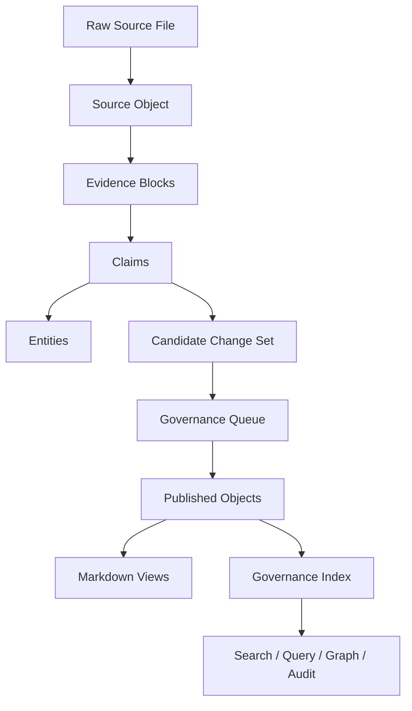
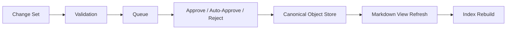

# V8 Knowledge Governance Spec

Date: 2026-04-19
Project: Vector Lake
Status: Draft for implementation
Target Version: V8

## 1. Objective

V8 upgrades Vector Lake from a page-centric LLM wiki into a governed knowledge publishing system.

The primary shift is:

- V7 core asset: Markdown pages
- V8 core asset: structured `Entity`, `Claim`, `Evidence`, and `Source` objects

Markdown remains the human-facing publishing layer, but no longer serves as the only source of truth for knowledge identity, validity, provenance, and conflict state.

## 2. Design Goals

1. Every important conclusion must trace back to specific source evidence.
2. Time-sensitive knowledge must carry validity and review metadata.
3. Agents should propose changes before publishing them into the primary knowledge graph.
4. The system must continuously surface knowledge debt, not just retrieve relevant pages.

## 3. Non-Goals

1. Do not replace Markdown with a database as the primary user-facing storage layer.
2. Do not require a web service or long-running backend to use the system.
3. Do not attempt full natural-language theorem proving or automatic truth adjudication.

## 4. V8 Conceptual Model



## 5. Core Objects

### 5.1 Entity

Stable identity for a real-world or conceptual thing.

Required fields:

- `entity_id`
- `canonical_name`
- `entity_type`
- `status`
- `aliases`
- `created_at`
- `updated_at`

Optional fields:

- `domain`
- `topic_cluster`
- `tags`
- `superseded_by`
- `merged_into`

### 5.2 Claim

A declarative proposition about an entity, relationship, state, or event.

Required fields:

- `claim_id`
- `claim_text`
- `claim_type`
- `status`
- `confidence`
- `subject_entity_ids`
- `evidence_ids`
- `source_ids`
- `created_at`
- `updated_at`

Optional fields:

- `valid_from`
- `valid_to`
- `review_after`
- `freshness_tier`
- `supersedes`
- `superseded_by`
- `contradicts`

### 5.3 Evidence

Structured reference to a concrete supporting or contradicting block from a source.

Required fields:

- `evidence_id`
- `source_id`
- `locator`
- `evidence_text`
- `evidence_type`
- `created_at`

Optional fields:

- `page_number`
- `section_heading`
- `block_hash`
- `supports_claim_ids`
- `contradicts_claim_ids`

### 5.4 Source

Stable representation of an ingested raw source.

Required fields:

- `source_id`
- `raw_ref`
- `canonical_source_page`
- `source_type`
- `ingested_at`
- `content_hash`

Optional fields:

- `title`
- `published_at`
- `author`
- `language`
- `duplicate_of`

### 5.5 Candidate Change Set

Atomic proposed mutation package produced by ingest or query.

Required fields:

- `change_set_id`
- `origin`
- `created_at`
- `status`
- `proposed_entities`
- `proposed_claims`
- `proposed_evidence`
- `proposed_source_updates`

Optional fields:

- `summary`
- `risk_level`
- `affected_ids`
- `requires_human_review`

## 6. Storage Model

V8 keeps Markdown, but introduces a structured object layer under `wiki/.meta/`.

### 6.1 Proposed Files

```text
MEMORY/
  raw/
  wiki/
    overview.md
    Entity_*.md
    Concept_*.md
    Source_*.md
    Synthesis_*.md
    index.json
    .meta/
      entities.json
      claims.json
      evidence.json
      sources.json
      change_sets.json
      governance_queue.json
      alias_registry.json
      claim_edges.json
      topology_state.json
```

### 6.2 Source of Truth Rules

- Canonical identity lives in `.meta/*.json`.
- Markdown pages are published views built from canonical objects plus curated narrative text.
- `index.json` remains the fast runtime projection for CLI operations.

## 7. Index Structure

### 7.1 `index.json`

V8 `index.json` becomes a projection layer, not the canonical object store.

Required top-level fields:

```json
{
  "schema_version": "8.0",
  "nodes": {},
  "aliases": {},
  "weighted_edges": [],
  "communities": {},
  "community_labels": {},
  "graph_insights": [],
  "graph_state": {
    "dirty": false,
    "reason": "",
    "updated_at": null
  },
  "claim_index": {},
  "entity_index": {},
  "source_index": {},
  "governance_metrics": {},
  "error_log": []
}
```

### 7.2 `claim_index`

Maps `claim_id` to:

- `claim_text`
- `subject_entity_ids`
- `evidence_ids`
- `status`
- `confidence`
- `validity_state`
- `review_state`

### 7.3 `governance_metrics`

Minimum required counters:

- `stale_claim_count`
- `unsupported_claim_count`
- `conflicted_claim_count`
- `pending_change_set_count`
- `merge_candidate_count`
- `orphan_source_count`

## 8. Workflow Changes

### 8.1 Ingest Workflow

V7:

```text
read raw -> write wiki pages -> parse review blocks -> rebuild index
```

V8:

```text
read raw -> extract source/evidence/claims -> normalize identities -> build candidate change set -> enqueue for publish -> publish approved mutations -> rebuild projections
```

### 8.2 Query Workflow

V7 query writes synthesis page directly.

V8 query must produce:

- synthesis text
- provenance trace
- candidate claim updates
- conflict flags

If `dry_run=True`, output preview only.
If `dry_run=False`, persist synthesis plus optional change set.

### 8.3 Publish Workflow



## 9. Governance Queue Design

Replace the current lightweight review queue with a typed governance queue.

Allowed event types:

- `publish-candidate`
- `conflict`
- `merge`
- `missing-evidence`
- `staleness`
- `topology-gap`

Required fields per queue item:

- `item_id`
- `type`
- `title`
- `description`
- `created_at`
- `status`
- `source`
- `affected_ids`

Optional fields:

- `search_queries`
- `affected_pages`
- `change_set_id`
- `risk_level`

## 10. Markdown View Rules

Markdown pages remain the primary reading interface.

Each published page should follow this structure:

1. Canonical summary
2. Active claims
3. Evidence-backed statements
4. Temporal validity section
5. Conflicts and caveats
6. Related entities and syntheses
7. Source timeline

The page must be renderable even if some canonical objects are temporarily missing, but canonical IDs must remain embedded in frontmatter or hidden comment markers.

## 11. Controlled Relationship Model

Allowed relationships:

- `supports`
- `contradicts`
- `about`
- `same_as`
- `derived_from`
- `belongs_to`
- `supersedes`
- `superseded_by`

Rules:

- `Entity -> Claim`: `about`
- `Evidence -> Claim`: `supports` or `contradicts`
- `Claim -> Claim`: `supersedes`, `contradicts`, `derived_from`
- `Entity -> Entity`: `same_as`, `belongs_to`

Any relationship outside the matrix is invalid and should be flagged by lint.

## 12. Temporal Validity Model

Every claim should resolve into one of these runtime states:

- `current`
- `stale`
- `future`
- `expired`
- `unknown`

Resolution inputs:

- `valid_from`
- `valid_to`
- `review_after`
- latest source timestamp
- manual override

This is distinct from page update time.

## 13. Knowledge Debt Dashboard

V8 should compute and expose these debt classes:

1. Claims with no evidence
2. Claims with expired review windows
3. Conflicted claims without adjudication
4. Entities with alias collisions
5. Sources with no extracted claims
6. High-centrality nodes with low confidence
7. Synthesis pages with stale constituent claims

Minimum CLI support:

- `python cli.py debt`
- `python cli.py debt --top 20`

## 14. Module Plan

### 14.1 New Modules

- `governance_store.py`
  canonical read/write for `.meta/*.json`

- `claim_extractor.py`
  extraction and normalization of claims/evidence from raw/source pages

- `change_sets.py`
  creation, validation, and application of candidate change sets

- `provenance.py`
  provenance trace construction for query and publish

- `governance_metrics.py`
  debt calculations and runtime governance counters

- `view_builder.py`
  render published canonical objects back into Markdown pages

### 14.2 Existing Module Responsibilities

- `ingest.py`
  orchestration only, no ad hoc direct Markdown mutation

- `review.py`
  migrate into governance queue compatibility layer

- `indexer.py`
  projection builder from canonical store to runtime search/graph index

- `tool_query.py`
  query orchestration plus provenance-bearing synthesis output

- `tool_lint.py`
  schema and governance lint, not just page lint

## 15. Migration Strategy

### Phase 1: Compatibility Layer

No user-facing behavior break.

Tasks:

- add `schema_version`
- introduce `.meta/entities.json`, `.meta/claims.json`, `.meta/evidence.json`, `.meta/sources.json`
- backfill `source_id` and `entity_id`
- keep current page writes working

### Phase 2: Projection-Based Index

Tasks:

- build `index.json` from canonical objects, not directly from page frontmatter alone
- preserve current `search`, `graph`, and `audit-graph` commands

### Phase 3: Candidate Change Sets

Tasks:

- ingest produces change sets
- publish path applies approved changes
- direct write mode available only behind compatibility flag

### Phase 4: Provenance-Aware Query

Tasks:

- query outputs provenance trace
- synthesis records source claim lineage
- stale/contradicted inputs marked explicitly

### Phase 5: Governance Operations

Tasks:

- debt dashboard
- merge suggestion workflow
- staleness review workflow

## 16. Migration Script Requirements

Add a migration entry point:

```text
python cli.py migrate-v8
```

Responsibilities:

1. scan existing wiki pages
2. assign stable IDs where missing
3. extract source mappings
4. generate initial entity and claim records
5. populate compatibility projections
6. emit migration report

Migration must be:

- idempotent
- dry-run capable
- rollback-capable via `.bak`

## 17. Backward Compatibility

V8 must preserve these commands through compatibility wrappers:

- `sync`
- `search`
- `query`
- `lint`
- `graph`
- `review`
- `audit-graph`
- `delete`
- `doctor`

Compatibility rule:

- V7 page-centric views must continue to render during transition.
- New governance objects must not require manual user editing.

## 18. Testing Strategy

### 18.1 Unit Tests

- canonical ID generation
- claim extraction normalization
- evidence locator generation
- change set validation
- validity state resolution
- merge detection

### 18.2 Integration Tests

- ingest raw source into staged change set
- approve change set and publish markdown views
- query with provenance trace
- migration from V7 wiki corpus
- stale claim detection

### 18.3 Regression Tests

- V7 search still returns useful results
- V7 graph still opens
- delete and review semantics remain safe

## 19. CLI Additions

Required new commands:

- `migrate-v8`
- `publish`
- `debt`
- `trace`
- `merge-suggestions`

Example:

```text
python cli.py publish pending --top 10
python cli.py debt --top 20
python cli.py trace claim claim_20260419_abc123
```

## 20. Risks

1. Canonical store drift from Markdown views
2. Over-complexity in claim extraction before enough governance value is realized
3. Excessive review burden if candidate change sets are too granular
4. Topology and governance metrics becoming too slow on large corpora

Mitigations:

- keep V7 compatibility wrappers
- batch change sets by source
- use projection indexes
- add dirty-flag rebuild strategy, not always full recomputation

## 21. Acceptance Criteria

V8 is complete when:

1. At least 90% of newly ingested claims have explicit evidence linkage.
2. At least 95% of time-sensitive claims have `review_after` or validity metadata.
3. Query output can show provenance trace for every major synthesis section.
4. Governance queue can publish or reject candidate change sets without direct manual file surgery.
5. Debt dashboard can list the top unresolved knowledge liabilities in one command.

## 22. Recommended Build Order

1. `wiki_utils.py` extension for canonical object helpers
2. `governance_store.py`
3. `migrate-v8` scaffold
4. `change_sets.py`
5. `claim_extractor.py`
6. `view_builder.py`
7. `indexer.py` projection upgrade
8. `tool_query.py` provenance upgrade
9. `tool_lint.py` governance lint
10. `debt` and `publish` CLI surface

## 23. Implementation Decision Record

Decision:

- Keep Markdown as the primary publishing shell.
- Move stable identity, provenance, and validity into structured canonical objects.
- Use `index.json` as runtime projection, not canonical storage.
- Introduce staged publishing before canonical mutation becomes visible in the main wiki.

This preserves the current ergonomics of Vector Lake while enabling actual knowledge governance.
